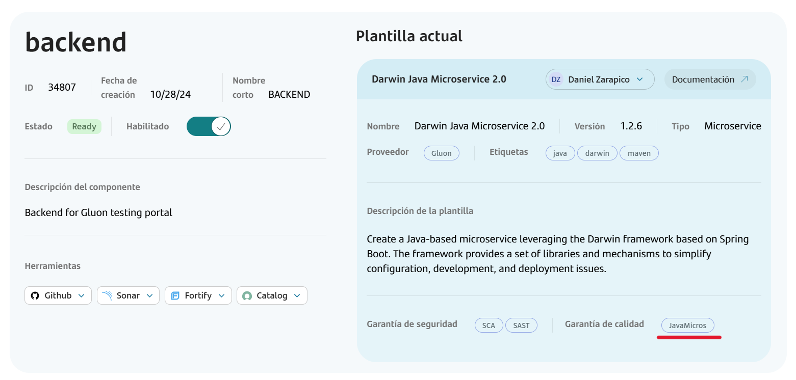
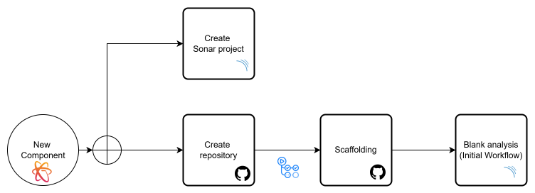
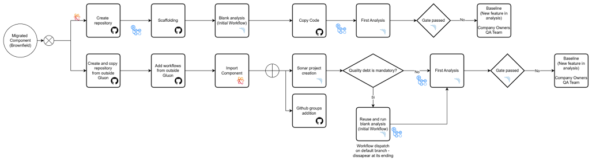

# **Sonarqube**

In this section you will find the documentation of [SonarQube](https://www.sonarsource.com/){:target="_blank"}.

## **Gluon Sonarqube Profiles**

Quality profiles are collections of rules to apply during an analysis. For each language there is a default profile.
The <strong>SonarWay</strong> profile is the default profile for every language if no other profile is explicitly defined at the project level.
Go to [Quality Profiles](https://gluon.gs.corp/sonarqube/profiles){:target="_blank"} to see all the currently defined profiles grouped by language.

<div class="cards row-3" markdown>

- ### Android

    <small>Gluon will offer Android/Kotlin ODS framework as its reference framework for Android</small>

    ---

    [Java](https://gluon.gs.corp/sonarqube/coding_rules?activation=true&qprofile=AYso2qkcCI3Q8cT_op5s){:target="_blank"}

    [Kotlin](https://gluon.gs.corp/sonarqube/coding_rules?activation=true&qprofile=AY8Q9C8uqr2b-5GRZ38A){:target="_blank"}

- ### Apigee

    <small>Apigee Framework</small>

    ---

    [XML](https://gluon.gs.corp/sonarqube/coding_rules?activation=true&qprofile=AYi5ha7gYO9KQ5Rr3I1E){:target="_blank"}

- ### Appian

    <small>Appian Framework</small>

    ---

    [XML](https://gluon.gs.corp/sonarqube/coding_rules?activation=true&qprofile=AYneKQ3w_fmegNY92Kn9){:target="_blank"}

- ### Angular Darwin

    <small>Darwin Angular Framework</small>

    ---

    [JavaScript](https://gluon.gs.corp/sonarqube/coding_rules?activation=true&qprofile=AYlvmKJ0_fmegNY92H-Q){:target="_blank"}

    [TypeScript](https://gluon.gs.corp/sonarqube/coding_rules?activation=true&qprofile=AYlvmFQ2_fmegNY92H4G){:target="_blank"}

    [HTML](https://gluon.gs.corp/sonarqube/coding_rules?activation=true&qprofile=AYlvmYW3_fmegNY92I7m&repositories=Web){:target="_blank"}

    [JSON](https://gluon.gs.corp/sonarqube/coding_rules?activation=true&qprofile=AYlvmYW3_fmegNY92I7m&repositories=sgt-json){:target="_blank"}

- ### iOS

    <small>Gluon will offer iOS/Swift ODS framework as its reference framework for iOS</small>

    ---

    [Swift](https://sonar-ent.sgtech.gs.corp/coding_rules?activation=true&qprofile=AY8QkZPemxgJde72xfBo){:target="_blank"}

- ### Java Microservices

    <small>Darwin/Arsenal Java Framework</small>

    ---

    [Java](https://gluon.gs.corp/sonarqube/coding_rules?activation=true&qprofile=AYso2qkcCI3Q8cT_op5s){:target="_blank"}

    [Properties](https://gluon.gs.corp/sonarqube/coding_rules?activation=true&qprofile=AYiQ4sQeMk-wV-75oT6B){:target="_blank"}

    [XML](https://gluon.gs.corp/sonarqube/coding_rules?activation=true&qprofile=AYiQ4P4UMk-wV-75oSmH){:target="_blank"}

    [Yaml](https://gluon.gs.corp/sonarqube/coding_rules?activation=true&qprofile=AYiQ4STmMk-wV-75oSmo){:target="_blank"}

- ### NodeJS Microservice

    <small>Darwin NodeJS Framework</small>

    ---

    [JavaScript](https://gluon.gs.corp/sonarqube/coding_rules?activation=true&qprofile=AYso2XpQCI3Q8cT_opeG){:target="_blank"}

    [TypeScript](https://gluon.gs.corp/sonarqube/coding_rules?activation=true&qprofile=AYso2hzwCI3Q8cT_oprA){:target="_blank"}

- ### Python

    <small>Darwin Python Framework</small>

    ---

    [Python](https://gluon.gs.corp/sonarqube/coding_rules?activation=true&qprofile=AY8QUUiJEIdjxYnGYZn1){:target="_blank"}

- ### React

    <small>Gluon will offer React ODS framework as its reference framework for React</small>

    ---

    [JavaScript](https://gluon.gs.corp/sonarqube/coding_rules?activation=true&qprofile=AYr1xWaSCI3Q8cT_ooPm){:target="_blank"}

    [TypeScript](https://gluon.gs.corp/sonarqube/coding_rules?activation=true&qprofile=AYr1xgFGCI3Q8cT_ootJ){:target="_blank"}

- ### Terraform

    <small>Terraform Framework</small>

    ---

    [Terraform](https://gluon.gs.corp/sonarqube/coding_rules?activation=true&qprofile=AZEr4_oa93TxBPUUt_Tp){:target="_blank"}

</div>

- ### **All languages**

The <strong>SonarWay profile</strong> is the default profile for every language if no other profile is explicitly defined at the project level.
Go to [Quality Profiles](https://gluon.gs.corp/sonarqube/profiles){:target="_blank"} to see all the currently defined profiles grouped by language.

---

## **Gluon Sonarqube Quality Gates**

A Quality Gate is a set of measure-based, Boolean conditions. It helps you know immediately whether your projects are production-ready. Each project's Quality Gate status is displayed prominently on its homepage.
Visit all the Quality Gates in [Gluon Sonarqube Quality Gates](https://gluon.gs.corp/sonarqube/quality_gates/){:target="_blank"}.

<div class="cards row-3" markdown>

- ### **Quality Gates**

    ---

    [Silver (default)](https://gluon.gs.corp/sonarqube/quality_gates/show/AYiQ41d5Mk-wV-75oT7j){:target="_blank"}

    [Silver no coverage](https://gluon.gs.corp/sonarqube/quality_gates/show/AYjD1kjwl1OyI8HRB_nz){:target="_blank"}

    [Sonar way](https://gluon.gs.corp/sonarqube/quality_gates/show/AYh4QddQMk-wV-75oEwR){:target="_blank"}

    [Sonar way no coverage](https://gluon.gs.corp/sonarqube/quality_gates/show/AZJof9xOxg0Xub1njhXt){:target="_blank"}

    [Sonar way Gln](https://gluon.gs.corp/sonarqube/quality_gates/show/AZaumRN7wWl7Evjg8qBM){:target="_blank"}

    [Appian](https://gluon.gs.corp/sonarqube/quality_gates/show/AZXb58NOzoIF1j5tNKwc){:target="_blank"}

</div>

---

These are the most common QualityGates we created in Sonar. The most of Gluon Templates are matched with Silver, and Silver no coverage for projects which no need coverage.

For [Clean as you code strategy](https://docs.sonarsource.com/sonarqube-server/9.9/user-guide/clean-as-you-code/) we offer Sonar way and its variant with no coverage. For more restrictive templates we also offer Sonar way Gln.
The Quality Profiles and its rules applied with these QualityGates during onboarding, are all Sonar way (Sonar default rules).

## **Gluon Sonarqube Baseline**

In order to reduce technical debt and increase coding efficiency, Sonar defines the [Clean as You Code methodology](https://docs.sonarsource.com/sonarqube/latest/core-concepts/clean-as-you-code){:target="_blank"}.
This methodology is based on the fact that new code is easier to debug than old code, and fixing issues in your own code is dramatically easier than fixing old code that is hard to understand.

To stablish a clean version to compare new code against, a <strong>Baseline component</strong> is stablished after each release has been completed.

---

<br>

## **Sonar Technologies**

In order to make onboarding of Sonar projects we manage this concept to do this kind of actions. Every Sonar Technology is a combination of Sonar Quality Gate and Sonar Quality Profiles for each language.

This is the key you can view when you choose a template for your component:



The most common combinations are the following:

- ### JavaMicros

    <small>Java Microservices></small>

    ---

    Gate [Silver](https://gluon.gs.corp/sonarqube/quality_gates/show/AYiQ41d5Mk-wV-75oT7j){:target="_blank"}

    Profiles [Java](./index.md#java-microservices){:target="_blank"}

- ### Python

    <small>All Python components</small>

    ---

    Gate [Silver](https://gluon.gs.corp/sonarqube/quality_gates/show/AYiQ41d5Mk-wV-75oT7j){:target="_blank"}

    Profiles [Python](./index.md#python){:target="_blank"}

- ### AngularDarwin

    <small>Angular Darwin components</small>

    ---

    Gate [Silver](https://gluon.gs.corp/sonarqube/quality_gates/show/AYiQ41d5Mk-wV-75oT7j){:target="_blank"}

    Profiles [Angular Darwin](./index.md#angular-darwin){:target="_blank"}

- ### SonarWay/SonarWayGln

    <small>Clean as you code Techs</small>

    ---
    Gates [Sonar way](https://gluon.gs.corp/sonarqube/quality_gates/show/AYh4QddQMk-wV-75oEwR){:target="_blank"} or
    [Sonar way Gln](https://gluon.gs.corp/sonarqube/quality_gates/show/AZaumRN7wWl7Evjg8qBM){:target="_blank"}

    Profiles, for this tech key we associate all languages with its builtin profiles.

## **Brownfield & Greenfield**

### **Initial Analysis**

When Sonar runs an initial analysis of a project, there's nothing to compare with and it can't detect new issues in the project.
To solve this, you must run an empty initial analysis to be situated as the baseline, allowing Sonar to use it as a starting point for
subsequent analyses. Depending on how the project was created, the initial analysis will run differently:

### **Greenfield** (New projects created from Gluon)

The initial analysis is embedded in the repository scaffolding process.



### **Migrated Components**

Entities may to choose which is the situation of the component previously to the migration and the strategy to do that.
Also each company needs to decide if the component needs to be compliance for quality at the creation.
In both ways baseline feature, still in analysis, is available from ComponentManager for application owners.



#### ***Brownfield*** (Projects migrated from another Git repository)

In this case, the initial-analysis.yml workflow will be added manually,
and the user must ensure this workflow is run before any other workflows, if another project analysis runs before the initial analysis
it will fail. When the initial scan runs successfully, the baseline will be set to that scan and the workflow will be removed itself
from the repository.

#### ***Legacy*** (Projects that do not want old issues to appear)

For this type of projects, it will be enough not to copy the initial
analysis workflow and choose for these components a quality gate based on newCode (clean as you code),
so that the first analysis they do of their project will always give OK and this will be the baseline with which
the rest of the analyses are compared until they carry out the first release.

### **Workflow**

- **Description**

Automate the initial SonarQube analysis. It includes multiple jobs such as setting up environment variables, checking Sonar onboarding, running an empty Sonar analysis, and removing the workflow file post-analysis.

- **Steps**

- Setup environment variables: The setup-env-vars job uses a reusable workflow to configure environment variables needed
for subsequent steps, ensuring a consistent setup across runs.

- Check Sonar onboarding: The check-sonar-onboarding job retrieves management assurance information and validates the Sonar project key,
ensuring the repository is correctly configured in the SonarQube and Gluon Portal.

- Run initial empty sonar analysis: The run-initial-analysis job performs an empty SonarQube analysis, leveraging a custom action
to integrate with SonarQube using the extracted project key and environment variables.

- Remove initial analysis workflow: Remove initial workflow from repository.

#### **Workflow yml**

The file can be copied from [user-initial-sonar-analysis.yml](https://github.com/santander-group-shared-assets/gln-testing-workflows/blob/v1/.github/workflows/user-initial-sonar-analysis.yml). Its structrure is as follows:

``` yaml title="initial-analysis.yml" linenums="1"
name: Initial analysis
on:
  workflow_dispatch:
jobs:
  setup-env-vars:
    name: Setup environment variables
    uses: santander-group-shared-assets/gln-multipurpose-child-reusable-workflows/.github/workflows/setup-env-vars.yml@v1.26.0
    with:
      runner: 'base-runner'
      repo: ${{ github.repository }}
      repo-branch: ${{ github.ref }}
    secrets: inherit
  check-sonar-onboarding:
    name: Check Sonar onboarding
    needs: [setup-env-vars]
    runs-on: base-runner
    outputs:
      sonar-project-key: ${{steps.get-sonar-project-key.outputs.sonar-project-key }}
    steps:
      - name: Retrieve management assurance info
        uses: santander-group-shared-assets/gln-cm-check-sec-and-qa-onboarding-action@development
        id: api-assurance-info
        with:
          corporateLoginURL: ${{ fromJSON(needs.setup-env-vars.outputs.env-vars-json).CORPORATE_LOGIN_API_URL }}
          stsURL: ${{ fromJSON(needs.setup-env-vars.outputs.env-vars-json).STS_LOGIN_URL }}
          managmentURL: ${{ fromJSON(needs.setup-env-vars.outputs.env-vars-json).MANAGMENT_API_URL }}
          username: ${{ secrets.CORPORATE_LOGIN_USER }}
          password: ${{ secrets.CORPORATE_LOGIN_PASSWORD }}
          repository: "${{ github.server_url }}/${{ github.repository }}"
      - name: Get sonar project key
        id: get-sonar-project-key
        shell: bash
        run: |
          # Get sonar project id from quality assurance url
          quality_assurance_url=${{steps.api-assurance-info.outputs.quality_assurance_url}}
          echo "Quality assurance url: $quality_assurance_url"
          if [[ -z "$quality_assurance_url" ]]; then
            echo "::error::Quality assurance URL is empty. Please review your component in Gluon Portal and Sonar tool."
            exit 1
          fi
          sonar_project_key=$(echo "$quality_assurance_url" | grep -oP 'id=\K[^&]+')
          echo "Sonar project key: $sonar_project_key"
          if [[ -z "$sonar_project_key" || "$sonar_project_key" == "null" ]]; then
            echo "::error::Sonar project key not found. Please review your component in Gluon Portal and Sonar tool."
            exit 1
          fi
          echo "sonar-project-key=$sonar_project_key" >> $GITHUB_OUTPUT
  run-initial-analysis:
    name: Run initial empty sonar analysis
    needs: [setup-env-vars, check-sonar-onboarding]
    runs-on: base-runner
    steps:
      - name: Run initial empty sonar analysis
        uses: santander-group-gluon/sgt-glntest-initsonaraction@1.0.0
        timeout-minutes: ${{ fromJSON(fromJSON(needs.setup-env-vars.outputs.env-vars-json).SONAR_TIMEOUT) }}
        with:
          env-vars-json: ${{ needs.setup-env-vars.outputs.env-vars-json }}
          secrets: ${{ toJSON(secrets) }}
          vars: ${{ toJSON(vars) }}
          sonar-project-key: ${{needs.check-sonar-onboarding.outputs.sonar-project-key}}
  remove-initial-analysis-workflow:
    name: Remove initial analysis workflow
    needs: [run-initial-analysis]
    runs-on: 'base-runner'
    steps:
    - name: Get project token
      id: get-project-token
      uses: santander-group-shared-assets/gln-get-github-app-token-action@1.2.0
      with:
        organization: ${{ github.repository_owner }}
        app-id: ${{ secrets.APPLICATION_ID }}
        private-key:  ${{ secrets.APPLICATION_PRIVATE_KEY }}
    - name: Checkout ${{ github.repository }}
      uses: actions/checkout@v4.1.2
      with:
        ref: ${{ github.ref }}
        token: ${{ steps.get-project-token.outputs.token }}
    - name: Get workflow file name
      id: get-workflow-filename
      shell: bash
      run: |
        # Extract the path to the workflow file
        workflow_path=$(echo "${{github.workflow_ref}}" | sed -n 's|.*\(.github\/workflows\/[^@]*\).*|\1|p')
        echo "Workflow file path: $workflow_filename"
        # Extract just the filename
        workflow_filename=$(basename "$workflow_path")
        echo "Workflow file name: $workflow_filename"
        echo "::set-output name=workflow_path::$workflow_path"
        echo "::set-output name=workflow_filename::$workflow_filename"
    - name: Remove ${{ steps.get-workflow-filename.outputs.workflow_filename }}
      shell: bash
      run: |
        echo "Remove ${{ steps.get-workflow-filename.outputs.workflow_filename }}"
        git config --global user.name 'GitHub Actions'
        git config --global user.email 'github.actions@users.noreply.github.com'
        git rm ${{ steps.get-workflow-filename.outputs.workflow_path }}
        git status
        git commit -m 'Remove ${{ steps.get-workflow-filename.outputs.workflow_filename }} [--gluontask--]'
        git push
```

---

<br>
