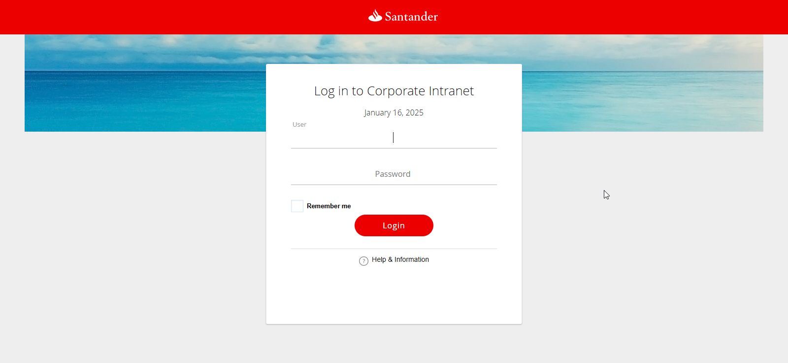
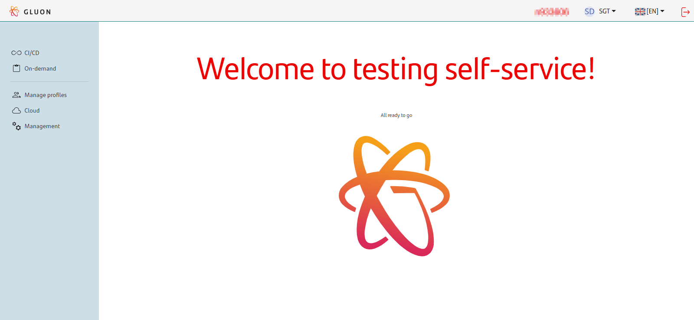
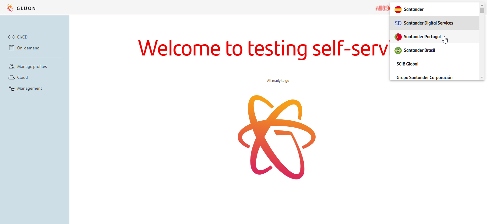

## **1. Prerequisites**

In order to use Gluon Testing it's needed to have following elements.

### **1.1 Gluon components**

If we want to run a test from the Ondemand section, first we need to create the test component in Gluon. Different types of testing components can be created from Gluon.
Each of them is associated with a framework or technology with which the tests will be executed. You can see how to create the Gluon testing component in the sections:

- [TalosBDD Journey](../../../components/configuration/testing/talosbdd/journey/talosbdd-testing-journey.md)
- [Nitro Journey](../../../components/configuration/testing/nitro/journey/nitro-testing-journey.md)
- [Cilantrum Journey](../../../components/configuration/testing/cilantrum/journey/cilantrum-testing-journey.md)
- [Newman Journey](../../../components/configuration/testing/newman/journey/newman-testing-journey.md)
- [Jmeter Journey](../../../components/configuration/testing/jmeter/journey/jmeter-testing-journey.md)
- [Appium Journey](../../../components/configuration/testing/appium/journey/appium-testing-journey.md)

It is necessary to create the testing components in Gluon before configuring the tests in the portal, since this creation will generate the repositories in which the tests will be built.

For tests executions during microservices deployment using the Github actions,
also it is necessary to have created in Gluon, [microservice component](../../../components/software/backend/index.md) or [api component](../../../components/software/api/apideployment/apis.md) on which the tests will be performed in its deployment.
Same situation for [front components](../../../components/software/front/index.md).

### **1.2 Setup infrastructure**

To run Gluon Testing tests is necessary an infrastructure that supports this executions. For this, there are two options:

- Legacy mode
- Ephemeral runners

#### **1.2.1 Legacy**

When we configure a test in [Gluon Testing Portal: Web](https://gluon.gs.corp/testing){:target="_blank"}, we must indicate a namespace where
the service will set up the support infrastructure to carry out the tests. Each Gluon Application will be assigned a series of namespaces that can be used.
This association must be requested from the Gluon Support Team:

!!! warning

    Before making this request, first confirm that the cluster is among those registered in Gluon Testing Portal: [Available clusters](./portal/clusters/index.md)

!!! Support

    To register new namespace, please open request as [here](../../../getting-started/support/index.md).

    REQ:

     - **Functional App:** Gluon Request

     - **Technical App:** Testing - Namespace Onboarding

     - **Description:**
       ```markdown
        Register new namespace:
         - Company: Company name
         - Application: Gluon application name
         - Cluster url: Cluster api url OR ClusterKEY (e.g. CCC_CN2_PRE)
         - Environment: DEV, PRE or PRO
         - Namespace: Namespace name
       ```

#### **1.2.2 Ephemeral runners**

Another way to launch the execution of tests, is through ephemeral runners installed in the cluster of the entity, where the applications to be tested are located.
For development and pre-production testing, the runners must be installed in a PRE environment cluster with label **testing-runner-pre**. And for production tests the runners must be installed in a Production cluster with label **testing-runner**.
For mobile testing, a runner with the label **android-runner** must be installed. This runner must have Kootlin and Gradle installed.

[Adoption process for ephemeral runners](../../../getting-started/company-management/technical-requirements/ephemeral-runners/adoption-process/index.md)

Once the ephemeral runners are configured, tests can be executed directly from Github through [workflows](./workflows/index.md).

##### **1.2.2.1 Selenium Grid**

In addition to installing the runners, to carry out web tests you need to have the Selenium images and the browsers.
These images will be found in the registry **registry.global.ccc.srvb.can.paas.cloudcenter.corp**, therefore there must be connectivity between
the entity's cluster with this registry. If you cannot open this connectivity, you must request the Gluon team to deploy the images in the entity's registry or on your regional registry.

!!! Support

    To display browser images in your registry, you must first create the gluon-alm project in the registry and then please create new request as indicated [here](../../../getting-started/support/index.md).

    REQ:

     - **Functional App:** Gluon Request

     - **Technical App:** Testing - Namespace Onboarding

     - **Description:**
       Deploy testing images for &lt;entity name&gt;
       ```markdown
        Deploy testing images for &lt;entity name&gt;
        Registry: Host of registry on deploy images.
        Project: Project name.
       ```

## **2 Login to the Testing Portal**

The first step to access the Portal, is to check whether you have access permissions or not.

This is the link to go to the Testing Portal: [Testing Portal web](https://gluon.gs.corp/testing){:target="_blank"}

{:style="border:1px solid grey"}

!!! note

    If you are unable to log in, try checking your permissions to access Gluon.

Once you have logged in, you should see the below page:

{:style="border:1px solid grey"}

## **3 Select company**

Once in the portal, select the company for which the tests will be configured or run. To do this, the portal has a selector in the upper right corner,
it can only change companies while it's in the home. Once the company is selected, tests can only be configured for applications from that company.

{:style="border:1px solid grey"}

<br>
<br>
