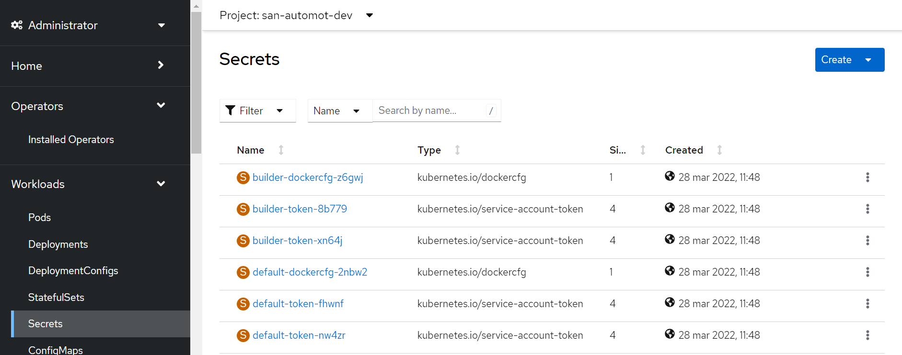
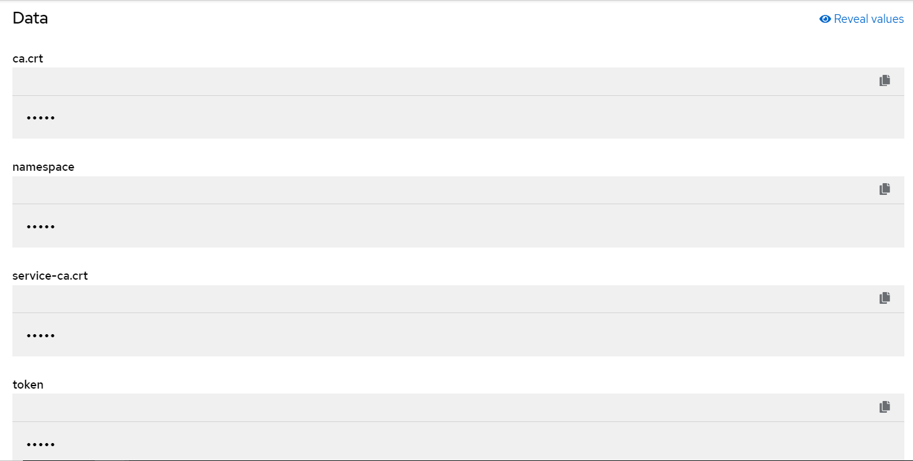
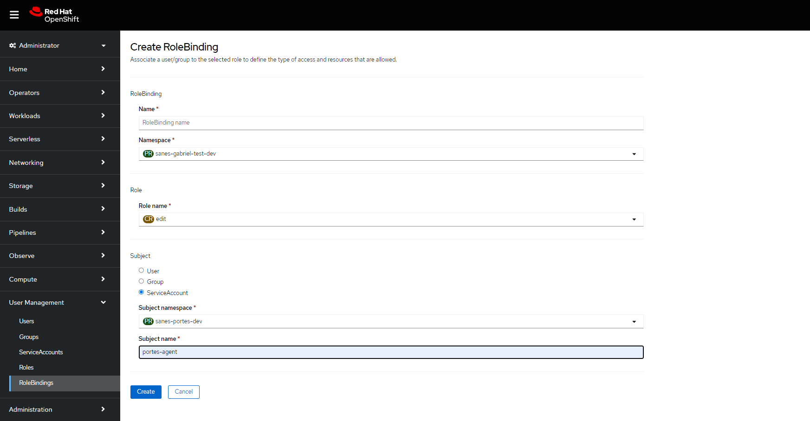

## **1. Introduction**

In order to use the Testing Portal from our entity, we need to make some configurations so that the service can deploy the necessary infrastructure in the entity's
cluster. This configuration only needs to be done once for each cluster in the entity. This configuration is only required for legacy mode of execution
(check [Setup infrastructure](../../initialstep.md#12-setup-infrastructure)).

## **2. Currently available clusters**

List of available clusters:

|Company|Cluster|Key|Status|Notes|
|---|---|---|---|---|
|Santander Spain|san.dev.weu1 - ocp01|SAN_WEU1_OCP1_DEV|Ok|---|
|Santander Spain|san.pre.weu1 - ocp01|SAN_WEU1_OCP1_PRE|Ok|---|
|Santander Spain|san.pre.weu2 - ocp02|SAN_WEU2_OCP2_PRE|Ok|---|
|Santander Spain|san.pro.weu1 - ocp03|SAN_WEU1_OCP3_PRO|Ok|---|
|Santander Spain|san.dev.bo1 - san01bks|SAN_BO1_SAN01BKS_DEV|Ok|---|
|Santander Spain|san.pre.bo1 - san01bks|SAN_BO1_SAN01BKS_PRE|Ok|---|
|Santander Spain|san.pre.bo2 - san01bks|SAN_BO2_SAN01BKS_PRE|Ok|---|
|Santander Spain|san.pro.bo1 - san01darwin|SAN_BO1_SAN01DARWIN_PRO|Ok|---|
|Santander Spain|san.pro.bo2 - san01darwin|SAN_BO2_SAN01DARWIN_PRO|Ok|---|
|Santander Digital Services|sgt.dev.cn1 - sgt01|SGT_CN1_DEV|Ok|---|
|Santander Digital Services|sgt.pre.cn1 - sgt01|SGT_CN1_PRE|Ok|---|
|Santander Digital Services|sgt.pre.cn2 - sgt01|SGT_CN2_PRE|Ok|---|
|Santander Digital Services|ccc.pre.cn1 - ccc01alm|CCC_CN1_PRE|Ok|---|
|Santander Digital Services|ccc.pre.cn2 - ccc01alm|CCC_CN2_PRE|Ok|---|
|Santander Digital Services|sgt.dev.cn1 - gpdev01|SGT_GPDEV_CN1_DEV|Ok|---|
|Santander Digital Services|sgt.dev.cn2 - gpcert01|SGT_GPCERT_CN2_DEV|Ok|---|
|Santander Portugal|tot.dev.weu1 - ocp01|TOT_WEU1_OCP01_DEV|Pending|---|
|Santander Portugal|tot.pre.weu1 - ocp01|TOT_WEU1_OCP01_PRE|Pending|---|
|Santander Portugal|tot.pre.weu2 - ocp02|TOT_WEU2_OCP02_PRE|Pending|---|
|Santander Portugal|tot.pro.weu1 - ocp01|TOT_WEU1_OCP01_PRO|Pending|---|
|Santander Portugal|tot.pro.weu2 - ocp02|TOT_WEU2_OCP02_PRO|Pending|---|
|SCIB Global|cib.pre.bo1 - cib01|CIB_CIB01_PRE|Pending|---|
|Santander UK|sanuk.pre.uk1 - sanuk01|UK_SANUK01_PREUK1_PRE|Ok|---|
|Santander UK|sanuk.pre.uk2 - sanuk01|UK_SANUK01_PREUK2_PRE|Ok|---|
|Santander Mexico|mex.dev.mx1 - str01|MEX_STR01_DEV|Pending|---|
|Santander Mexico|mex.pre.mx2 - mex02|MEX_MEX02_PRE|Pending|---|
|Santander Chile|chi.dev.cl1 - chi01|CHL_CL1_DEV|Ok|---|
|Santander Chile|chi.pre.cl1 - chi01|CHL_CL1_PRE|Ok|---|
|Santander Chile|chi.pre.cl2 - chi01|CHL_CL2_PRE|Ok|---|
|F1rst Digital Services|pre.paas.santanderbr|SANBR_PRE|Ok|---|
|F1rst Digital Services|alm.paas.santanderbr|SANBR_PRO|Ok|---|

## **3. Prerequisites**

To register a new cluster, the following conditions must be met before making the request.

## **3.1 Firewall rules**

Firewall rules must be opened from the testing portal to the new cluster. To do this, the entity must request the corresponding CISO to open the following rules:

{!
   include-markdown "../../../../../getting-started/company-management/technical-requirements/firewall-rules.md"
   start="<!--Gluon Testing ips start-->"
   end="<!--Gluon Testing ips end-->"
!}

{!
   include-markdown "../../../../../getting-started/company-management/technical-requirements/firewall-rules.md"
   start="<!--Harbour ips start-->"
   end="<!--Harbour ips end-->"
!}

Check [Request Details](../../../../../getting-started/company-management/technical-requirements/firewall-rules.md#request-details) for open rule.

## **3.2 Service account**

A service account is an OpenShift Container Platform account that allows a component to directly access the API. Service accounts provide a flexible way to control API access without sharing a regular user’s credentials. For example, service accounts
can allow:

- Replication controllers to make API calls to create or delete pods.

- Applications inside containers to make API calls for discovery purposes.

- External applications to make API calls for monitoring or integration purposes.

The entity must have a service account on each cluster that has deployment permissions. Additionally, in all namespaces that you want to use from the Testing Portal must have this service account.
This prerequisite must be done by a user who has permissions to create service accounts in the cluster.

#### **Creating service accounts**

You can create a service account in a project and grant it permissions by binding it to a role.
The service account is created within a namespace and after this process needs to be propagated to the rest of the namespaces involved to execute testing.

**Procedure**:

1. Login to your OpenShify account:

    ```bash
    oc login
    ```

2. Select the project where the service account will be created

    ```bash
    oc project <project_name>
    ```

3. Optional: To view the service accounts in the current project:

    ```bash
    $ oc get sa

    #Example output:
    NAME       SECRETS   AGE
    builder    2         2d
    default    2         2d
    deployer   2         2d
    ```

4. To create a new service account in the current project:

    ```bash
    $ oc create sa <service_account_name>

    #Example output:

    serviceaccount "portes-agent" created
    ```

    To create a service account in a different project, specify -n project_name.

    ???+ Tip
        You can alternatively apply the following YAML to create the service account:

        ``` { .yaml .copy}
        apiVersion: v1
        kind: ServiceAccount
        metadata:
            name: portes-agent
            namespace: <current_project>
        ```

5. Optional: View the secrets for the service account:

    ```bash
    $ oc describe sa portes-agent

    #Example output:
    Name:                portes-agent
    Namespace:           project1
    Labels:              <none>
    Annotations:         <none>
    Image pull secrets:  portes-agent-dockercfg-qzbhb
    Mountable secrets:   portes-agent-dockercfg-qzbhb
    Tokens:              portes-agent-token-f4khf
    Events:              <none>
    ```

#### **Getting the service account token**

Once the service account is created, there are 2 ways to obtain the service account token:

- To view the service account token via commands:

    ```bash
    $ oc get secret <secret-name> -o go-template --template="{{.data.token|base64decode}}"

    #Example output:

    eyRhEGuiGjJTUzI1NTIsImtpZCT6IjNJWGZkc2daMUZiSmJiN185bUtPMUxtV0dKbWpZdWlsc3RiOEpDWUxqNWsifQ.eyJpc3eiOiJrdWJlcm5ldGVzL3NlcnZpY2VhY2NvdW50Iiwia3ViZXJuZXRlcy5pby9zZXJ2aWNlYWNjb3VudC9uYW1lc3BhY2UiOiJzYW5lcy1wb3J0ZXMtZGV2Iiwia3ViZXJuZXRlcy5pby9zZXJ2aWNlYWNjb3VudC9zZWayZXQubmFtZSI6InBvcnRlcy1hZ2VudC10b2tlbi0xZ21zOCIsImt1YmVybmV0ZXMuaW8vc2VydmljZWFjY291bnQvc2VydmljZS1hY2NvdW50Lm5hbWUiOiJwb3J0ZXMtYWdlbnQiLCJrdWJlcm5ldGVzLmlvL3NlcnZpY2VhY2NvdW50L3NlcnZpY2UtYWNjb3VudC58aWQiOiI0NDFjNWNkMS1kOWE4LTRlMTUtOWNhZC65MzNkMTFmMDZlNDMiLCJzdWIiOiJzeXN0ZW06c2VydmljZPFjY291bxQ6c2FuZXMtcG9ydGVzLWRldjpwb3J0ZXMtYWdlbnQifQ.T8RQoLbAt6eGRYyrGziYuCf5TNBmM-SOmNfVigm6JeczuG7Xw0y_tvh19xlaJiEeuHKLgExjdSrK9GAPU7hGCn9ocvGWhbiG3VYFrWkZYUt5RUmwy0gLXUseN-m83mLhMOs3xmnLRKj7pK-IDNrESHaj1qjeQkmuyr-GqMa46nHq0DfSLy-qfI_7FwqF-Ljwa6eOg1eYZmy8qw5RXhKwoM8WthFpE9VfuqqY0vRzWdyzeC4tK_IeNyL2zTLwNbi9i8vYH8vtOTFbkdJAjjaFd8nro8Uz8oTkECRxeZ6nPlt16x5x6XgDDGw1bFOiyokebWs68aAl15QkmpM92HqSfK
    ```

- To view the service account token via the OpenShift web:

    In the Secrets section of the left side menu of the website, select the secret with the secret_name obtained in step 5.

    {:style="border:1px solid grey"}

    And finally, click on "Reveal values" to view the service account token.

    {:style="border:1px solid grey"}

#### **Propagating the service account**

Once the service account is created and the entity needs to add to a new namespace, you have to grant it permissions by binding it to a role.

- To add the service account via commands:

    ```bash
    oc policy add-role-to-user edit system:serviceaccount:<service_account_namespace>:portes-agent -n <mynewnamespace>
    ```

- To add the service account to a new namespace via the OpenShift web:

    In the RoleBindings section of the left side menu of the website inside User Management, click the button Create binding in the top right of the page. Fill the form and Save

    {:style="border:1px solid grey"}

## **3.3 Proxy**

The entity must have a proxy that has connectivity to Github.com, so that the execution pod that the portal will set up in the cluster can download the test project.

## **4. Register new cluster**

Once all the prerequisites are met, a request will be made to the support team to register the new cluster:

!!! Support

    To register new cluster, please contact with Gluon support [here](../../../../../getting-started/support/index.md).

    New Support/Doubt:

     - **Title:** [Support]: Register new cluster on Gluon Testing Portal

     - **Which functionality is the issue related with?:** Other

     - **Company:** &lt;Your company&gt;

     - **Describe your support:**
       ```markdown
        Register new cluster:
          - Company: Company name
          - Cluster name: Cluster name
          - Api url: Cluster api url
          - Environment: Cluster environment
          - Proxy: Host and port of cluster proxy. In addition to the username and password if the proxy requires authentication.
          - Service account: (Once the request is opened, the testing team will ask the user to send the token through a secure channel)
          - Harbour: Host of registry Harbour
       ```

## **5. Namespace requirements**

Once the cluster is registered, the namespaces of that cluster that we want to use in the Testing Portal, must meet the following requirements.

#### 5.1 Service account

The service account associated with the cluster must have deployment permissions on the namespace.

#### 5.2 EgressNetworkPolicy

Make sure that the EgressNetworkPolicy does not restrict outbound connections to the proxy or to Gluon Testing Portal. To do this, allow all output connections

```json
spec:
  egress:
    - to:
        cidrSelector: 0.0.0.0/0
      type: Allow
```

or enable connections for the proxy and Gluon Portal, in addition to all those necessary for the test itself

```json
spec:
  egress:
    - to:
        dnsName: <proxyhost>
      type: Allow
    - to:
        dnsName: gluon.gs.corp
      type: Allow
    - to:
        dnsName: <others DNS required for test>
      type: Allow
    - to:
        cidrSelector: 0.0.0.0/0
      type: Deny
```

#### 5.3 Resource Quotas

Verify that you have sufficient quota to deploy the testing infrastructure. Depending on the type of execution, the requirements are different.

<table>
 <tr>
  <th>Item</td>
  <th>Deployment config</td>
  <th>Job batch</td>
  <th>Pods</td>
  <th>Replication controllers</td>
  <th>Services</td>
  <th>Memory</td>
  <th>Cpu</td>
 </tr>
 <tr>
  <th>Maven (Cilantrum or Nitro)*</th>
  <td>0</td>
  <td>1</td>
  <td>1</td>
  <td>0</td>
  <td>0</td>
  <td>2Gb</td>
  <td>1 core</td>
 </tr>
 <tr>
  <th>Python (Talos bdd)*</th>
  <td>0</td>
  <td>1</td>
  <td>1</td>
  <td>0</td>
  <td>0</td>
  <td>2Gb</td>
  <td>1 core</td>
 </tr>
 <tr>
  <th>Node (Newman)*</th>
  <td>0</td>
  <td>1</td>
  <td>1</td>
  <td>0</td>
  <td>0</td>
  <td>2Gb</td>
  <td>1 core</td>
 </tr>
 <tr>
  <th>Jmeter (Performance)*</th>
  <td>0</td>
  <td>1</td>
  <td>1</td>
  <td>0</td>
  <td>0</td>
  <td>2Gb</td>
  <td>1 core</td>
 </tr>
 <tr>
  <th>Grid (Only web executions)</th>
  <td>1</td>
  <td>0</td>
  <td>1</td>
  <td>1</td>
  <td>0</td>
  <td>1Gb</td>
  <td>0,5 core</td>
 </tr>
 <tr>
  <th>Chrome</th>
  <td>1</td>
  <td>0</td>
  <td>n</td>
  <td>1</td>
  <td>0</td>
  <td>n*1,5Gb</td>
  <td>n core</td>
 </tr>
 <tr>
  <th>Firefox</th>
  <td>1</td>
  <td>0</td>
  <td>n</td>
  <td>1</td>
  <td>0</td>
  <td>n*1,5Gb</td>
  <td>n core</td>
 </tr>
 <tr>
  <th>Edge</th>
  <td>1</td>
  <td>0</td>
  <td>n</td>
  <td>1</td>
  <td>0</td>
  <td>n*1,5Gb</td>
  <td>n core</td>
 </tr>
 <tr>
<td colspan="8">n=threads number</td>
 </tr>
</table>

**(*)This pods will not apply if you are using [ephemeral runners](../../initialstep.md#122-ephemeral-runners) mode.**

For example,

1. **Newman - Backend:**
      - Deployments config: **0**
      - Jobs Batch: 1 node job = **1**
      - Pods: 1 node pod = **1**
      - Replication controllers: **0**
      - Services: **0**
      - Memory: 2Gb node pod = **2Gb**
      - Cpu: 1core node pod = **1 core**
2. **Cilantrum - Web - Chrome,Firefox - 3 threads:**
      - Deployments config: 1 grid + 1 chrome + 1 firefox = **3**
      - Jobs Batch: 1 maven job = **1**
      - Pods: 1 maven pod + 3 chrome + 3 firefox = **7**
      - Replication controllers: 1 grid + 1 chrome + 1 firefox = **3**
      - Services: 1 grid = **1**
      - Memory: 2Gb maven + 1Gb grid + 3*1,5Gb chrome + 3*1,5Gb firefox = **12Gb**
      - Cpu: 1core maven + 0,5 grid + 3*1core chrome + 3*1core firefox = **7,5core**
3. **Talos - Web - Chrome - 1 thread:**
      - Deployments config: 1 grid + 1 chrome = **2**
      - Jobs Batch: 1 python job = **1**
      - Pods: 1 python pod + 1 chrome = **2**
      - Replication controllers: 1 grid + 1 chrome = **2**
      - Services: 1 grid = **1**
      - Memory: 2Gb python + 1Gb grid + 1,5Gb chrome = **4,5Gb**
      - Cpu: 1core python + 0,5 grid + 1core chrome = **2,5core**

<br>
<br>
