---

title: CI/CD

---

## **1. Introduction**

From the CI/CD section of the test portal you can manage the test configuration to be executed during the deployment of microservices using the Github actions.

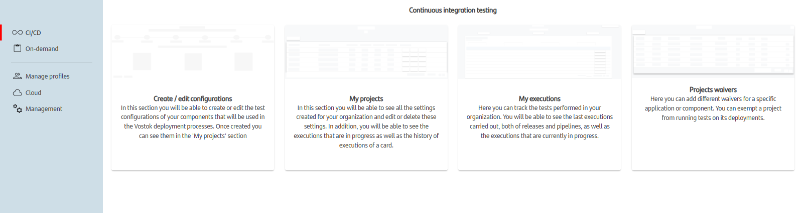{:style="border:1px solid grey"}

Once inside this section we are shown three options:

1. [Create or edit configurations](#2-create-or-edit-configurations): Screen in which we can create new configurations or edit the ones already created.

2. [My projects](#3-my-projects): Here we can see every created configuration for each microservice of one organization.

3. [My executions](#4-my-executions): Here we can see each execution of the tests launched by the pipelines.

4. [Projects exceptions](#5-projects-exceptions): Here we can add different waivers for a specific application or component. You can exempt a project from running tests on its deployments.

## **2. Create or edit configurations**

In this wizard we can create test configurations for microservices. This tests will be executed on the proper step of the CICD pipeline.

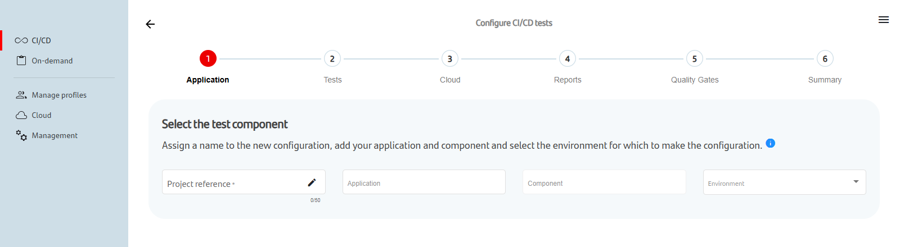{:style="border:1px solid grey"}

### Application

On the first step of the wizard we configure the information of the application and component for which we are gonna configure and assign the tests.

- Project reference: The name of the configuration.
- Application: Name of the Gluon application where the component is created.
- Component: Name of the Gloun component where the repository is stored.
- Environment: Environment for the test configuration. Only available PRE environment.

Once all fields are informed the **Validate** button will appear. Once clicked, we will check if the configuration already exists. If it exists then it will be loaded for the next steps and it will be editable.

Once validated, we can continue to the next steps where we will configure the tests.

### Tests

On this screen we will be shown a selection of possible types of tests that can be configured depending on the environment selected.

Currently only available functional tests.

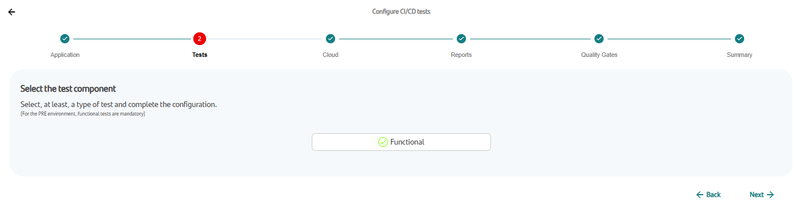{:style="border:1px solid grey"}

Once the functional tests are selected the following modal will pop up and we must complete all the necessary information.

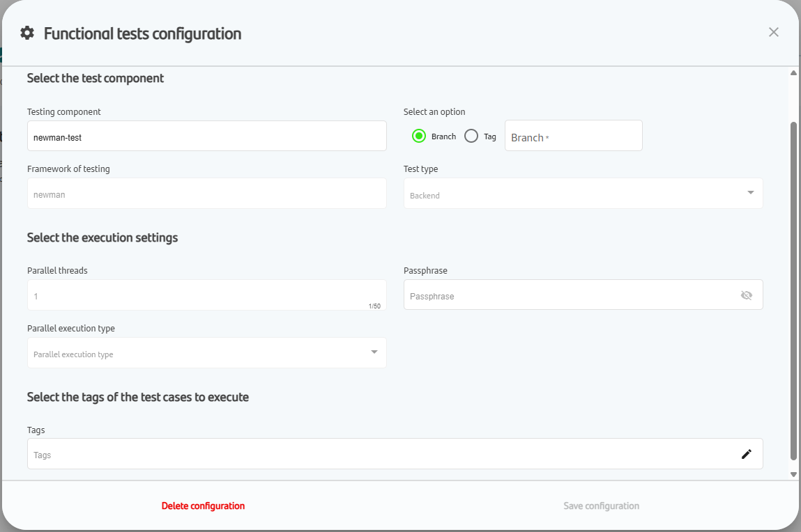{:style="border:1px solid grey"}

Description of the fields:

  1. Testing component*: Name of the component created in Gluon.
  2. Git branch*: Name of the repository branch to be executed.
  3. Test type*: Web or Backend.
  4. Framework of testing*: Talos BDD, Newman, Cilantrum or Nitro (The framework selected will depend on the type of testing component created in Gluon for that test).
  5. Parallel threads*: Number of parallel executions that will be executed.
  6. Devices*: Chrome, Firefox or Edge for web tests or Backend for API testing. By default one.
  7. Tags: Tags of the tests that need to be executed.
  8. Delete configuration
  9. Save configuration

!!! info

    All fields are required but the tags.

Once all required fields have been filled we can click on the save button (10). Then, **the icon will turn into a green check**.

If we forgot to click on the save button, then the icon will turn into an orange exclamation mark indicating that there are pending changes that have not been saved.

To delete a test configuration we just need to open the modal and click on the delete button. Then the icon will turn grey signaling that no configuration has been set.

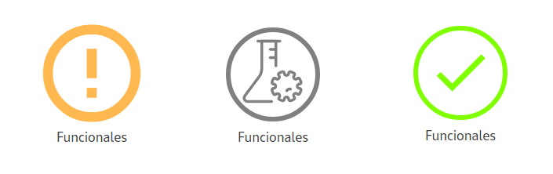{:style="border:1px solid grey"}

- Orange icon: There are pending changes that have not been saved.
- Grey icon: No configuration has been established.
- Green icon: The configuration has been saved successfully.

### Cloud

Once the test are configured we move on to the next step, Cloud. Here the infrastructure that will support the tests will be chosen.
This infrastructure can be a namespace where the service will deploy the pods necessary for execution (legacy mode) or through ephemeral
runners previously configured in the organization.

##### Ephemeral runners

This kind of execution is already deprecated. You can launch CICD Testing Workflow directly with configuration inside your **properties.env** file. See [here](../../workflows/cicd/index.md).

##### Legacy

The service will deploy the infrastructure necessary for execution in the namespace indicated by the user.

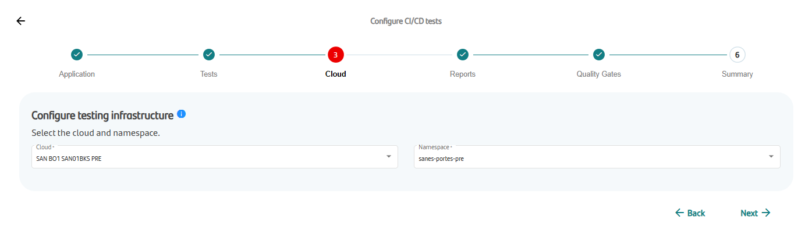{:style="border:1px solid grey"}

Normally, the namespace to be used will be the same as the one in which the application to be tested is deployed. Also, if the namespace
follows the naming convention, it will be loaded automatically.
If the namespace loaded does not match the desired namespace, simply select another namespace from the drop-down menu for that field.

!!! warning

      In the portal, each Gluon application has a list of assigned namespaces that it can use to deploy the infrastructure.

      If at this screen the application namespace does not exist or a modal error appears indicating that the application does not have any namespace configured, check [Register new namespace](../../initialstep.md#12-setup-infrastructure) documentation.

### Reports

Each test that is executed, either from the pipelines or from the release tool, creates a results report that will be sent to HP-ALM, but at this time it is not available for Gluon to use HP-ALM.
However, it is possible to use the option to send the report by email.

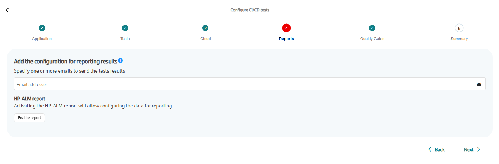{:style="border:1px solid grey"}

!!! warning

    Keep this option disabled, as it is currently not available for Gluon due to the version of HP-ALM used.

### Quality Gates

After every test execution the results will be revised to decide if the cicd pipeline will follow through with the deploy or if it instead does not reach the needed quality levels. In this screen we set those limits.

More over, in some cases, we will have the possibility to mark a certain configuration to not stop and instead complete the step with a warning, to do so we just need to click on the warning checkbox.

Currently, only the functional test on the PRE environment are required and can not be marked as optional.

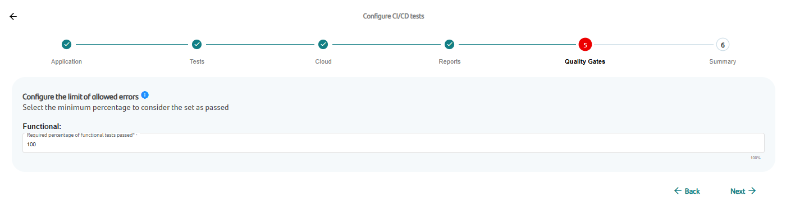{:style="border:1px solid grey"}

### Summary

After all configurations have been filled we can view a summary of everything we have introduced. After reviewing this information we can click on the **Save configuration** button to store it.

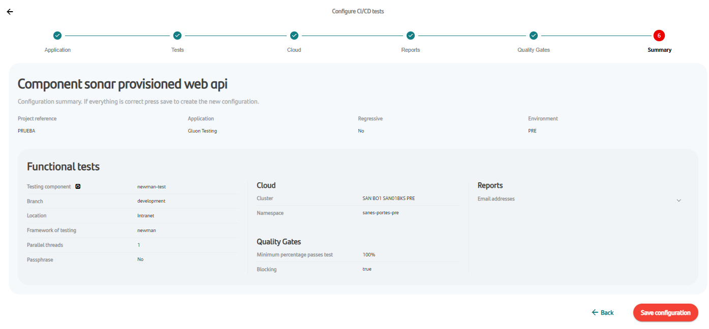{:style="border:1px solid grey"}

## **3. My projects**

On the "My projects" section of the CI/CD menu we can see a list of all the configured tests for a Gluon application. We can also edit, delete or clone for the configured tests.

If it is the first time we enter on this screen we will be asked to select the application for which we want to see the configurations.

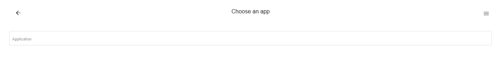{:style="border:1px solid grey"}

!!! info

    A user can only see configurations for which he has access to.

After selecting an organization we can see a list with all organizations.

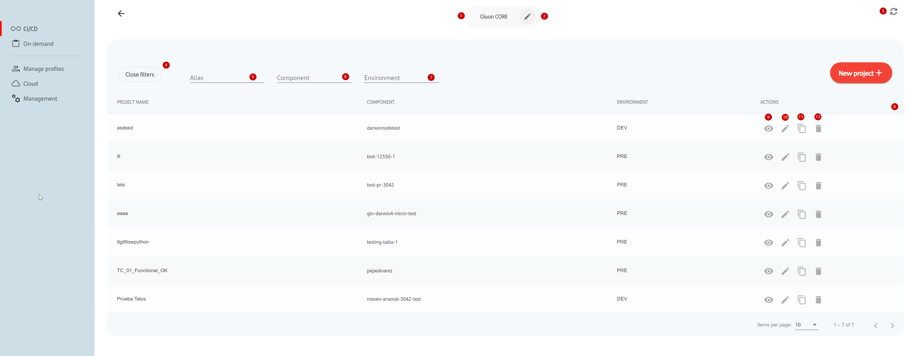{:style="border:1px solid grey"}

We can see the selected Gluon application at the top (1). With the edit button (2) we can change the current application.

If the application has already some configurations a table will appear (8) with the list of configurations. We will be shown the name of the configuration, the name of the component, the environment and the type of tests the configuration has.
On the top right there is a button (3) to refresh the data.

We can filter the list by expanding the filters menu (4), where we can filter by alias (5), by component (6) and by environment (7).

For each configuration we can perform the following:

- View (9): We can see the information of the configuration.
- Edit (10): Clicking on this button will redirect to [Create/edit configurations](#2-create-or-edit-configurations) screen, where the configuration will be loaded and become editable.
- Clone (11): This will open a model where we will be asked to select the type of test we want to clone. Doing so will create a new ondemand project on [Ondemand section](./ondemand.md) with the same configuration.
- Delete (12): To delete the configuration.

## **4. My executions**

When entering this screen for the first time we will be greeted by the following screen asking to choose the application:

{:style="border:1px solid grey"}

Afterwards we will go directly to this screen:

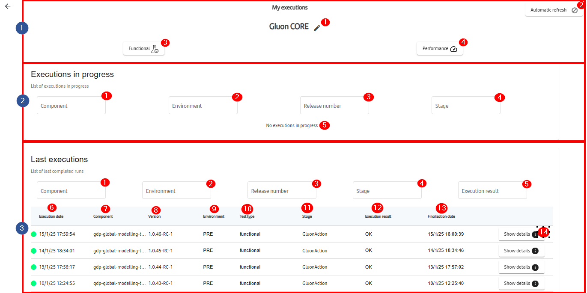{:style="border:1px solid grey"}

In this screen you can see 3 different sections, the first one shows the application selected by the user. Clicking on the edit button (1), you can change the application selected.
Just below are the filters (4,5) that apply to the whole page. The runs shown can be filtered by the type of test.
At the top right, we have the "Automatic refresh" (2). Clicking on it will change the icon to a continuous refresh icon, indicating that the option has been activated.

In the section 2, we have the "Executions in progress" section, with filters that apply to only this section.
When there are no executions in progress the message in the picture appears (5). Otherwise a table similar to the one in the next section will appear listing the current executions in progress. We can filter this section by the following (1, 2, 3, 4).

Last section, we have all finished cicd executions for this application. We have the same filters as before plus one more. Here we can also filter by the execution result (5).
In this table we can see the following info: Execution date, Component, Environment, Test Type, Stage, Execution result and Finalization date (6-12).

The execution result is also indicated with a colored circle: Green for OK, Yellow for warning, Red for KO and Gray for Stopped.

Finally, with the "Show details" button (13) we can see more information about the execution such as, the test configuration at the time of execution, the logs and results and report of the execution if the execution has finished successfully.

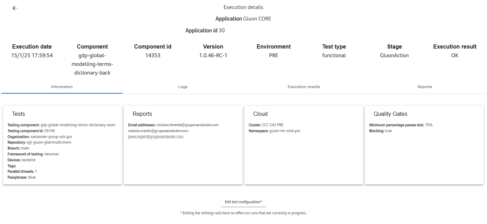{:style="border:1px solid grey"}

## **5. Projects exceptions**

There is a section in the portal to exempt components or applications. This is due to specific problems that may arise and a temporary exemption is needed on a justified basis.

Only users with permissions will be able to access the exemptions screen. Here you will be able to see the current waivers, those that are still valid in black and those that have expired in red. From this section, new project exemptions can be created.

!!! Support

    To add any waivers, please contact with Gluon support [here](../../../../../getting-started/support/index.md).

    New Support/Doubt:

     - **Title:** [Support]: Add waiver on Gluon testting portal

     - **Which functionality is the issue related with?:** Other

     - **Company:** &lt;Your company&gt;

     - **Describe your support:**
       ```markdown
        Create waiver on Gluon portal for:
         - Company: Company name
         - Application: Gluon application name
         - Component: Gluon component name
         - Type of test: Functional or Performance
         - Environment: DEV, PRE or PRO
         - Request owner: Owner of the request
         - Reason: Describe the reason for requesting the waiver
         - Start date: Date from which the exception becomes effective
         - End date: Date until which the exception is effective
       ```

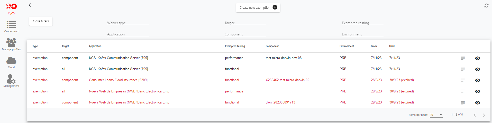{:style="border:1px solid grey"}

The exemptions can be searched by:

- Type: exempted
- Target: all or component
- Test type: functional or performance
- Application: Gluon application
- Component: Gluon component
- Environment

### **5.1 Create New Exemption**

Waivers can be created for the entire Gluon application or for a specific component.

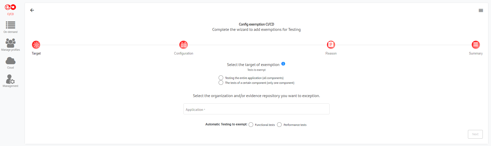{:style="border:1px solid grey"}

In this screen it must be selected to which tests this exemption applies and also the type of tests, functional or performance.

In the next screen is necessary to select the environment and also the period of time in which this exemption is valid:

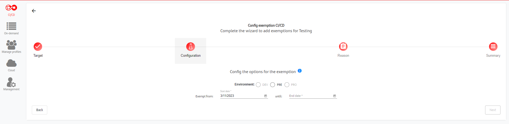{:style="border:1px solid grey"}

In the last screen before the summary we must write a reason for this exemption:

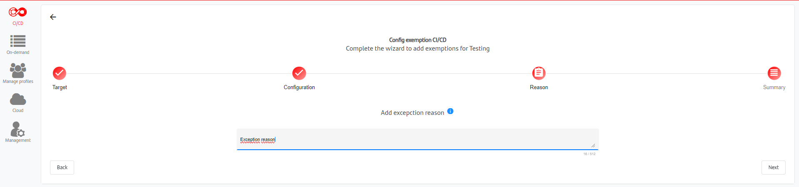{:style="border:1px solid grey"}

Finally, in the last screen we see a summary of the exemption, listing all the information introduced:

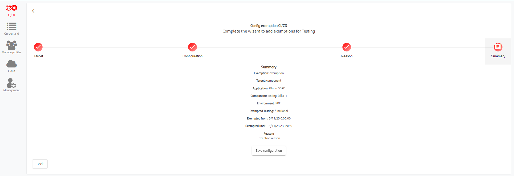{:style="border:1px solid grey"}

### **5.2 View, Edit and Delete Exemption**

To view, edit or delete an exemption, click on the button (2) shown in the exemptions list table.

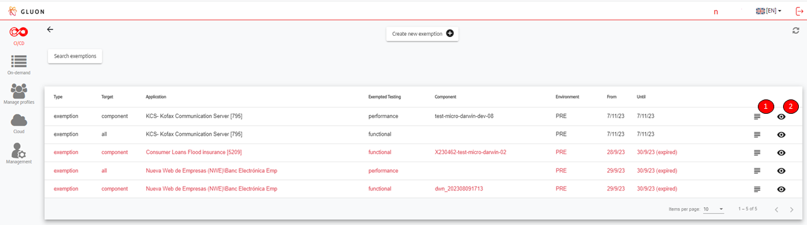{:style="border:1px solid grey"}

Then, the follow screen to be displayed:

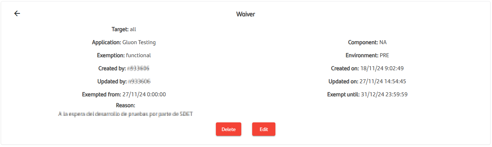{:style="border:1px solid grey"}

To view only the exemption reason, click on the button (1) shown in the exemptions list table.

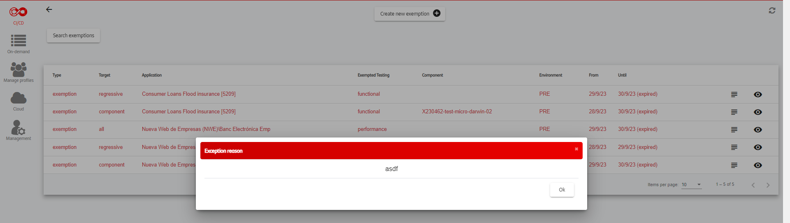{:style="border:1px solid grey"}

<br>
<br>
