## **1. Introduction**

It is possible to make use of the Ondemand section so that a user can configure and launch his tests when needed and even schedule them to be launched at a later time and see the results later.
In this section it is possible to see the different types of tests offered by the portal: **Functional** and **Performance** tests.

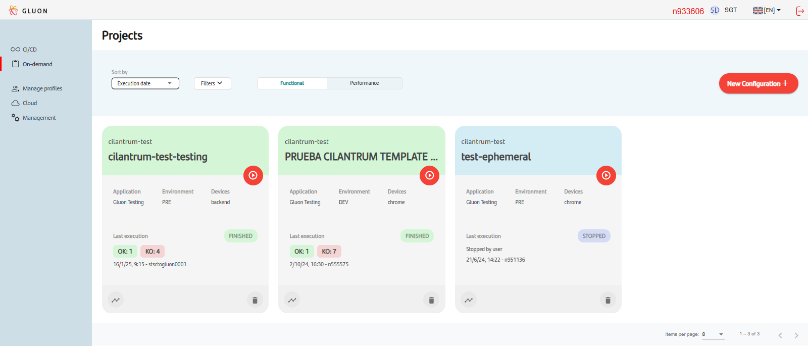{:style="border:1px solid grey"}

## **2. Functional tests**

<!--Testing portal ondemand functional tests start-->

Once we access the Ondemand functional tests section, we can proceed to create a new project.

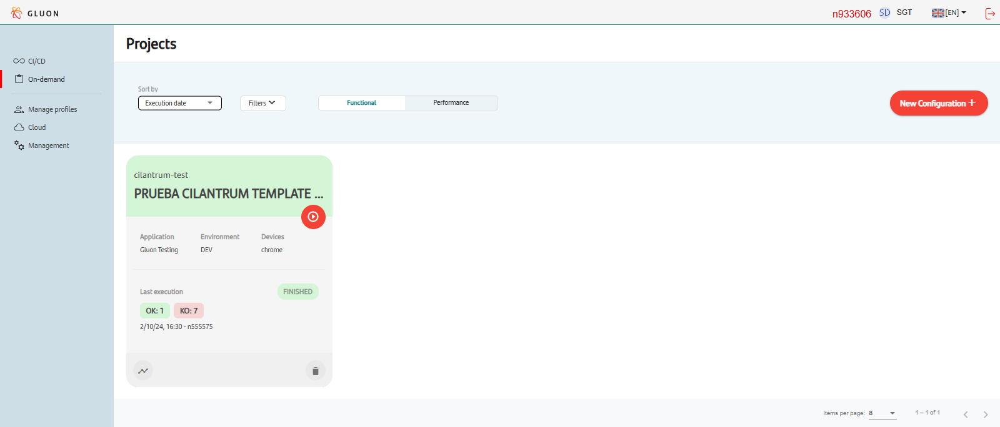{:style="border:1px solid grey"}

To do this, click on the **New configuration** (2) button on the upper tab, from where we will access the test configurator.
Once in the configurator we will see the different steps where we will complete the information of the new project.

<!--Testing portal ondemand functional tests end-->

### **2.1 New Configuration**

For functional tests there are three possible configurations: Web, Backend and Mobile.

#### **2.1.1 Web and Backend**

<!--Testing portal ondemand functional web and backend tests creation start-->

The information to complete for a new project is the following:

##### Test identification

In the first step, the field to fill is "Project Reference", this is the name of the new project and cannot exceed 50 characters.

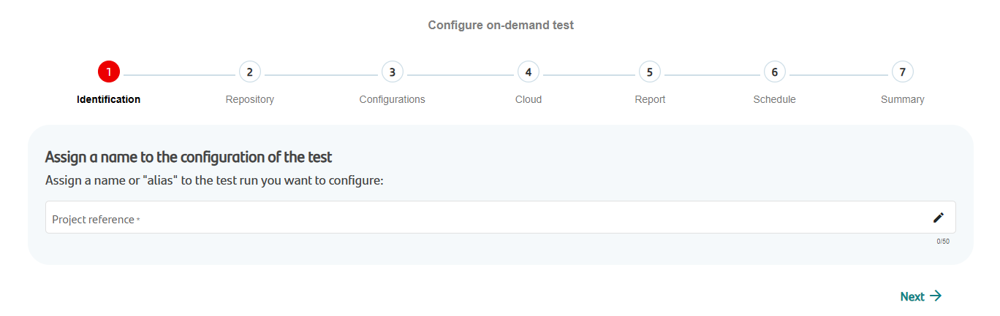{:style="border:1px solid grey"}

##### Repository

In this step you have to fill in the Gluon "Application" and "Testing component", and afterwards the branch or Tag on which you want to run the tests.

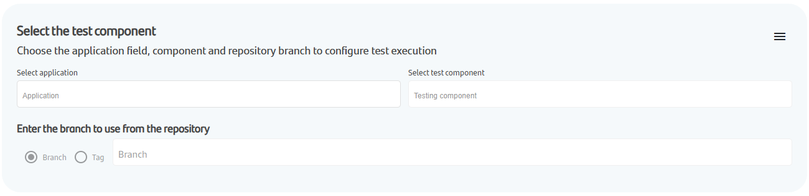{:style="border:1px solid grey"}

##### Configurations

In this screen, the first thing to select is the "Test type":

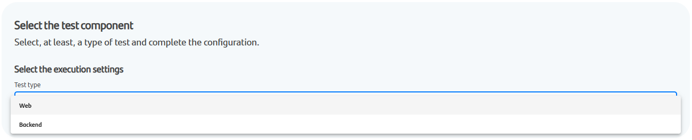{:style="border:1px solid grey"}

If **Web** test type is selected, the fields to be filled in are:

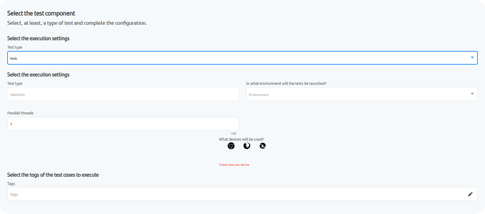{:style="border:1px solid grey"}

If **Backend** test type is selected, the fields to be filled in are:

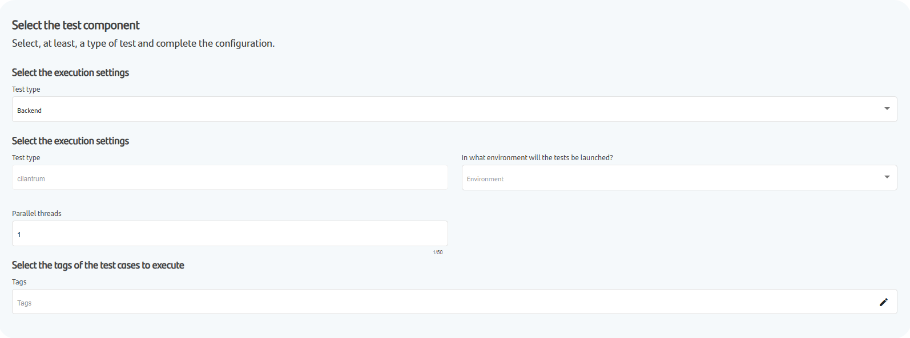{:style="border:1px solid grey"}

Description of the fields to be filled in:

  1. Framework of testing*: Framework on which the functional tests are developed. Currently the options available are TalosBDD, Newman, Cilantrum or Nitro.
  2. Environment: The environment where the application, on which the tests will be run, is located. DEV, PRE or PRO.
  If Internet is selected, you will not have access to the internal urls. If you do  not select an option, by default it will be created with Intranet.
  3. Devices: Devices on which tests will be performed. The options are Backend by default for tests that do not require a browser and Chrome, Firefox or Edge for Web type.
  4. Parallel executions: Number of threads in parallel with which you want to execute. The value must be between 1 and 50.
  5. Tags: Tags to filter the test cases you want to run. (Mandatory if TalosBDD is selected and Parallel executions is more than one).
  6. Passphrase: Passphrase to decrypt sensitive data. (Only available for TalosBDD or Newman)

!!! warning

    A specific role is required to be able execute tests in a Production environment.
    To request this role open a Support (INC), then indicate the following:

    - Summary:
      Requesting "Execute in PRO" role on Gluon Testing

    - Details:
      [The list of users]
        - Nombre Apellido1 Apellido2: n12345
        - Nombre Apellido1 Apellido2: x56789

    - Expected Outcome:
      The users indicated above have the "Execute in PRO" role on Gluon Testing

    - Priority:
      Low

    - Evidence:
      N/A

    For more info about how to do that go to [Request Support Section](../../../../../getting-started/support/index.md)

If Talos BDD is selected, we can found the next fields too:

- Type of parallel: Browsers or Scenarios. This field only appear for the more than one thread option.

<!--Testing portal ondemand functional web and backend tests creation end-->

### **2.1.2 Mobile**

<!--Testing portal ondemand functional mobile tests creation start-->

The information to complete for a new project is the following:

##### Test identification

In the first step, the field to fill is "Project Reference", this is the name of the new project and cannot exceed 50 characters.

{:style="border:1px solid grey"}

##### Repository

In this step you have to fill in the Gluon "Application" and "Testing component", and afterwards the branch or Tag on which you want to run the tests.

{:style="border:1px solid grey"}

##### Configurations

For Mobile the fields to be filled are:

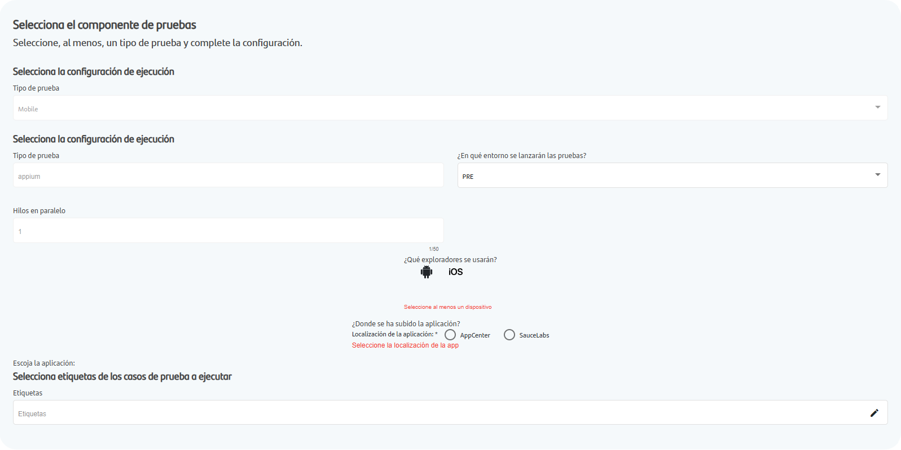{:style="border:1px solid grey"}

Once a device, if Android has been selected the following fields show up:

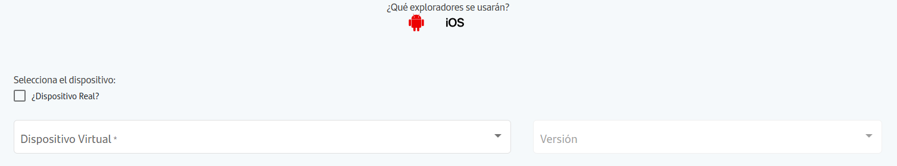{:style="border:1px solid grey"}

Otherwise, if iOs has been selected the following field show up:

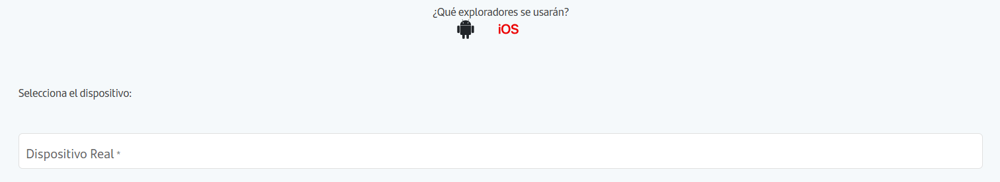{:style="border:1px solid grey"}

Once the app location has been selected, if AppCenter has been selected the following fields show up:

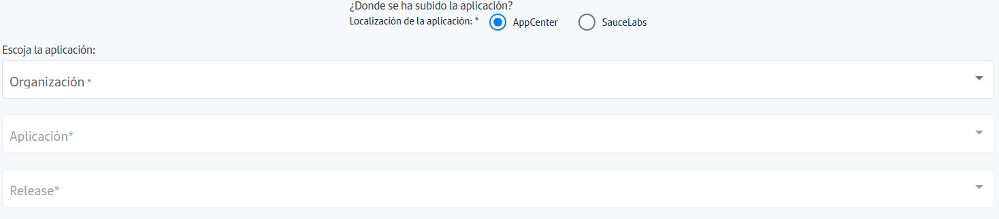{:style="border:1px solid grey"}

Otherwise, if SauceLabs has been selected the following field show up:

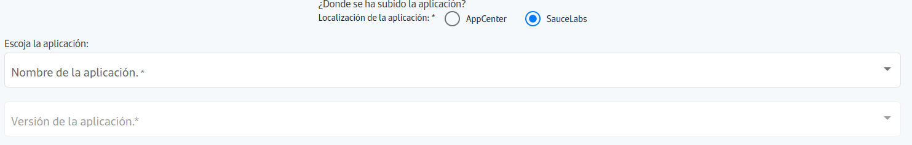{:style="border:1px solid grey"}

Description of the fields to be filled in:

  1. Environment: The environment where the application, on which the tests will be run, is located. DEV, PRE or PRO*.
  2. Devices: Devices on which tests will be performed. The options are Android or iOS.
  3. Virtual or Real device: Only available on Android, iOS must always be a real device. On virtual devices you choose the emulator and android version.
  4. Organization: Only available on AppCenter. The AppCenter organization where the application is stored.
  5. Application: Only available on AppCenter. The AppCenter application name.
  6. Release: Only available on AppCenter. The AppCenter application release.
  7. Application Name: Only available on SauceLabs. The SauceLabs application name.
  8. Application Version: Only available on SauceLabs. The SauceLabs application version.
  9. Tags: Tags to filter the test cases you want to run.

<!--Testing portal ondemand functional mobile tests creation end-->

<!--Testing portal ondemand functional tests creation start-->

#### Cloud

Once the tests are configured, we move on to the next step: Cloud. Here, the infrastructure that will support the tests is selected.
This infrastructure consists of a namespace where the service will deploy the necessary pods for execution.

The service will automatically deploy all required infrastructure components within the user-specified namespace.

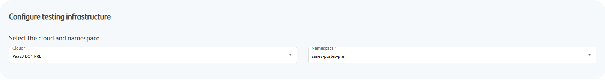{:style="border:1px solid grey"}

- **Cloud** (mandatory): Name of the cluster where to build the infrastructure that will support the tests.
- **Namespace** (mandatory): Name of the namespace where to build the infrastructure that will support the tests. Only namespaces from the indicated cloud can be selected

!!! warning

      In the portal, each Gluon application has a list of assigned namespaces that it can use to deploy the infrastructure.

      If at this screen the application namespace does not exist or a modal error appears indicating that the application does not have any namespace configured, check [Register new namespace](../../initialstep.md#12-setup-infrastructure) documentation.

#### Report

In this step, the possibility is given to send the report generated after the test run by e-mail. Regarding the HP-ALM delivery, it is currently not available for Gluon to All entities because of the version used, so keep this option disabled.

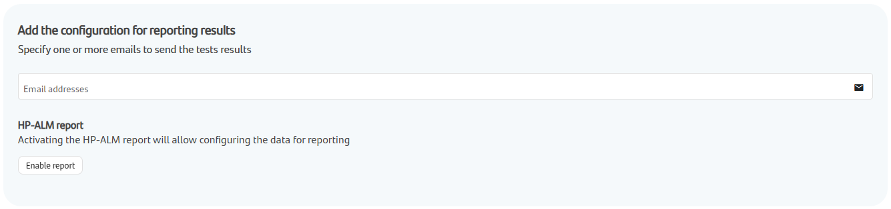{:style="border:1px solid grey"}

#### Schedule

In this step, it is possible to set up scheduled executions. The fields and options are explained in the table below.

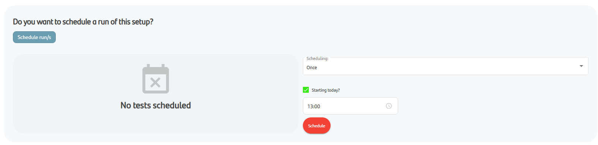{:style="border:1px solid grey"}

|Field|Description|Options|Required|Validation|
|---|---|---|---|---|
|Schedule type|Indicates the frequency in time of the scheduled test |Once, weekly, daily and periodically |Yes | One must be selected|
| Starting today? | Indicates if the scheduled test starts today. (only for once, daily and periodically). |checked or not | Yes | N/A |
| Starts on | Indicates the day the scheduled test begins. (only if Starting today? is not checked) | Days on a calendar | No | One day must be selected |
| Day of the week | Indicates the day the scheduled test will be performed. (only for week) | Days of the week | Yes | N/A|
| Set end date? | Indicate the last day that the test will be carried out. (only for weekly, daily and periodically). | checked or not | Yes | N/A|
| Ends on | Indicates the day the scheduled test ends. (only if Set end date? is checked) | Days on a calendar | No | One day must be selected |
| Time | Indicates the time at which the scheduled test will be performed (only for once, weekly and daily) | Available hours are: :00, :15, :30 and :45. | Yes | One time must be selected |
| Execution interval | Time between scheduled runs | 15, 30, 45, 60, 75, 90, 105,120 | Yes | One must be selected |

By default this option will be disabled, but it is possible to enable it once the configuration has been created in the edit screen.

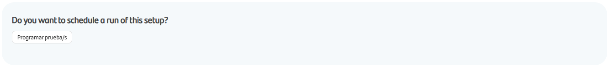{:style="border:1px solid grey"}

#### Summary

In the last step, once all the fields are completed, we will see a summary with the information of the project that we are going to create.
If all the information is correct, we will press the accept button that will create the project and redirect us to the projects list page.

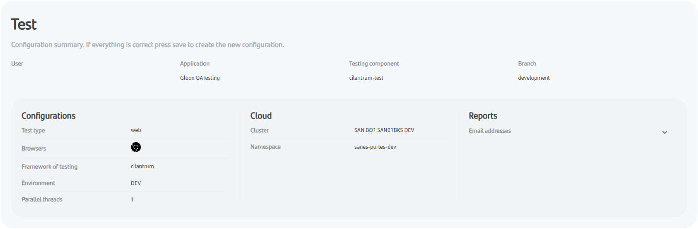{:style="border:1px solid grey"}

<!--Testing portal ondemand functional tests creation end-->

### **2.2 Project list**

In this interface you will see all the projects created to which the user has access. The access, is done through the permissions that the user has on the Gluon Applications. Let's see the different search and filter options that we have:

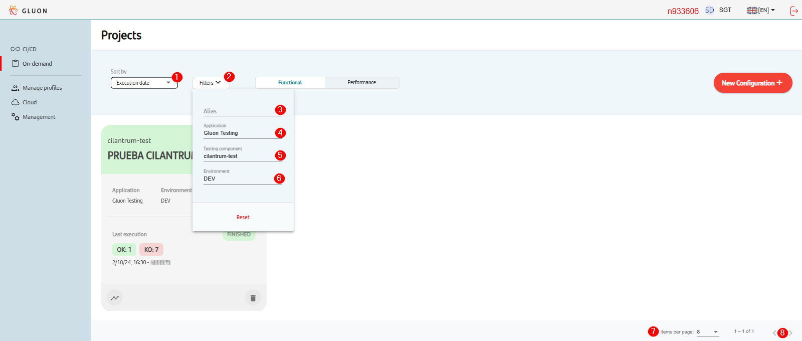{:style="border:1px solid grey"}

Description of the fields:

  1. Project sort by selector: creation date or execution date.
  2. Filters.
  3. Filtering of projects by project reference.
  4. Filtering projects by Gluon Application.
  5. Filtering projects by Gluon Testing Component.
  6. Filtering project by Environment.
  7. Filter number of projects per page.
  8. Pagination.

Each of the cards represents a project created with a certain configuration. Let's take a closer look at the cards:

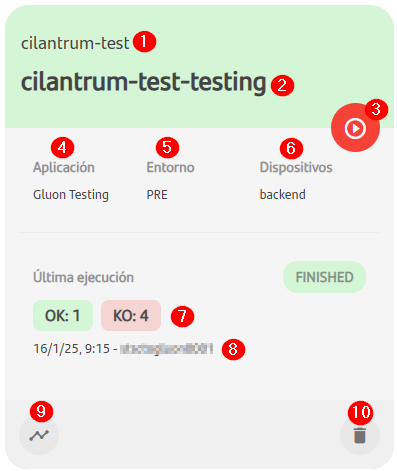{:style="border:1px solid grey" width="40%"}

Description of the fields:

  1. Gluon testing component.
  2. Project reference.
  3. Execute test button.
  4. Gluon application.
  5. Environment where the test will take place: DEV, PRE or PRO.
  6. Devices on which the test will run: Backend, Chrome, Firefox or Microsoft Edge.
  7. Cases passed and failed in the last run.
  8. Date and user of the last run.
  9. Access to execution history.
  10. Delete card.

To be able to carry out the different actions that we can do in the project, we must click on the card. It will take us to the next point, where the actions that can be taken on a project will be explained.

### **2.3 Project actions**

In this point will explain the information that is displayed after clicking on the card and the actions that can be performed on the project configuration.

#### **Test information**

Clicking on the card to view its configuration in detail:

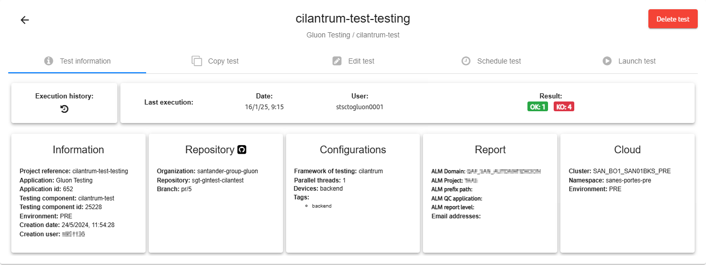{:style="border:1px solid grey"}

^^Last execution:^^

- Date: Date of the last run.
- User: Last user to run the project.
- Result: Result of the last execution.

^^Information:^^

- Project reference : Project reference.
- Application: Gluon application.
- Application Id: Gluon application id.
- Testing component: Gluon testing component.
- Testing component Id: Gluon testing component id.
- Environment: Environment of the application on which to run the tests.
- Creation date: Card creation date.
- Creation user: Card creation user.

^^Repository:^^

- Organization: Name of the git organization where the test repository is located.
- Repository: Name of the test repository.
- Git branch: Branch to be executed.

^^Configuration:^^

- Framework of testing: Framework on which the tests are developed. Talosbdd, Newman, Cilantrum, Nitro or Appium.
- Parallel threads: Number of threads in parallel.
- Devices: Devices on which the execution will take place. Chrome, Firefox, Microsoft Edge or Backend. For mobile testing it can also be Android or IOS.
- Tags: Tags that determine which tests have been executed. This field is not required, so it will only be displayed if it has been used.

^^Report:^^

- Email addresses: Email addresses to which the execution results will be sent at the end of the test.
- HP Alm info: Report Hierarchy (only for those entities with Hp Alm enabled).

^^Cloud:^^

- Cluster: Name of the cluster where to build the infrastructure that will support the tests.
- Namespace: Name of the namespace where to build the infrastructure that will support the tests.
- Environment: Environment where the infrastructure that supports the execution is located.

#### **Delete test**

From this screen, to delete the configuration press the "Delete test" button. Once clicked, the following confirmation pop-up will be displayed:

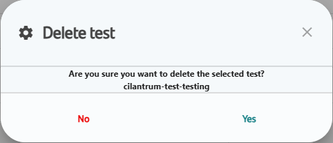{:style="border:1px solid grey"}

#### **Copy test**

When clicking on the "Copy test" tab, the project copying page will open. Cloning a project will create a card with the same organization and git repository, although we can edit the rest of the settings.
We must also complete the "Project reference", field to assign an alias to the new card that we are going to create.

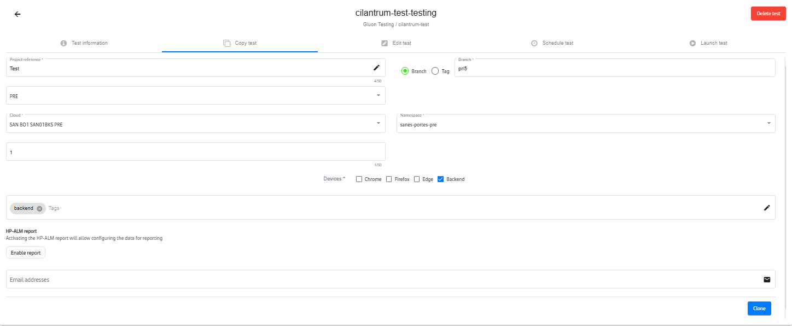{:style="border:1px solid grey"}

#### **Edit test**

When clicking on the "Edit test" tab, the project editing page will open. We will be able to edit any configuration of the card with the exception of project reference, application, testing component, environment and testing framework.

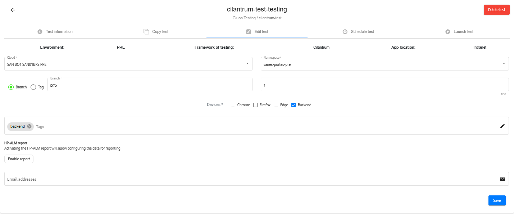{:style="border:1px solid grey"}

#### **Schedule test**

When clicking on the "Schedule test" tab, the project scheduling page will open. We will be able to carry out any configuration of the test schedule.

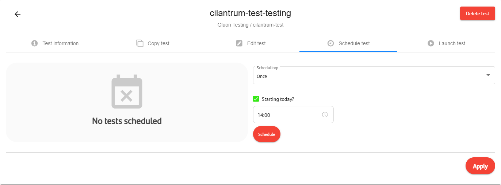{:style="border:1px solid grey"}

For more information on the different configurations, please see section [2.1.1.1 New Configuration: Schedule](#schedule)

#### **Launch test**

<!--Testing portal ondemand functional tests launch start-->

Pressing the "Launch test" tab will open the actions page in the launch test screen. On this page we can modify some data before launching the execution.

!!! info

    It is important to note that the fields that we modify here will only affect the test that we are going to run and not the card itself.

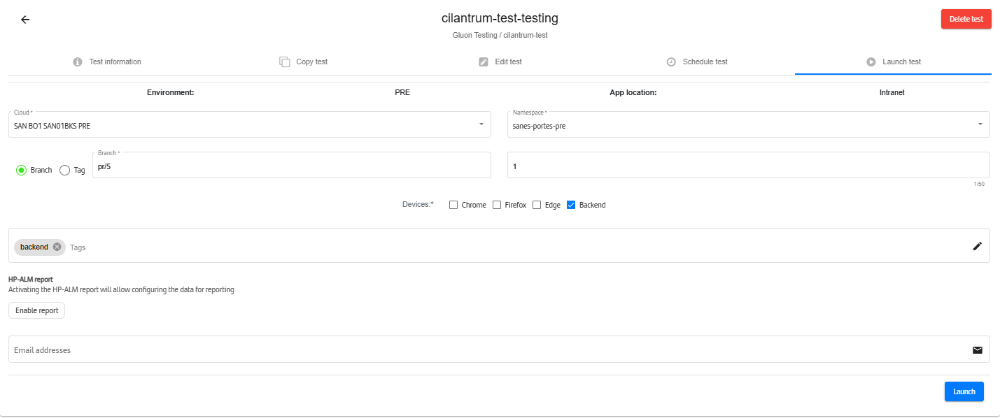{:style="border:1px solid grey"}

Once everything is ready, click on execute, and you will be redirected to the projects list window. In the project you just launched you will see a circle spinning around the run button indicating that that card has a run in progress.

<!--Testing portal ondemand functional tests launch end-->

### **2.4 Execute history**

In this section we can see the history of all the executions of a project with all the details of each one of the executions. You can access here by clicking on the button "Execute history".

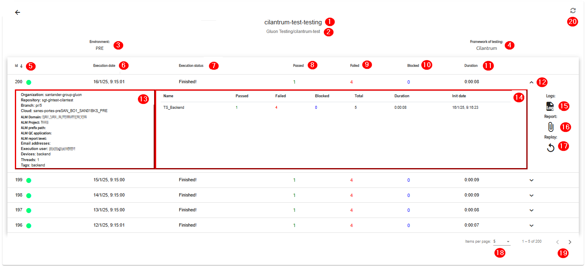{:style="border:1px solid grey"}

Description of the fields:

  1. Test reference.
  2. Gluon application and testing component.
  3. Environment in which it runs.
  4. Framework of testing.
  5. Execution number and status (green = finished successfully, white = in progress, red = finished with error, gray = stopped by a user).
  6. Date of execution.
  7. Execution status.
  8. Total passed cases.
  9. Total failed cases.
  10. Total cases blocked.
  11. Total execution duration.
  12. Button to open the detailed information of the execution.
  13. Execution configuration.
  14. Results of each test suite of the execution.
  15. Access to execution logs.
  16. Download link of the compressed file with the report (not enabled when report expires).
  17. Repeat execution with the same parameters or stop execution if it is in progress.
  18. Selector of the number of executions to show on the screen.
  19. Pagination.
  20. Refresh history of executions.

 
 

## **3. Performance tests**

Once we access the Ondemand performance tests section, we can proceed to create a new project.

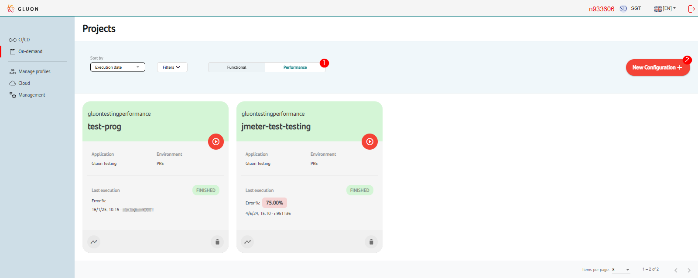{:style="border:1px solid grey"}

To do this, click on the **New configuration** (2) button on the upper tab, from where we will access the test configurator.
Once in the configurator we will see the different steps where we will complete the information of the new project.

### **3.1 New Configuration**

<!--Testing portal ondemand performance tests creation start-->

The information to complete for a new project is the following:

#### Test identification

In the first step, the field to fill is "Project Reference", this is the name of the new project and cannot exceed 50 characters.

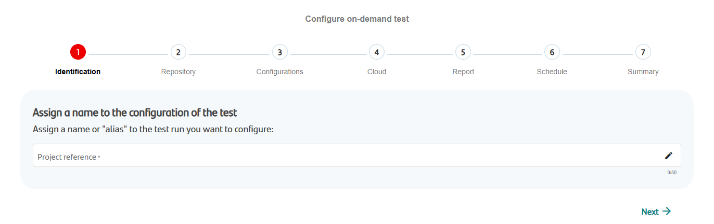{:style="border:1px solid grey"}

#### Repository

In this step you have to fill in the Gluon "Application" and "Testing component", and afterwards the branch or Tag on which you want to run the tests.

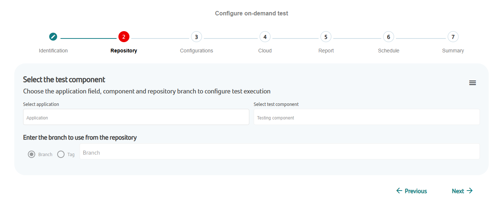{:style="border:1px solid grey"}

#### Configurations

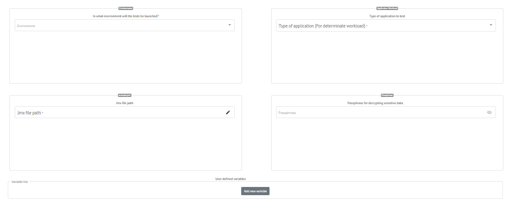{:style="border:1px solid grey"}

Description of the fields to be filled in:

  1. **Environment** (mandatory): The environment where the application, on which the tests will be run, is located. DEV, PRE or PRO.
  2. **Application workload** (mandatory): Type of application to test. Web service, Basic Operation, Workflow, Complex operation or Datamart or information system.
  3. **Jmx file path** (mandatory): Full path where the .jmx file to be executed is located.
  4. **Passphrase**: Passphrase for decrypting sensitive data..
  5. **Execution variables**: List of execution variables. We will add the name of the variable and its value. For example, if we define the variable “variable1” with the value “10“, in the jmx file we will define this variable as ${__P(variable1)}, which
  will take the value of 10.

#### Cloud

Once the test are configured we move on to the next step, Cloud. Here the infrastructure that will support the tests will be chosen. This infrastructure can
be a namespace where the service will deploy the pods necessary for execution (legacy mode) or through ephemeral runners previously configured in the
organization.

- **Ephemeral runners**: The execution of the tests will be carried out in ephemeral runners previously configured in the organization where the test repository is located. See [Ephemeral runners](../../initialstep.md)

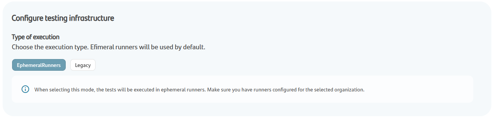{:style="border:1px solid grey"}

- **Legacy**: The service will deploy the infrastructure necessary for execution in the namespace indicated by the user.

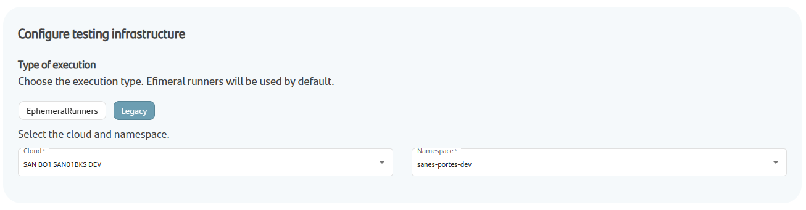{:style="border:1px solid grey"}

- **Cloud** (mandatory): Name of the cluster where to build the infrastructure that will support the tests.
- **Namespace** (mandatory): Name of the namespace where to build the infrastructure that will support the tests. Only namespaces from the indicated cloud can be selected

!!! warning

      In the portal, each Gluon application has a list of assigned namespaces that it can use to deploy the infrastructure.

      If at this screen the application namespace does not exist or a modal error appears indicating that the application does not have any namespace configured, check [Register new namespace](../../initialstep.md#12-setup-infrastructure) documentation.

#### Report

In this step, the possibility is given to send the report generated after the test run by e-mail. Regarding the HP-ALM delivery, it is currently not available for Gluon because of the version used, so keep this option disabled.

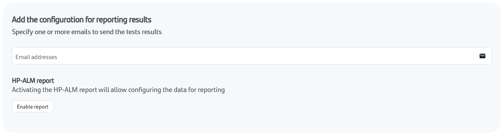{:style="border:1px solid grey"}

#### Schedule

In this step, it is possible to set up scheduled executions. The fields and options are explained in the table below.

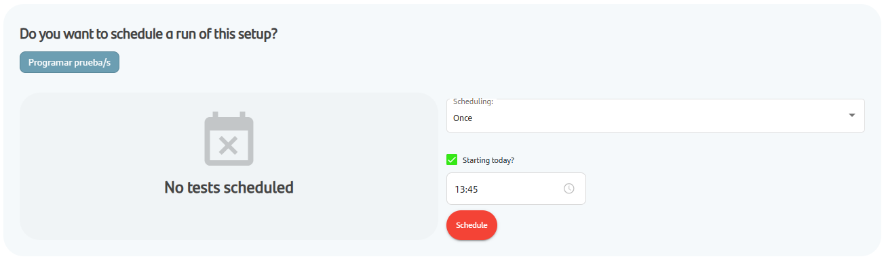{:style="border:1px solid grey"}

|Field|Description|Options|Required|Validation|
|---|---|---|---|---|
|Schedule type|Indicates the frequency in time of the scheduled test |Once, weekly, daily and periodically |Yes | One must be selected|
| Starting today? | Indicates if the scheduled test starts today. (only for once, daily and periodically). |checked or not | Yes | N/A |
| Starts on | Indicates the day the scheduled test begins. (only if Starting today? is not checked) | Days on a calendar | No | One day must be selected |
| Day of the week | Indicates the day the scheduled test will be performed. (only for week) | Days of the week | Yes | N/A|
| Set end date? | Indicate the last day that the test will be carried out. (only for weekly, daily and periodically). | checked or not | Yes | N/A|
| Ends on | Indicates the day the scheduled test ends. (only if Set end date? is checked) | Days on a calendar | No | One day must be selected |
| Time | Indicates the time at which the scheduled test will be performed (only for once, weekly and daily) | Available hours are: :00, :15, :30 and :45. | Yes | One time must be selected |
| Execution interval | Time between scheduled runs | 15, 30, 45, 60, 75, 90, 105,120 | Yes | One must be selected |

By default this option will be disabled, but it is possible to enable it once the configuration has been created in the edit screen.

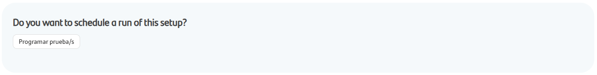{:style="border:1px solid grey"}

#### Summary

In the last step, once all the fields are completed, we will see a summary with the information of the project that we are going to create.
If all the information is correct, we will press the accept button that will create the project and redirect us to the projects list page.

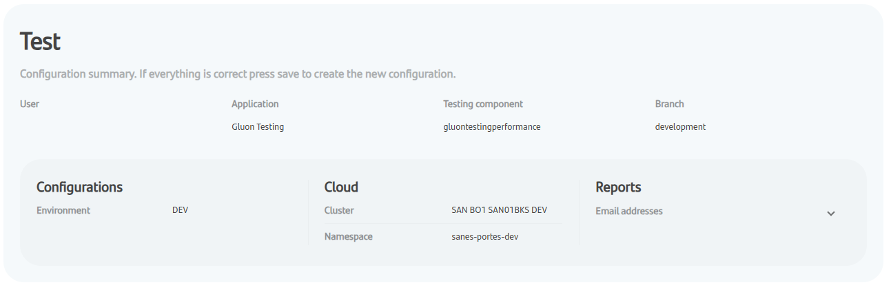{:style="border:1px solid grey"}

<!--Testing portal ondemand performance tests creation end-->

### **3.2 Project list**

In this interface you will see all the projects created to which the user has access. The access, is done through the permissions that the user has on the Gluon Applications. Let's see the different search and filter options that we have:

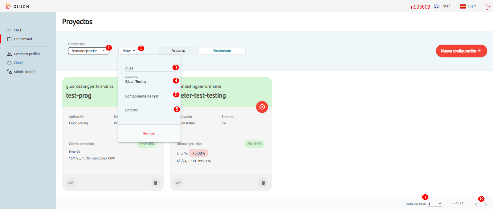{:style="border:1px solid grey"}

Description of the fields:

  1. Project sort by selector: execution date or creation date.
  2. Filters.
  3. Filtering of projects by project reference.
  4. Filtering projects by Gluon Application.
  5. Filtering projects by Gluon Testing Component.
  6. Filtering project by Environment.
  7. Filter number of projects per page.
  8. Pagination.

Each of the cards represents a project created with a certain configuration. Let's take a closer look at the cards:

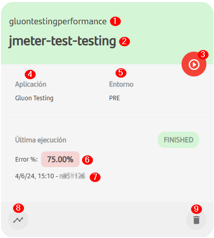{:style="border:1px solid grey" width="40%"}

Description of the fields:

  1. Project reference.
  2. Gluon testing component.
  3. Execute test button.
  4. Gluon application.
  5. Environment where the test will take place: DEV, PRE or PRO.
  6. Error percentage of the last run.
  7. Date and user of the last run.
  8. Access to execution history.
  9. Delete card.

To be able to carry out the different actions that we can do in the project, we must click on the card. It will take us to the next point, where the actions that can be taken on a project will be explained.

### **3.3 Project actions**

In this point will explain the information that is displayed after clicking on the card and the actions that can be performed on the project configuration.

#### **Test information**

Clicking on the card to view its configuration in detail:

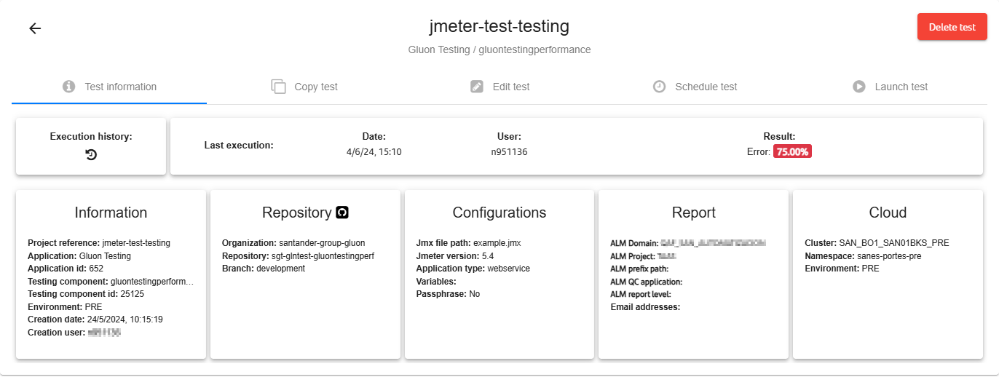{:style="border:1px solid grey"}

^^Last execution:^^

- Date: Date of the last run.
- User: Last user to run the project.
- Result: Result of the last execution.

^^Information:^^

- Project reference : Project reference.
- Application: Gluon application.
- Application Id: Gluon application id.
- Testing component: Gluon testing component.
- Testing component Id: Gluon testing component id.
- Environment: Environment of the application on which to run the tests.
- Creation date: Card creation date.
- Creation user: Card creation user.

^^Repository:^^

- Organization: Name of the git organization where the test repository is located.
- Repository: Name of the test repository.
- Git branch: Branch to be executed.

^^Configuration:^^

  - Jmx file path: Full path where the .jmx file to be executed is located.
  - Application type: Type of application to test.
  - Execution variables: List of execution variables.
  - Passphrase: Passphrase for decrypting sensitive data.

^^Report:^^

- Email addresses: Email addresses to which the execution results will be sent at the end of the test.

^^Cloud:^^

- Cluster: Name of the cluster where to build the infrastructure that will support the tests.
- Namespace: Name of the namespace where to build the infrastructure that will support the tests.
- Environment: Environment where the infrastructure that supports the execution is located.

#### **Delete test**

From this screen, to delete the configuration press the "Delete test" button. Once clicked, the following confirmation pop-up will be displayed:

{:style="border:1px solid grey"}

#### **Copy test**

When clicking on the "Copy test" tab, the project copying page will open. Cloning a project will create a card with the same organization and git repository, although we can edit the rest of the settings.
We must also complete the "Project reference", field to assign an alias to the new card that we are going to create.

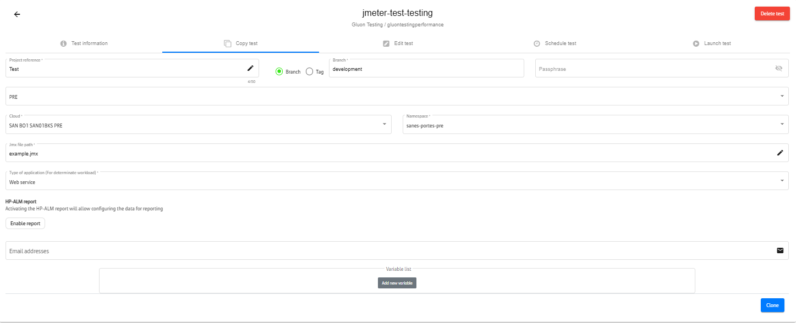{:style="border:1px solid grey"}

#### **Edit test**

When clicking on the "Edit test" tab, the project editing page will open. We will be able to edit any configuration of the card with the exception of project reference, application, testing component and environment.

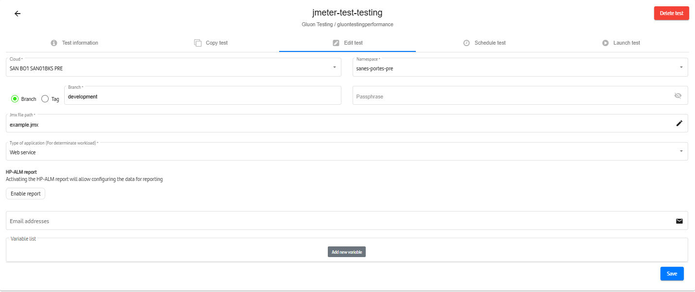{:style="border:1px solid grey"}

#### **Schedule test**

When clicking on the "Schedule test" tab, the project scheduling page will open. We will be able to carry out any configuration of the test schedule.

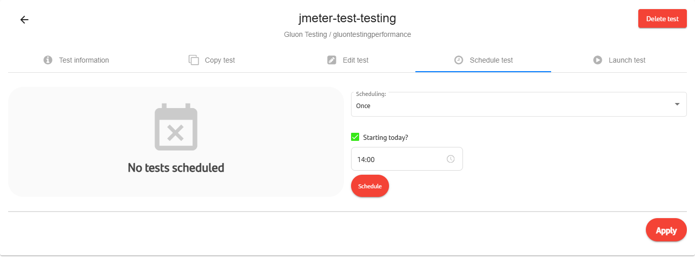{:style="border:1px solid grey"}

For more information on the different configurations, please see section [3.1.1.1 New Configuration: Schedule](#schedule)

#### **Launch test**

<!--Testing portal ondemand performance tests launch start-->

Pressing the "Launch test" tab will open the actions page in the launch test screen. On this page we can modify some data before launching the execution.

!!! info

    It is important to note that the fields that we modify here will only affect the test that we are going to run and not the card itself.

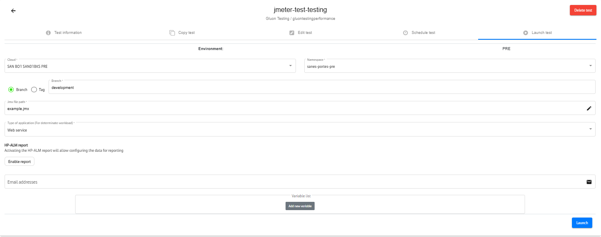{:style="border:1px solid grey"}

Once everything is ready, click on execute, and you will be redirected to the projects list window. In the project you just launched you will see a circle spinning around the run button indicating that that card has a run in progress.

<!--Testing portal ondemand performance tests launch end-->

### **3.4 Execute history**

In this section we can see the history of all the executions of a project with all the details of each one of the executions. You can access here by clicking on the button "Execute history".

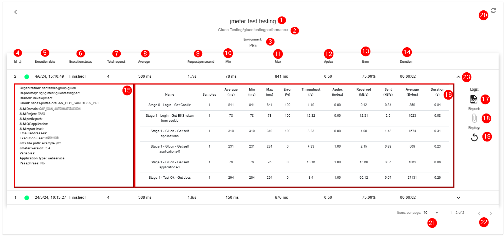{:style="border:1px solid grey"}

Description of the fields:

  1. Test reference.
  2. Gluon application and testing component.
  3. Environment in which it runs.
  4. Execution number and status (green = finished successfully, white = in progress, red = finished with error, gray = stopped by a user).
  5. Date of execution.
  6. Execution status.
  7. Total requests made.
  8. Average response rate.
  9. Requests per second made.
  10. Minimum response time
  11. Maximum response time.
  12. Apdex
  13. Error rate.
  14. Total execution duration.
  15. Execution configuration.
  16. Results of each execution request.
  17. Access to execution logs.
  18. Download link of the compressed file with the report.
  19. Repeat execution with the same parameters or stop execution if it is in progress.
  20. Refresh history of executions.
  21. Selector of the number of executions to show on the screen.
  22. Pagination.
  23. Button to open the detailed information of the execution.
