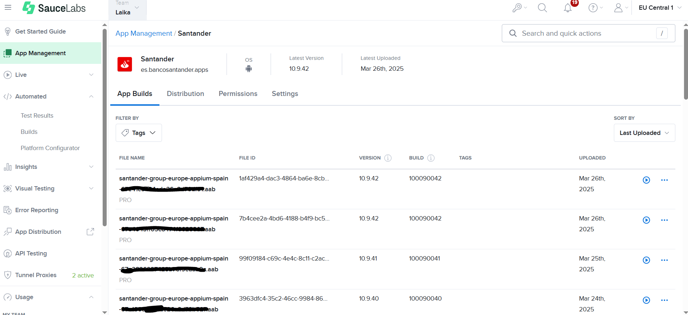

## **Introduction**

{!
   include-markdown "../snippets/workflows-steps.md"
   start="<!-- ondemand workflow introduction start -->"
   end="<!-- ondemand workflow introduction end -->"
!}

## **Configuration**

{!
   include-markdown "../snippets/workflows-configurations.md"
   start="<!-- ondemand workflow configuration description start -->"
   end="<!-- ondemand workflow configuration description end -->"
!}

{!
   include-markdown "../snippets/workflows-configurations.md"
   start="<!-- workflow mobile configuration file start -->"
   end="<!-- workflow mobile configuration file end -->"
!}

{!
   include-markdown "../snippets/workflows-configurations.md"
   start="<!-- workflow mobile configuration table start -->"
   end="<!-- workflow mobile configuration table end -->"
!}

{!
   include-markdown "../snippets/workflows-configurations.md"
   start="<!-- workflow configuration general note start -->"
   end="<!-- workflow configuration general note end -->"
!}

## **Execute**

<!-- ondemand workflows appium execute start -->

{!
   include-markdown "../snippets/workflows-steps.md"
   start="<!-- workflow saucelabs warning start -->"
   end="<!-- workflow saucelabs warning end -->"
!}

{!
   include-markdown "../snippets/workflows-steps.md"
   start="<!-- ondemand workflow execute start -->"
   end="<!-- ondemand workflow execute end -->"
!}

- **Branch:** Branch name.
- **Environment:** Execution environment.
- **Tags:** Execution tags separated by ';'.
- **Application name:** name of the application file name as it appears in Saucelabs. See image below.
- **Application build:** name of the test execution that will appear in Saucelabs, if left empty the Application name field will be used instead.

{:style="border:1px solid grey"}

<!-- ondemand workflows appium execute end -->

## **Steps**

{!
   include-markdown "../snippets/workflows-steps.md"
   start="<!-- workflow steps appium start -->"
   end="<!-- workflow steps appium end -->"
!}

{!
   include-markdown "../snippets/workflows-steps.md"
   start="<!-- job report test results start -->"
   end="<!-- job report test results end -->"
!}

## **Results**

{!
   include-markdown "../snippets/workflows-steps.md"
   start="<!-- workflow results start -->"
   end="<!-- workflow results end -->"
!}

## Related content

[Appium Journey](../../../../../components/configuration/testing/appium/journey/appium-testing-journey.md)
