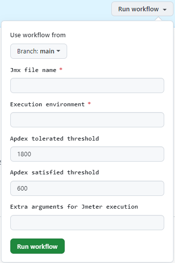

## **1. Introduction**

{!
   include-markdown "../snippets/workflows-steps.md"
   start="<!-- ondemand workflow introduction start -->"
   end="<!-- ondemand workflow introduction end -->"
!}

## **Configuration**

{!
   include-markdown "../snippets/workflows-configurations.md"
   start="<!-- ondemand workflow configuration description start -->"
   end="<!-- ondemand workflow configuration description end -->"
!}

{!
   include-markdown "../snippets/workflows-configurations.md"
   start="<!-- workflow jmeter configuration file start -->"
   end="<!-- workflow jmeter configuration file end -->"
!}

{!
   include-markdown "../snippets/workflows-configurations.md"
   start="<!-- workflow jmeter configuration table start -->"
   end="<!-- workflow jmeter configuration table end -->"
!}

{!
   include-markdown "../snippets/workflows-configurations.md"
   start="<!-- workflow configuration general note start -->"
   end="<!-- workflow configuration general note end -->"
!}

## **Execute**

<!-- ondemand workflows jmeter execute start -->
{!
   include-markdown "../snippets/workflows-steps.md"
   start="<!-- ondemand workflow execute start -->"
   end="<!-- ondemand workflow execute end -->"
!}

- **Branch:** Branch name.
- **Environment:** Execution environment.
- **JmxFileName:** Path to jmx file for execute.
- **Apdex tolerated:** Apdex tolerated threshold index.
- **Apdex satisfied:** Apdex satisfied threshold index.
- **Extra arguments for Jmeter execution:** Arguments to pass Jmeter execution with format '-Jkey=value'.

{:style="border:1px solid grey"}
<!-- ondemand workflows jmeter execute end -->

## **Steps**

{!
   include-markdown "../snippets/workflows-steps.md"
   start="<!-- workflow steps jmeter start -->"
   end="<!-- workflow steps jmeter end -->"
!}

{!
   include-markdown "../snippets/workflows-steps.md"
   start="<!-- job report test results start -->"
   end="<!-- job report test results end -->"
!}

## **Results**

{!
   include-markdown "../snippets/workflows-steps.md"
   start="<!-- workflow results jmeter start -->"
   end="<!-- workflow results jmeter end -->"
!}

## Related content

[Jmeter Journey](../../../../../components/configuration/testing/jmeter/journey/jmeter-testing-journey.md)
