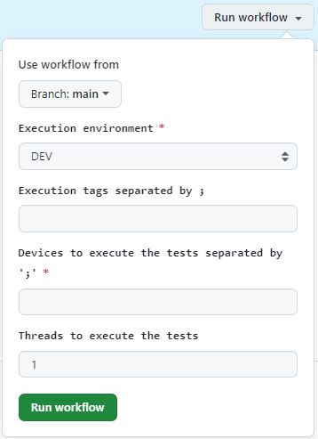

## **Introduction**

{!
   include-markdown "../snippets/workflows-steps.md"
   start="<!-- ondemand workflow introduction start -->"
   end="<!-- ondemand workflow introduction end -->"
!}

## **Configuration**

{!
   include-markdown "../snippets/workflows-configurations.md"
   start="<!-- ondemand workflow configuration description start -->"
   end="<!-- ondemand workflow configuration description end -->"
!}

{!
   include-markdown "../snippets/workflows-configurations.md"
   start="<!-- workflow web configuration file start -->"
   end="<!-- workflow web configuration file end -->"
!}

{!
   include-markdown "../snippets/workflows-configurations.md"
   start="<!-- workflow web configuration table start -->"
   end="<!-- workflow web configuration table end -->"
!}

{!
   include-markdown "../snippets/workflows-configurations.md"
   start="<!-- workflow configuration general note start -->"
   end="<!-- workflow configuration general note end -->"
!}

## **Execute**

<!-- ondemand workflows nitro execute start -->
{!
   include-markdown "../snippets/workflows-steps.md"
   start="<!-- ondemand workflow execute start -->"
   end="<!-- ondemand workflow execute end -->"
!}

- **Branch:** Branch name.
- **Environment:** Execution environment.
- **Devices:** Devices to execute test separated by ';'. Options: backend or chrome, firefox and/or edge.
- **Tags:** Execution tags separated by ';'.

{:style="border:1px solid grey"}
<!-- ondemand workflows nitro execute start -->

## **Steps**

{!
   include-markdown "../snippets/workflows-steps.md"
   start="<!-- workflow steps nitro start -->"
   end="<!-- workflow steps nitro end -->"
!}.

{!
   include-markdown "../snippets/workflows-steps.md"
   start="<!-- job report test results start -->"
   end="<!-- job report test results end -->"
!}

## **Results**

{!
   include-markdown "../snippets/workflows-steps.md"
   start="<!-- workflow results start -->"
   end="<!-- workflow results end -->"
!}

## Related content

[Nitro Journey](../../../../../components/configuration/testing/nitro/journey/nitro-testing-journey.md)
