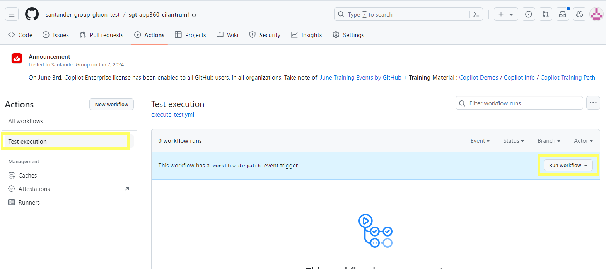

<!-- ONDEMAND SNIPPETS -->

<!-- cicd workflow introduction start -->

Using Gluon's CICD workflows, tests can be integrated into application deployment flows. These tests will be run during the deployment cycle of
a component after step **Deploying in preproduction**, during step **Running tests on preproduction**. For these tests to be executed
through workflows using ephemeral runners, the test component must be associated with the component. To use this functionality we must add
the following fields to the file **properties.env**:

{!
   include-markdown "../../../../ci-cd/technologies/snippets/common-project-properties.md"
   start="<!--testing-start-->"
   end="<!--testing-end-->"
!}

<!-- cicd workflow introduction end -->

<!-- ONDEMAND SNIPPETS -->

<!-- ondemand workflow introduction start -->
It's possible to make ondemand execution directly from Github testing repository. This type of execution is carried out on Ephemeral Runners that
must be previously installed in the Git organization. See [Ephemeral Runners](../../initialstep.md#122-ephemeral-runners).

When you create a new testing component from the Gluon Portal, a new Git repository is created from the selected framework template
with the following workflow **.github/workflows/execute-test. yml**. This workflow is the one that will be executed from the Gluon Testing Portal when configure
a new test for that repository and selecting the Ephemeral Runner option in the Cloud step. This is the same workflow that can be executed directly from GitHub.
<!-- ondemand workflow introduction end -->

<!-- ondemand workflow execute start -->
To execute the workflow we must ensure that the file **.github/workflows/execute-test.yml** exists in the default branch of the **main** project. If not,
you must merge the **development** branch to **main**.

Now, in the **Actions** section of the repository,

{:style="border:1px solid grey"}

the **Test execution** workflow appears, which can be executed using the **Run workflow** button. When selecting **Run workflow**, the following
parameters are requested (These parameters overwrite the configurations made in the [configuration file](../utilities/configurations.md#ondemand)):
<!-- ondemand workflow execute end -->

<!-- COMMON SNIPPETS -->

<!-- workflow selenium warning start -->
!!! note

    To perform web tests, the file **.testingConfig/selenium/properties.yml** must be configured correctly. See [Selenium Configuration](../utilities/selenium.md).
<!-- workflow selenium warning end -->

<!-- workflow saucelabs warning start -->
!!! note

    To perform mobile tests in Saucelabs, the url (either in the config files or as the environment variable SAUCELABS_HOST), the user and the token, as secrets SAUCELABS_USER and SAUCELABS_TOKEN, must be properly set. All this information can be found in the profile page of your user in Saucelabs.
<!-- workflow saucelabs warning end -->

<!-- workflow results start -->
When the execution finishes correctly, both results and report will **be stored in Github**, see [Retention Days](../utilities/retentiondays.md). These files can be downloaded by
accessing the **Artifacts** section of the action from the **Summary**.
<!-- workflow results end -->

<!-- workflow talos results start -->
When the execution finishes correctly, both results, report and full report, which contains the screenshoots, will **be stored in Github**, see [Retention Days](../utilities/retentiondays.md). These files can be downloaded by
accessing the **Artifacts** section of the action from the **Summary**.
<!-- workflow talos results end -->

<!-- workflow results jmeter start -->
When the execution finishes correctly; summary, results, apdex and report will **be stored in Github**, see [Retention Days](../utilities/retentiondays.md). These files can be downloaded by accessing the **Artifacts** section of the action from the **Summary**.
<!-- workflow results jmeter end -->

<!-- SNIPPETS BY FRAMEWORK -->

<!-- workflow steps nitro start -->

### **Setup environment variables**

Uses a reusable workflow to set up necessary environment variables.

### **Load Nitro configurations**

1. **Set up job:** Initialize job
2. **Set up runner:** Initialize runner
3. **Show inputs:** Show input information.
4. **Checkout repository:** Checkout GitHub repository.
5. **Setup testing configurations:** Setup testing configurations, [read config files](../utilities/configurations.md), [get execution secrets](../utilities/secrets.md), get Gluon data and generate Nitro execution command.
6. **Check framework version:** Check that framework version is supported. [Check version](../utilities/check-version.md).

### **Execute Nitro test on &lt;ENV&gt;**

1. **Set up job:** Initialize job
2. **Set up runner:** Initialize runner
3. **Execution info:** Show execution information.
4. **Checkout repository:** Checkout GitHub repository.
5. **Setup runner OHE:** Setup Helm version on runner. (Only for web executions)
6. **Deploying selenium in &lt;env&gt;:** Deploy Selenium hub (Only for web executions). See [Selenium Configuration](../utilities/selenium.md).
7. **Maven info:** Show Maven and Java information.
8. **Download dependencies:** Download Maven dependencies.
9. **Execute test:** Execute Nitro command for launch functional tests.
10. **Parse results:** Prepare results for next steps.
11. **Upload report:** Upload report as artifact on action run.
12. **Upload summary:** Upload summary as artifact on action run.

<!-- workflow steps nitro end -->

<!-- workflow steps cilantrum start -->

### **Setup environment variables**

Uses a reusable workflow to set up necessary environment variables.

### **Load Cilantrum configurations**

1. **Set up job:** Initialize job
2. **Set up runner:** Initialize runner
3. **Show inputs:** Show input information.
4. **Checkout repository:** Checkout GitHub repository.
5. **Setup testing configurations:** Setup testing configurations, [read config files](../utilities/configurations.md), [get execution secrets](../utilities/secrets.md), get Gluon data and generate Cilantrum execution command.
6. **Check framework version:** Check that framework version is supported. [Check version](../utilities/check-version.md).

### **Execute Cilantrum test on &lt;ENV&gt;**

1. **Set up job:** Initialize job
2. **Set up runner:** Initialize runner
3. **Execution info:** Show execution information.
4. **Checkout repository:** Checkout GitHub repository.
5. **Setup runner OHE:** Setup Helm version on runner. (Only for web executions)
6. **Deploying selenium in &lt;env&gt;:** Deploy Selenium hub (Only for web executions). See [Selenium Configuration](../utilities/selenium.md).
7. **Maven info:** Show Maven and Java information.
8. **Download dependencies:** Download Maven dependencies.
9. **Execute test:** Execute Cilantrum command for launch functional tests.
10. **Parse results:** Prepare results for next steps.
11. **Upload report:** Upload report as artifact on action run.
12. **Upload summary:** Upload summary as artifact on action run.

<!-- workflow steps cilantrum end -->

<!-- workflow steps appium start -->

### **Setup environment variables**

Uses a reusable workflow to set up necessary environment variables.

### **Load Appium configurations**

1. **Set up job:** Initialize job
2. **Set up runner:** Initialize runner
3. **Show inputs:** Show input information.
4. **Checkout repository:** Checkout GitHub repository.
5. **Setup testing configurations:** Setup testing configurations, [read config files](../utilities/configurations.md), [get execution secrets](../utilities/secrets.md), get Gluon data and generate Appium execution command.
6. **Check framework version:** Check that framework version is supported. [Check version](../utilities/check-version.md).

### **Execute Appium test on &lt;ENV&gt;**

1. **Set up job:** Initialize job
2. **Set up runner:** Initialize runner
3. **Execution info:** Show execution information.
4. **Checkout repository:** Checkout GitHub repository.
5. **Java info:** Show Java information.
6. **Execute test:** Execute Appium command for launch functional tests.
7. **Parse results:** Prepare results for next steps.
8. **Upload report:** Upload report as artifact on action run.
9. **Upload summary:** Upload summary as artifact on action run.

<!-- workflow steps appium end -->

<!-- workflow steps talos start -->

### **Setup environment variables**

Uses a reusable workflow to set up necessary environment variables.

### **Load Talos configurations**

1. **Set up job:** Initialize job
2. **Set up runner:** Initialize runner
3. **Show inputs:** Show input information.
4. **Checkout repository:** Checkout GitHub repository.
5. **Setup testing configurations:** Setup testing configurations, [read config files](../utilities/configurations.md), [get execution secrets](../utilities/secrets.md), get Gluon data and generate Talos execution command.
6. **Check framework version:** Check that framework version is supported. [Check version](../utilities/check-version.md).

### **Execute Talos test on &lt;ENV&gt;**

1. **Set up job:** Initialize job
2. **Set up runner:** Initialize runner
3. **Execution info:** Show execution information.
4. **Checkout repository:** Checkout GitHub repository.
5. **Setup runner OHE:** Setup Helm version on runner. (Only for web executions)
6. **Deploying selenium in &lt;env&gt;:** Deploy Selenium hub (Only for web executions). See [Selenium Configuration](../utilities/selenium.md).
7. **Python info:** Show Python version.
8. **Install requirements:** Install Python requirements from requirements.txt.
9. **Execute test:** Execute Talos command for launch functional tests.
10. **Parse results:** Prepare results for next steps.
11. **Upload report:** Upload report as artifact on action run.
12. **Upload summary** Upload summary as artifact on action run.
13. **Upload full output** Upload entire talos output folder as artifact on action run. This folder contains the report with all the screenshoots.

<!-- workflow steps talos end -->

<!-- workflow steps newman start -->

### **Setup environment variables**

Uses a reusable workflow to set up necessary environment variables.

### **Load Newman configurations**

1. **Set up job:** Initialize job
2. **Set up runner:** Initialize runner
3. **Show inputs:** Show input information.
4. **Checkout repository:** Checkout GitHub repository.
5. **Setup testing configurations:** Setup testing configurations, [read config files](../utilities/configurations.md), [get execution secrets](../utilities/secrets.md), get Gluon data and generate Newman execution command.

### **Execute Talos test on &lt;ENV&gt;**

1. **Set up job:** Initialize job
2. **Set up runner:** Initialize runner
3. **Execution info:** Show execution information.
4. **Checkout repository:** Checkout GitHub repository.
5. **Npm info:** Show node and npm versions.
6. **Execute tests:** Execute Newman command for launch functional tests.
7. **Parse results:** Prepare results for next steps.
8. **Upload report:** Upload report as artifact on action run.
9. **Upload summary:** Upload summary as artifact on action run.

<!-- workflow steps newman end -->

<!-- workflow steps jmeter start -->

### **Setup environment variables**

Uses a reusable workflow to set up necessary environment variables.

### **Load Jmeter configurations**

1. **Set up job:** Initialize job
2. **Set up runner:** Initialize runner
3. **Show inputs:** Show input information.
4. **Checkout repository:** Checkout GitHub repository.
5. **Setup testing configurations:** Setup testing configurations, [read config files](../utilities/configurations.md), [get execution secrets](../utilities/secrets.md), get Gluon data and generate Jmeter execution command.
6. **Check framework version:** Check that framework version is supported. [Check version](../utilities/check-version.md).

### **Execute Jmeter test on &lt;ENV&gt;**

1. **Set up job:** Initialize job
2. **Set up runner:** Initialize runner
3. **Execution info:** Show execution information.
4. **Checkout repository:** Checkout GitHub repository.
5. **Setup runner OHE:** Setup Java version on runner.
6. **Jmeter info:** Show JMeter information.
7. **Execute tests:** Execute JMeter command for launch performance tests.
8. **Parse results:** Prepare results for next steps.
9. **Upload report:** Upload report as artifact on action run.
10. **Upload summary:** Upload summary as artifact on action run.

<!-- workflow steps jmeter end -->

<!-- REUSED SNIPPETS -->

<!-- job report test results start -->

### **Report test results**

1. **Set up job:** Initialize job
2. **Set up runner:** Initialize runner
3. **Download report:** Download report as artifact on action run.
4. **Download summary:** Download summary as artifact on action run.
5. **Test reporter:** Create summary markdown to display on the summary page of workflow run.
6. **Send report to HP-ALM**: Send execution results and report to HP-ALM if it is configured. See [HP-ALM](../utilities/send-report-alm.md).
7. **Send report to Xray**: Send execution results to Xray if it is configured. See [Xray](../utilities/xray-report.md).
8. **Send email**: Send execution results by email if it is configured. See [Email](../utilities/email.md).
9. **Send "Tests" to DataSearchEngine**: Send execution results and test information to DataSearchEngine.

<!-- job report test results end -->
