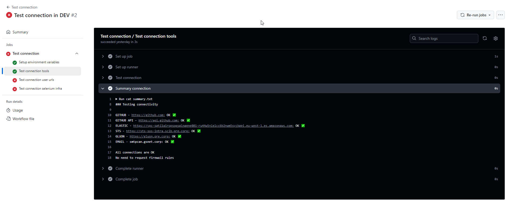
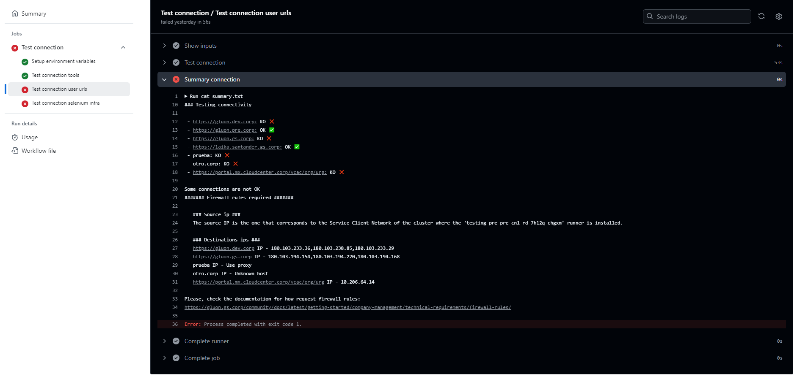
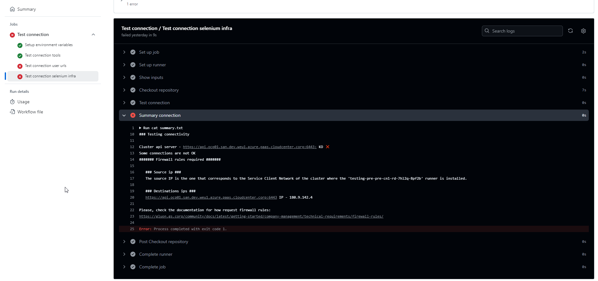

<!-- Check connectivity start -->

It is necessary to ensure connectivity between the runner and the different tools with which the workflow is integrated, as well as with the
URLs of the applications to be tested. To check this connectivity there is a workflow in the test repository called test-connection.yml.

When running the workflow test-connection.yml, the urls of the tools with which the workflow is integrated will be checked: Github, Elastic, Smtp, Gluon
Management, STS... In addition, the user can add the urls, separated by "," without spaces, to test if runner have connectivity with the applications to be tested.

For Talos, Nitro and Cilantrum repositories, the option "Enabled for check connection to cluster on deploy selenium" will appear.
When activating this option, the connection from the runner to the clusterApiServer that the user has configured in the
".testingConfig/selenium/properties.yml" file for the corresponding environment will also be checked.

If the execution of the workflow fails, you should check in the "Summary connection" step for which connectivity is missing. The workflow
will try to extract the IP addresses to which the firewall rules should be requested. If not, "Unknown host" will appear. If the URL
indicated is from the Internet or is not included in the runner's no_proxy, "Use proxy" will appear to indicate that what is failing is
the connection from the proxy, not from the runner.

It is the user's responsibility to know what the source IP is, since it corresponds to the IP of the Service Client Network of the
cluster where the ephemeral runner is installed.

Check de documentation of how request [firewall rules](../../../../../getting-started/company-management/technical-requirements/firewall-rules.md#request-details).

**Test connection examples:**

{:style="border:1px solid grey"}

{:style="border:1px solid grey"}

{:style="border:1px solid grey"}

<!-- Check connectivity end -->