# OAM Workflows

OAM Workflows are a set of steps that are executed in a specific order to achieve a specific goal.

## Quality Workflow

The Quality Workflow is a set of steps that are executed for the purpose of ensuring the quality of the OAM application
Model file, and discovery any issue that may exist in the application model file.

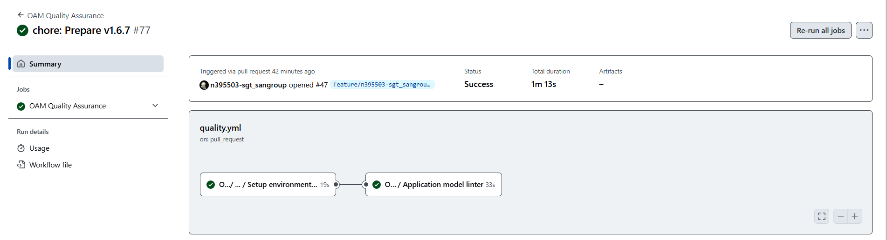

This workflow will executed when:

- A pull request is created or updated on the `main` or `release-vX.Y.Z` branch,
- A push is made to a branch that starts with `feature/`.

```yaml
on:
  pull_request:
    branches:
      - main
      - release-v[0-9]+.[0-9]+.[xX]
  push:
    branches:
      - feature/*
```

### Steps

1. **Setup Environment**: This step sets up the environment for the workflow. It installs the necessary tools and
   libraries that are required to execute the workflow.
2. **Application Model Linter**: This step validates the OAM Application Model file to ensure that it is
   correctly formatted and does not contain any syntax errors.

## Staging Workflow

The OAM Staging workflow is used to create a new draft release of the application.

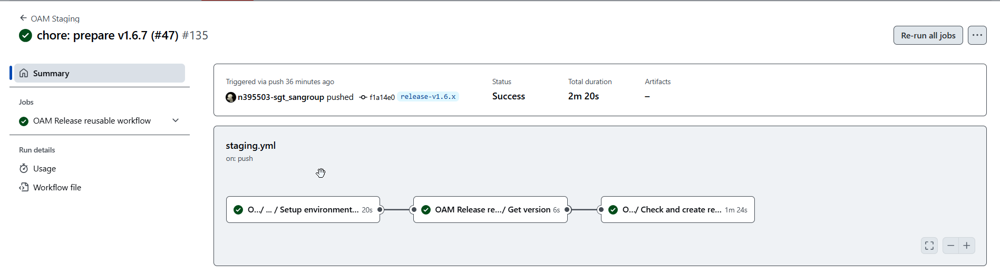

This workflow is triggered by the user workflow with exist a push event on the main branch.

```yaml
on:
  push:
    branches:
      - main
      - release-v[0-9]+.[0-9]+.[xX]
```

A draft release is created before that the release is published. With the draft release, the user can review the
components details and make any necessary changes before the release is published.

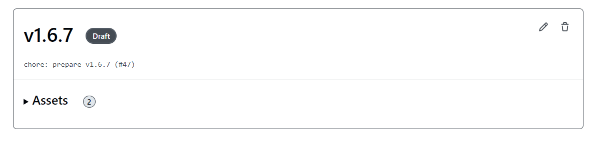

A release draft could be deployed in environments like certification or preprouction,but never it'll be deployed in
a production environment.

### Steps

1. **Setup Environment**: This step sets up the environment for the workflow. It installs the necessary tools and
   libraries that are required to execute the workflow.
2. **Get Version**: This step gets the version of the application from the application model file. The version is used
   to create the release and it can't exist in GitHub a release with the same version published.
3. **Create Draft Release**: This step creates a draft release in the GitHub repository, and print a brief summary with
   the release components details.

   - Deploymet Component groups: Group the components by the deployment order.
   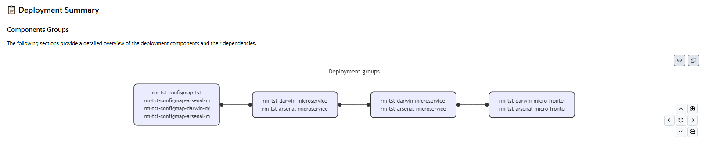

   - Component Dependency: Show the dependencies bettwen components.
   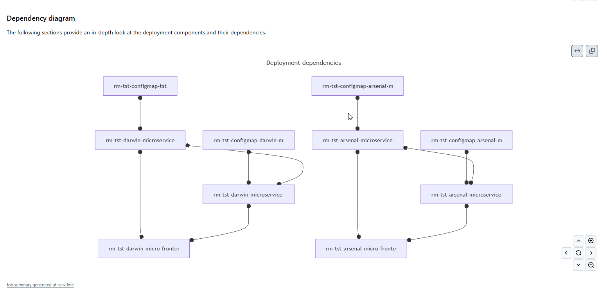

## Release Workflow

The OAM Release workflow is used to publish a new release of the application.

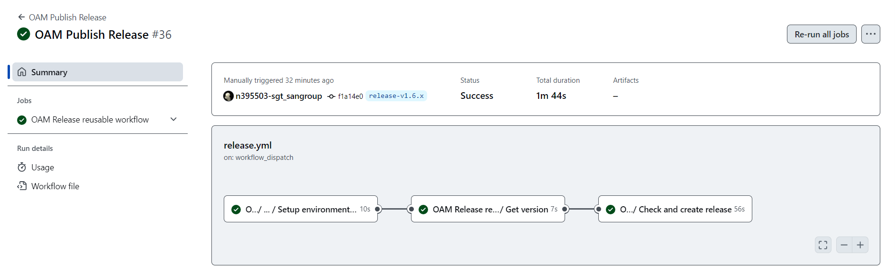

This workflow is triggered by the user on demand. The user can publish the release when the draft release is ready to be deployed in a production environment.

```yaml
name: OAM Publish Release
on:
  workflow_dispatch:
```

The release will be publish as `latest`in the GitHub repository and the release details will be available in the Gluon Release Management service.

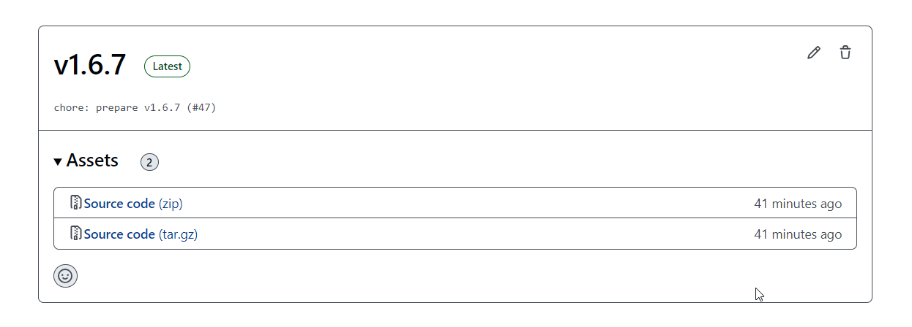

### Steps

1. **Setup Environment**: This step sets up the environment for the workflow. It installs the necessary tools and
   libraries that are required to execute the workflow.
2. **Get Version**: This step gets the version of the application from the application model file. The version is used to
   create the release and it can't exist in GitHub a release with the same version published.
3. **Publish Release**: This step publishes the draft release in the GitHub repository. The release is now available to
   be deployed in a production environment.

## Deployment Workflow

The OAM Deployment workflow is used to deploy the application on an environment.

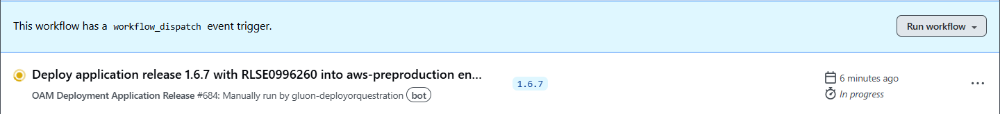

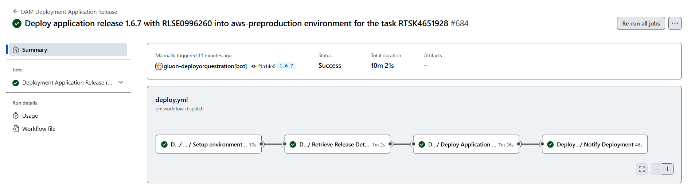

This workflow is triggered by the user through Gluon Portal.

```yaml
on:
  workflow_dispatch:
    inputs:
      release-version:
        description: 'Release version to deploy'
        required: true
        type: string
      release-number:
        description: 'ITSM Release number to deploy'
        required: true
        type: string
      task-number:
        description: 'ITSM task number to deploy'
        required: false
        type: string
      environment:
        description: 'Environment to deploy to'
        required: true
        type: string
      environment-type:
        description: 'Environment type to deploy to'
        required: true
        type: choice
        options:
          - certification
          - preproduction
          - production
```

### Steps

1. **Setup Environment**: This step sets up the environment for the workflow. It installs the necessary tools and
   libraries that are required to execute the workflow.
2. **Retrieve Release Details**: This step gets the release from the GitHub repository. The release is used to
deploy the application on the environment.

    - The release must be exist in the Gluon Release Management service.
    - The environment must associated to the trail defined in the release.
    - The task must exist at ITSM tool and associated to release.

    This step retrieves the release details from the Gluon Release Management service.

    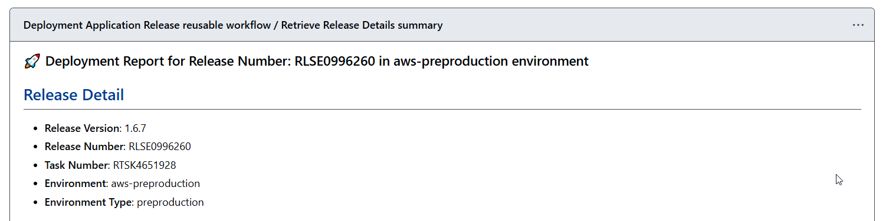

3. **Deploy Application Release**: This step deploys all components version of the application in the environment.

    The deployment of a release consists of deploying each and every component version defined in the release. This step is responsible for retrieving the components associated with the release, grouping the components by the deployment order:

    - 

    and deploying each component in the target environment. At the end of the deployment, the action will publish a summary with the detail of the deployed components.

    - 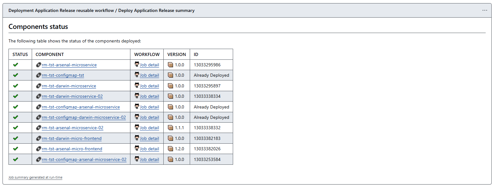

    !!! warning "Component Deployment Status"

        - At this first version, All components defined inside of the OAM definition file will be deployed. In next versions Only components version that are not deployed in the target environment will be deployed. To ensure this step, we will use the "deployments" and "environment" elements of GitHub.
        - Each time a component is deployed, the deployment status must be updated in the "deployments" element of GitHub with the deployed version, so that the release workflow can clearly identify the deployment status.

        For example the component:

        ```bash
        ✔️  🔗rm-tst-configmap-darwin-microservice-02   :octocat:Job detail 📦 1.0.0    Already Deployed
        ```
        It is not deployed because there is already a deployment with the same version in the target environment.

        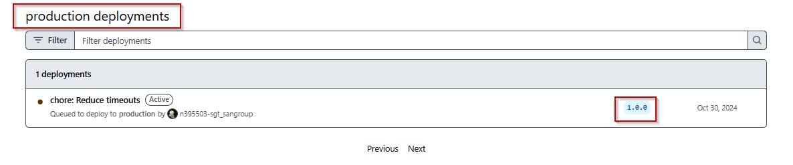

        | Field     | Description |
        |-----------|-------------|
        | `status`      | The status of the component deployment. If exist an error with the component, the deploy actions finally and not the group following |
        | `Component`   | The component name. Must exist associated with the application |
        | `Workflow`    | The component deploy workflow. |
        | `Version`     | The component version to deploy. |
        | `ID`          | The run id of the deploy action in GitHub. |

4. **Notify Deployment Status**: This step notifies the deployment status to the user through Gluon Portal.

   The deployment status is updated in the Gluon Release Management service.
   The user can see the deployment status in the Gluon Portal.
