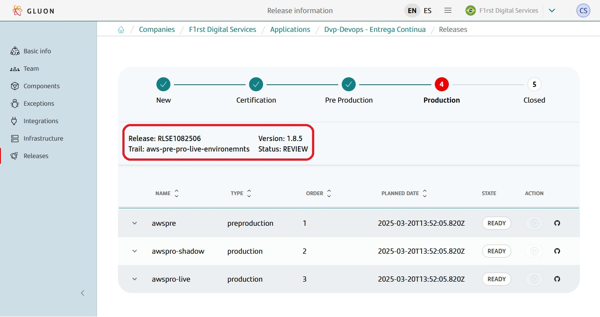
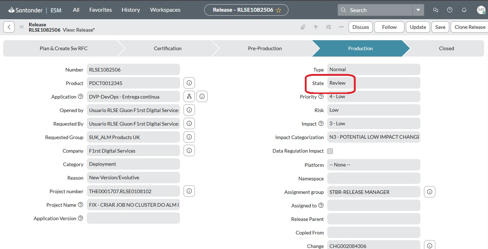
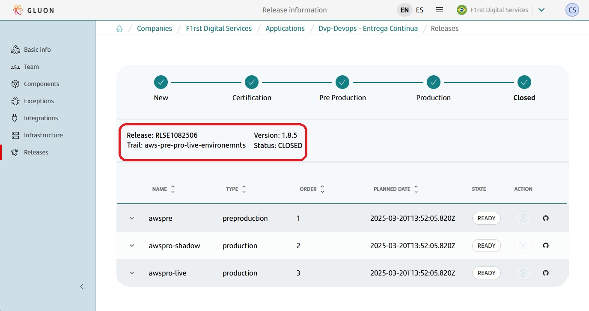
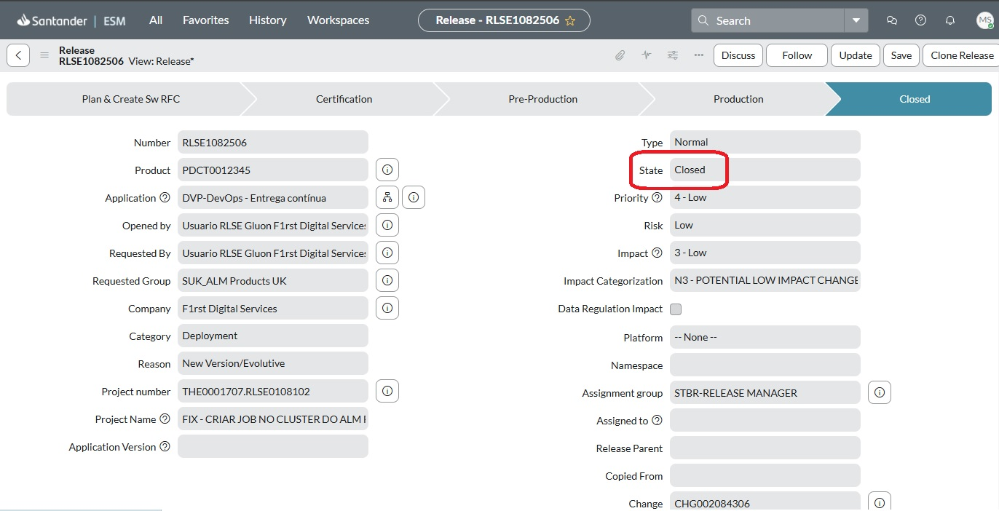

## Batch Process

Batch Process is any computational processing that occurs automatically, without human intervention, on a server at a specific time that follows certain rules with parameterized points to make its execution more flexible.

In Release Management, the batch is responsible for transitioning the Releases from `IMPLEMENTED` to `REVIEW` and subsequently to `CLOSE`.

For the end user, no action is required at this stage, as the batch is responsible for advancing the release in ITSM without user intervention.

With the release in the `IMPLEMENTED` state and the deployments/rollbacks in production completed, the batch will first transition the release to the `REVIEW` state and then to the `CLOSED` state.

## Business Rules

These are the rules assigned to the batch to process a release:

1. Only releases managed by Release Management will be processed.
2. Only releases with all deploy tasks in `Close Complete` state will be processed.
3. If rollback tasks are triggered, they must also be in `Close Complete` state.
4. The release's **"Planned End Date"** must be less than the current date plus a configurable number of days.

## The Batch in Action

!!! warning "Important"

    The transition of releases in ITSM to the `REVIEW` and `CLOSED` states are actions that **MUST BE** performed by the batch.
    The user **MUST NOT** perform this transition manually in ITSM.

The batch will search for releases that meet the business rules above.

At first, the batch will transition the releases to the `REVIEW` state.

Then the batch will transition the releases to the `CLOSED` state.

## End of Release Lifecycle

With the release in the `CLOSED` state, the release lifecycle in Release Management and ITSM is concluded.

