## Introduction

During the release creation process, a manual approval task will be created in *ITSM* associated with the *ASSESS* state in Release Management. To progress to the next state, a member of the company's Change Management team must close the task in *ITSM*.

User management in *ITSM* associated with the Change Management team will be done directly in *ITSM*.

The creation of the predefined Change Management team, as well as the management of users within it, will be the responsibility of the company and will follow the same creation requirements as any other predefined team in *GLUON*.

Regardless of the number of production environments, only one *Change Management* approval task will be created.

If during the release creation the **change_management_approval** field is filled in and there is no Change Management team in the company, an error will
be returned indicating that a Change Management team exists and the field must be filled in. Conversely, if the field is not filled in and there is a
Change Management team in the company, an error will be returned indicating that the field must be filled in since there is a Change Management team of
approvers.

## Create a new Change Management team for the company

To create a Change Management team in the company, the Change Management type with the *id* **change_management** must exist in *GLUON*.

- **Create new team.** Once inside the *Teams* section of the *Company*, click on the *Create company team* icon.
  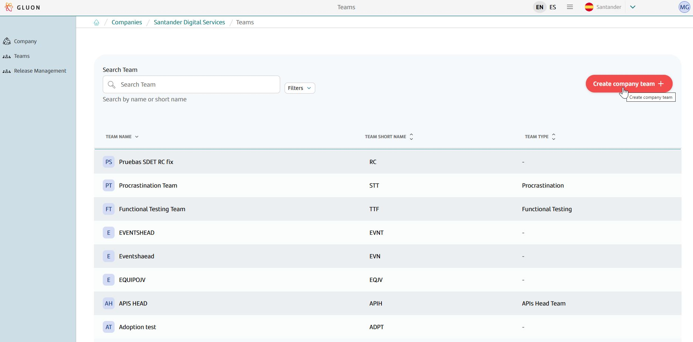

- **Onboard team.** Select the *Predefined team* option and click *Next*.
  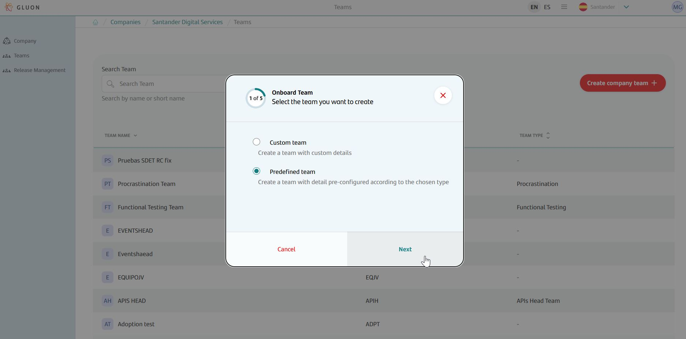

- **Select team type.** In the dropdown, select the *Change Management* type and click *Next*.
  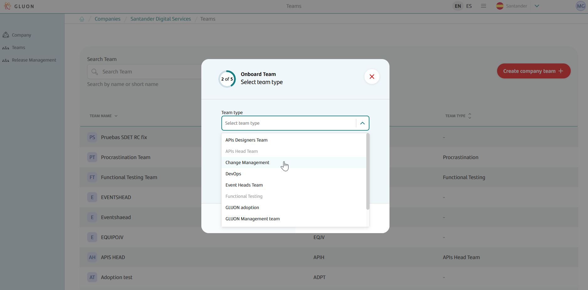

- **Select Jira instance and Project Template.** Select the *Jira instance* and *Project template* in the dropdowns and click *Next*.
  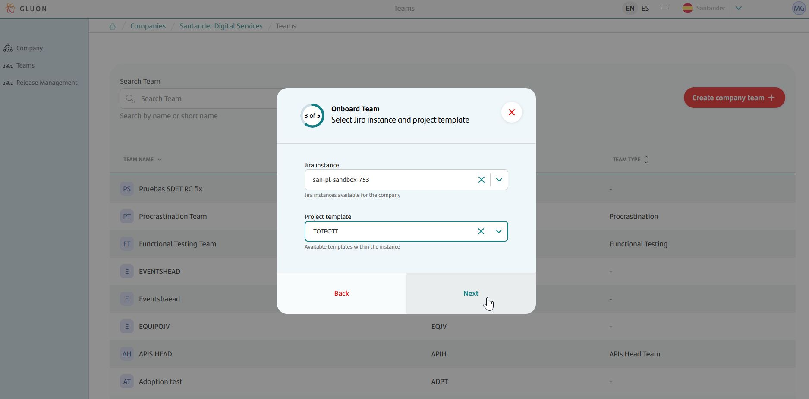

- **Select Confluence instance.** Select the *Confluence instance* in the dropdown and click *Next*.
  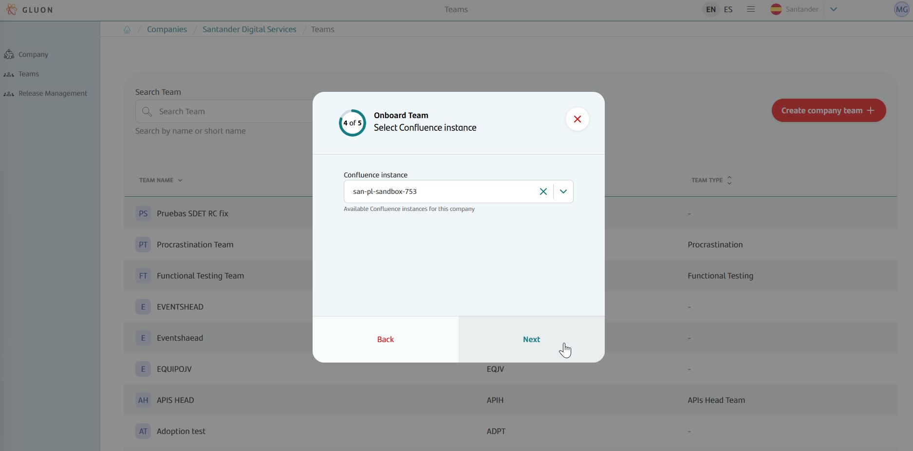

- **Select GitHub organization.** Select the *GitHub organization* in the dropdown and click *Next*.
  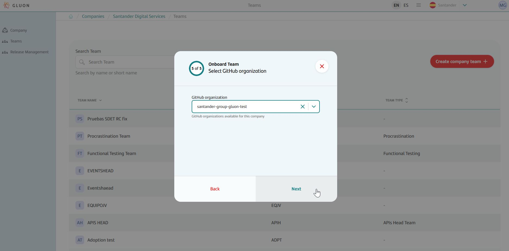

- **Confirm configuration.** *Confirm* if everything is correct.
  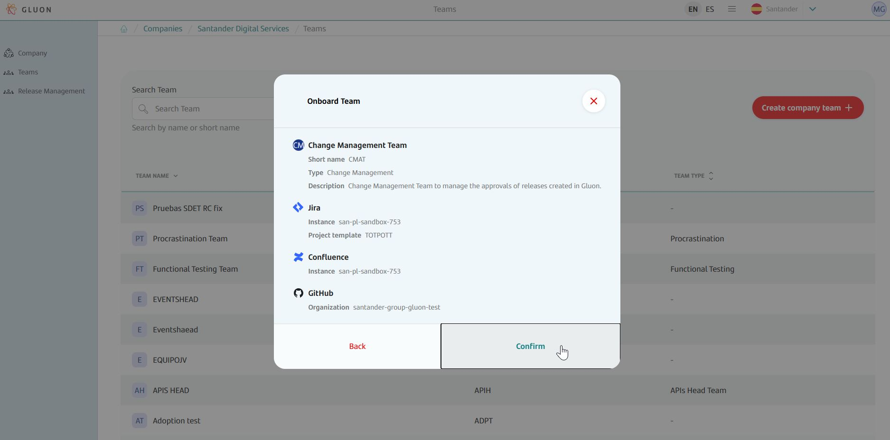

## Add owner to the Change Management team

- **Add team owner.** Once inside the *Change Management Team*, in the *Team* section, click on the pencil icon *Team owners*.
  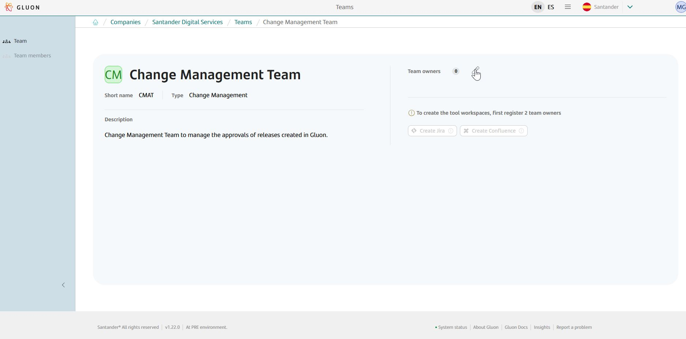

- **Select owners.** Enter the *Employee code* and click *Add to list*. Remember that to add members to the *Team*, at least two *Team owners* are required.
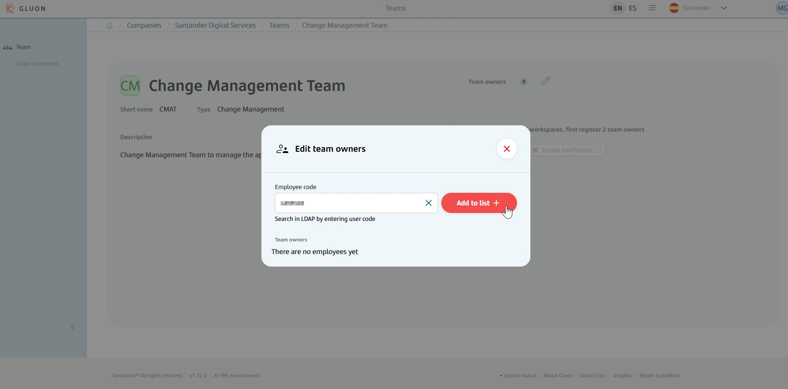

## Add members to the Change Management team

Only a user who is an owner of this team can add members to the Change Management team.

- **Add members.** Once inside the *Change Management Team*, in the *Team members* section, click on the *Add members* icon.
  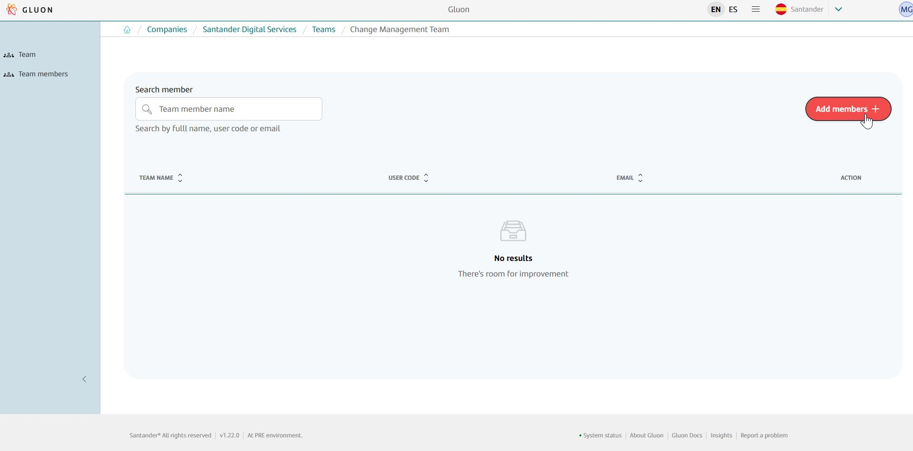

- **Select members.** Enter the *Employee code* and click *Add to list*.
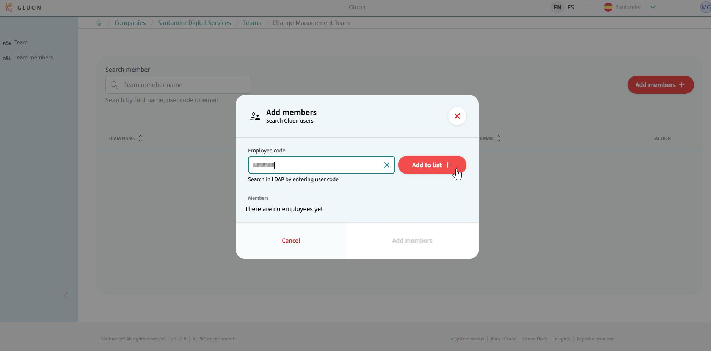

- **Confirm.** Once all members have been added, click *Add member*.
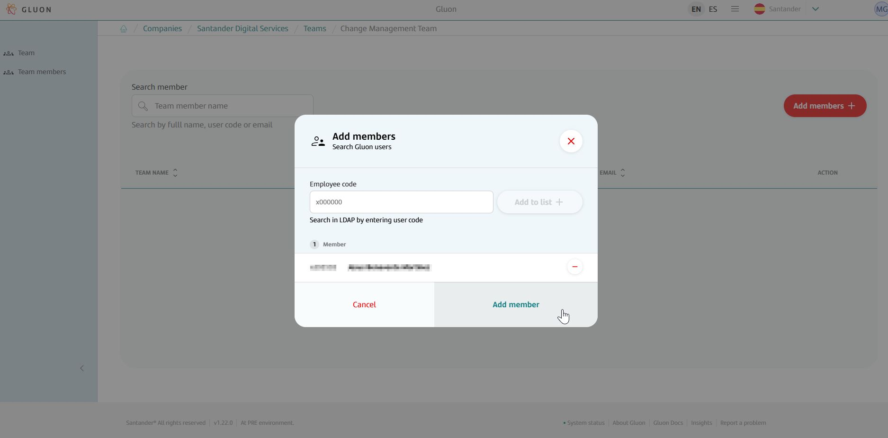

## Remove members from the Change Management team

Only a user who is an owner of this team can remove members from the Change Management team.

- **Remove members.** Once inside the *Change Management Team*, in the *Team members* section, click on the trash can icon located on the right side of the team member you want to remove.
  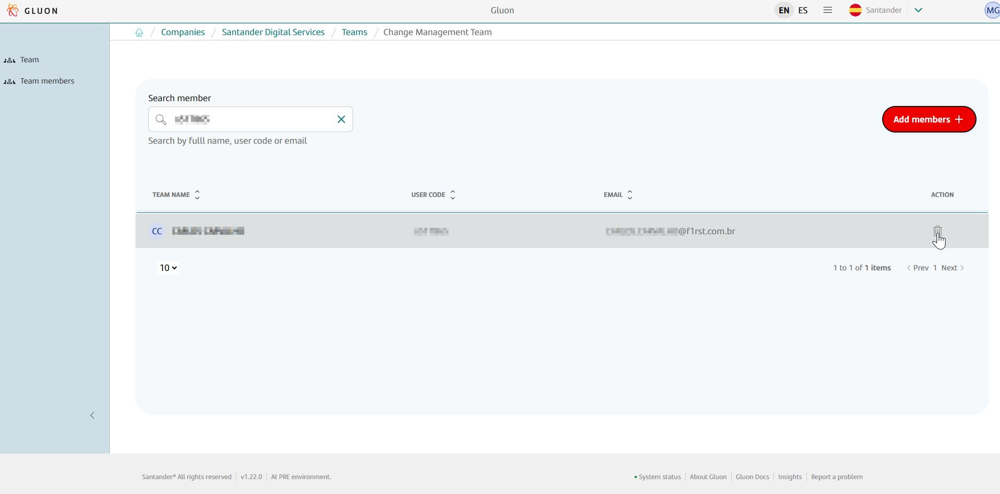

- **Confirm.** Click *yes, delete* to confirm the deletion.
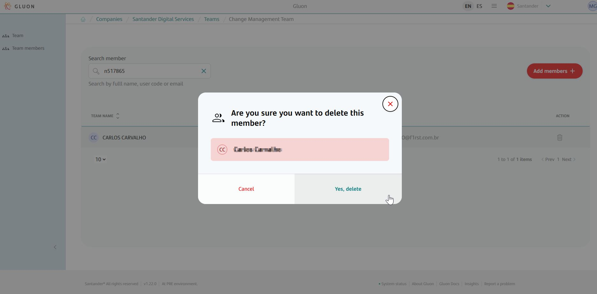
