???+ info "Note"

    The aim of this document is to show how to create a release in servicenow ITSM and orchestrate the release in the Gluon portal.

???+ tip "What's New"

    Starting from version __6.3.0__ of Gluon, releases will be made at the application level.

    For create a new release will not be necessary to select the component version. The components versions will be
    defined in the Gluon Application Model yaml file.

To understand how the Gluon Release Management module works, it is essential to comprehend the behaviour the Component
Template [Gluon Application Model](./../oam/index.md).
Starting from the new version of Gluon, to use the release management module, it is necessary to have created one, and
only one, component based on this template.

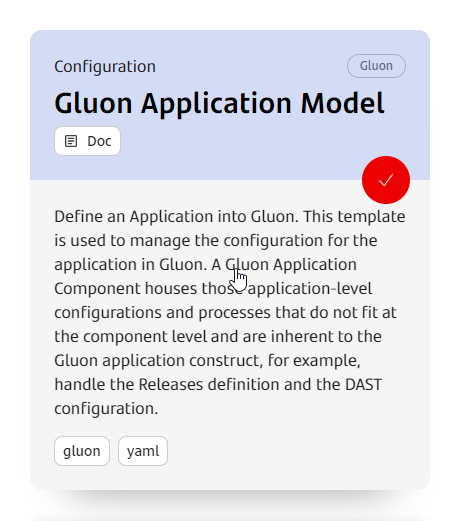

This component with `application` scope, is going to help us to define our application, giving details about release's
environments and deployment trails.

An [environment](../oam/index.md#environments) is a set of infrastructure resources that are used to deploy an application.
Each environment has a `name`, `type`, and `infrastructures` which helps us understand the properties of the infrastructure
where we will deploy a component.

An [environment](./../oam/index.md#environments) is a set of infrastructure resources that are used to deploy an application. Each environment has
a `name`, `type`, and `infrastructures`.

- The `infrastructures` help us understand the properties of the infrastructure where we will deploy a component
- The `environment` and environment type where we're going to deploy.

A [trail](./../oam/index.md#trails) is a sequence of environments that an application passes through during its deployment.
Remember that each trail must be sorted by the deployment rightly sequence.

In the `trails` section, we define the deployment trails for our application. Each trail has:

- `name`: It's the name of the trail. It must be unique in the oam file.
- `environments`: The environments that the application passes through during its deployment. Each environment has:
  - `name`: Must be existed in the `environments` section.
  - `order` The `order` is the sequence of the environment in the deployment trail.

A [component](./../oam/index.md#components) is a set of component version that are deployed together. Each component has:

- `name`: Component Name with that the component was created in Gluon Portal
- `version`: GitHub tag release
- `need`: Set of the components that are dependencies of the component.

!!! info "Note"

    Before the creation of the release, it is necessary to understand and first read the premises indicated on the page:
    [Recommendations](./index.md)

## Create OAM Application Model Component

To work with the new `Gluon Release Management Module`, the first steps is create a new component based on the Gluon
Application Model template. In this component, you will define the environments and trails that your application will
pass
through during its deployment.

You can define so many environments and trails as you need, for example, you can define a trail for deploy on
preproduction
and production environments.

It's recommended that you read the ci-cd documentation to understand the properties associated with the distinct types of infrastructures.

Here, we're going to show an example of an OAM file with several trails, one for deploy on preproduction and production environments, another for deploy on all
production environments, and another for deploy on shadow and live environments.

```yaml
apiVersion: v1
kind: application
metadata:
  name: {{Application Logical name}}
  version: {{Application version}}
trails:
    - name: deploy-preproduction-production-environments
      environments:
        - name: preproduction-environment
          order: 1
        - name: production-shadow
          order: 2
        - name: production-live
          order: 3
    - name: deploy-only-production-environments
      environments:
        - name: production-shadow
          order: 1
        - name: production-live
          order: 2
    - name: deploy-on-pro-shadow
      environments:
        - name: production-shadow
          order: 1
    - name: deploy-on-live
      environments:
        - name: production-live
          order: 1

environments:
    - name: preproduction-environment
      type: preproduction
      infrastructures:
        - id: Cluster Preproduction
          properties:
          ## Remember visit the CI CD documentation for review the properties associated with the distinct types of infrastructures
    - name: production-shadow
      type: production
      infrastructures:
        - id: Cluster PRO SHADOW  
          properties:
            ## Remember visit the CI CD documentation for review the properties associated with the distinct types of infrastructures
            key: value
    - name: production-live
      type: production
      infrastructures:
        - id: Cluster PRO LIVE
          properties:
            ## Remember visit the CI CD documentation for review the properties associated with the distinct types of infrastructures
            key: value
components:
    -   name: rm-tst-configmap-tst
        version: 1.0.0
        needs: [ ]
    -   name: rm-tst-configmap-arsenal-microservice
        version: 1.0.0
        needs: [ ]
    -   name: rm-tst-configmap-darwin-microservice-02
        version: 1.0.0
        needs: [ ]
    -   name: rm-tst-configmap-arsenal-microservice-02
        version: 1.0.0
        needs: [ ]
    -   name: rm-tst-darwin-microservice
        version: 1.0.0
        needs: [ rm-tst-configmap-tst ]
    -   name: rm-tst-arsenal-microservice
        version: 1.0.0
        needs: [ rm-tst-configmap-arsenal-microservice ]
    -   name: rm-tst-darwin-microservice-02
        version: 1.0.0
        needs: [ rm-tst-configmap-darwin-microservice-02, rm-tst-darwin-microservice ]
    -   name: rm-tst-arsenal-microservice-02
        version: 1.1.1
        needs: [ rm-tst-configmap-arsenal-microservice-02, rm-tst-arsenal-microservice ]
    -   name: rm-tst-darwin-micro-frontend
        version: 1.0.0
        needs: [ rm-tst-darwin-microservice-02, rm-tst-darwin-microservice ]
    -   name: rm-tst-arsenal-micro-frontend
        version: 1.0.0
        needs: [ rm-tst-arsenal-microservice-02, rm-tst-arsenal-microservice ]
```

It's important define:

- name: __Logical name__ of the application
- version: __Application Release__, it'll be used to create the release in the Gluon portal, and it must correspond with
a release associated with the Gluon Application Model component. It`s a tag associated with the component`s release.

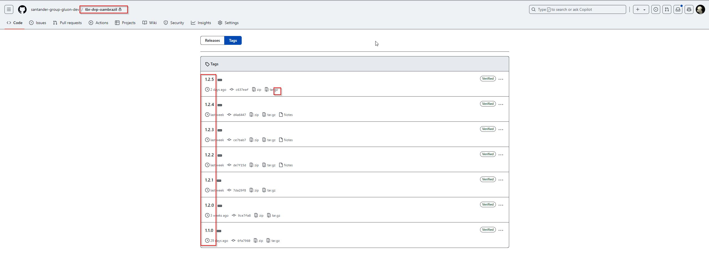

!!! warning "Release"

    The release must be created in the GitHub repository associated with the Gluon Application Model component.

After creating the component and having a valid release created through the OAM GitHub workflows, we can start the
release creation process.

!!! warning "Important"

    Only the components based on the new templates aligned with the Gluon Framework CI CD will be able to use the Gluon Release Management module.
    If you include a new component in the OAM file, you must be sure that the component is aligned with the Gluon Release Management deploy.
    
    - 'API Deployment 2.0'
    - 'API Product'
    - 'API Subscription'
    - 'Appian Process'
    - 'Application Secrets'
    - 'Arsenal Java Microservice 2.0'
    - 'Darwin Java Microservice'
    - 'Darwin Java Microservice 2.0'
    - 'Darwin Microfront'
    - 'Darwin NodeJS Microservice'
    - 'Darwin NodeJS Microservice 2.0'
    - 'Darwin Python Microservice'
    - 'Darwin Python Microservice 2.0'
    - 'Darwin SPA'
    - 'Event Subscription'
    - 'Event Deployment'
    - 'Image Reuse'
    - 'Key Set'
    - 'Kubernetes ConfigMaps 2.0'
    - 'ODS Java Microservice'
    - 'TypeScript Angular FrontEnd'
    - 'TypeScript React FrontEnd'
    - 'React SPA'

If you need to create a new Local Component Template and you want to use the Gluon Release Management Module to deploy all component created before its, you must be sure that the component is aligned with the Gluon Framework CI CD. For more information,
visit the documentation [How Integrate a New Template with Release Management](./../how-integrate-a-new-tempalte-with-rm.md).

By each company can exist a different set of components. The components listed above are some the globals templates that are
available in the Gluon Release Management Module.

!!! tip "Local Component Template"

    __All component based on a Local template could be used in the Gluon Release Management Module__ always that the component template is aligned with the Gluon Framework CI CD.

It is important read the documentation of the component to understand the properties that must be defined in the OAM file.

## Generate OAM Release Version

The release generation process is necessary so that we can deploy new components aligned with Release Management.

It is possible to generate `Draft` versions from any branch, not just release branches. The only requirement to avoid having a `Draft` version is to merge into an integration branch, either `main` or `release_vx.x`.
However, if only the `Staging` workflow has been executed and not the `Publish Release` workflow, the release will remain as `Draft`. Remember that the `Publish Release` workflow is responsible for changing the release from `Draft` to `Latest`.

Therefore, we now have the option to generate and use releases in `Draft` mode, allowing changes to be made to the same version to be deployed without the need to create a new __Tag/Release__ for each change
 in the __preproduction__ environment, before generating a `Latest` release.

#### Create Draft Releases

To start the Draft release generation process, we can use our workflows to follow the release generation flow. For more details, consult the detailed information in the workflows section. [Workflows Details](../oam/oam-workflows.md)

First, let's create our release branch based on the last implemented tag version.

1. We can select the `Create Release Branch` workflow.
2. We select the `source branch` for the execution of our workflow.
3. We enter the `origin tag version (the last generated)`, which will give rise to our new release branch.
4. We define the version semantics of our branch (in this case, `1.9`, which will give rise to all others, for example: `1.9.0`, `1.9.1`, and so on).
5. Finally, we execute our workflow with the `Run Workflow` button.

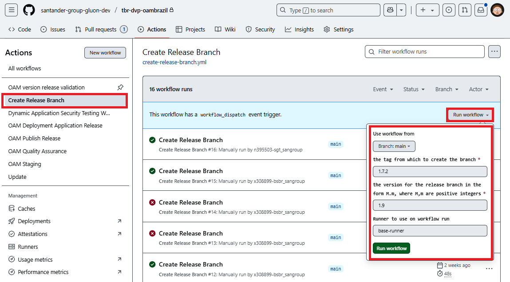

We can see below that the new branch `release-v1.9.x` has been created. This will be our branch for launching updates. Any new implementation that we want to deploy will be done by opening Pull Requests to this branch and, subsequently,
 merging them into the `main` branch to equalize the code.

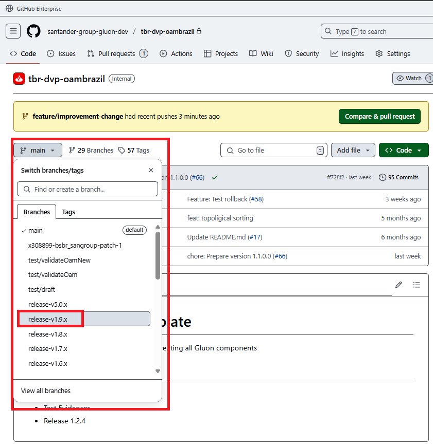

After generating our release branch, we can now actually make our modifications. We can create a new branch from the latest one that contains the most up-to-date code and open the `oam-application-definition.yml` file to make the necessary modifications.

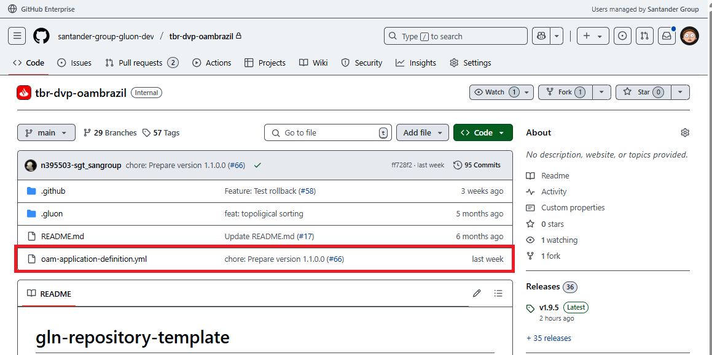

In our example, we will implement the changes from the `feature/improvement-change` branch to our `release` branch. In this case, only the file name change and version increment were made.

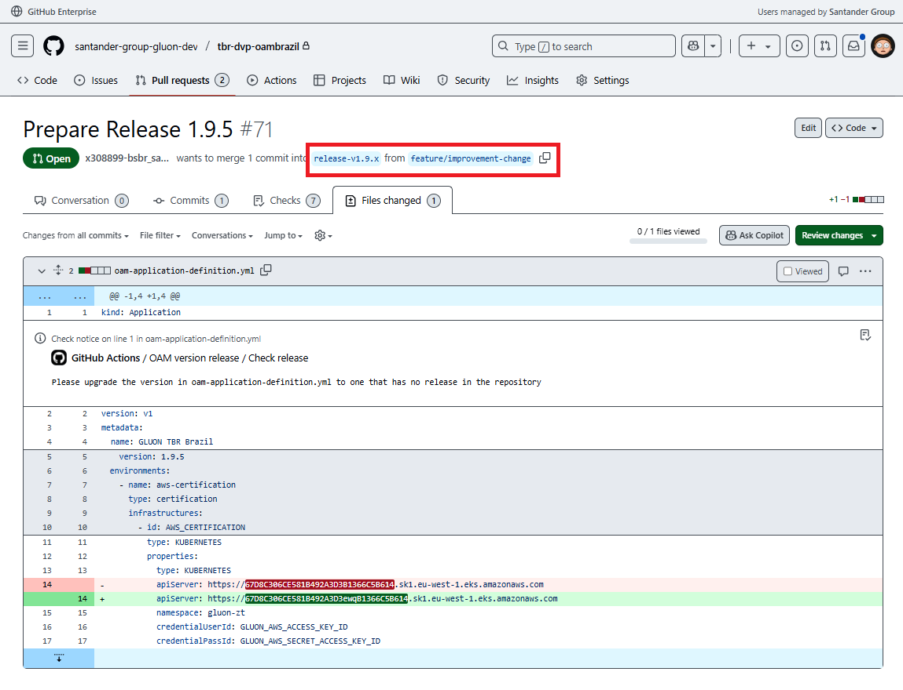

It is important, at this stage of creating the Pull Request, to provide a descriptive title at the time of the merge and to add a description of the changes, to facilitate the identification of the modifications to be made.

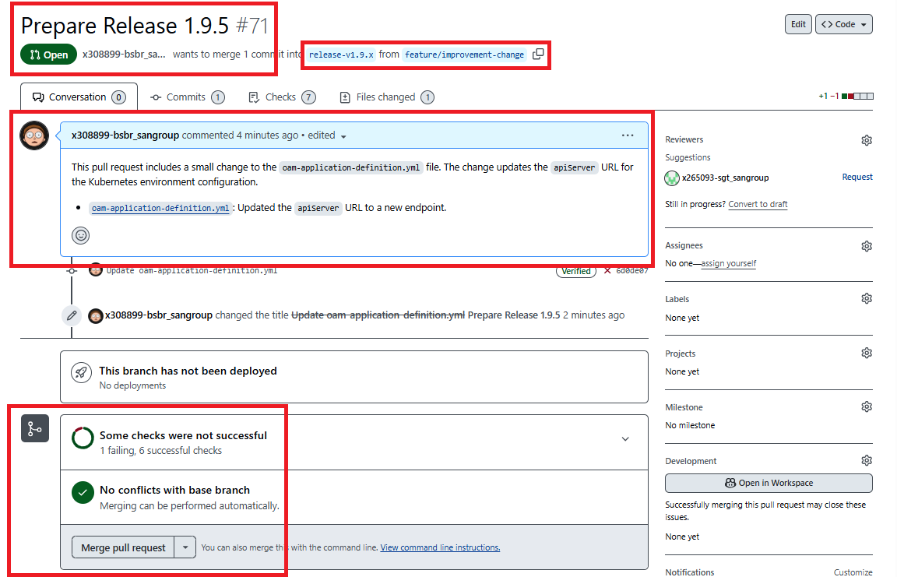

At this stage of opening the Pull Request, additional validation workflows will be executed to verify if the modifications are correct. One of them, in particular, is the [OAM Quality Assurance](../oam/oam-workflows.md#quality-workflow),
 which runs a linter module, performing some validations of the code structure and filling rules determined for the proper functioning of Release Management.

After the merge is successfully completed to our `release` branch, we can see in the `Actions` tab that the [OAM Staging](../oam/oam-workflows.md#staging-workflow) workflow will be automatically executed.


In the details, we can verify the validations it performs. In this example, we did not have the release version `1.9.5` created, so it created it for us. If it already existed, it would only increment the new modifications made.

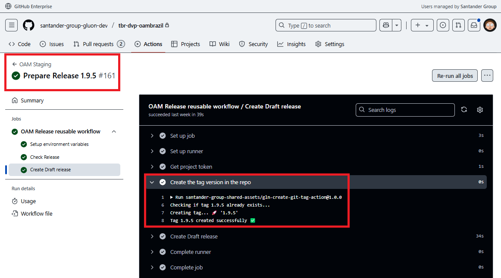

When finished, upon opening the `Releases` tab, we can verify that previously only version `v1.9.4` existed before execution, and now release version `v1.9.5` has been generated in __Draft__ mode, referring
 to the completion of the __Staging Workflow__ execution.

| Before Execution                                                              | After Execution                                                            |
| ----------------------------------------------------------------------------- | -------------------------------------------------------------------------- |
| | 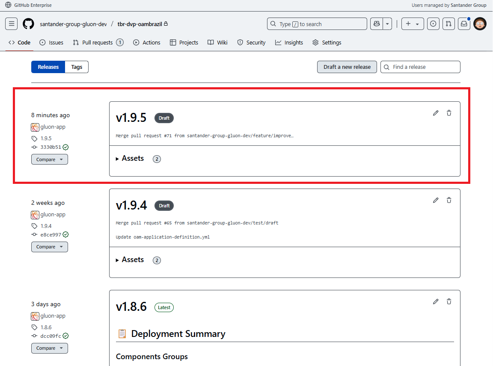|

After that, if it is necessary to make any edits or changes to the OAM configurations, simply make the modifications and open a Pull Request and merge it into the `release` branch. This will trigger the workflow again,
 updating the release artifacts generated with the new modifications.

Once the release in draft mode is created, it will be available for use in creating releases on the portal.

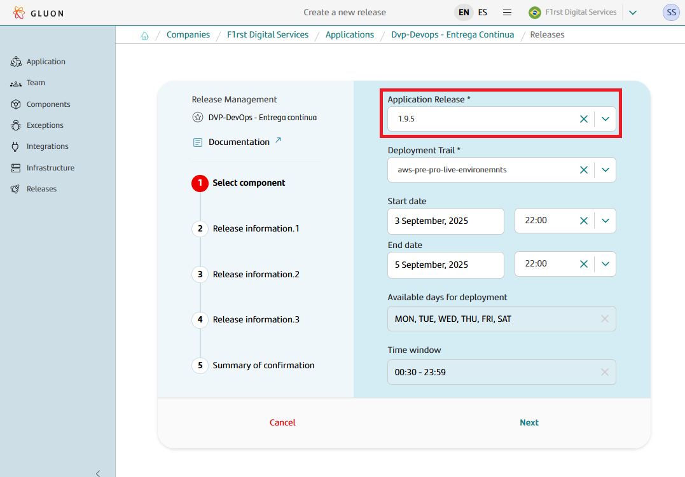

!!! warning "Attention"
    Releases in __DRAFT__ mode allow you to deploy in `preproduction` as many times as you want, but they do not allow advancing to the `production` stage. Therefore, your release created in the portal by Release Management will be stuck in
     `preproduction` with the state `PREPRODUCTION` until it is transformed into a concrete release (__Latest__).

#### Promote Release Draft for Latest

After validating that everything is correct in the `preproduction` environment and finalizing the change package, we can __promote the release__, thus turning your __Draft__ release into __Latest__.

We can use the [OAM Publish Release](../oam/oam-workflows.md#release-workflow) workflow to execute the process.

1. Select the `OAM Publish Release` workflow.
2. Click on `Run Workflow`.
3. Select your __release branch__ that you want to promote to `latest`.
4. Click on `Run Workflow`.

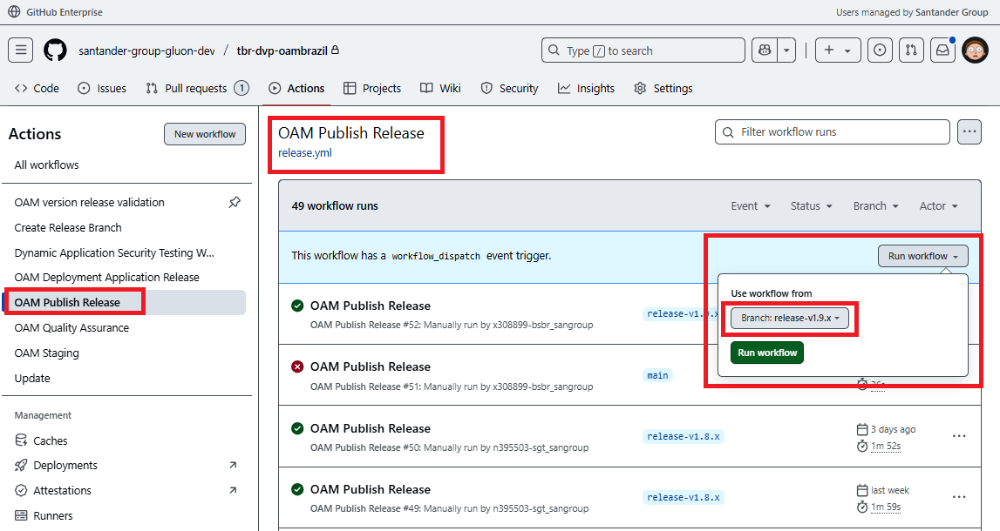

After the execution is successfully completed, we can verify that our same release previously created in __Draft__ mode has now become __Latest__.

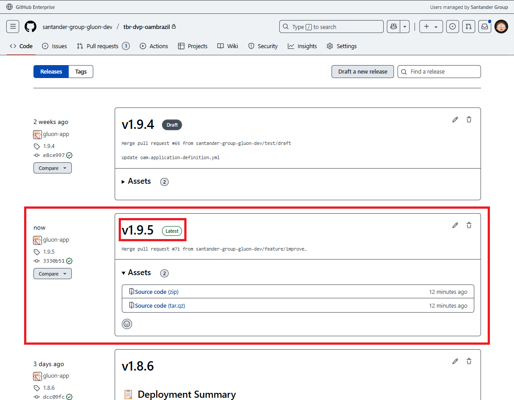

## Release Creation

First you have to onboard your application. Once you have your application created, you can start creating your release.

To create the release, access the __Releases__ menu and click on __Create Release__.
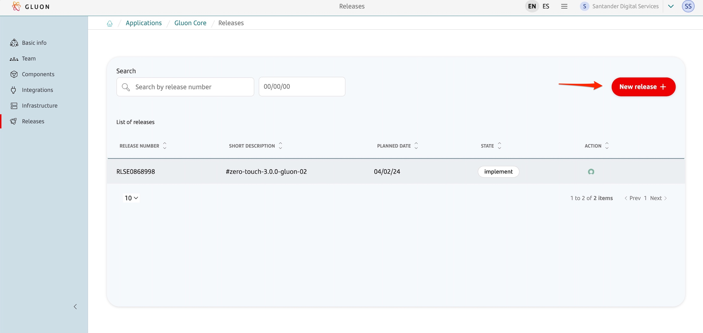

After clicking on __Create Release__, you must fill in the mandatory fields to create a release in servicenow ITSM

!!! warning "Recommendation"

    1. Any user who is a member of 'Requested Group' specified in the release will be able to create releases.

        a. All specified users **MUST** be associated with the application in the Gluon Portal.

    2. All users specified during the release creation **MUST** be members of the 'Requested Group' provided.

    3. We recommend using an already created ITSM servicenow release to use as a reference when filling out the form fields via the Gluon portal.

### 1. Select Component

In this step, the following information should be provided:

| Field                      | Description                                                     |
|----------------------------|-----------------------------------------------------------------|
| __Application release__    | lists the GitHub tags defined in the OAM Application component. |
| __Deployment Trail__       | List the Deployment trail defined for the application release   |
| __Start date production__  | Release start date and time                                     |
| __End date production__    | Release end date and time                                       |

???+ info

    The deployment time will be queried from the "Release Management" module, which is configured by the company owner.

    __It's not necessary to select the component name and version__ yet, because the component versions are defined in the Gluon Application
    Model yaml file.

???+ info "Time Window Information"

    There are two informative fields that appear on this screen:
    
    - __Available days for deployment__: Displays the days when deployments are allowed based on Company Release Management Configuration
    - __Time window__: Shows the permitted hours for deployment on production environments
    
    This information helps you plan your release start and end dates within allowed timeframes.

Example of completed fields:
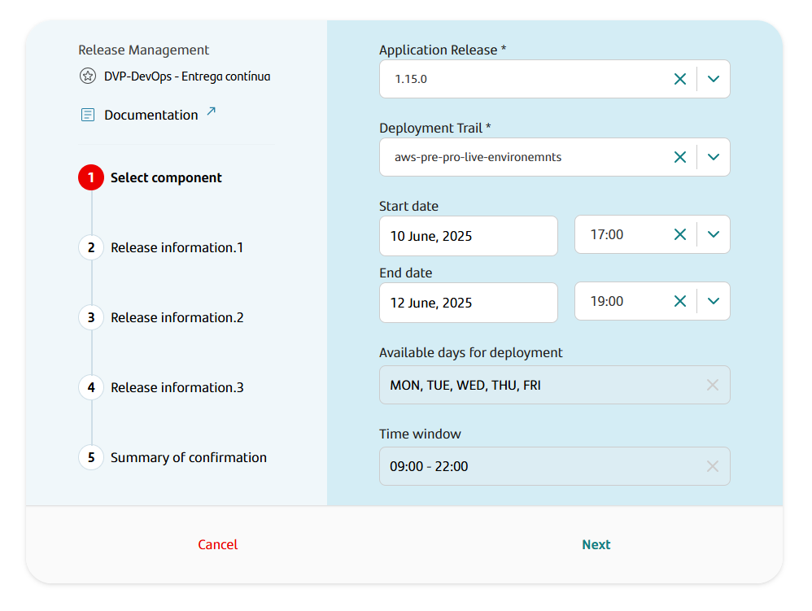

### 2. Release information 1/3

| Field                 | Description                                                                                                                                                                                                                                                                                                                                                                                                                             |
|-----------------------|-----------------------------------------------------------------------------------------------------------------------------------------------------------------------------------------------------------------------------------------------------------------------------------------------------------------------------------------------------------------------------------------------------------------------------------------|
| __Product__           | Field required when creating a servicenow release that references the technical application registered in servicenow.                                                                                                                                                                                                                                                                                                                   |
| __Project Number__    | Required field when creating a release in ServiceNow, used to inform the financial code of the project                                                                                                                                                                                                                                                                                                                                  |
| __Requested Group__   | Field required when creating a servicenow release, inform the Requested Group associated with the technical application                                                                                                                                                                                                                                                                                                                 |
| __Product Owner__    | The list of users registered in Gluon with __PRODUCT OWNER__ profiles (Menu Teams) associated with the selected application is displayed                                                                                                                                                                                                                                                                                                |
| __Application owner__ | The list of users registered on Gluon as __APPLICATION OWNER__ (Menu basic info) of the selected application is displayed                                                                                                                                                                                                                                                                                                               |
| __Change Management Approval__ | The list of users registered on Gluon as __CHANGE MANAGEMENT APPROVAL__ (Menu Teams) of the selected company is displayed. For the field and its approvers to appear in the form, it is necessary that the company has created a *Team* of the *Change Management* type, otherwise the field will not appear and the *Release* will work without approvers. [More details Change Management Approval](./change-management-approval.md). |
| __Requested By__      | User registration registered in servicenow (Employee ID) that is creating the release, this field is filled in automatically and cannot be changed. This user must be associated with the Requested Group informed.                                                                                                                                                                                                                                     |
| __Short Description__ | Required field when creating a servicenow release, a brief description of the release must be provided: example #ZERO TOUCH Deployment version 3.0.0 of component xyz                                                                                                                                                                                                                                                                   |
| __Description__       | Required field when creating a servicenow release, a more detailed description of the scope of the release must be entered                                                                                                                                                                                                                                                                                                              |
| __Reason__            | Required field when creating a servicenow release, the reason for deployment must be informed normally for new versions and evolution and the value must be used: New Version/Evolutive                                                                                                                                                                                                                                                 |
| __Priority__          | Required field when creating a servicenow release, the priority that the release has to be deployed must be informed                                                                                                                                                                                                                                                                                                                    |
| __Risk__              | Required field when creating a servicenow release, the risk of the release must be informed                                                                                                                                                                                                                                                                                                                                             |

!!! tip "Attention"

    - During the release creation process, in the form section for selecting the Application Owner, Product Owner, and Change Management, only users belonging to the group specified in the `Requested Group` field (linked to ITSM) will appear in the list. This ensures that only users who are part of the specified group and the relevant `Management` teams are displayed.
  
Example of completed fields:
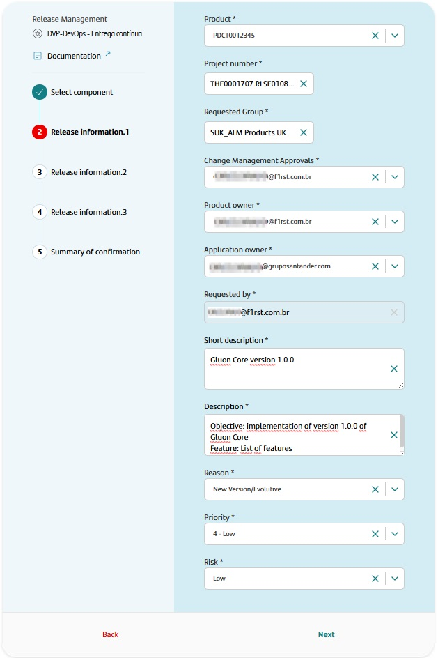

!!! tip "Attention"

    - If a generic error message is displayed, press the F12 key to open the browser's developer tools. This will provide more detailed information about the error in the Console or Network tabs, helping to identify the root cause of the issue.

To assist in searching for form information when creating a release via the portal, as already suggested, the user can access the ServiceNow ITSM and search for a previously created release as a reference for filling in the fields.

If it is the first time the user is creating the release, the following method can be used to assist in querying some fields:

Access the Releases menu in the [ServiceNow ITSM](https://santander.service-now.com/nav_to.do?uri=%2Frm_release_list.do%3Fsysparm_query%3Dsys_class_name%3Drm_release%5Eactive%3Dtrue%26sysparm_first_row%3D1%26sysparm_view%3Drelease)
and click on the __New__ button

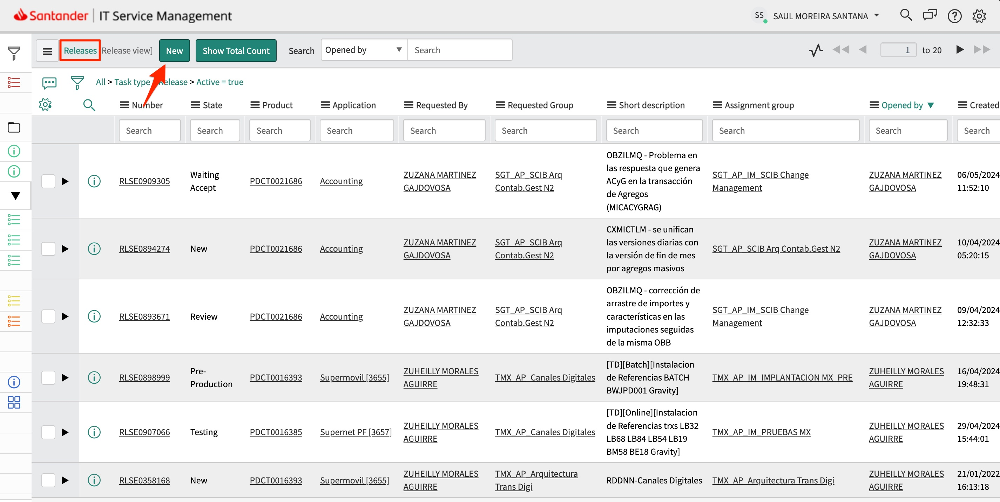

A form with fields to create a release will open. On this screen, the user can query the available values for each field by clicking on the magnifying glass icon next to the field.

Example to query the __Requested Group__ field:
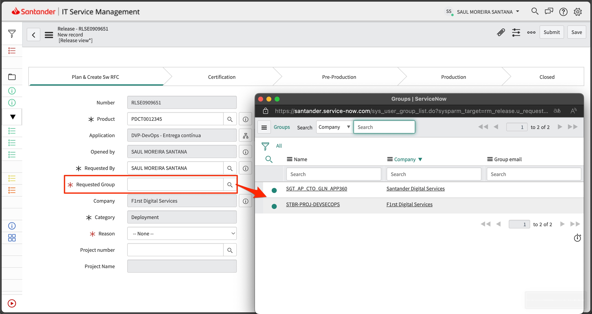

Example to query the __Project Number field__:
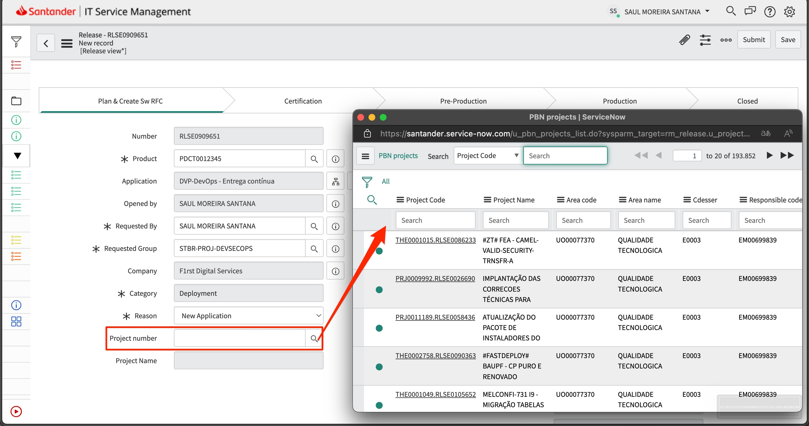

### 3. Release information 2/3

| Field                        | Description                                                                                                                                                           |
|------------------------------|-----------------------------------------------------------------------------------------------------------------------------------------------------------------------|
| __Impact__                   | Required field when creating a servicenow release, the impact of the release on users must be informed                                                                |
| __Platform__                 | Field required when creating a servicenow release that lists the platforms registered in the tool, if the platform is not registered, the none option can be selected |
| __Justification__            | Field required when creating a servicenow release, the justification for the release must be entered in this field                                                    |
| __Implementation Plan__      | Field required when creating a servicenow release, the implementation plan must be entered in this field                                                              |
| __Risk and impact analysis__ | Required field when creating a servicenow release, this field must inform the risk and impact of the release                                                          |
| __Test Plan__                | Field required when creating a servicenow release, this field must include the test plan after deploying the release                                                  |
| __Backout Plan__             | Field required when creating a servicenow release, the action must be selected if rollback is needed                                                                  |

Example of completed fields:
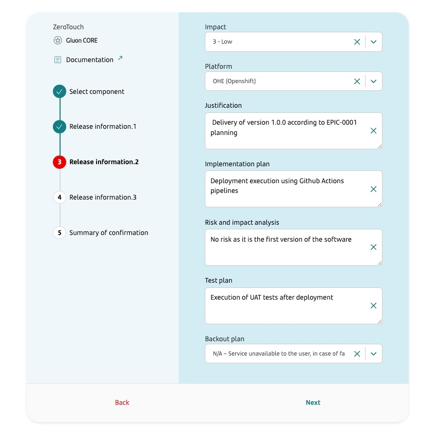

### 4. Release information 3/3

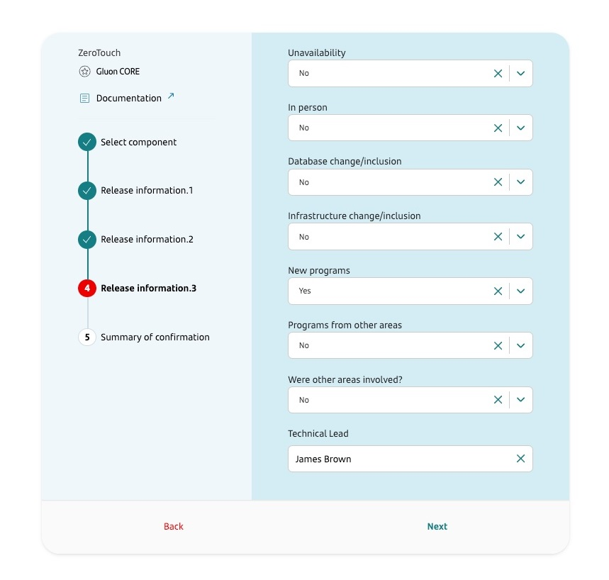

### 5. Summary of confirmation

After all the fields in the form have been filled out, the values should be reviewed and if they are correct, the "Create" button should be clicked
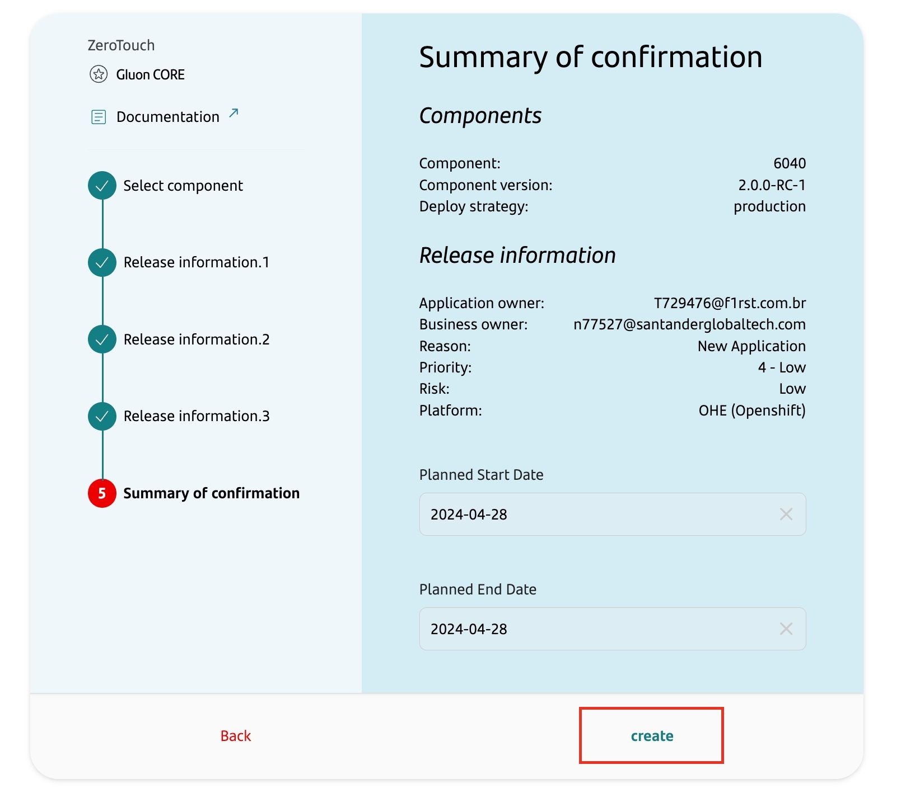

If all the information requested in the form is correctly filled out and the prerequisites for access to servicenow are met, the release will be created.
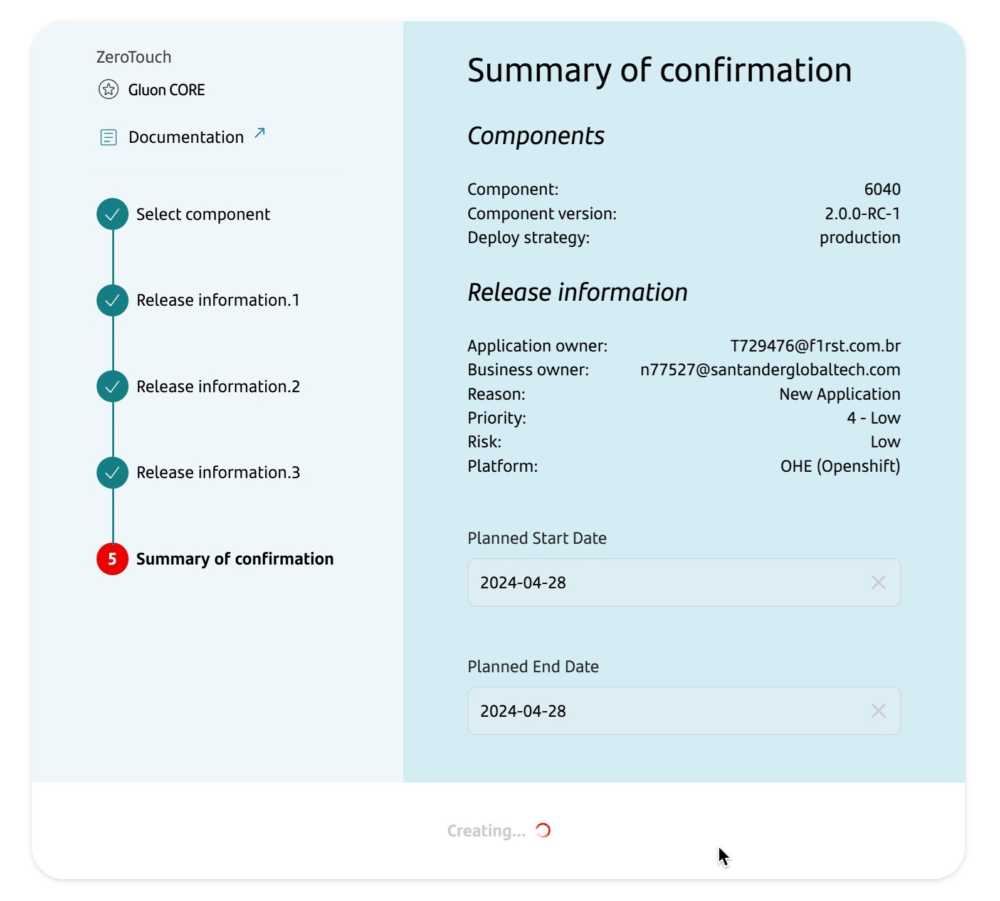

The newly created release will appear in the release listing:


The state associate with the release depends on the `deployment trail` selected in the release creation form.
All the transition between states will be handled by the Gluon Release Management Module.

The States are aligned with the ITSM states:

- __NEW__: The release was created and is waiting for approval.
- __CERTIFICATION__: The release was approved and is waiting for deployment in the pre-production environment.
  In the case of doesn't exist defined an environment of type `certification`, Gluon will be the responsible for
  promote the states. It's exist at least one environment of type `certification`, it'll be the Application Owner the
  responsible for promote the states.
- __WAITING_ACCEPT__: The release was deployed in the certification environment and is waiting for approval and could
    be promoted to the next environment.
- __PREPRODUCTION__: The release was approved and is waiting for deployment in the `preproduction` environment.
  *__Attention__*, for the release to advance to the next stage, it is necessary that the OAM release version be a
  `latest` release. If it is a `draft`, it will remain in that state until the release is promoted.
- __TESTING__: The release was deployed in all pre-production environments and is waiting for check the testing state.
  The Application Owner and Product Owner will be the responsible for promote the states. It's mandatory that the
  Application Owner approve the release to promote the state. This operation are the only one that are executed in the
  ITSM Tool. Once time that the Application Owner and Product Owner approve the Deploy, the Gluon Release Management
  Module will promote the state to the next state.
- __ASSESS__: The release was approved and it'll be promoted to the next state for deployment in the production environment.
- __AUTHORIZE__: It`s only a transiction state. The Gluon Release Management Module will promote the state to the next
  state.
- __SCHEDULED__: It`s only a transition state. The Gluon Release Management Module will promote the state to the next
  state.
- __IMPLEMENT__: This state needs the manual intervention of the Application Owner. When the release arrives in this
  state,
  the application owner could deploy in the production environment. At the end of the deployment, when all environments
  are
  deployed, the Gluon Release Management Module will promote the state to the next state.
- __REVIEW__: The release was deployed in the production environment and is waiting for approval.
- __CLOSED__: The release was approved and is closed.

When accessing servicenow ITSM, it is possible to view the release and tasks created by the portal:

Release:
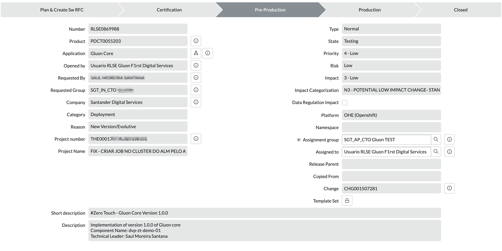

Tasks:
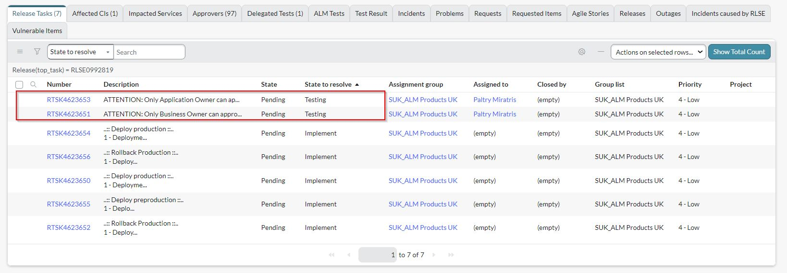

| Field                          | Description                                                                                                                                                                       |
|--------------------------------|-----------------------------------------------------------------------------------------------------------------------------------------------------------------------------------|
| __Deploy Pre-Production__      | Task is created and automatically closed if you definition trail only contains production environments. It includes an attachment with evidence of the pre-production deployment. |
| __Deploy Production__          | Task created to be used in the production deployment. the process creates so task as production environment exist.                                                                |
| __Rollback Production__        | Task created to be used in case a rollback is necessary, the process creates so task as production environment exist.                                                             |
| __Application Owner Approval__ | Task created to formalize the approval of the Application Owner.                                                                                                                  |
| __Product Owner Approval__    | Task created to formalize the approval of the Product Owner.                                                                                                                     |

---

### Commons Problems / Error messages

If there are errors in the information filled out, the system will display an error message and the user should correct the information and try again.

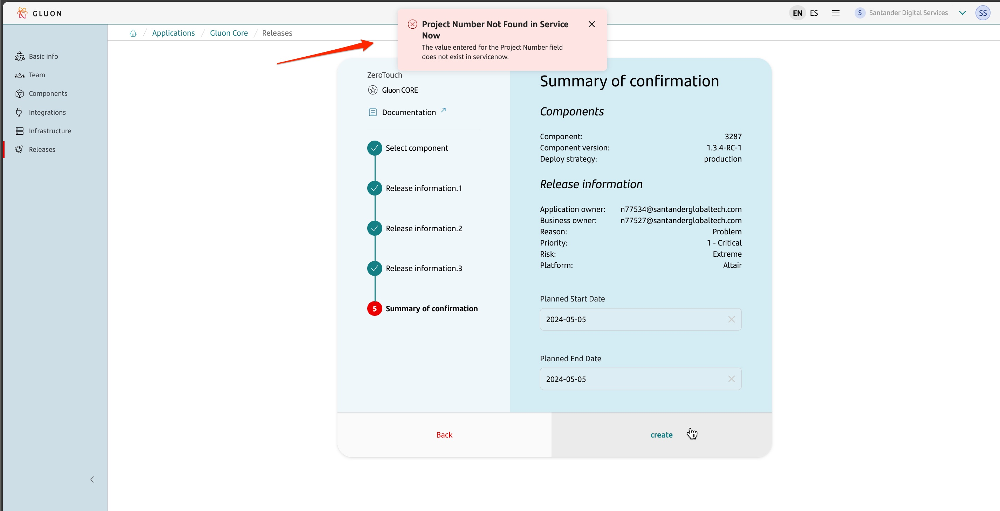

| Error Message | Detailed Description |
| ------------- | -------------------- |
| The value entered for the Requested Group field does not exist in ServiceNow. | The value entered for the Requested Group field does not exist in ServiceNow. Please consult the correct value directly in the ITSM tool. |
| The value entered for the Requested By field must be the Employee ID, format: `<Letter><numbers>`. | The value entered for the Requested By field must be the Employee ID in the format: `<Letter><numbers>`. Please go back to the Requested By field in Step 2 of the form and enter the user ID in the requested format. |
| The service user `<service_user_name>` does not have access to create releases in the `<Requested Group>` group in ServiceNow. | The service user `<service_user_name>` does not have access to create releases in the `<Requested Group>` group in ServiceNow. The association of the Gluon service user to the application group in ServiceNow is one of the prerequisites for creating a release. Please follow the instructions described on the page: [Zero Touch](./index.md) |
| The value entered for the Project Number field does not exist in ServiceNow. | The value entered for the Project Number field does not exist in ServiceNow. Please consult the correct value directly in the ITSM  tool. |

## Next Steps

After the release is successfully created, it is necessary to interact with the release via the Gluon portal so that it can go through the phases until it reaches the Deployment phase.

The instructions for this are described on the
page: [Deploy with Gluon Release Management](./deploy-with-release-management.md)
