The aim of this document is to show how to create a release in servicenow ITSM and how Gluon Release Management
orchestrate the release in the Gluon portal.

Before the creation of the release, it is necessary to understand and first read the premises indicated on
the page: **Gluon Release Management**

!!! tip "What's New"

    Starting from version __6.3.0__ of Gluon, releases will be made at the application level.
    
    - An application release is a set of components that are deployed together.
    - Each component has a version and can have dependencies on other components.
    - Only it'll be possible to deploy the application release in the production environments if the release is inside of the deployment window
    - Only it'll be deployed the components version that aren't deployed in the production environments.

## Introduction

The Gluon portal allows the user to create releases in the ITSM servicenow and orchestrate the release in the portal.

To understand how a release is promoted between states and how the orchestration process works in the Gluon portal,
it is important to know the states of a release and how they integrate into its lifecycle.

## Release States

In ITSM servicenow, a release can have the following states:

- **NEW**: Initial state of the release.
  - If doesn't exist `certification`environment, Gluon Release Manage move the release to the next state.
  - If exists `certification` environment, the release will not be promoted to other states until the application owner has deployed the release in all certification environments defined in the release.
- **CERTIFICATION**: Transaction state. The release management module promotes this state automatically
    whenever there are no certification environments, or the release has already been successfully deployed in those environments.
- **WAITING_ACCEPT**: First state of the Preproduction stage. Once the release reaches this state, the application owner
can deploy the release in the preproduction environments.
If the release doesn't have preproduction environments, the Gluon Release Management Module checks if the component
version has been deployed in the preproduction environment. If it has been deployed, the release is promoted to the next state.
- **PREPRODUCTION**: State that shows that the release is deployend in all preproduction environments. ***Attention***, for the release to advance to the next stage, it is necessary that the OAM release version be a `latest` release.
  If it is a `draft`, it will remain in that state until the release is promoted.
- **TESTING**: State in which the evidence of the tests carried out in the preproduction environments are collected.
If the release handle the preproduction environments, the Gluon Release Management Module generates a task in ITSM
to collect the evidence of the deployment workflow that include the component deployment workflow with the check at testing phase.
  The Approvals task associate with the Application and Product owners are collected now in this state. They've bee moved from the Assess state.

!!! tip "Attention"

    - During the approval process for Application Owner, Product Owner, and Change Management, only users belonging to the group specified in the `Requested Group` field (linked to ITSM) will appear in the list. This ensures that only users who are part of the specified group and the relevant `Management` teams are displayed. 

    - If the approval is performed by someone who has access to the ITSM group but does not belong to the designated groups for the tasks (Application Owner, Product Owner, and Change Management), the task will be invalidated along with the release. This will prevent the release from continuing to be available for use, requiring the creation of a new release.
  
- **ASSESS**: Transition state to which Gluon Release Management promotes the release once all approvals have been made.
- **AUTHORIZED**: Transition state to which Gluon Release Management promotes the release once all approvals have been made.
- **SCHEDULED**: Transition state to which Gluon Release Management promotes the release once all approvals have been made.
- **IMPLEMENTATION**: State in which the deployment of the release in the production environments is carried out.
- **REVIEW**: State in which the deployment tasks carried out in the production environments are reviewed.
- **CLOSED**: Final state of the release.

!!! warning "Change in Gluon 6.0"

    The Approve task have been move to the Testing Step from the Assess step.

## Release Lifecycle

The following diagram shows the states of a release in the Gluon portal and how they relate to each other.

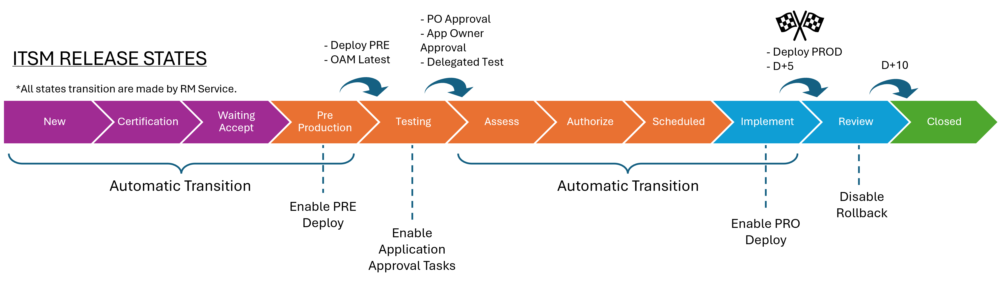

!!! warning "Note"

    Although the process can manage deployments in certification environments, these are not mandatory, and it is
    the project's responsibility to decide whether to include this dependency in their releases.

The release lifecycle is managed by the Gluon Release Management module, which is responsible for promoting the release.
All the transitions between states are managed by the module, which is responsible for promoting the release to the next state
when the conditions are met.

The release, could be created with a deployment trail that includes or not certification environments. If the deployment trail
doesn't have certification environments, the release is promoted to the state of `PREPRODUCTION`, in other case the release
will be create at the `NEW` state waiting for the deployment in the certification environments.

The release could be created with a deployment trail that includes or does not include preproduction environments. If the deployment trail does not include preproduction environments, the release must be promoted to the state of `TESTING`.
 Otherwise, the release will be created in the `PREPRODUCTION` state, waiting for deployment in the preproduction environments.
Additionally, if the release of OAM is in a `draft` state, it will remain in that state until it is promoted to `latest`, allowing the release to advance to the next stage.

When the release reaches the `TESTING` state, the application owner and product owner must approve the tasks created in ITSM.
After the approvals, the release is promoted to the `ASSESS`, `AUTHORIZED` and `SCHEDULED` states automatically.

- While the component version is not deployed in the preproduction environment, the release will not be promoted to the next state
and the release stays in the `PREPRODUCTION` state.
- While the Gluon Release Management module does not collect the evidence of the tests carried out in the preproduction environments
the release will not be promoted to the next state and the release stays in the `TESTING` state.

## Release Creation

Remember review the [Gluon Release Management](./create-release.md) page to understand the release management process
for create a new release.

???+ warning "Recommendation"

    We recommend using an already created ITSM servicenow release to use as a reference when filling out the form fields via the Gluon portal.

When the release is created, the following message will appear:

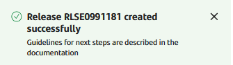

and the new release appears in the list of releases. At this moment we can start the orchestration process.

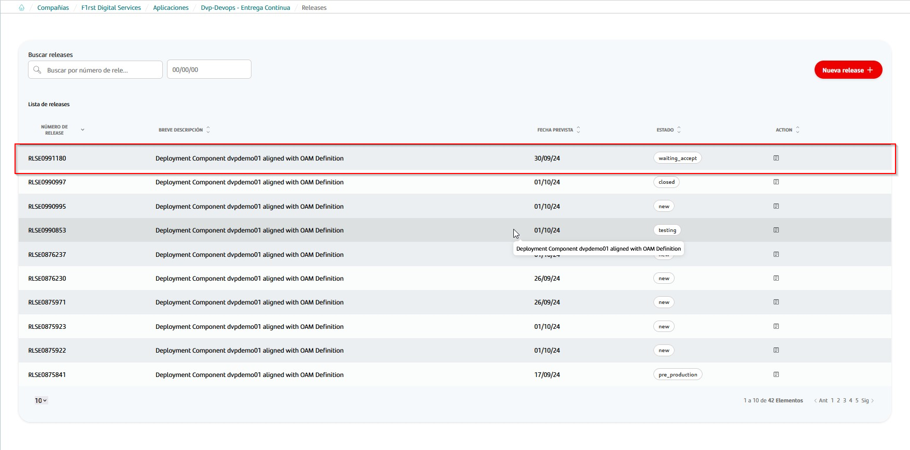

Clicking on the release icon takes you to the release details, where you can see the release status and its details.
In the Release detail screen, you can see the release status and the different states of the release. At the first time
the release is created, the release is in the `NEW` state, and how the Deployment trail doesn't have certification environments
the release is promoted automatically to the `PREPRODUCTION` state.

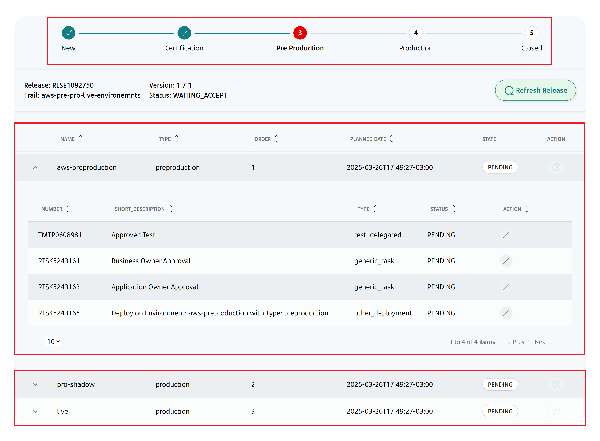

!!! warning "Important"
    You can refresh the release details screen by clicking on the **“Refresh Release”** button whenever you need to keep the information up to date and try to progress the release to the different states.

    

      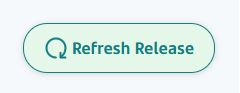
    

    This button also synchronizes the release dates between **Release Management portal** and **ServiceNow ITSM**, ensuring that the release schedule in the Release Management portal reflects the updated values.

    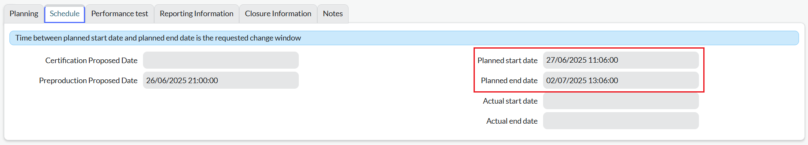

    Specifically, the dates synchronized to the release in Release Management will be the “Planned Start Date” and “Planned End Date”.

The release detail screen is divided into two parts.

In the upper part, the release status is displayed, as well as some details of the release, including the version information
and the selected deployment trail.

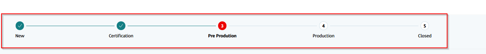

In the lower part, the different states of the release are shown, and if you click on each of them, the tasks that apply
to each environment are shown.

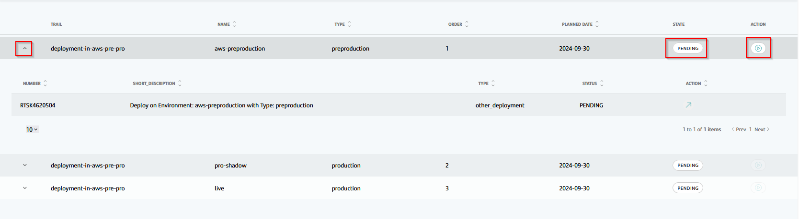

The state associated to the environments represent the states of the release deployment. An environment could have the following states:

- `PENDING`: The release has been created, but it has not been deployed in the environment. Deployment is allowed if the conditions are correct.
- `IN_PROGRESS`: The release is being deployed in the selected environment. Deployment is not allowed until the release has been deployed correctly.
- `REQUIRE_ATTENTION`: An error occurred during the release deployment workflow in the environment. Deployment is allowed.
- `READY`: The release has been deployed correctly in the environment. Deployment is not allowed.

## Deployment of the release

The deployment process is managed by the Gluon Release Management module, which is responsible for promoting the release
to the next state when the conditions are met.

The deployment process is the same for all environment types.

To deploy the release, click on the **Deploy** button in the release detail screen.

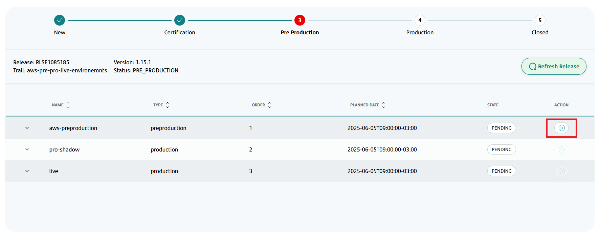

The process calls to the deployment workflow that is defined in the Component created in the Gluon portal with
the Gluon Application Model Component template.

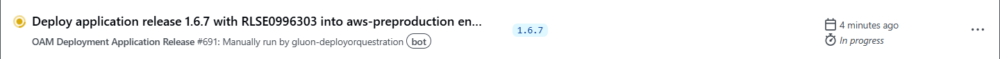

This workflow is responsible for deploying the application release in the selected environment.

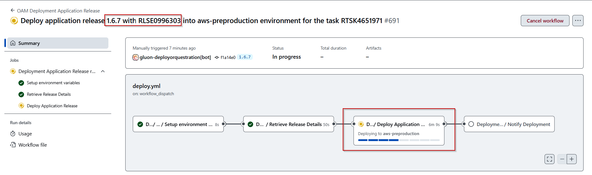

The deployment process contains the following steps. For more information, see the [Gluon Application Model](./../oam/oam-workflows.md) page.:

- **Setup**: The deployment workflow is initialized.
- **Deploy**: Validate the release information and deploys the component version in the selected environment.
- **Notify**: Notify the deployment status to the Gluon Release Management module. In case of error, the deployment status is set to `REQUIRE_ATTENTION`,
otherwise the deployment status is set to `READY`.
- **Summary**: The deployment workflow is finalized, and associate a brief summary of the deployment in the GitHub repository.

When the deployment is finished, the state will be changed to the `READY` state, and the release will be promoted to the next state if the conditions are met.

Now it's possible go the GitHub workflow through the GitHub button link in the release detail screen to see the deployment status.

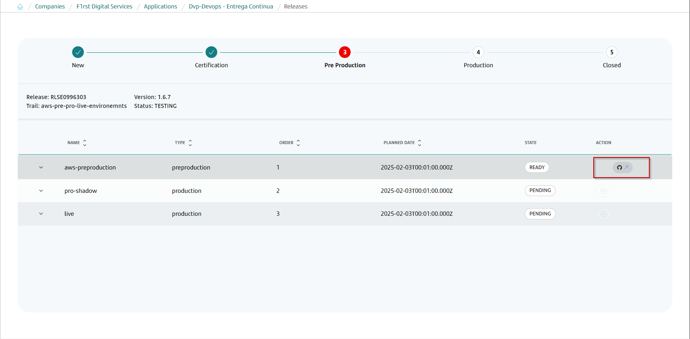

#### Preproduction Stage

Here in `preproduction`, you have the possibility to deploy more than once in the same environment.

So after you deploy once in preproduction and it is successfully completed, the deploy button will be unlocked so that you can perform a new deploy in the environment, with possible changes made to your OAM package of the release.

We can see an example in the image below:

| First Deploy in Portal                                                               | Detail of Release in ITSM                                                                 |
| -------------------------------------------------------------------------------------| ----------------------------------------------------------------------------------------- |
| 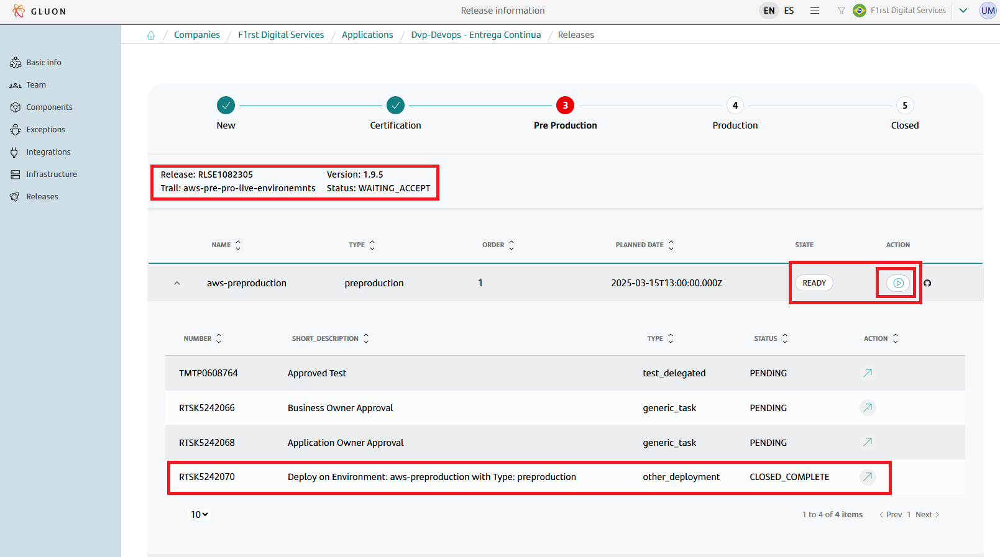 | 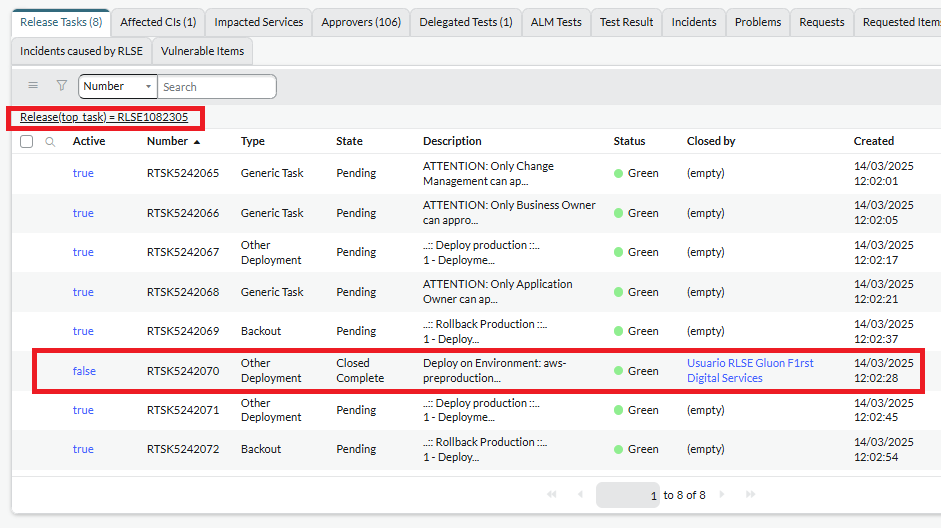 |

When we execute the deploy again using the deploy button available on the portal, we can see, as shown in the image below, that the status of the `environment` is set to `IN_PROGRESS` again, as it is performing a new deploy of the environment.
After this second execution is completed, we can also notice that a **new task in ITSM** has been created. For each new deploy, a new task of the type `other_deployment` will be created in ITSM and will be linked to this new execution within GitHub.

| Second Deploy in Portal                                                            | Detail of Release in ITSM                                                                      |
| -----------------------------------------------------------------------------------| ---------------------------------------------------------------------------------------------- |
| 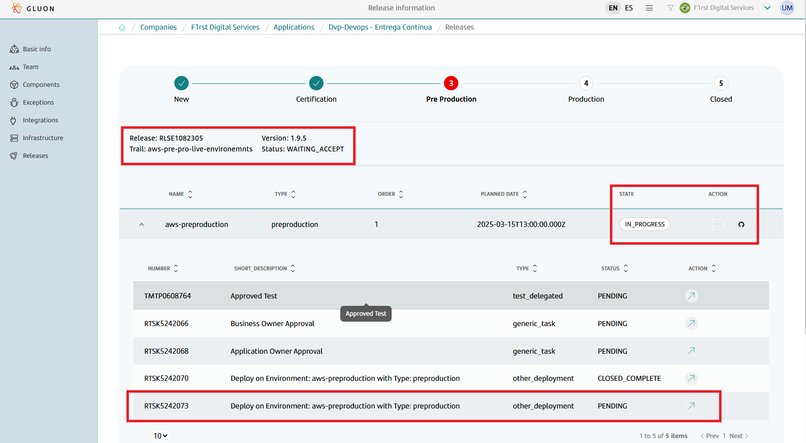 | 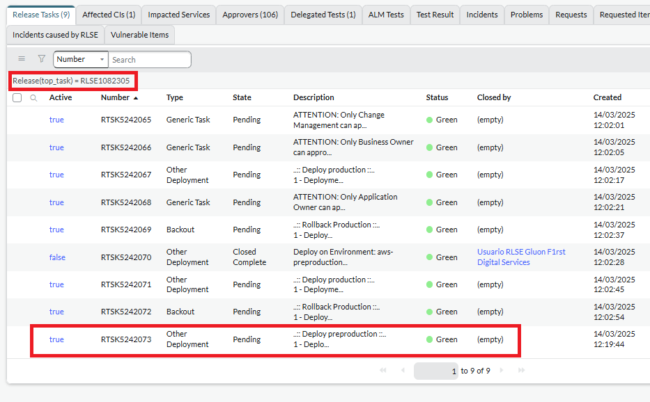 |

Here within the GitHub portal in the OAM configuration repository, within the executions, we can see our new execution that was launched, and the task description name already has the new task linked to it.

| Second Deploy Execution in GitHub                                             | Details                                                                                        |
| ----------------------------------------------------------------------------- | ---------------------------------------------------------------------------------------------- |
| 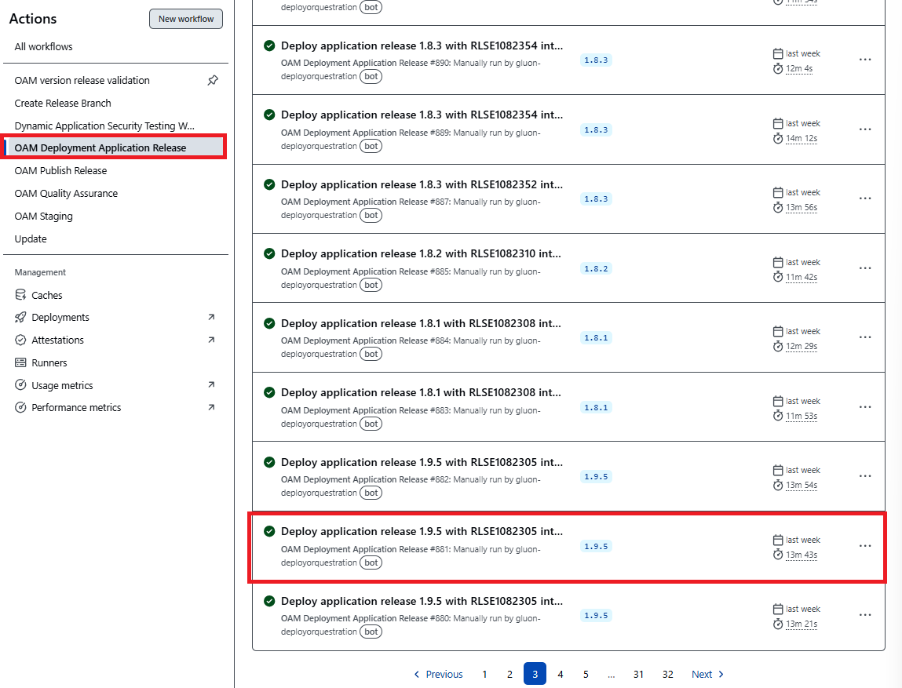 | 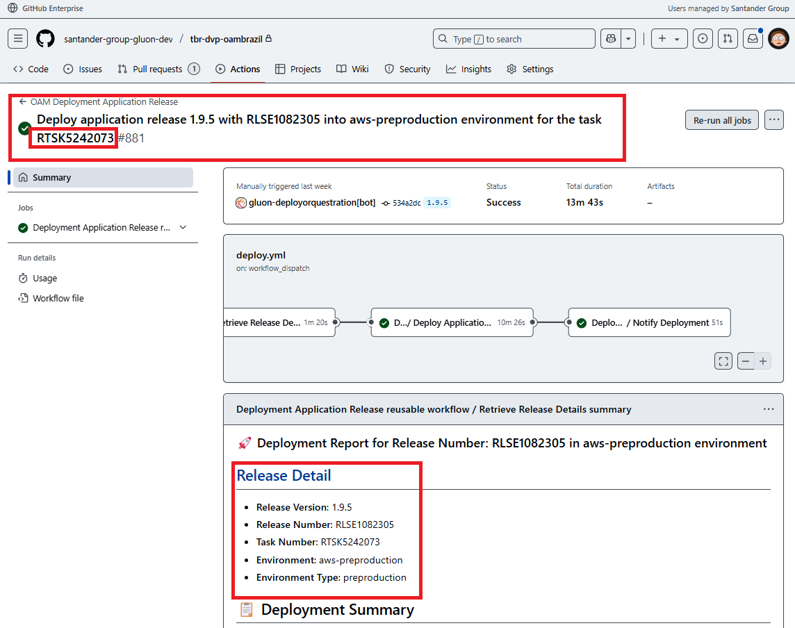 |

After the execution is successfully completed, the ITSM task is automatically closed and the environment execution status is updated on the release details page.

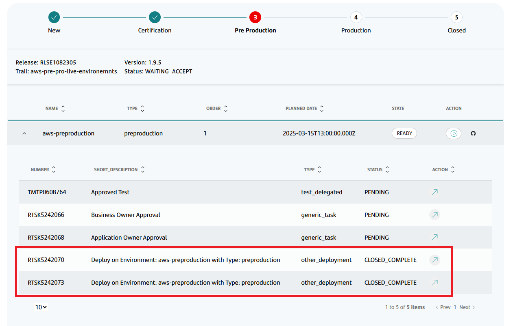

!!! warning "Attention"
    Releases in **Draft** mode allow you to deploy in `preproduction` as many times as you want, but they do not allow advancing to the `production` stage. Therefore, your release created in the portal by Release Management will be
     stuck in `preproduction` with the state `PREPRODUCTION` until it is transformed into a concrete release (**Latest**).

    For more information, see: [Promote Release](../zero-touch/create-release.md#promote-release-draft-for-latest)

#### Testing Phase

- The testing phase is responsible for collecting the evidence of the tests carried out in the preproduction environments.
- The release will not be promoted to the next state until the evidence of the tests in the preproduction environment are collected.
- The approval tasks have been moved in the Testing state.
- The release stays in this state until the application owner and product owner approve the tasks created in ITSM. Once the approvals
  have been made, the release is promoted to the `ASSESS`, `AUTHORIZED`, `SCHEDULED` states and finally on `IMPLEMENT` state.

!!! tip "Approvals Task"

    These are the only manual task that we must do on the ITSM Tool.
    The relese'll stay in the Testing state until the application owner and product owner approve the tasks created in ITSM.

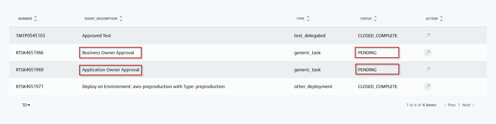

You can go to the ITSM tool through the link in the release detail screen to approve the tasks, and close the task when the approval is done.

The approval process is the same for the two tasks. In both cases, the following must be selected:

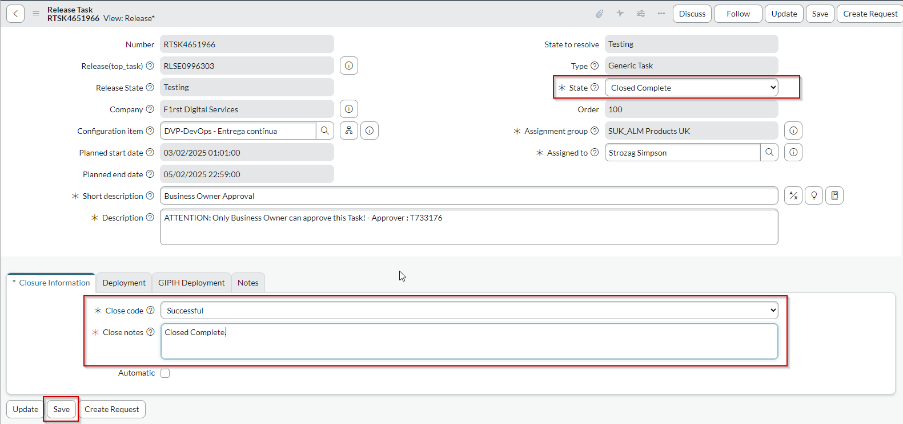

- **state**: Close Complete
- **Clousure Information**
  - **Close Code**: Successful
  - **Close Notes**: Any text, for example `Approved`. `Closed Complete`, etc.

In this first version, the way of acting will depend on the configuration of the release.

- **Brazil** For the entity of Brazil the release will be promoted to `ASSESS` when the evidence of the tests carried out in the preproduction environments
are collected in the Octane tool.
- **Other entities** For the rest of the entities the release will be promoted to `ASSESS` depending on whether the management of the preproduction environments has been carried out or not
from the Gluon Release Management module.

    - If our release has selected a deployment trail with at least one preproduction environment, the system collects the execution of this workflow
  as evidence of the tests carried out in the preproduction environments and promotes the release to `ASSESS`.
    - If our release has not selected a deployment trail with at least one preproduction environment, the system understands that the evidence of the component may be
  in the Gluon Testing module censused from the component deployment workflow.

!!! warning "Testing Phase"

    In any case, the release will not evolve from the Testing state until the evidence has been collected and owner Approvals have been made.

    Remember that this entire process is automated from the release detail screen. As soon as the system detects that the test
    evidence has been collected in the preproduction environments ant the task have been approved, the release will be promoted
    to next stage.

### Production Stage

The **production stage**  starts when the release is approved by the owners and the testing task is close completed.

- The production stage is responsible for deploying the release in the production environments.
- The deployment process is the same as in the preproduction environments.
- To deploy the release in the production environments, click on the **Deploy** button in the release detail screen.

The release is promoted to the `ASSESS` state when the evidence of the tests carried out in the preproduction environments are collected.

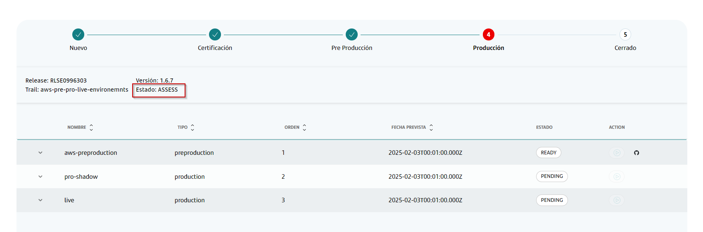

The system will be responsible to promote the release to the `AUTHORIZED`, `SCHEDULED` and `IMPLEMENT` states automatically.
The system **not allow the deployment in the production environments** until the release has been promoted to the `IMPLEMENT` state.

Once the release is promoted to the `IMPLEMENT` state, the deployment process in the production environments can be started.

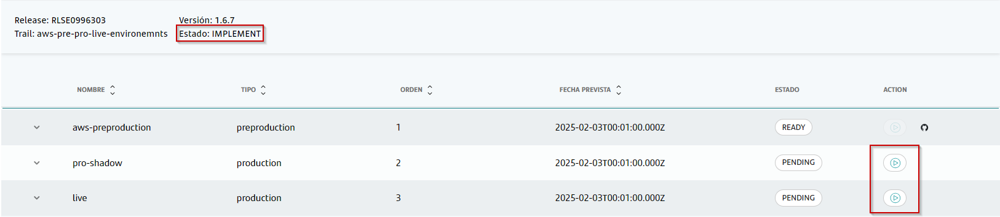

!!! tip "Validate Window deployment"

    To deploy the release in the production environments, it is necessary that the release is inside of the deployment window.
    In other case, the deployment process will not be executed, and the system shows a message indicating that the release is outside of the deployment window.

In this case, the release will not be deployed in the production environments because it is outside of the deployment window.
The deployment process will start when the release is inside of the deployment window that starts at 2025-2-03:T00:01:00Z.

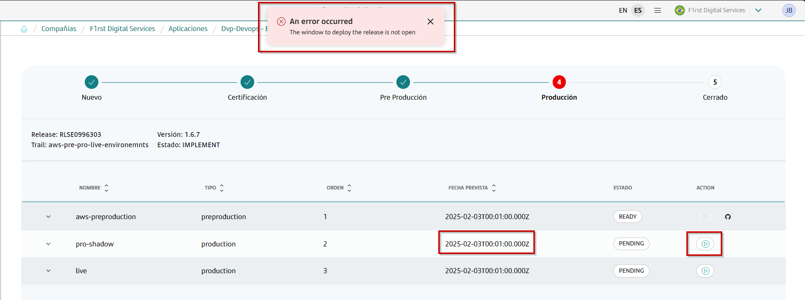

!!! info "Remember"

    The deployment process is the same as in the preproduction environments and must be executed in the order defined in the deployment trail.

When the deployment is finished, the state will be changed to the `READY` state, and the release will be promoted to the next state if the conditions are met.

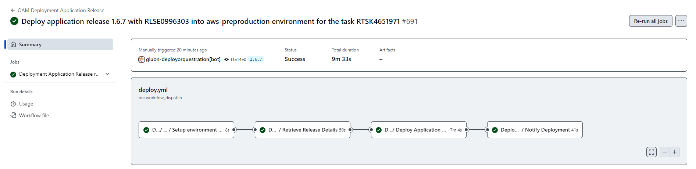

The OAM Deploy workflow must shows a resume of the component status during the deployment.

Summary of the deployment process:

It`s important follow the order defined in the deployment trail to avoid errors in the deployment process. In other case
the deployment process will not be executed.

Once time that the deployment process on this environment is finished and the gluon Release Management module has been notified

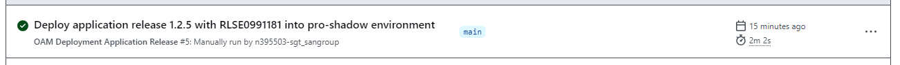

we could deploy the release in the next environment, o we could promote the release to the next state.

In this case we need deploy on the second production environment

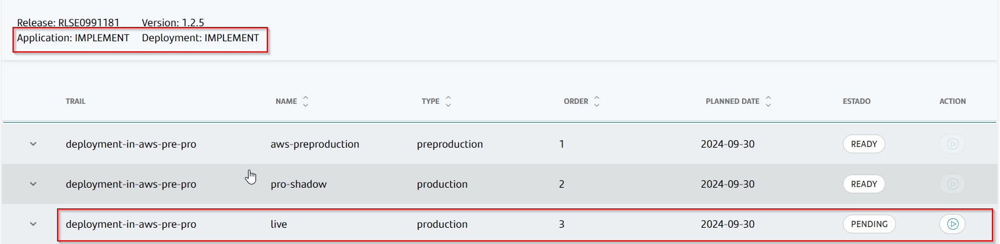

Once the deployment process is finished, the release will be promoted to the next state.

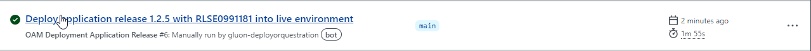

The release will be promoted to the `REVIEW` state, where the deployment tasks carried out in the production environments are reviewed.

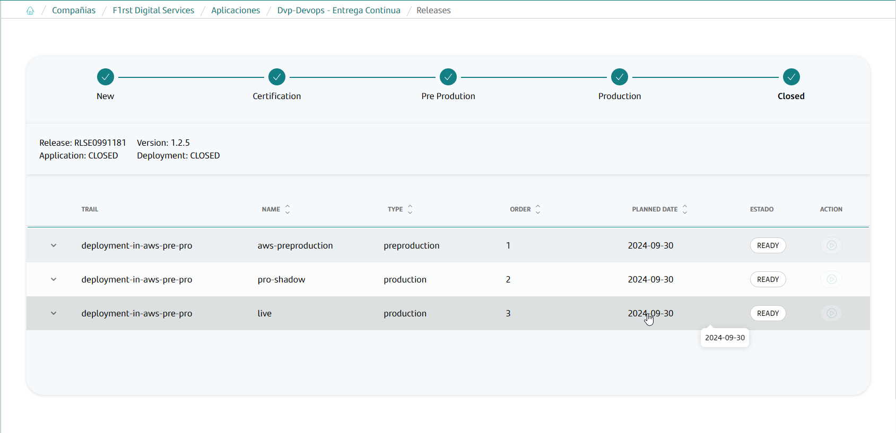

## References

- [Deployment Workflows](./../oam/oam-workflows.md): To know more about the deployment process you can visit the [Gluon Application Model](./../oam/oam-workflows.md) page.
