## Introduction

The purpose of this document is to demonstrate how the Release Management menu can be used to configure the deployment window and enable the **New Release** button in applications.

## Prerequisites

- The "Company Owner" role is required for users to access the Release Management menu.
  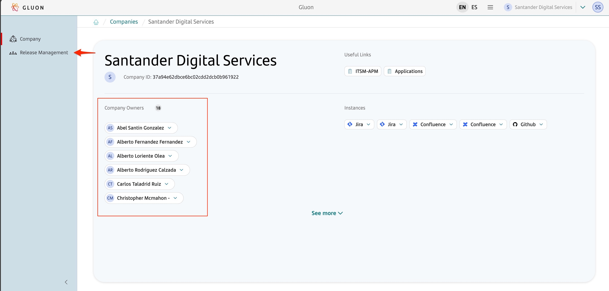

???+ info "Note"
It is necessary to understand and read the prerequisites mentioned on the [Gluon Release Management](./index.md) page.

## Release Management

To enable the **New Release** button in the Releases menu on the Applications screen, the Company Owner needs to enable Gluon Release Management and configure the deployment window.

This configuration can be done at the company level or at the application level through the Release Management menu.

 
Accessing the Release Management menu

1. Go to the Gluon portal home page.

   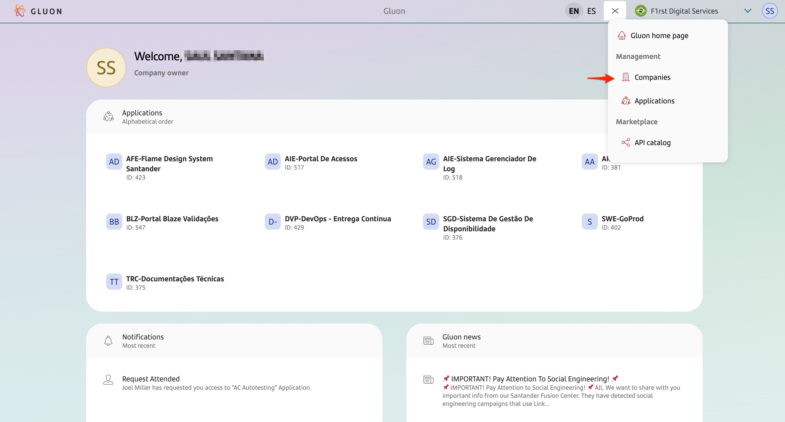

2. Click on the menu, select Companies, and choose a company.

   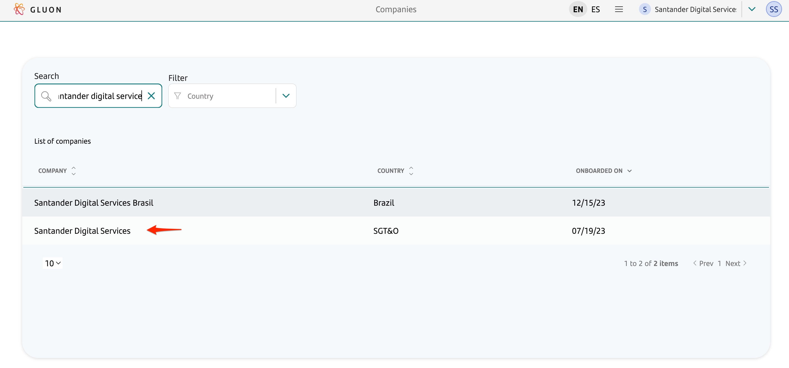

3. Click on the "Release Management" menu.

   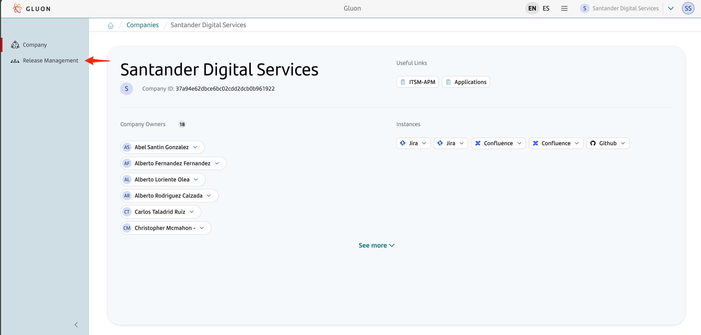

   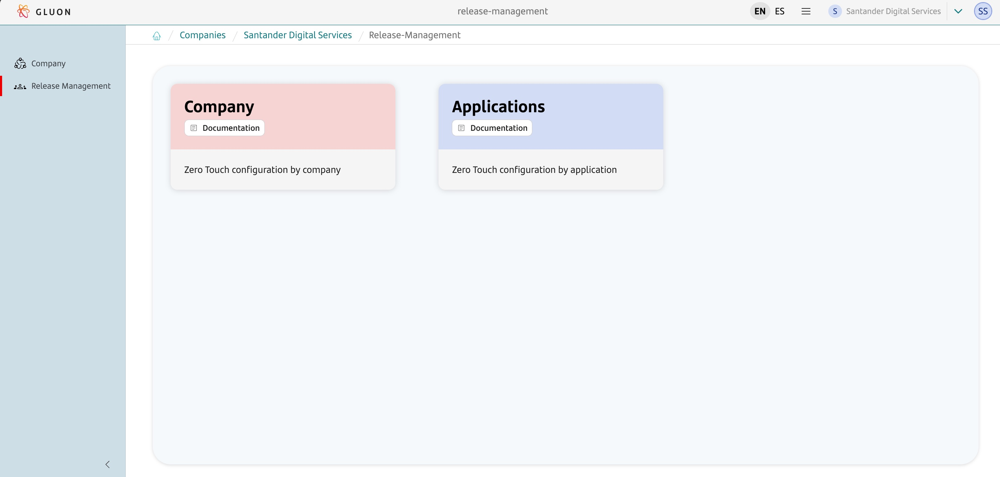

### Company-level Configuration

To configure the window at the company level access the "Release Management" menu and click on "Company".
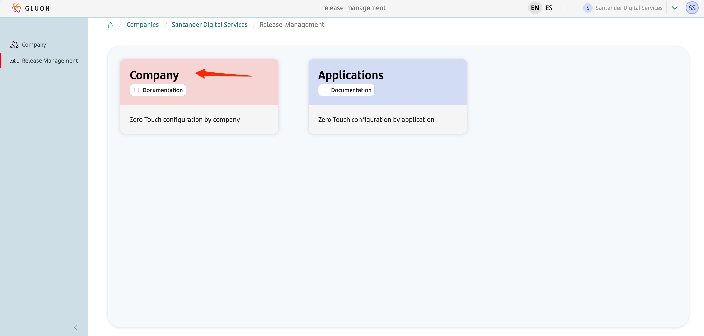

The company configuration screen will be displayed, showing on one side the **Enable all applications** button, which allows the company owner to enable or block creation and deployment of releases in the company's applications.
And on the other, the **Calendar** and **Rules** to configure the window of deployments.

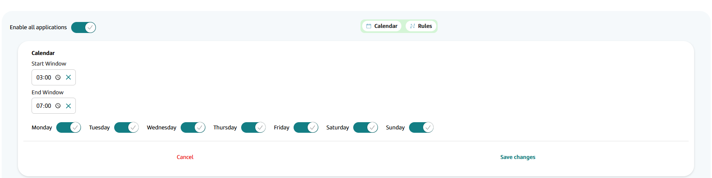

If the "Enable all applications" button is enabled, the **New Release** button will be displayed for all applications in the company. If it is disabled, the **New Release** button will be blocked for applications without specific configuration,
and a tooltip will inform users that "Release management is blocked at company level."

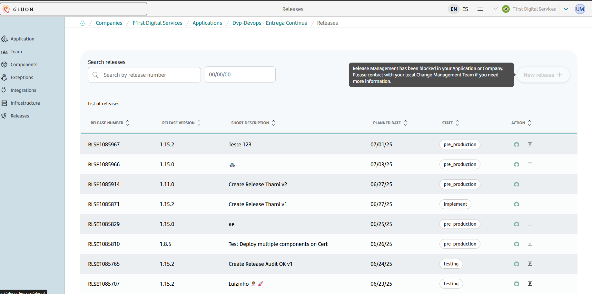

Additionally, when release management is blocked at the company level, the **Deploy** button on the release page will also be disabled, with a tooltip explaining the restriction.

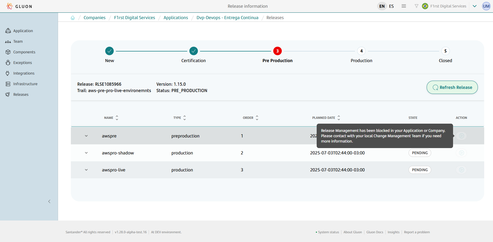

The same applies to the **Rollback** button.

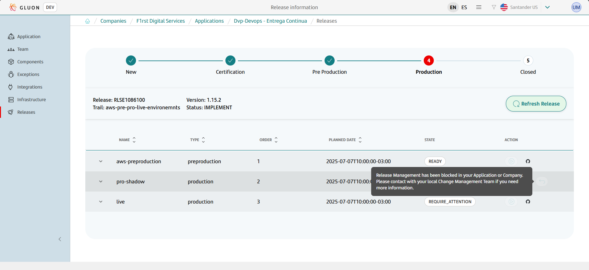

These restrictions ensure that only properly configured applications can proceed with release creation and deployment operations.

#### Calendar

Configure the start and end of the deployment window and the days of the week that are enabled for production deployment.

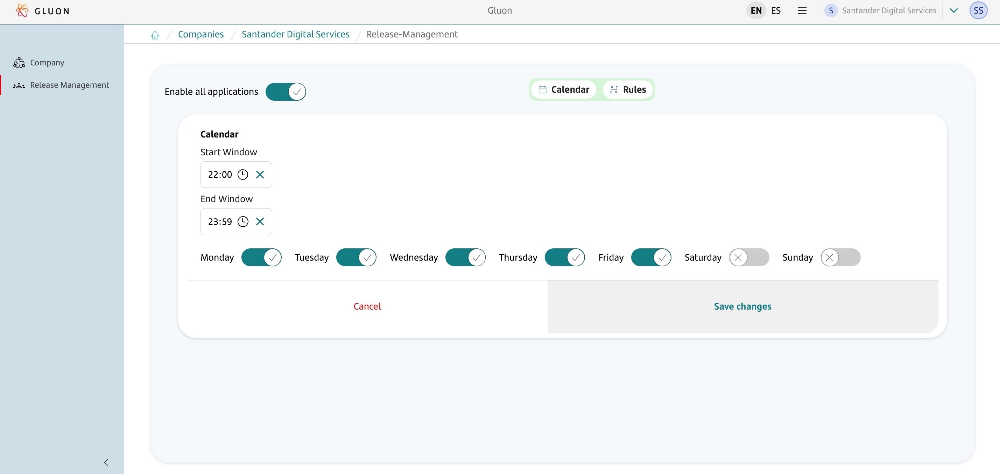

#### Rules

This menu contains some customizable rules.
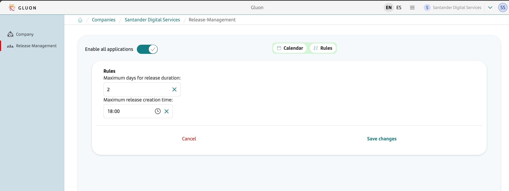

### Application-level Configuration

To configure the window at the application level, the same configuration options: Calendar and Rules present in the company-level configuration are applicable.

???+ info "Note"
The application-level configuration always takes precedence over the company-level configuration.

 

#### Accessing the application-level configuration

Go to the "Release Management" menu and click on "Applications".
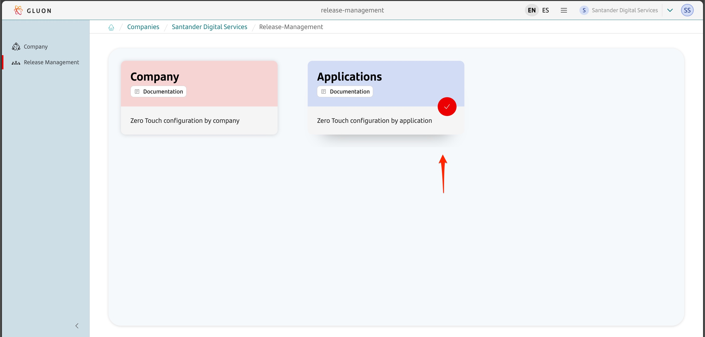

List of enabled applications
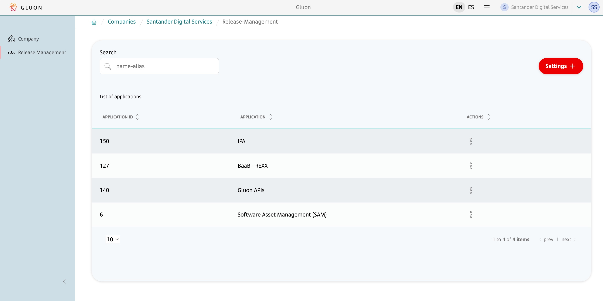

#### Creating a new configuration

To create a new configuration, click on the "Settings +" menu, which will display a list of applications registered in the company.
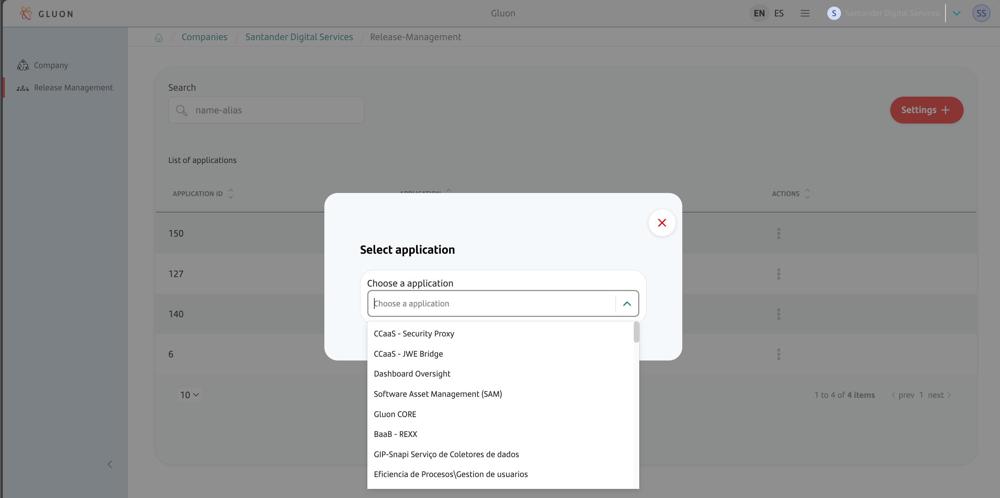

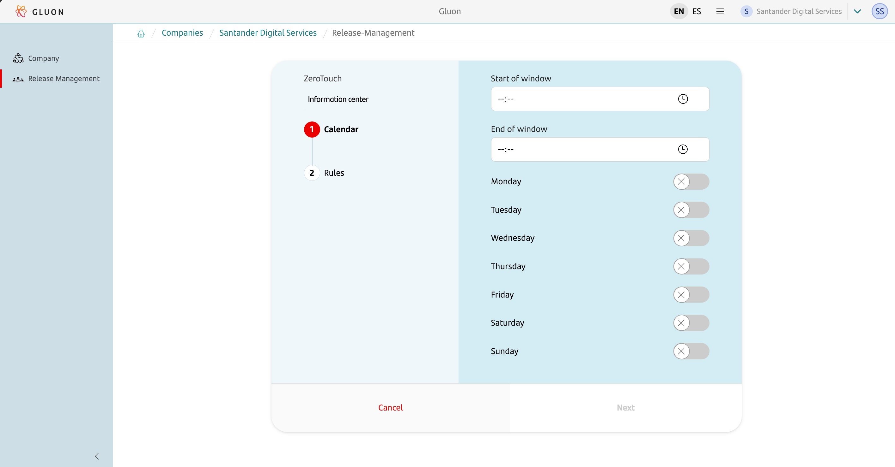
After selecting the application, simply fill out the form and click "Create" to create the configuration, which will appear in the list.

 

#### Deleting/Editing a configuration

By clicking on the menu next to a configuration, it is possible to edit or delete it.
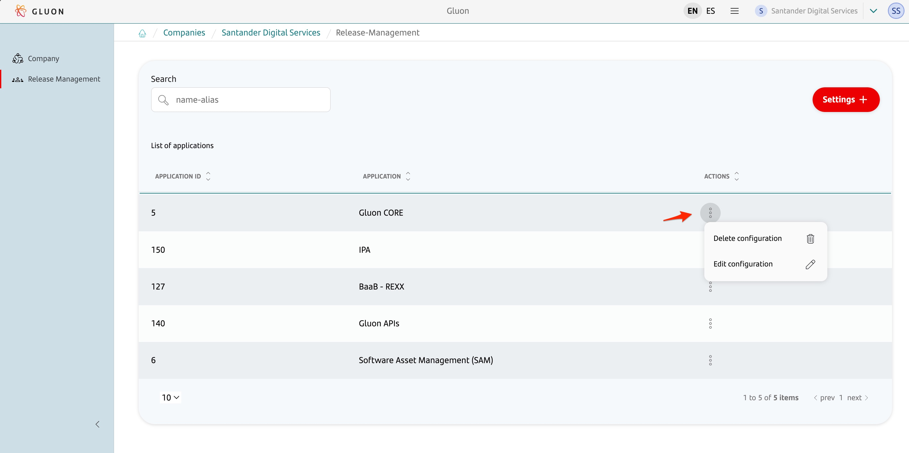
