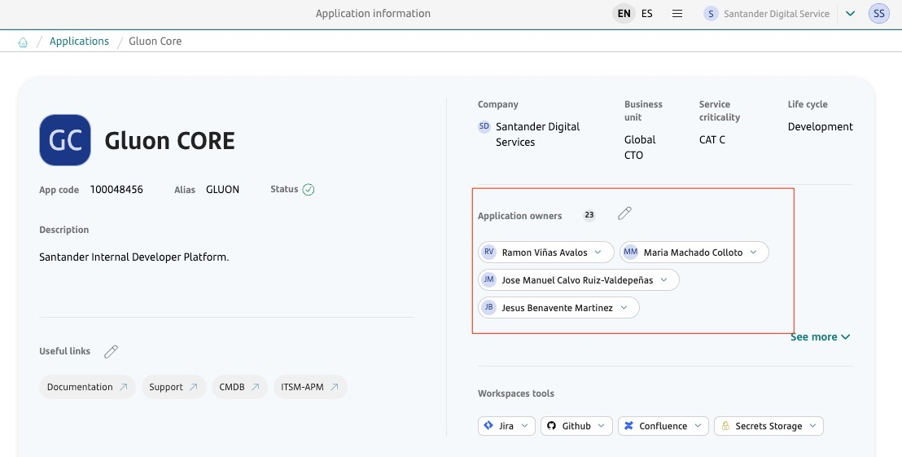
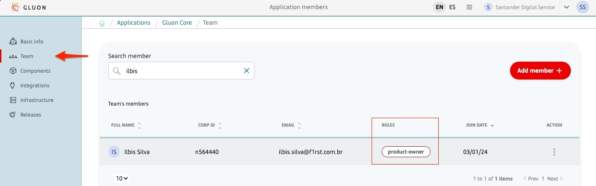

!!! tip "Restrictions"

    - Execution of Gluon Release Management must be done individually by technical component.
    - Use of Gluon Release Management is mandatory to align with the new Gluon Framework CI-CD.
    - Each application must have one and only one Component based on the `Gluon Application Model` component template.
    - Only releases existing in the GitHub repository will be deployed.

## Introduction

This documentation provides a step-by-step guide on deploying a component in
production on the GLUON platform using the Gluon Release Management process.
This guide explains how to create a release, promote it through different ITSM states, include test evidence, track approvals, and orchestrate deployment through integration with Servicenow ITSM and GitHub.

## What is Gluon Release Management?

Gluon Release Management is a Gluon portal integration process designed to automate the creation of
releases and tasks in Servicenow ITSM, as well as the orchestration of deployment in GitHub through
the portal itself.

???+ info "Note"

    Gluon Release Management empowers application teams to deploy their components in production without depending on other areas.

## Rules

1. The process should be used for components without deployment dependencies, as the automation creates one release per component.
2. All specified users **MUST** be associated with the application in the Gluon Portal.
3. Users specified during release creation **MUST** be members of the requested group provided.
4. Application Owner and PO users **MUST** be registered in the Change Management group of Gluon Portal and **MUST** also be members of the requested group provided.
5. Any user who is a member of the group specified in the release can create releases.
6. The release management module integrates with the definition of an application through the new Gluon template `Gluon Application Model`. Users
   can define the `trail` or path that the component associated with the release will follow until it reaches production environments.
7. Releases can be created for deployment in production for a version already approved in preproduction.
8. Management of the preproduction environment is defined through the trail selected in the release.
9. Creating a new release requires selecting the application release and its deployment trail.
10. During the testing phase of the Release, User Acceptance Testing (UAT) results from the pre-production environment will be checked in the Gluon Testing tool for all companies, except for Brazil, which will be checked in the Octane tool.
11. The Release must be approved by the Application Owner and Product Owner of the application through automatically created tasks within the release.

!!! tip "Attention"

    - During the release creation process, in the form section for selecting the Application Owner, Product Owner, and Change Management, only users belonging to the group specified in the `Requested Group` field (linked to ITSM) will appear in the list. This ensures that only users who are part of the specified group and the relevant `Management` teams are displayed.
  
## Scope

### Enabled for components

- All components types those are aligned with the New Gluon Framework CI/CD

## Requisites

### **Gluon Portal**

  - The Application Owner must be registered in the Gluon portal with the role of Application Owner

  - The Product Owner must be registered on the Gluon portal with the role of product-owner

### **Servicenow ITSM**

???+ info "Note"

    **There's no longer a need to add the ITSM Service user** (called *Usuario RLSE Gluon Digital Services*) to the group when creating releases with Gluon Release Management.
