The purpose of this document is to show how to interact with releases created by the Gluon portal in order to transition the release steps and orchestrate the deployment via the portal.

???+ info "Note"
    The instructions on this page should be followed after the release has already been created. For more details on how to create a release in the Gluon portal, please refer to the page: [Create Release](./create-release.md)

## Release Steps

The servicenow release consists of 11 states, which are abstracted into 4 phases in the Zero Touch process as described in the diagram below:

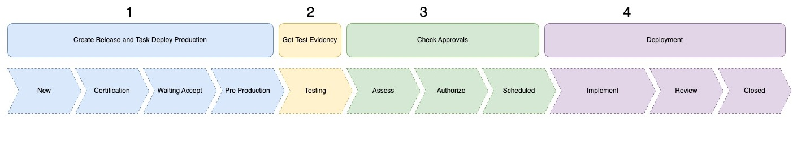

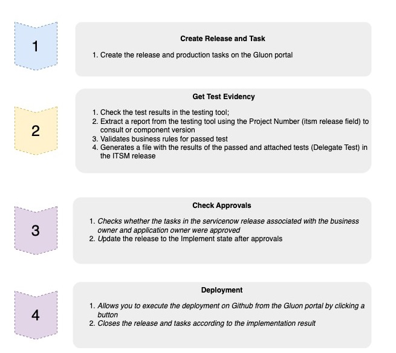

After the release is created, it should appear in the list of releases as follows:

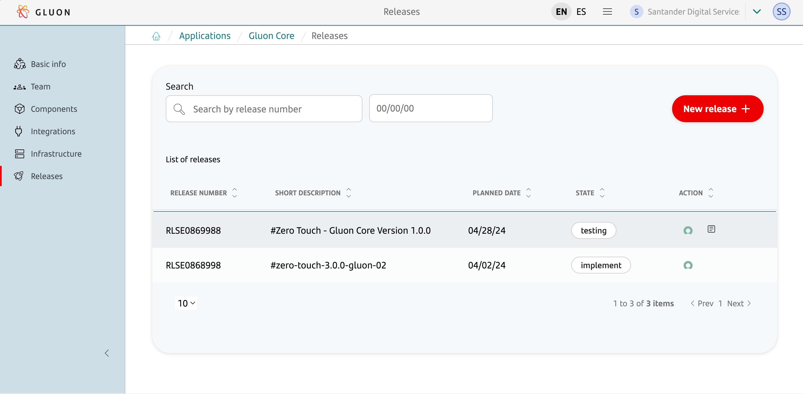

In the Action column, there are two icons:

- The first icon is to access the release details in servicenow
  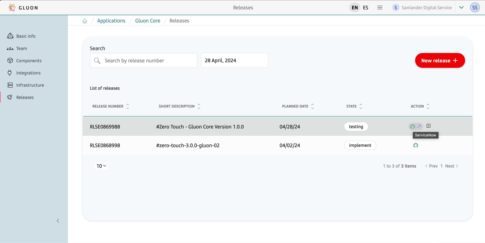

- The second icon is to access the release workflow in the Gluon portal
  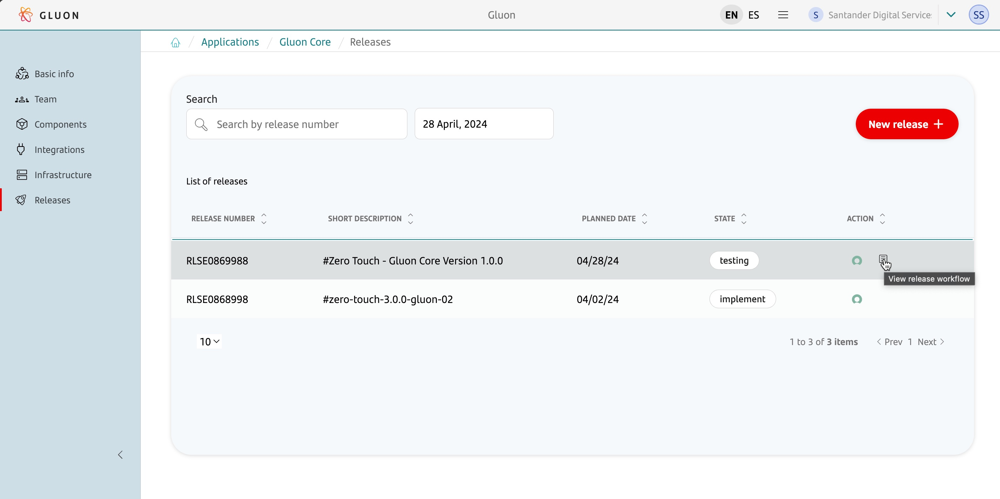

---

### Get Test Evidence - Testing

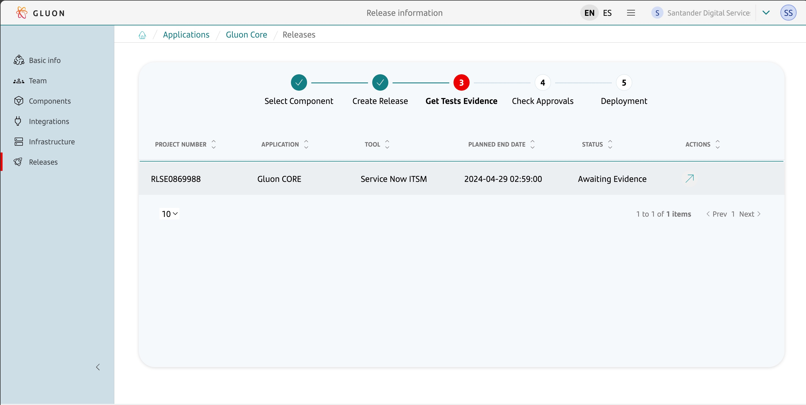

The purpose of this phase is to check the results of the tests performed in the pre-production environment using the testing tool, attach the release in servicenow ITSM, and automatically transition the release to the Assess phase.

#### Integration with testing tools

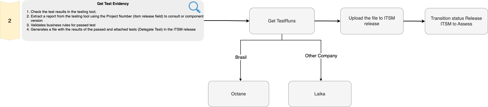

Integration has been done with the following tools: Gluon Testing and Octane

 - Integration with Gluon Testing is done for all companies except Brazil. The component ID and version are used as keys to check the results of the tests performed in the pre-production environment.
 - Integration with Octane is done only for companies in Brazil. The Project Number (information filled in the ITSM release) is used as a key to check the results of the tests performed in the pre-production environment.

#### Without integration with testing tools

In case of errors in the integration with testing tools, it is possible to proceed with this phase manually.
To do this, it is necessary to manually attach the evidence of the tests performed in the pre-production environment to the Release in the "delegated tests" tab.
After the attachment is done, click the 'Testing Ok' button, and the release should be transitioned to the Assess phase.

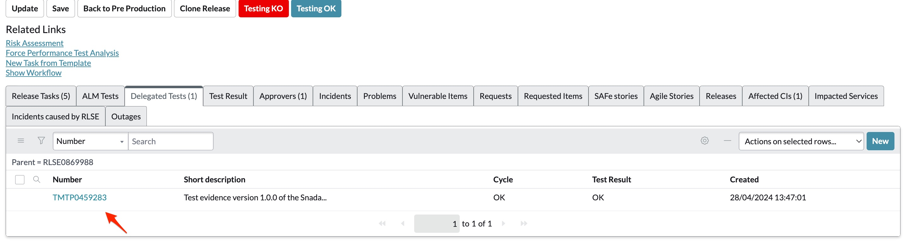

Once the release is in the Assess phase, the user can return to the Gluon portal to perform the remaining transitions.

???+ info "Note"
    To carry out this action, the user must be a member of the Quality/Testing group in servicenow ITSM.

#### Attached evidence

After the results are automatically or manually attached to the release, the release in servicenow will be transitioned to the Assess phase.

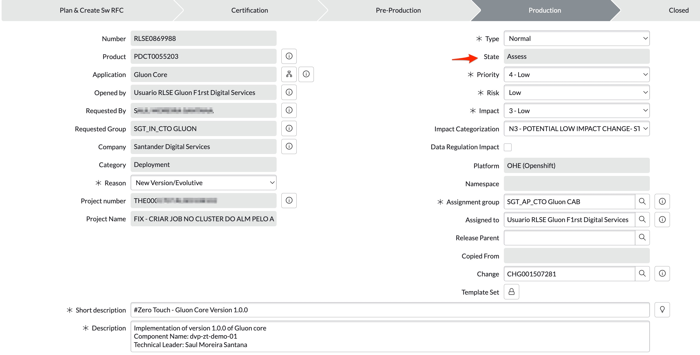

### Check Approvals - Assess

At this stage, it is necessary for the Application Owner and Product Owner to approve the deployment of the release in production by approving the tasks automatically created and associated with the release in servicenow ITSM.

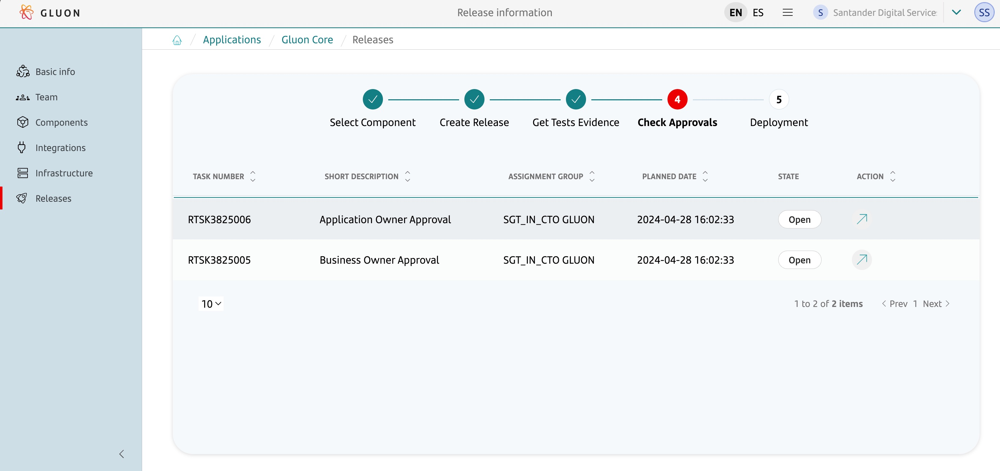

#### Approval tasks created in servicenow

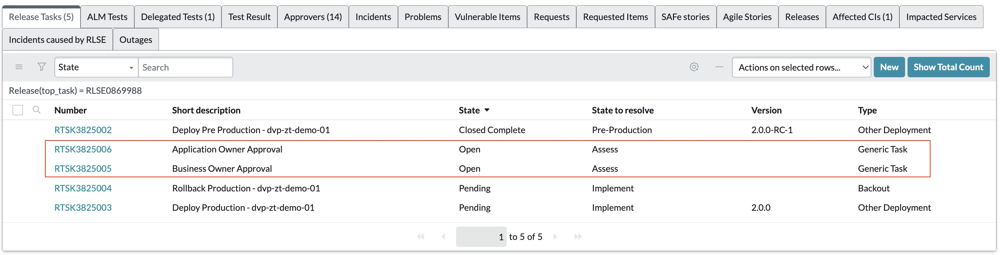

Approving the task in servicenow
To approve the task in servicenow, the user must access the task and click on the 'State' option, select the 'Closed Completed' option.

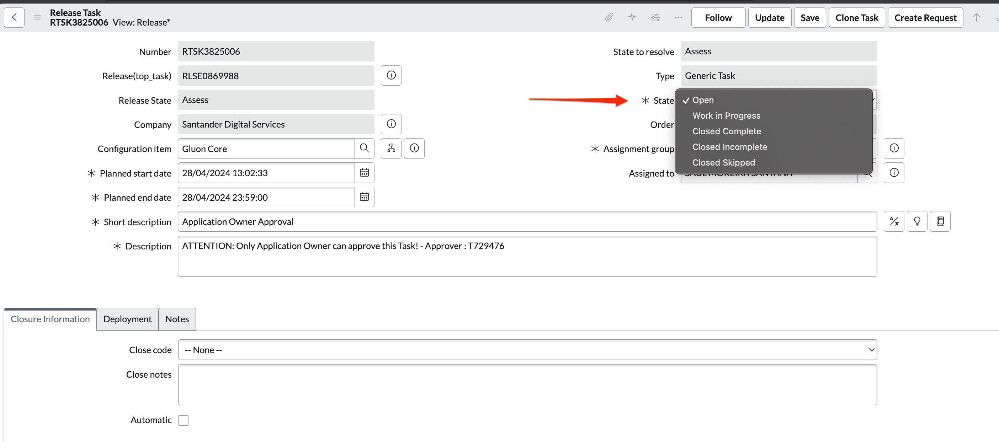

In the 'Closure Information' menu, select 'Successful' for the 'Close Code' option, enter 'Approved' for the 'Closed Notes' option, and finally click 'Save'.

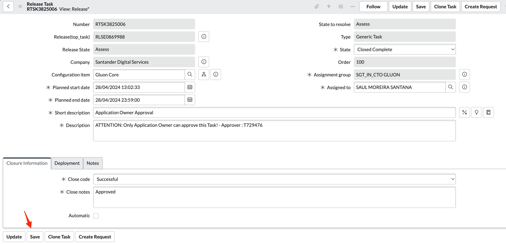

Example of an approved task

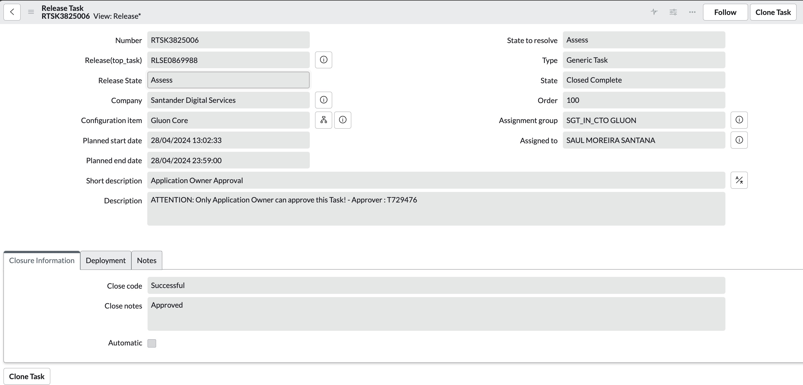

The same process should be followed for the two tasks: Product Owner and Application Owner.

If not approved, the state 'Closed Incomplete' can be selected, and the reason for non-approval should be provided.

???+ warning

    The task must be approved by the specified user assigned to the task. If another user tries to approve the task, the automatic transition process from the Assess phase to the Implement phase in the Gluon portal will not occur.

#### After task approval

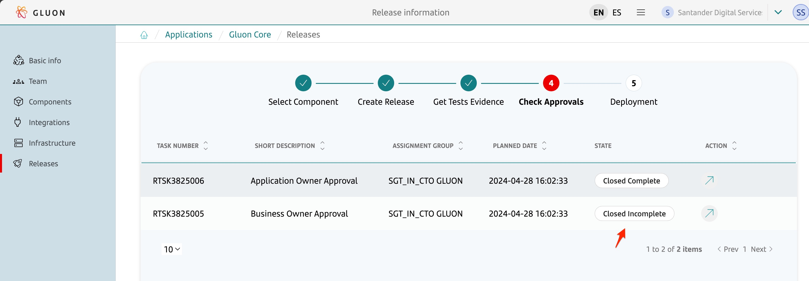

After the tasks are approved in servicenow ITSM, when the user returns to the Gluon portal and accesses the release, the status will be transitioned to the Implementation phase in servicenow ITSM.

### Deployment - Implement

To reach the Deployment phase, it is necessary that all previous phases are successfully completed.

On this screen, it is possible to view the tasks created in servicenow ITSM that represent the deployment of the release in production.

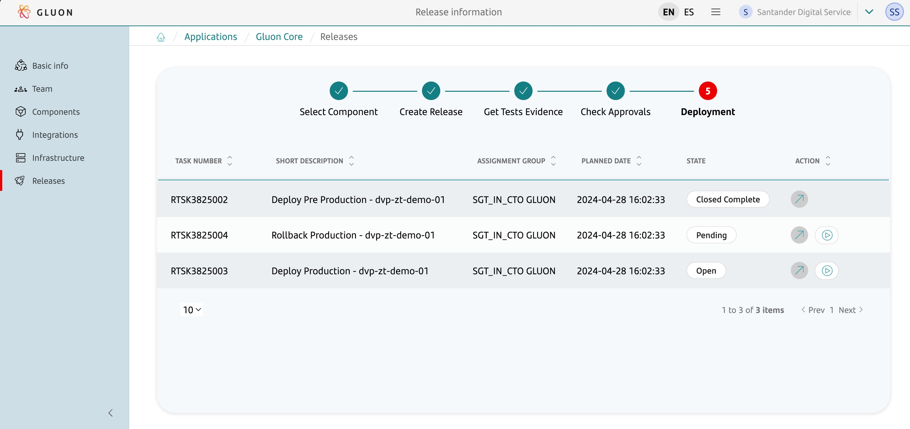

To start the deployment, within the Deployment Window, click the `Run Deploy` button to orchestrate the deployment in GitHub Actions.

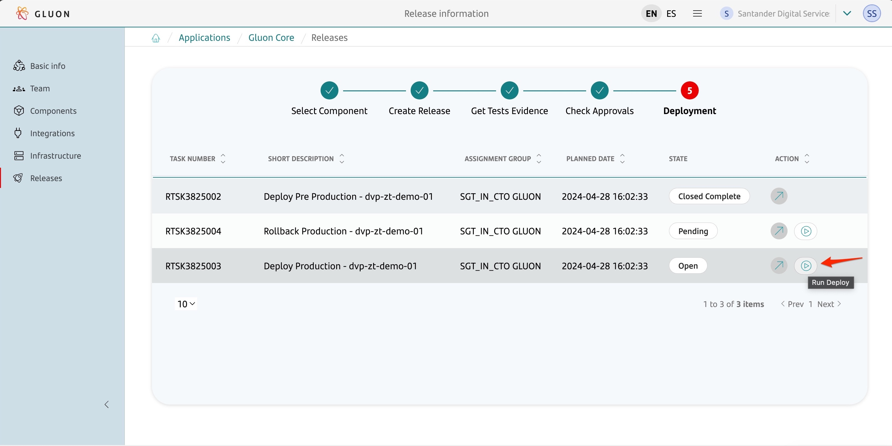

After clicking the button, a call will be made to GitHub to execute the CD pipeline, using the component version to be deployed and the ITSM task number that represents the deployment as parameters.
After a few seconds, the hyperlink icon will be enabled to access the GitHub Actions workflow and monitor the deployment logs through GitHub.

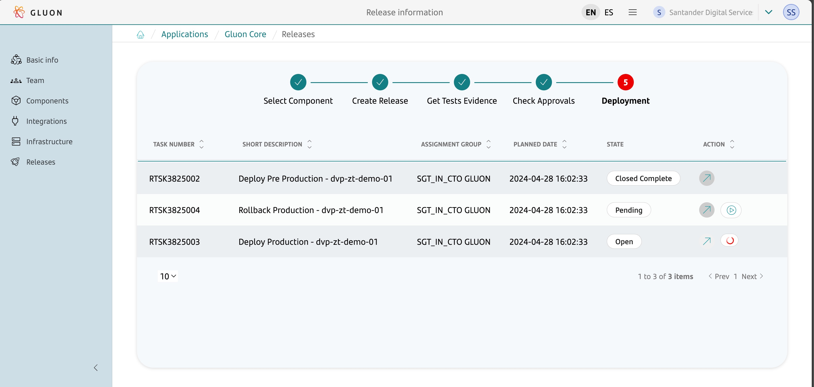

The CD workflow is executed via API through the gluon-deployment-orchestration (bot)

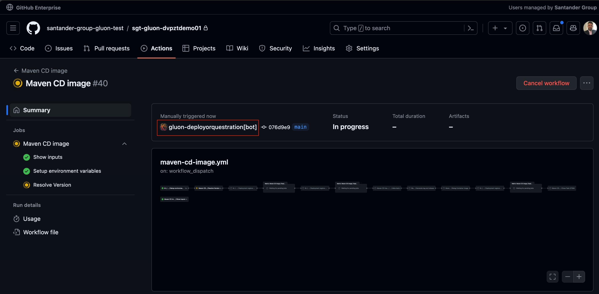

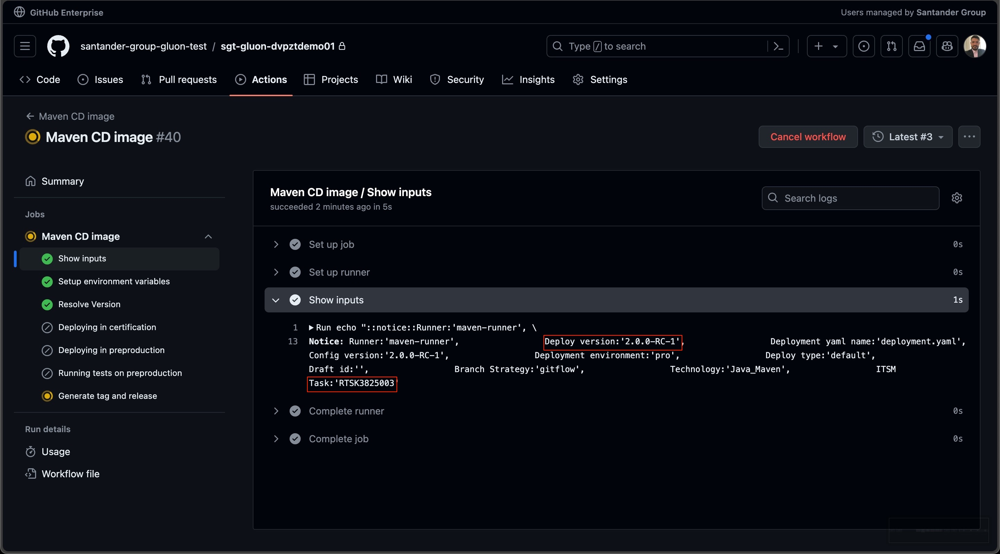

GitHub Step Validate ITSM Task:
In GitHub Actions, the first step before the pipeline deployment is to validate if the ITSM task can be executed. This involves performing some validations to check:

 - if the task is in the correct state
 - if the execution is within the deployment window
 - if the task was created by the service user, among other validations to ensure that the deployment can be done safely.

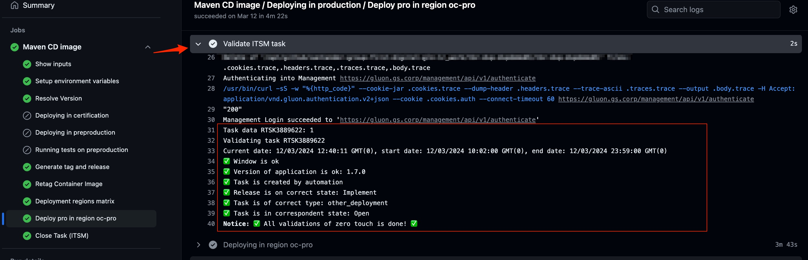

When the deployment is completed successfully, the ITSM task will be closed through the GitHub CD workflow.

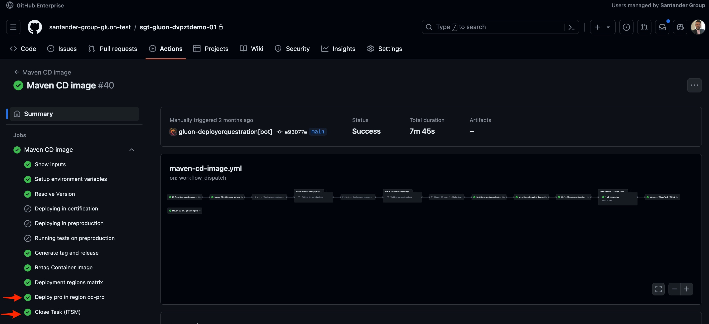

???+ warning "Warning"

    If it is necessary to execute the Rollback, this action should be performed directly in the CD pipeline in GitHub Actions dedicated to the component in question. It is necessary to fill in the parameters related to the previous version and also include the number of the ITSM task that was created automatically by the ZeroTouch process.

    For further guidance, consult the documentation dedicated to each component.

???+ info "Note"
    After the deployment, the tasks are closed with the deployment status.
    The transition of the Release status from Implement to Review is automatically done on D+1.
    The transition of the Release status from Review to Closed should be done by the Change Management/DevOps responsible for each company after the Release review.
