The purpose of this document is to show how to create a release rollback in ServiceNow ITSM and how Gluon Release Management orchestrates the rollback in the Gluon portal.

Before starting the rollback, it is necessary to understand and first read the premises indicated on the page: **Gluon Release Management**

## Introduction to Rollback

The Gluon portal allows the user to create rollbacks in ITSM ServiceNow and orchestrate the rollback in the portal.

To understand how a rollback is promoted between states and how the orchestration process works in the Gluon portal, it is important to know the states of a rollback and how they integrate into its lifecycle.

## Pre-requisites

!!! warning "Note"

    The rollback can only be executed in production environments, so it is not possible to execute rollback in certification or pre-production environments.

For the rollback to be executed, the release must be in the `IMPLEMENT` state and have at least one deploy executed once.

- While the component version is not deployed in the production environment, the rollback will not be enabled.
- The environment state must be `READY`.
- To execute the rollback, the deploy tasks must be closed in the `CLOSED_COMPLETE` state and the backout task must be in the `PENDING` state to be executed.
- It will be possible to request a rollback up to one day `D+1` after the closing of the deployment window of a release.
- It is also possible to perform the rollback when the environment is in the `REQUIRED_ATTENTION` state, in which case there has been a technical error during execution so it is possible to perform the rollback again.

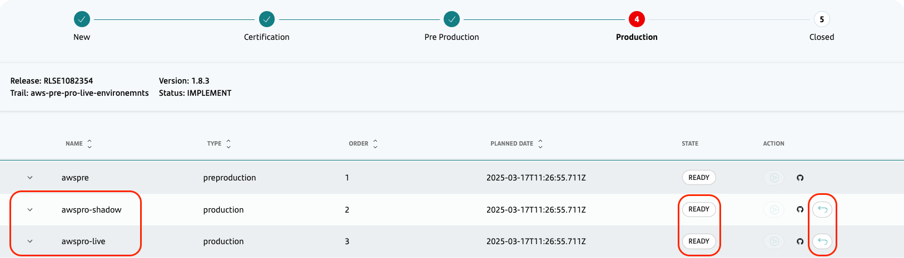

## Rollback Request

It is possible to request a rollback directly through the Gluon portal in the RELEASES section.

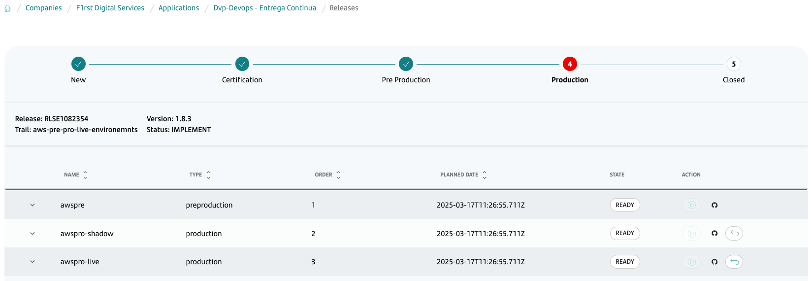

The `BACKOUT` task must be in the `PENDING` status.

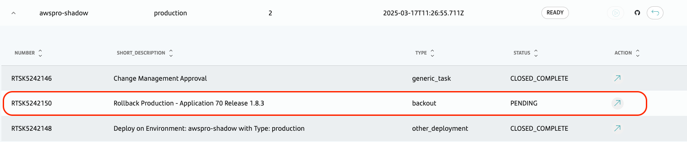

## Rollback Deployment

The deployment process is managed by the Gluon Release Management module, which is responsible for promoting the rollback to the next state when the conditions are met.

The deployment process is the same for all types of production environments.

!!! warning "Note"

    The rollback of all components associated with the environment will be performed, the definition of each component and its version is defined in the OAM.

To deploy the rollback in one of the production environments, click the **Rollback** button in the ACTION column.

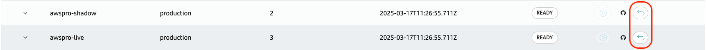

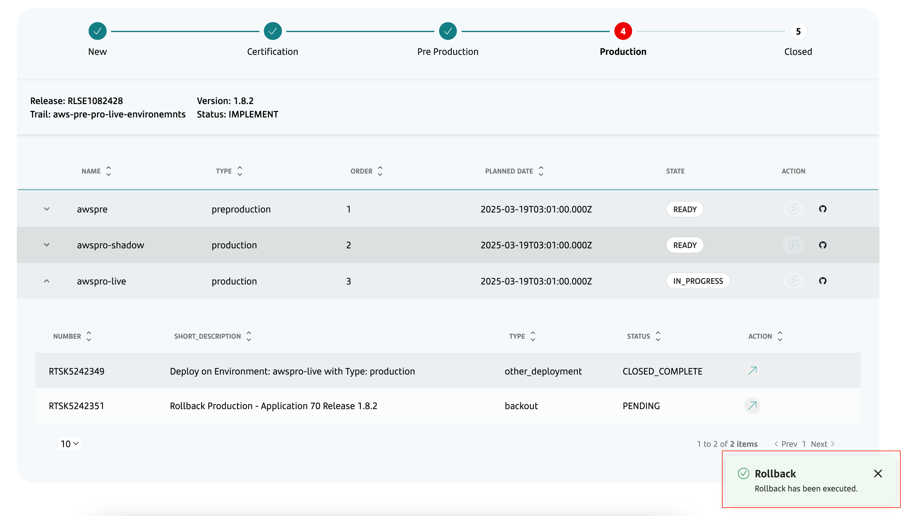

The process calls the rollback workflow that is defined in the Component created in the Gluon portal with the Gluon Application Model Component template.

- By clicking the GitHub button corresponding to the environment name, you will be taken to the corresponding execution.

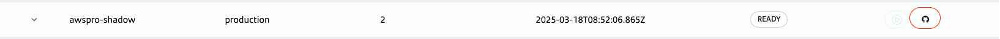

After starting the rollback workflow, the following steps should occur:

- The system retrieves and deploys the `previous version` deployed in the `production environment`.

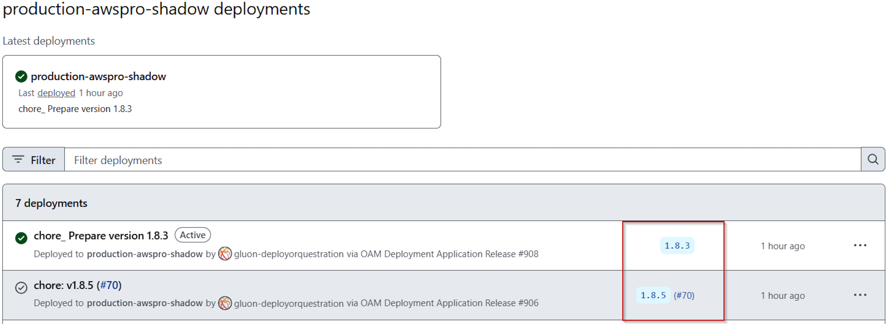

- The system will wait until the deployment is completed.

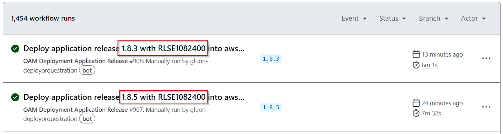

- In the GitHub actions, it is possible to see the `executions`, the `deployments` of that environment, and the `status` of each component.

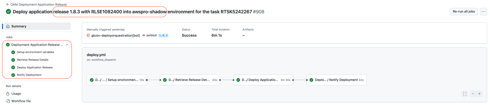

- It is also possible to perform the rollback simultaneously in different production environments.

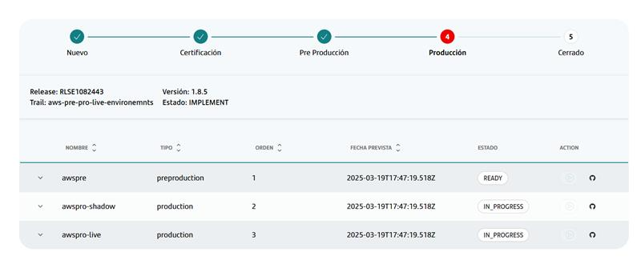

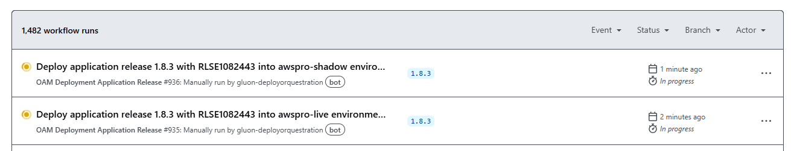

- After finishing the executions in GitHub, the environment that had a rollback executed changes to the `READY` state and it will no longer be possible to execute deploy or rollback in this environment.

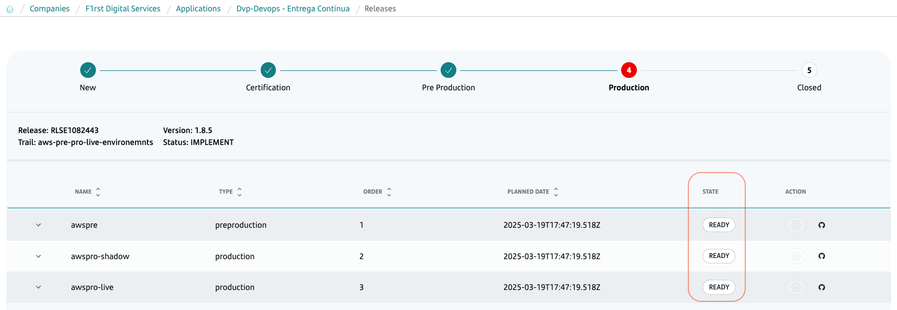

- In ServiceNow ITSM, the details of the components, their versions, and the task details are also described.

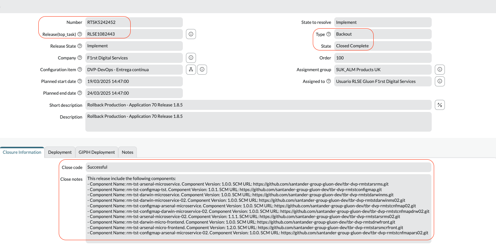

## References

- [Deployment With Release Management](./../zero-touch/deploy-with-release-management.md): To learn more about the release process, you can visit the [Gluon Release Management](./../zero-touch/deploy-with-release-management.md) page.
- [Deployment Workflows](./../oam/oam-workflows.md): To learn more about the deployment process, you can visit the [Gluon Application Model](./../oam/oam-workflows.md) page.
