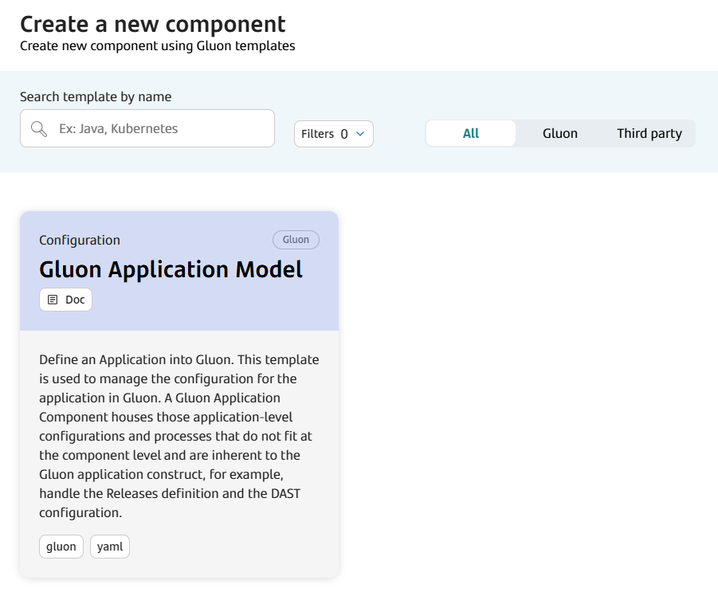
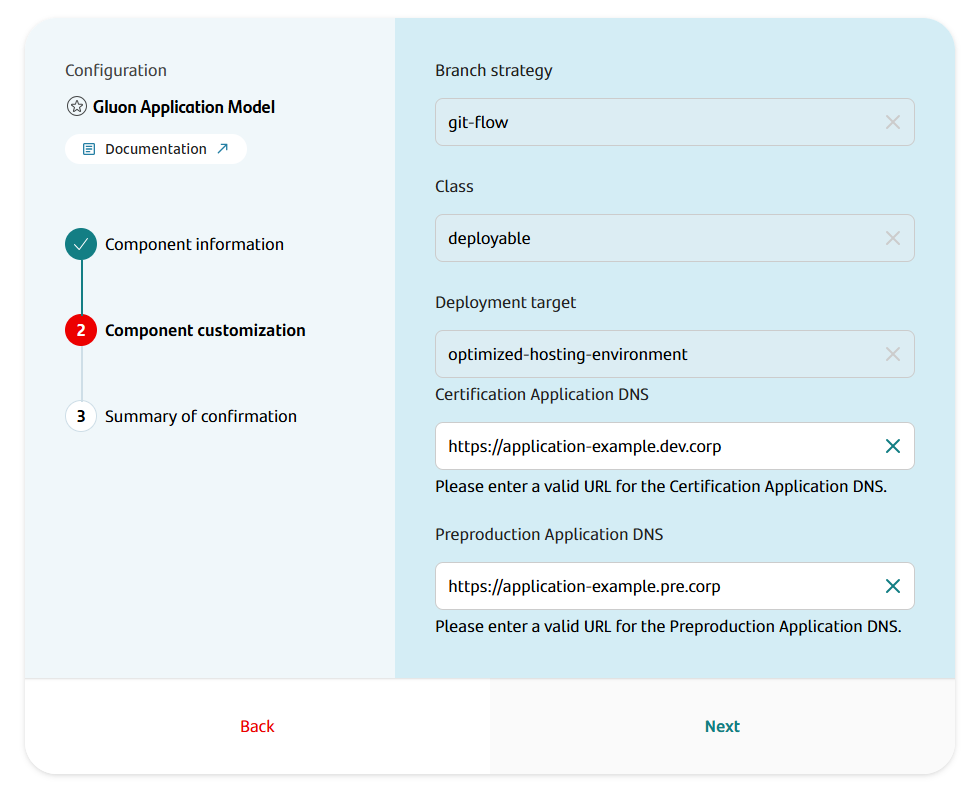
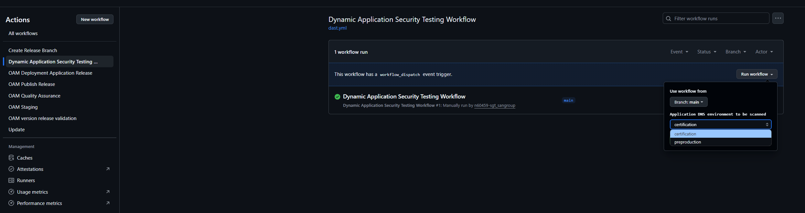
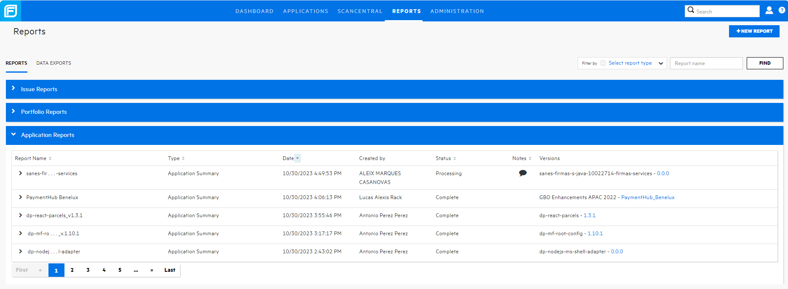
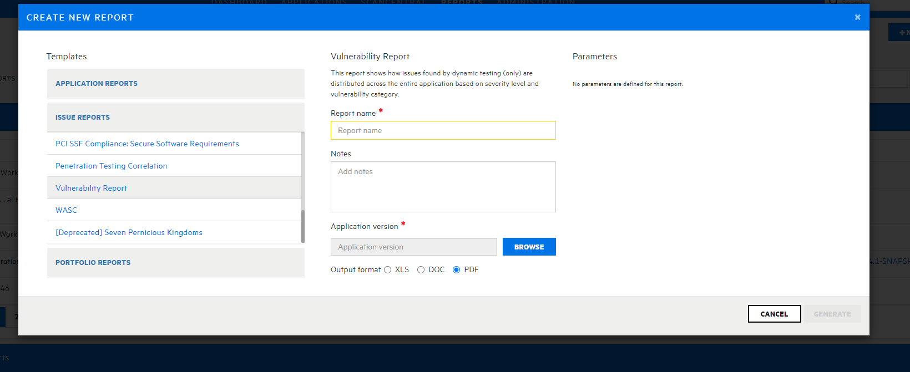

# DAST Service

## Introduction

Dynamic Application Security Test (DAST) is a testing methodology to scan application while they are running
to identify potential security vulnerabilities that allow for attacks like SQL injections, Cross-Site Scripting (XSS),
and more. The DAST tools allow applications to be scanned based on known attack vectors. In addition to finding the
vulnerabilities, these tools will also provide guidance on remediation.

## Description

- **DAST scans** Dynamic scans performed to the DNS of a deployed application.

- **Centralized Platform** Web platform for centralization of results and management using Fortify SSC.

- **Reporting** Reporting module with multiple templates according to detailed need.

## Requirements

- Create a OAM component in your application from Gluon Portal.
- Configure an URL for preproduction or development environment.
- Open the firewall rules between the Gluon DAST VM's runners and your application.

## Firewall rules

If the scans finished with an error that configured DNS is not available, it may be
because firewall rules have not been opened from the runners where the DAST tool (WebInspect)
and the application to be scanned. DAST scans are executed on non-ephemeral
VMs (runners over virtual machine).

### Firewall Rules IP List

Note: In order to open the firewall rules, please open a ticket in Service Now.

Source ranges of the DAST runners:

| Services            | Current Services IP  |
|---------------------|--------------------------|
| Global DAST runners   | 180.156.113.146 |

## Perform a DAST Scan

The DAST scan should be executed to the main URL of the web application. For perform this
configuration is required to create a new component under the technical application called
[Gluon Application Model (OAM)](../../../ci-cd/cd/cd-rm/gluon-application-model-oam/index.md)

Gluon performs the onboarding of OAM components automatically into the S-SDLC tools. The DAST global service
platform is Fortify SSC, you can access [here](https://ssc.santander.fortifyhosted.com){:target="_blank"}

When configuring a new Gluon OAM component, the user should configure the DNS of
the application at the specific environment (development or pre-production).
This generates a configuration file "dast.yml" at .gluon/security at the repository with the
DAST configuration.

The execution of a DAST scan can be performed on demand from the Gtihub.com repository created
when the component OAM is created:

- Access the Github.com "Actions" screen of the OAM component repository.

- Select the workflow with the name "Dynamic Application Security Testing Workflow".

- Click on the "Run Workflow" button.

- Select the application environment to perform the test, the workflow read the configuration from for the specific environment and
launch the scan.

- When the scan is finished the results are reported to Fortify SSC under the OAM repository name
 and by default to the version "0.0.0".

## Create a report for DAST scans

The "Reporting" module allows the generation and management of reports on the applications/versions
on which the user has permissions.
Within the Fortify reporting module there are multiple templates already predefined that allow to obtain reports with great detail
classifying by severity, security frameworks (OWASP, NIST, etc.) or policies such as PCI-DSS, etc.

- Access the Fortify reports module and click on "+ NEW REPORT".

- For Webinspect analysis (DAST) select on the left side as Template, within "Issue reports" the template "Vulnerability report”.

At this screen set the name report name, indicate some notes and select the application
and the version to obtain the report. The parameters can leave as default because include
the classification of weaknesses according to different standards.

The Fortify SSC "vulnerability report template" provides a report with this information:

- Summary: Brief summary indicates scan metrics and vulnerabilities found without going into detail.
- Detailed: Report that reviews in detail the vulnerabilities found:
- Vulnerable URL.
- Description of the error.
- Recommended solution.
- Request sent.
- Response received.
- CWE associated with vulnerability.

