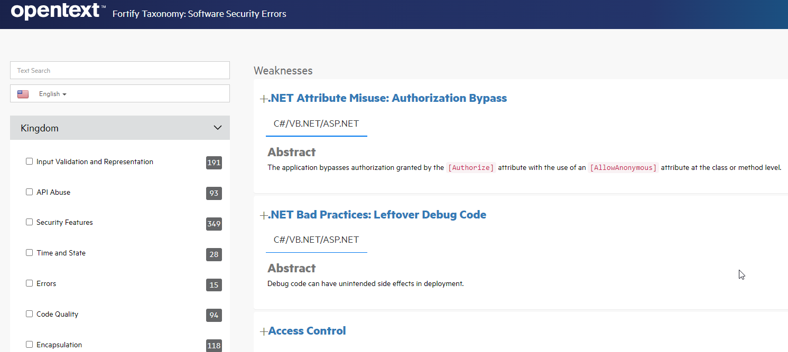

# SAST Service  

## Introduction

Static Application Security Testing (SAST) Testing has to be done during the Construction and Testing phase. Static Application
Security Testing (SAST) is a testing methodology for analyzing proprietary source code for security vulnerabilities.
The type of analysis that is performed is called "white box analysis". Once a SAST scan has been run on an application, it is imperative
to manage the vulnerabilities detected. Critical and high vulnerabilities must be corrected as soon as possible and always before moving
to a productive environment.

## Description

Actual capabilities:

- **SAST scans** Static scans of the source code based on a set of different analyzers (static analysis, metrics, duplicate code detection).

- **Technologies** Multi-technology scanning engines.

- **Centralized Platform** Web platform for centralization of results and management using Fortify SSC.

- **Reporting** Reporting module with multiple templates according to required detailed.

## Fortify ScanCentral SAST

Fortify SCA is Opentext on-premises static analysis engine. It is a multi-technology engine. Scancentral SAST is the specific product that allows to centralize SAST scan into continuous integration lifecycle.

Fortify SAST scan standard procedure are:

- **Translate** Fortify first translates the found sources into an intermediate format understood by the Fortify software.

- **Scan** Scan translated code in a centralized infraestructure

- **Report to Fortify SSC** Generates an output file with the scan results (FPR format) and uploaded to the Fortify SSC

## SAST Fortify Workflow steps

SAST Security Workflow steps description:

- **Onboarding** Check if the component and the version has been onboarded on Fortify SSC. If the version is not found under the software component it will be created.

- **Check out code** Check out the code for being scanned by Scancentral SAST Client.

- **Download Fortify ScanCentral Client** Download Fortify ScanCentral Client at the execution runner.

- **Set versions using action runner OHE** This steps let the configuration in execution of different tools required for the execution as Java, Python, Go, NPM, Groovy, etc

- **Perform SAST Scan** Execute the ScanCentral SAST client. This client package all the software and send to the Fortify ScanCentral infraestructure to be translated and scanned.

- **Security Gate** After the scan execution a Security Gate check the results for let or block the deploy of the software component.

## Actual Fortify fully supported technologies

| Language                 | Versions                               |
|--------------------------|----------------------------------------|
| .NET Core                | 5.0, 6.0, 7.0, 8.0                     |
| .NET Framework           | 2.0 - 4.8                              |
| Apex                     | 55 , 56, 57, 58                        |
| Classic ASP              | 2.0, 3.0                               |
| ColdFusion               | 8, 9, 10                               |
| Dockerfiles              | Any                                    |
| Go                       | 1.12 - 1.19                            |
| HTML                     | 5 or earlier                           |
| Java (including Android) | 7, 8, 9, 10, 11, 12, 13, 14, 17        |
| JavaScript               | ECMAScript 2015–2022                   |
| JSON                     | ECMA-404                               |
| Kotlin                   | 1.3, 1.4, 1.5, 1.6, 1.7, 1.8           |
| PHP                      | 7.3, 7.4, 8.0, 8.1, 8.2                |
| PL/SQL                   | 8.1.6                                  |
| Python                   | 2.6, 2.7, 3.0 - 3.12  *                |
| Ruby                     | 1.9.3                                  |
| T-SQL                    | SQL Server 2005, 2008, 2012            |
| TypeScript               | 2.8, 3.x, 4.x, 5.0                     |
| Visual Basic             | 6.0                                    |
| XML                      | 1.0                                    |
| YAML                     | 1.2                                    |
| HCL                      | 2.0                                    |

## Fortify Vulnerabilities Categories

The vulnerabilities for Fortify SAST are published by the product into Fortify Taxonomy. Access [here](https://vulncat.fortify.com/en/weakness){:target="_blank"}

You can search by kingdom or category or directly by the category name:

## Onboarding

Gluon performs the onboarding of software components automatically into the S-SDLC tools.

The S-SDLC global services platform is Fortify SSC, you can access [here](https://ssc.santander.fortifyhosted.com){:target="_blank"}

## Red Button

In case of instability in the platform, the “Red Button” will automatically evaluate the status of the platform on each execution which may result in partial or total lost of service.

- If there is a partial lost of service in the SSC platform, scans will continue to be performed without using its sensors.
Instead, they will be carried out via SCA (work in runner) for code vulnerability scanning (SAST). The service remains active.  
- In the event of a total lost of service, the tool is disabled and will not be blocking.

> **⚠ Warning**
> In case of platform congestion, traffic from entire organizations can be redirected to perform scans using SCA (work in runner) for code vulnerability scanning (SAST), reducing the load on the platform’s sensors.
