# Push Protection

Push protection is a feature in GitHub designed to prevent sensitive information, such as secrets or tokens, from being pushed to your repository.

Push protection proactively scans your code for secrets during the push process and blocks the push if any are detected.

The **Security Management Team is the only team with permission to bypass these controls**. There is one team per entity.

## How Push Protection works

When this functionality is enabled, it blocks any push that contains secrets matching a pattern. When it happens, it generates a new alert in the security dashboard, and the user also receives a notification explaining why the push has been blocked.

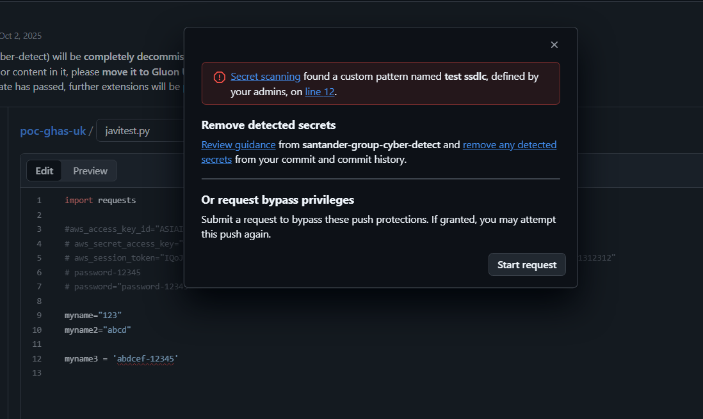

Once push protection is enabled, users are prompted to either remove the detected secret or initiate a bypass request. The process for requesting a bypass is detailed in the following section.

### Limitations

It is important to be aware of certain limitations:

- This feature only works with some predefined patterns. You can review the patterns [clicking here](https://docs.github.com/en/code-security/secret-scanning/introduction/supported-secret-scanning-patterns).

- We can add our own custom patterns to that list. A process to define new patterns needs to be created.

## How to create a bypass being Developer or Technical Lead

When the notification window appears indicating that your push was blocked by secret scanning, it will display details about the detected issue and the available options. To request bypass privileges, click the "Start request" button.

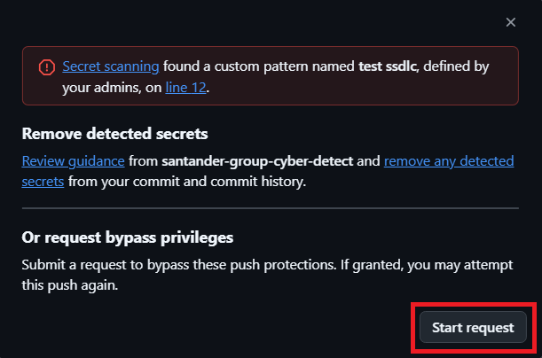

Common reasons for requesting a bypass include testing purposes, false positives (where the detected string is not actually a secret), or cases where the detected secret is real but will be addressed later.

You must select an option and provide a comment explaining the reason for your bypass request. Afterward, click "Submit request" to complete the process.

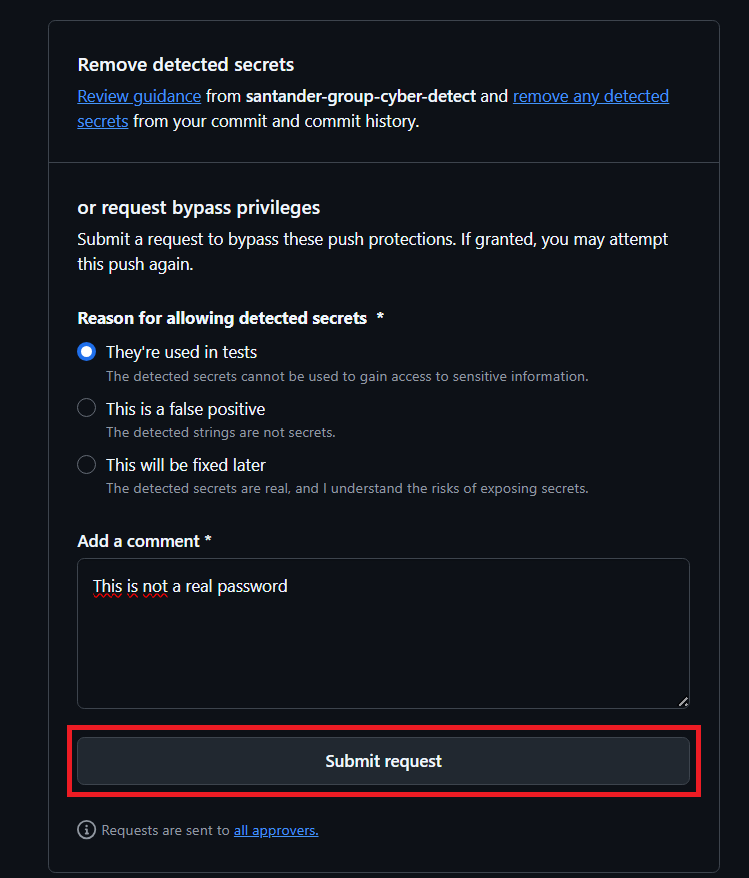

!!! warning
     If the detected secret is real ("This will be fixed later" option), you must include the corresponding waiver ticket number in the comment.

    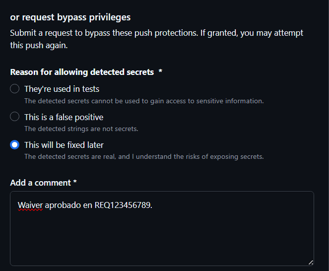

Eventually, your request will be sent to the Security Exception Management Team for review. Once you have submitted this request, the petition would be in queue and this request can be always cancelled.

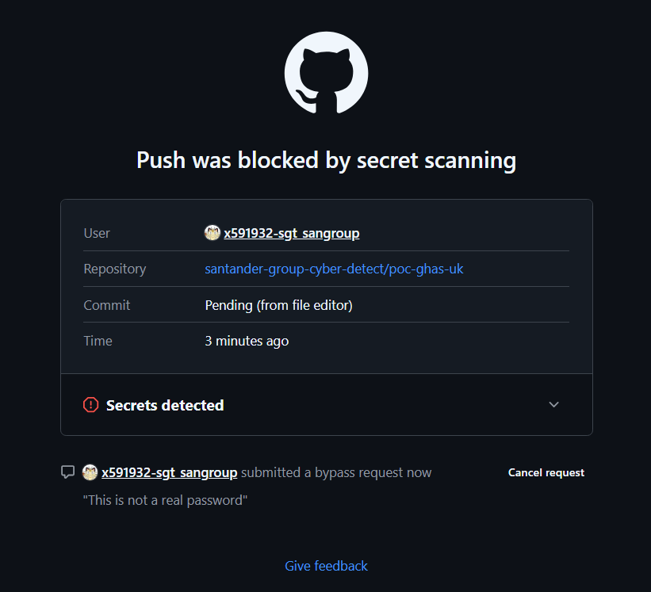

When the bypass is approved or denied, the user will receive an email notification confirming the approval. You can get more information by clicking "View request details".

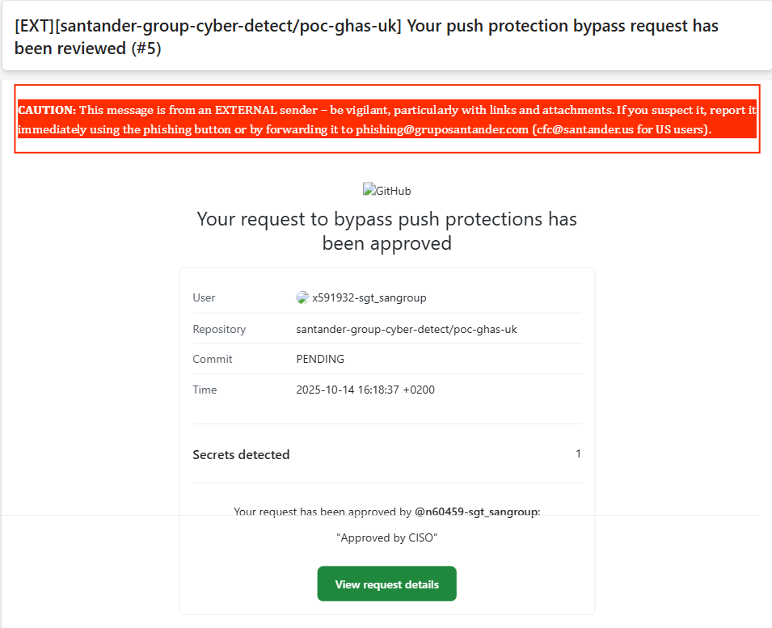

Figure 1: *Email notification received when the bypass request is approved*

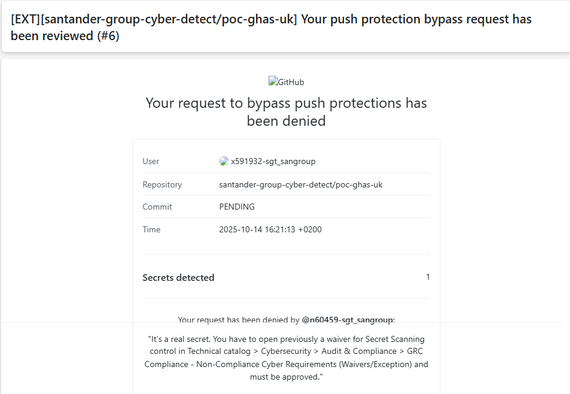

Figure 2: *Email notification received when the bypass request is denied*

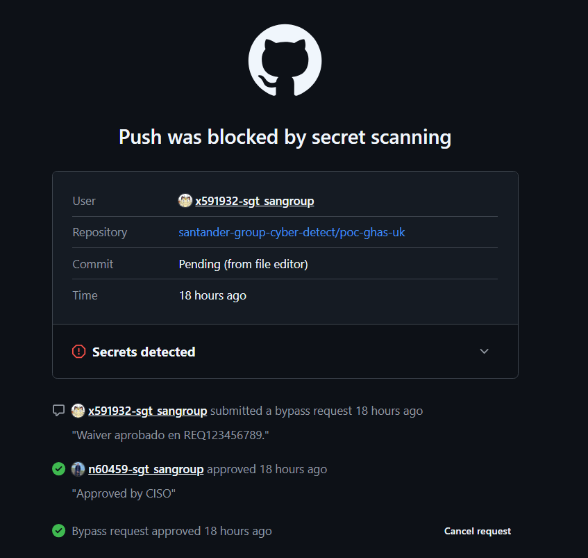

Figure 3: *Details of a reviewed request*

If your request is approved, you can upload the file containing the bypassed secret by making another commit and pushing it to the repository.

## How to Approve a Bypass as CISO (part of SEMT)

At organization level its possible to have an overview from security of all the request for push protection bypass, secret scanning alert dismissal and code scanning alert dismissal.

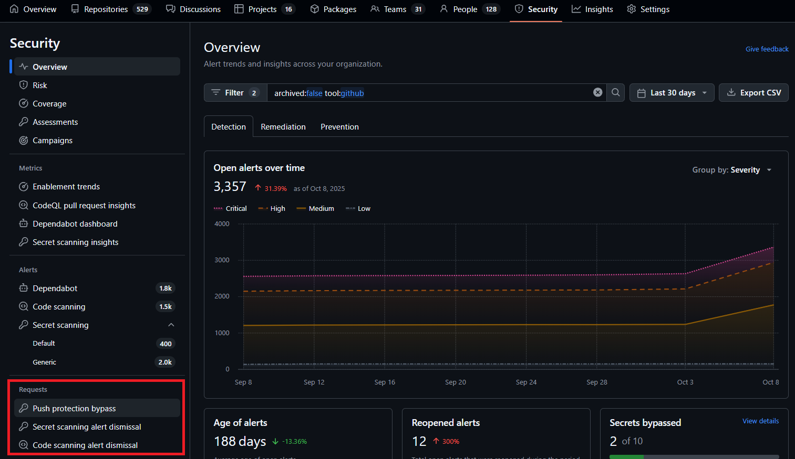

Entering into push protection bypass, it is possible to have an overview across your organization, as per the picture:

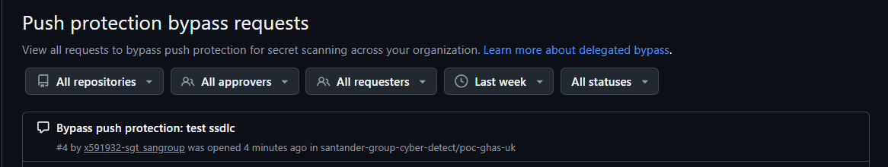

Once you have accessed a specific request, review the comments provided by users as reference, and then choose to either approve or decline the request. There are three alternatives of bypass request:

- They're used in tests.

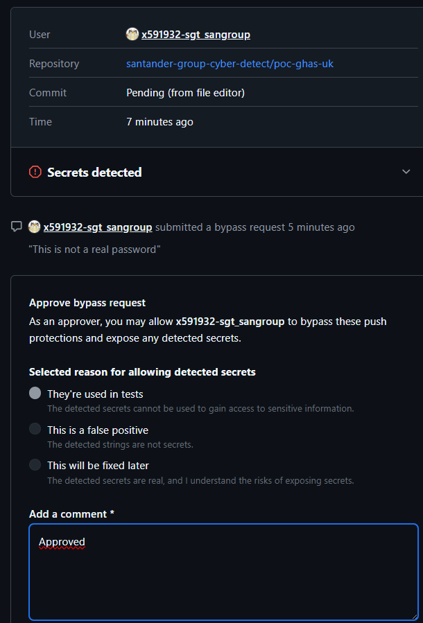

- This is a false positive.

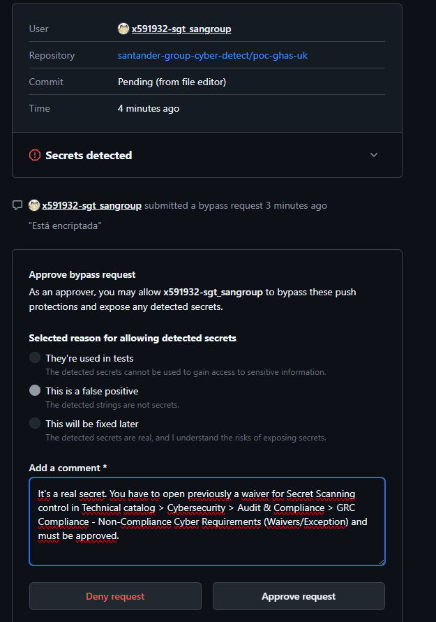

- This will be fixed later: In this case, the requester must attach an approved waiver ticket, and the CISO is required to review it.

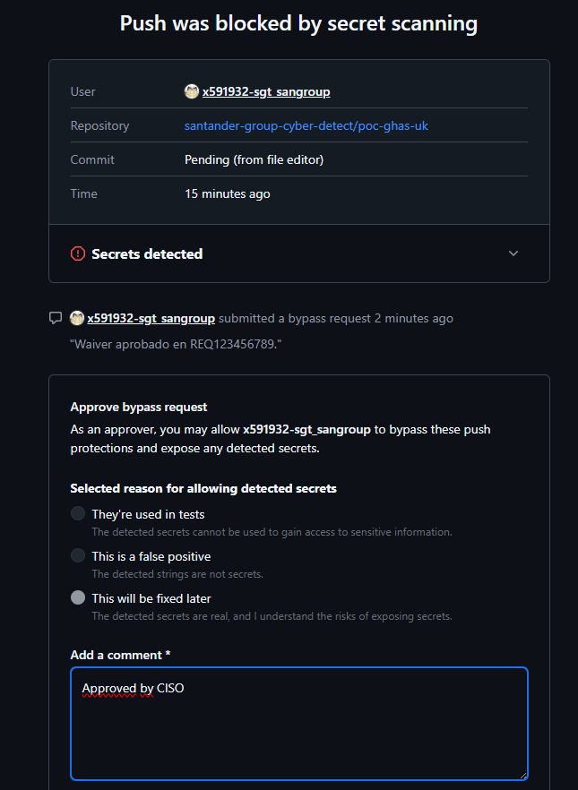
