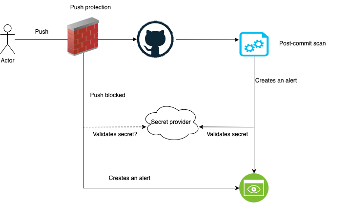

# Overview

Santander has implemented a secret protection mechanism to prevent the exposure of sensitive information within its repositories. This new procedure is part of GitHub Advanced Security.

Our configuration applies Secret Scanning and Push protection to all repositories.

## Push Protection

Push protection is a feature in GitHub designed to prevent sensitive information, such as secrets or tokens, from being pushed to your repository.

Push protection proactively scans your code for secrets during the push process and blocks the push if any are detected.

The **Security Management Team is the only team with permission to bypass these controls**. There is one team per entity. To view more information, please review the [push protection documentation](./push-protection.md).

This new feature applies only to new secrets.

