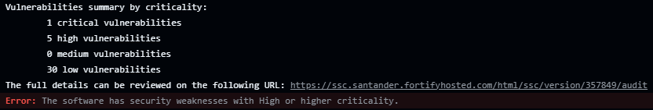
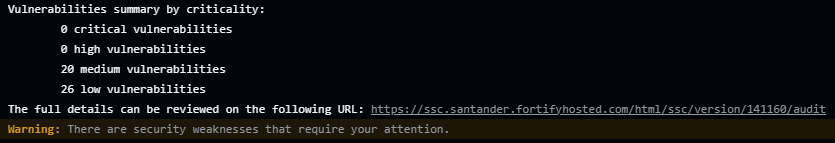
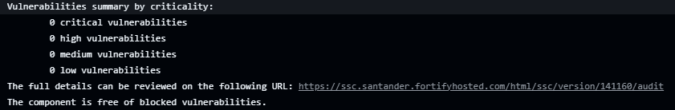
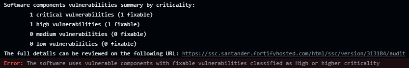
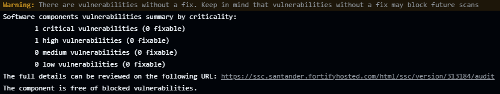
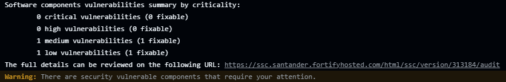
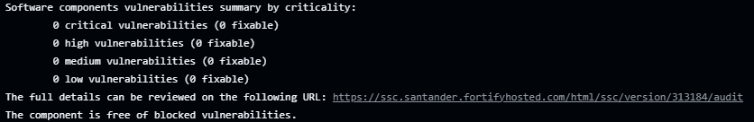
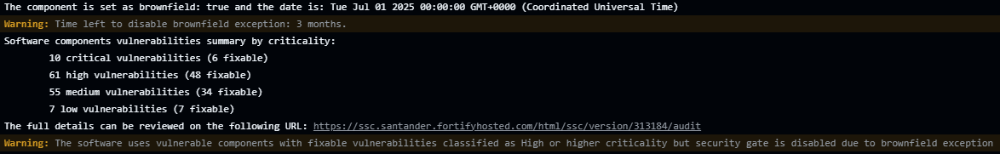

# Security Gate

At the end of the scan, the Security Gate evaluates the results to decide whether the deployment of the software component should be allowed or blocked, depending on the use case.

## SAST/DAST

For SAST and DAST scans, the following criteria are applied:

- **Critical or High Vulnerabilities**: If the component has Critical or High vulnerabilities, it will be blocked.

  

- **Medium or Low Vulnerabilities**: If the component only has Medium or Low vulnerabilities, the deployment is not blocked.

  

- **No Vulnerabilities**: If no vulnerabilities are detected, the deployment is not blocked.

  

## SCA

In the context of SCA, the security gate takes into account the following factors:

- **Critical or High Vulnerabilities**: If the component has Critical or High vulnerabilities, the decision depends on whether fixes are available for the vulnerabilities.

    - **Fix Available**: If any vulnerability has a fix, the pipeline will block execution, and the issue must be resolved before proceeding.

    

    - **No Fix Available**: If none of the vulnerabilities have a fix, the pipeline will not block, allowing progress until solutions become available.

    

- **Medium or Low Vulnerabilities**: If the component only has Medium or Low vulnerabilities, the deployment is not blocked.

  

- **No Vulnerabilities**: If no vulnerabilities are detected, the deployment is not blocked.

  
  
- **Brownfield**: If it is a Brownfield component and meets the exception conditions, a warning is generated instead of blocking the deployment. Check [Brownfield](../brownfield/brownfield.md) documentation.

  

> **⚠ Warning**
>When a scan detects at least one vulnerability without a fix, a warning will be displayed in the log indicating its detection and possible future blocking once fix is published.
