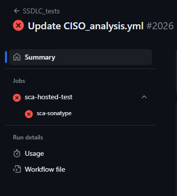
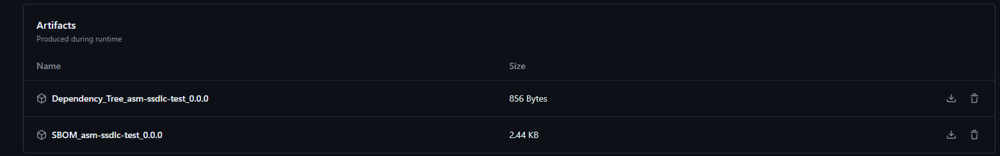

# SCA Service  

## Introduction

Software Composition Analysis (SCA) is a testing methodology to analyze Third-party components to find known security vulnerabilities.
The analysis of dependencies and third-party libraries is present in both the design and development phases of the application.
When developing an application, it is necessary to check if the components or dependencies that are going to be used in the development
are authorized in the centralized repository. If this is not the case, authorization must be requested in order to use them in the application.

## Description

SCA (Software Composition Analysis) is included into development and testing phases at S-SDLC Sonatype is a tool focused on measuring and obtaining
weaknesses in the software components used in projects. This tool scans the libraries used in the development of the application based on frameworks
such as NIST, CVE, CWE, OWASP and CVSS.

There are different project technologies/package manager that can be analyzed:

- Maven, Gradle and Ivy projects
- NPM, YARN
- Nuger
- Rubyhems, Bundler
- Go Modules
- Pypi, Poedtru, pipenv
- Yum, Fedora EPEL repo
- Conan
- Composer, Drupal
- CocoaPods
- Conda
- Cran
- Charge
- Swift

## Sonatype and Fortify SSC

Sonatype is integrated with Fortify SSC for being used as SCA scans results centralizer.

## SCA Sonatype Workflow steps

SCA Security Workflow steps description:

- **Onboarding** Check if the component and the version has been onboarded on Fortify SSC and Sonatype IQ Server. If the version is not found under the software component it will be created.

- **Check out code** Check out the code for being scanned by Sonatype CLI.

- **Set versions using action runner OHE** This steps let the configuration in execution of different tools required for the execution as Java, Python, Go, NPM, Groovy, etc

- **Build** Build the software component with the build command specified as input.

- **Download Sonatype CLI** Download Sonatype CLI Client at the execution runner.

- **Perform SCA Scan** Execute the Sonatype CLI Client. This client identify all the components used at the software component and looking
for vulnerabilities into Sonatype vulnerabilities database (this database use multiple source as NIST, OWASP, own database, etc)

- **Synchronize results to Fortify SSC** Execute the Sonatype CLI Client. This client identify all the components used at the software component.

- **Security Gate** After the scan execution a Security Gate check the results for let or block the deploy of the software component. Non-fixable vulnerabilities in SCA.
If any vulnerability has a fix, the pipeline will block the execution, and the issue must be resolved before proceeding.  
If none of the vulnerabilities have a fix, the pipeline will not block, allowing progress until solutions become available. If it is a brownfield component, please review the [brownfield documentation](../brownfield/brownfield.md).

> **⚠ Warning**  
> Once the component is activated as a Brownfield component, Security Gate will be ready to handle exceptions. This period will be a 6-month long. **It just apply to SCA analysis**

## How can Sonatype Analyzer works?

You can access to the datail of the scans performed by technology [here](https://help.sonatype.com/en/analysis.html){:target="_blank"}

## SCA Workflows output

- **Dependency Tree** In Maven and NPM projects you can download the dependency tree scanned as a Github artifact on the workflow execution summary (JSON file).

- **SBOM** SCA workflow generates the SBOM of the scanned application in CycloneDX format as a Github artifact on the workflow execution summary (JSON file).

If access to the summary of the Security Workflow execution:

You can access to the artifacts session to download the artifacts:

## Onboarding

Gluon performs the onboarding of software components automatically into the S-SDLC tools.

The S-SDLC global services platform is Fortify SSC, you can access [here](https://ssc.santander.fortifyhosted.com){:target="_blank"}

## Red Button

In case of instability in the platform, the “Red Button” will automatically evaluate the status of the platform on each execution which may result in partial or total lost of service.

- In the event of a lost of service, the tool is disabled and will not be blocking.
