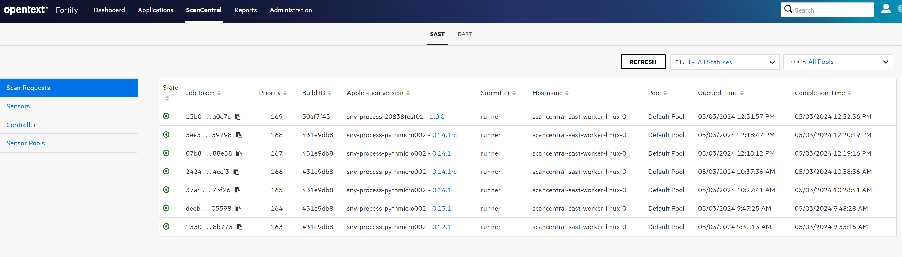
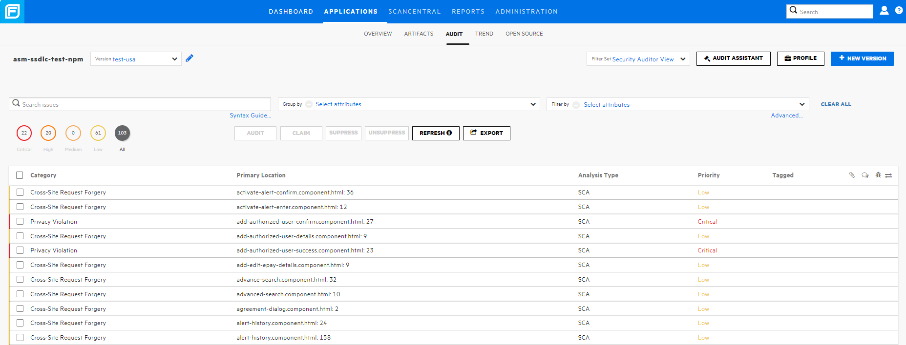
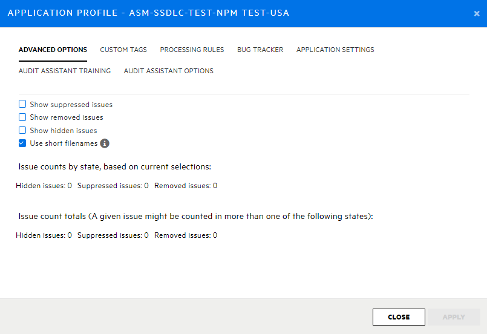
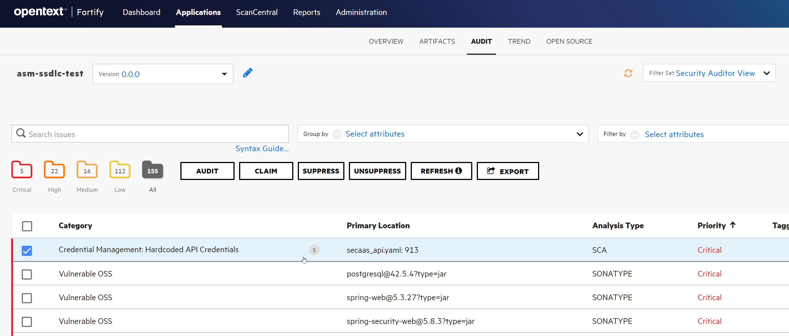
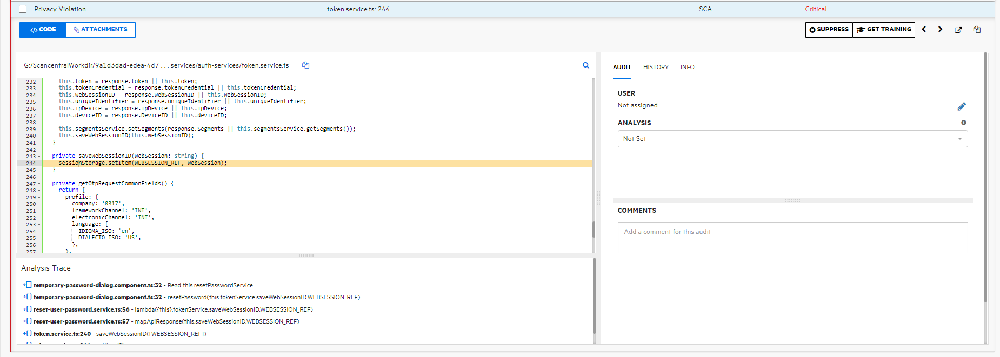
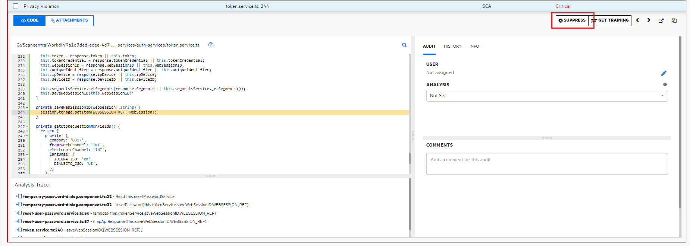
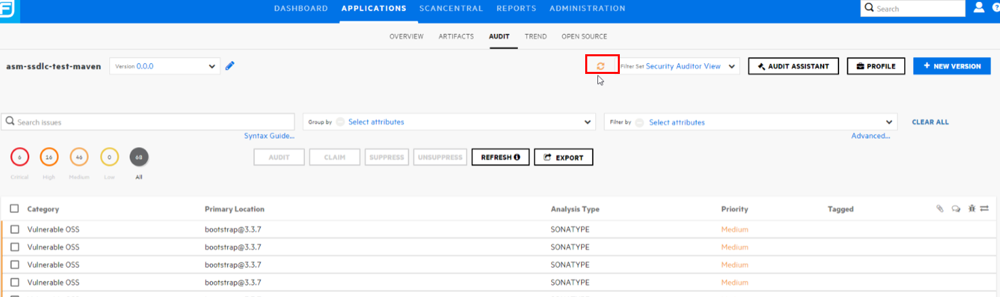
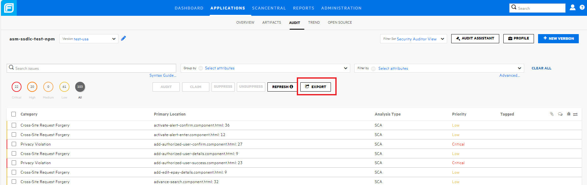

# Use of Fortify SSC Platform

Fortify SSC Platform is the centralized platform for SSDLC Services (SAST, SCA and DAST) issues management.

## View results SAST, DAST and SCA at Fortify SSC

You can access to Fortify SSC platform [here](https://ssc.santander.fortifyhosted.com){:target="_blank"}

Our corporate users have access to the corresponding software components, you can access to the ScanCentral module for check the scan status.

## View and triage results in the Fortify SSC portal

The Fortify SSC portal is organized into 5 modules:

- **Dashboard** Dashboard of those applications/versions on which the user has permissions.
- **ScanCentral** Centralizing scanning module when using the Scancentral.
- **Applications** Visualization module and triage of the scan results. In the Applications module we can access a list
of all the components and versions on which the logged in user has access.
- **Reports** Module for generating reports of analyses.
- **Administration** Module for configuration and visualization of parameters and attributes.

Once the scans has finished the results are uploaded to the Fortify SSC platform where users can visualize the results in the Applications module.

## Audit screen

In the Applications module we can access a list of all the software components with user permissions.
If click in specific component you can list all the versions under this software component, to access to
the audit screen click on the specific version name.

The vulnerabilities of SAST, SCA and DAST can be reviewed in the audit screen (Can be filtered with the combo "Filter by".)

- The SAST issues has the analysis type attribute as "SCA"
- The SCA issues has the analysis type attribute as "SONATYPE"
- The DAST issues has the analysis type attribute as "Webinspect"

In the Audit screen we can check the status of the active issues on all the scans performed on the specific version (the weaknesses already corrected are removed automatically)

At the top it is possible to modify the version without having to return to the application list screen. At the top we can also group/filter the weaknesses by different criteria through the "Group by/Filter by" combo.

By using "Search Issues" field it's possible to search by severity, if the issues are new, if are deleted, if are false positives, etc. In the following links you can see more detailed information and examples of search queries.

- [Instructions on using search queries](https://www.microfocus.com/documentation/fortify-software-security-center/2010/SSC_Help_20.1.0/Content/SSC_UG/Search_Issues.htm){:target="_blank"}
- [Search modifiers](https://www.microfocus.com/documentation/fortify-software-security-center/2010/SSC_Help_20.1.0/Content/SSC_UG/SearchModifiers.htm){:target="_blank"}
- [Examples of using search queries](https://www.microfocus.com/documentation/fortify-software-security-center/2010/SSC_Help_20.1.0/Content/SSC_UG/SearchExamples.htm){:target="_blank"}

In order to identify which are the new issues, corrected, reintroduced, by severity with respect to the previous scans we can use the "search queries" of Fortify:

- New: New compared to the previous scan on the same version.
- Updated: remain with respect to the previous scan
- Removed: removed from previous scan
- Reintroduced: issues that were in some of all the analyses carried out on the application and that have been reintroduced.

In order to visualize the corrected issues or marked as false positives it is necessary to have the option of viewing eliminated weaknesses / false positives active.
With the profile button we can indicate if we want to see the eliminated issues / false positives in the default Audit screen:

- If the "Show suppressed issues" option is activated, we will see all the issues, including false positives that we have marked in this version or in previous versions as they are "spreading" between the versions.

- If the "Show removed issues" option is activated, we will see all the issues + the issues that have been eliminated when corrected or because they have been deleted from the scanned code.

Issues marked as false positives are marked with the "S" symbol and weaknesses eliminated from previous analyses (e.g. corrected) are marked with the "R" symbol in the general list of weaknesses:

If we click on specific issue  we can check the detail. In the left area we can see the code where the issue occurs.
In the module "Analysis trace " where we can see the detail of the trace of the vulnerability, the entire path from where the issue starts to where the issue finally becomes effective.

## False positives

#### Who can mute/flag false positives?

Only users in the 'Security management exception' team can flag false positives for all types of vulnerabilities. If the "Suppress" button in the Fortify SSC interface is disabled, it means that the user is not in 'Security management exception' team.

#### What should I do if someone needs to belong to the 'Security management exception' team?

If someone needs to be part of this group, please contact your CISO.

#### How to do it?

Within the detail panel of the weakness is the "Suppress" button.
With this button, users in the appropriate team can set the selected vulnerabilities as false positives, preventing them from appearing on the audit screen and in future scans/reports on the same application.
This operation requires a technical justification.

!!! warning "False positives"
    The mark of false positives must be done in the last version of each software component..

!!! warning "Audit changes"
    When changes of the issues status at audit screen are performed (for example, mark a new false positive) it's recommended confirm this changes using the orange arrows in the right upper zone at Fortify SSC audit screen.

## Reporting module

!!! note "Sonatype SCA issues report capabilities"
    This report module only generate reports for SAST and DAST issues. If you require reporting from SCA scan (Sonatype issues) , CSV format is required

The "Reporting" module allows the generation and management of reports on the applications/versions on which the user has permissions.

Within the Fortify reporting module there are multiple templates already predefined that allow to generate reports with great detail classifying by severity, security frameworks (OWASP, NIST, etc.) or policies such as PCI-DSS, etc.

There is another report alternative using reports in CSV format. This format includes a full detail of each issue (date, type, Sonatype issues, specific files, line of code..). For get all the issues details in CSV format.

