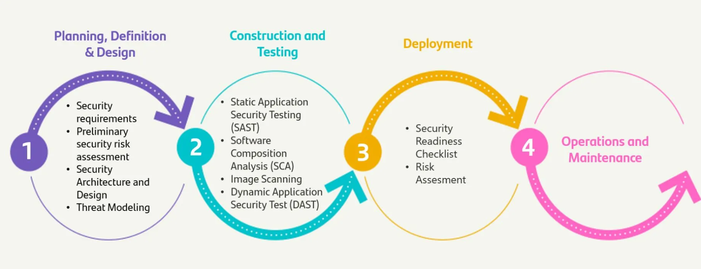

# Overview

S-SDLC (Secure - Software Development Life Cycle) consists of incorporating security in all phases of the software development life cycle, from the previous analysis and design to the final implementation and maintenance.
 In this way, the security of the resulting product is increased and the development cycle is made more efficient.
The S-SDLC model should be applied regardless of the development methodology followed.

Gluon has integrated the S-SDLC services from Detect Global Services (SAST and SCA services)

 

---

## S-SDLC

You can access to the detail of each phase at [process framework](https://santandernet.sharepoint.com/sites/Framework_Procesos/SitePages/Procesos%20de%20Gestion/CISO,%20Compliance%20_%20Risk/Security%20Management/S-SDLC%20Framework/Modelo%20S-SDLC/Modelo%20S-SDLC.aspx?cid=48bb642b-1dcb-4082-b4b8-8aee0d0987d7)

## Access to specific tool information

You can access to all the documentation for each tool used at S-SDLC at the next link: [Tools Functional Documentation](https://confluence.alm.europe.cloudcenter.corp/display/PDH/CVSW)

