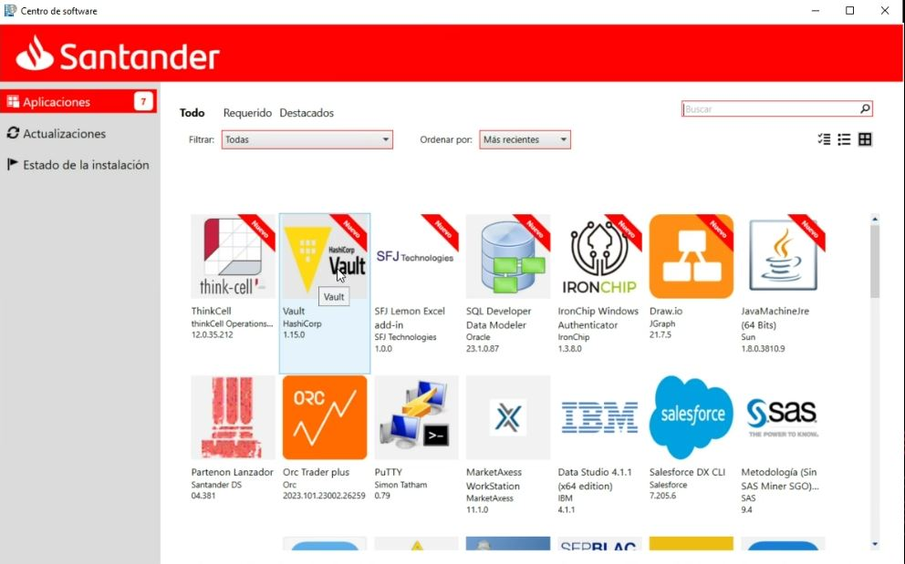
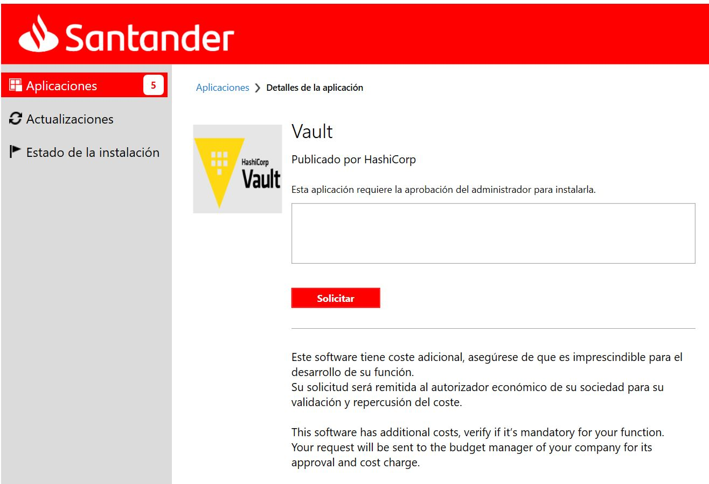
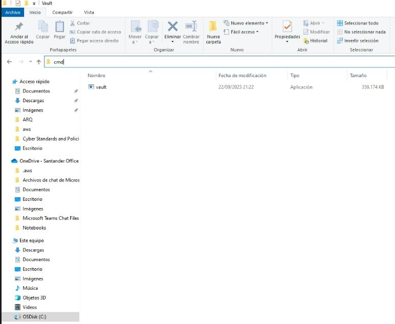
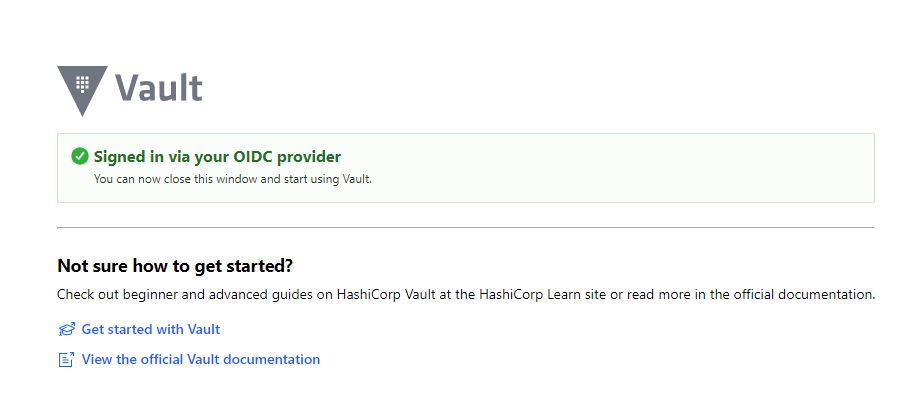
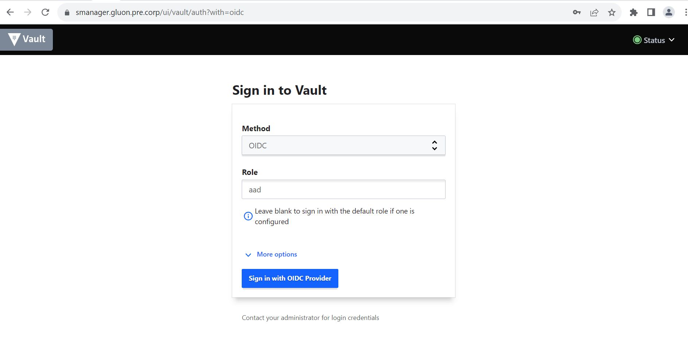
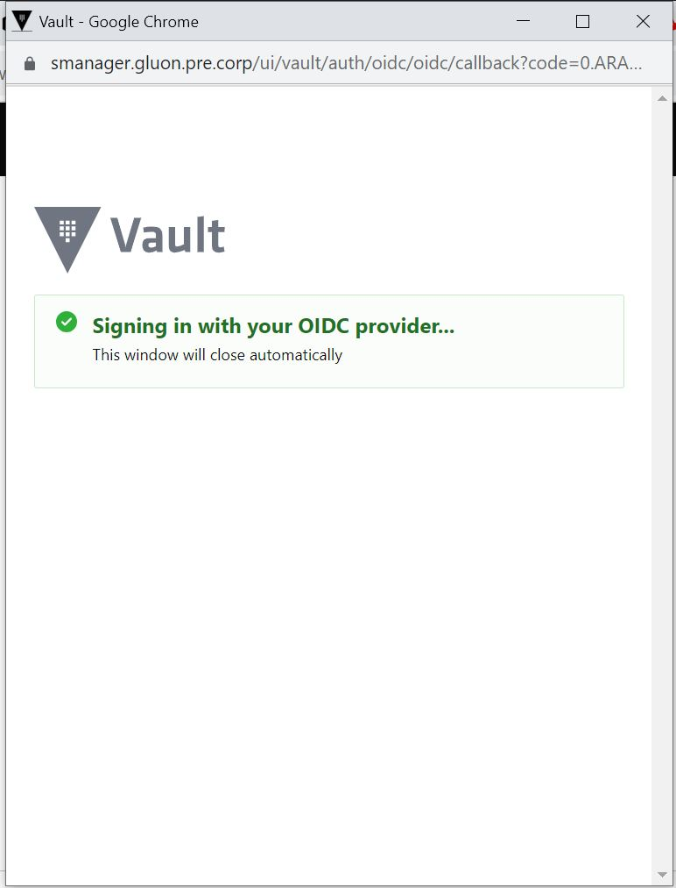
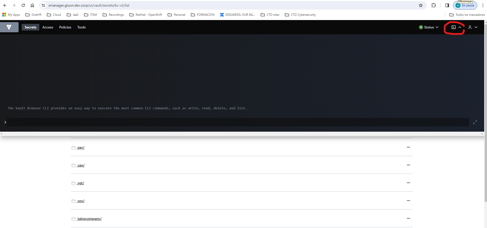
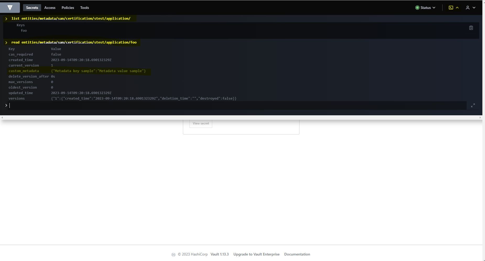

# Hashicorp Vault User Guide

## Who will have access to Vautl?

**Read access**: Read access to secrets is granted to pipelines through the identity that each pipeline has. The read segregation level is per company, application and environment.
Only in the **certification environment**, members of the application development team will be able to access the content of the secret in order to be able to develop their applications.

**Write Access**: Write mode access is granted to the company's access management role through its AD user and password, via SSO.  The write segregation level is per company and environment.

## How to operate in Vault?

!!! note

    Secrets must be created from the vault client since it is not possible to create metadata associated with the secret from the graphical interface**.

The data required to compose the secret path are as follows:

- COMPANY-NAME: 3 characters identifying the company. Example: cib, tot, wmi, san, etc. (Located in APM).
- ENVIRONMENT: One of the three available environments: "certification", "preproduction", "production".
- APP-NAME: 7 characters identifying the application for which the secrets are to be stored. Must be provided by the application owner in Gluon.
- SECRET-NAME: Identifier of the secret. Should be brought to the attention of the application development team. PLEASE, AVOID TO USE "&" IN THE SECRET NAME.
- SECRET-KEY: Key of the secret.
- SECRET-VALUE: Value of the secret (once written, this data can only be retrieved from the pipeline that will make use of it or under a glass break procedure requested by the company to Gluon's CISO).

In vault are kept the secrets to deploy any of the application components, in the mount kv-v2 and the path:

```txt
    <COMPANY-NAME>/<APP-NAME>/<ENVIRONMENT>/<deployment>/
```

In vault are kept the secrets to interact with other components, in the mount kv-v2 and the path:

```txt
    <COMPANY-NAME>/<APP-NAME>/<ENVIRONMENT>/<application>/
```

Vault access is restricted only to Access Management and Developers. Access Management per company and environment are the only ones with access to the secrets for that entity in environments like preproduction and production.
Developers have access to Vault but only to the certification environment of their application.

!!! note

    Vault is case-sensitive, both for the paths and for the name of the secrets and their values, please type in **lowercase** all the data.

### Download Vault client in order to operate with it

Look for Hashicorp Vault in Software Center:



Request the Vault Client from Software Center:



!!! note

    This software doesn't have cost when using as a client.

Your Local CISO has to authorice the installations. Let him/her know thath you will use it for manage secrets in Gluon.

Once ServiceNow ticket has been resolved and Vault client is installed on your computer, open Windows Explorer and move to "C:\Vault" folder

Open command line "cmd" from the Vault's folder (C:\Vault) by writing "cmd" on the text box in the folder and clicking "Enter":



Instead, you can open your favourite command line (Powershell, ...)

Login in Vautl from the command line:

```bash
  vault.exe login -method=oidc role=aad
```

You will be redirected through your browser to the group SSO site and once the login process is completed:



You will get the session logged within the command line, with the permissions that belong to your user:

```bash
  c:\Vault>vault.exe login -method=oidc role=aad
```

**Your cmd will show something similar to the following:**

```bash
Complete the login via your OIDC provider. Launching browser to:

https://login.microsoftonline.com/35595a02-4dxxxxxxx72db/oauth2/v2.0/authorize?client_id=21ac55c0xxxxxxxxxxxxx-xxxxxx0f79&code_challenge=gfC3hY9fLKGPxxxxxxxxxxxxqCdrv_lqwItbf9nbs&code_challenge_method=S256&nonce=n_UbRoAznzxxxxxxxxxxxa&redirect_uri=http%3A%2F%2Flocalhost%3A8250%2Foidc%2Fcallback&response_type=code&scope=openid+https%3A%2F%2Fgraph.microsoft.com%2F.default&state=st_6KGxxxxxxxxxx27P

Waiting for OIDC authentication to complete...
Success! You are now authenticated. The token information displayed below
is already stored in the token helper. You do NOT need to run "vault login"
again. Future Vault requests will automatically use this token.

Key                  Value
---                  -----
token                hvs.CAESxxxxxxxxxxxxxHG6Vfc4y6hrFxxxxxxxxxxxxxbLGh4KHGh2cyxxxxxxxxxxxxxzVkFtUWF6OUZxxxxxxxxxxxxx
token_accessor       5viIgfxxxxxxxxxxxxxSBY
token_duration       1h
token_renewable      true
token_policies       ["default" "policy_default"]
identity_policies    ["policy_COMPANY_creator_ENVIRONMENT"]
policies             ["default" "policy_default"    "policy_COMPANY_creator_ENVIRONMENT"]
token_meta_role      aad
```

### Listing secrets in Vault through Vault Client

Once you have access to Vault, you can start to operate with it.

Adding environment variables:

```bash
export VAULT_ADDR=<VAULT URL>
export PATH=$PATH:/c/Vault
```

List Application Secret Names:

```bash
    vault kv list -mount=kv-v2 <COMPANY-NAME>/<APP-NAME>/<ENVIRONMENT>/application
```

The following is an **example** of how the command would be used to list the application secrets of "test" application of the "cib" company in the "certification" environment.

```bash
    vault kv list -mount=kv-v2 cib/certification/test/application
```

List Deployment Secret Names:

```bash
  vault kv list -mount=kv-v2 <COMPANY-NAME>/<APP-NAME>/<ENVIRONMENT>/deployment
```

The following is an **example** of how the command would be used to list the deployment secrets of "test" application of the "cib" company in the "certification" environment.

```bash
  vault kv list -mount=kv-v2 cib/test/certification/deployment
```

Read Application Secret Metadata:

```bash
  vault kv metadata get -mount=kv-v2 <COMPANY-NAME>/<APP-NAME>/<ENVIRONMENT>/application/<my-secret>  
```

The following is an **example** of how the command would be used to read associated metadata with the application secret "mysecret" on "test" application of the "cib" company in the "certification" environment.

```bash
  vault kv metadata get -mount=kv-v2 cib/test/certification/application/mysecret
```

Read Deployment Secret Metadata:

```bash
  vault kv metadata get -mount=kv-v2 <COMPANY-NAME>/<APP-NAME>/<ENVIRONMENT>/deployment/<my-secret>  
```

The following is an **example** of how the command would be used to read associated metadata with the deployment secret "mysecret" of "test" application of the "cib" company in the "certification" environment.

```bash
vault kv metadata get -mount=kv-v2 cib/test/certification/deployment/mysecret
```

### Only for Access Management Users: Creating/Update secrets in Vault through Vault Client

Create/Update Application Secret:

```bash
  vault kv put -mount=kv-v2 <COMPANY-NAME>/<APP-NAME>/<ENVIRONMENT>/application/<SECRET-NAME> <SECRET-KEY>=<SECRET-VALUE>
```

The following is an **example** of how create or update the key named "foo" in the "kv-v2" mount with the value "bar=baz":

```bash
  vault kv put -mount=kv-v2 sgt/app1/certification/application/foo bar=baz
```

Create/Update the Metadata associated with the previous secret:

```bash
  vault kv metadata put -mount=kv-v2 -custom-metadata=METADATA-KEY1=METADATA-VALUE1 -custom-metadata=METADATA-KEY2=METADATA-VALUE2 <COMPANY-NAME>/<APP-NAME>/<ENVIRONMENT>/application/<SECRET-NAME>
```

The following is an **example** of how the command would be used to create or update the application secret "token01", with the associated metadata "Location=Cluster-01" for "test" application of the "cib" company in the "certification" environment.

```bash
  vault kv put -mount=kv-v2 cib/test/certification/application/token01 token01=examplesecretvalue
  vault kv metadata put -mount=kv-v2 -custom-metadata=Location=Cluster-01 cib/test/certification/application/token01
```

Create/Update Deployment Secret:

```bash
  vault kv put -mount=kv-v2 <COMPANY-NAME>/<APP-NAME>/<ENVIRONMENT>/deployment/<SECRET-NAME> <SECRET-KEY>=<SECRET-VALUE>
```

The following is an **example** of how create or update the key named "foo" in the "kv-v2" mount with the value "bar=baz":

```bash
  vault kv put -mount=kv-v2 sgt/app1/certification/deployment/foo bar=baz
```

Create/Update the Metadata associated with the previous secret:

```bash
  vault kv metadata put -mount=kv-v2 -custom-metadata=<METADATA-KEY1>=<METADATA-VALUE1> -custom-metadat=<METADATA-KEY2>=<METADATA-VALUE2> <COMPANY-NAME>/<APP-NAME>/<ENVIRONMENT>/deployment/<SECRET-NAME>
```

The following is an **example** of how the command would be used to create or update the deploy secret "sakubernetes02", with the associated metadata "Location=Cluster-01" for "test" application of the "cib" company in the "certification" environment.

```bash
vault kv put -mount=kv-v2 cib/test/certification/deployment/sakubernetes02 sakubernetes02=examplesecretvalue
vault kv metadata put -mount=kv-v2 -custom-metadata=Location=Cluster-01 cib/test/certification/deployment/sakubernetes02
```

### Listing secrets through the command line in Vault UI

Login in Vault, role aad:

- <https://smanager.gluon.pre.corp/ui/vault/auth?with=oidc>



A window will open that ends the login and once the process is completed (unattended).



In the upper right corner of the vault web site, click on the shell symbol:



List Application Secret Names:

```bash
list <COMPANY-NAME>/<APP-NAME>/<ENVIRONMENT>/application/
```

The following is an **example** of how the command would be used to list the application secrets of "test" application of the "cib" company in the "certification" environment.

```bash
list cib/test/certification/application  
```

Read Application Secret Metadata:
  
```bash
read <COMPANY-NAME>/<APP-NAME>/<ENVIRONMENT>/application/<SECRET-NAME>
```

The following is an **example** of how the command would be used to read the metadata associated with the secret application secret "token01" of "test" application of the "cib" company in the "certification" environment.

```bash
vault kv metadata get -mount=kv-v2 cib/test/certification/application/token01
```

List Deployment Secret Names:

```bash
list <COMPANY-NAME>/<APP-NAME>/<ENVIRONMENT>/deployment/
```

The following is an **example** of how the command would be used to list the deploy secrets of "test" application of the "cib" company in the "certification" environment.

```bash
list cib/test/certification/deployment
```

Read Deployment Secret Metadata:

```bash
read <COMPANY-NAME>/<APP-NAME>/<ENVIRONMENT>/deployment/<SECRET-NAME>
```

The following is an **example** of how the command would be used to read the metadata associated with the deploy secret "sakubernetes02" of "test" application of the "cib" COMPANY in the "certification" environment.

```bash
vault kv metadata get -mount=kv-v2 cib/test/certification/deployment/token01
```

The following is an example of listing and reading metadata through the web shell in Vault


