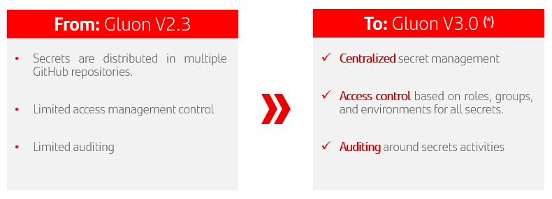
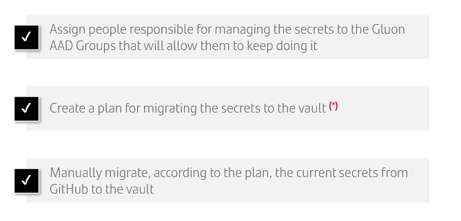
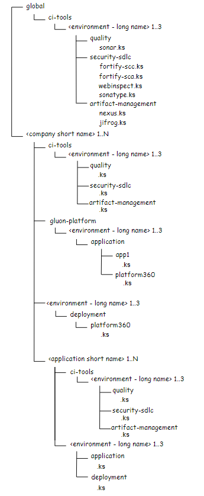

# Hashicorp Vault

**Gluon V2.3** relies on a vault for its secret management, and they will be gradually moved there.



**(*)** Definitive enterprise vault selection is currently being carried out by Protect. Integrating it should be almost transparent to the entities with respect to what has been proposed in Gluon V3

**V3 Rollout Tasks** In the entities, the groups of people that are already managing these secrets/identities (creation, rotation, informing them into Gluon, etc.), have to carry on the following tasks to adapt to V3:



!!! note

    (*) To simplify the V3 rollout, it does not necessary imply start using vault. So, a plan is needed.

---

## What is Vault?

HashiCorp Vault is an identity-based secrets and encryption management system. Vault provides encryption services that are gated by authentication and authorization methods. Using Vault’s UI, CLI, or HTTP API, access to secrets can be securely stored
and managed, tightly controlled (restricted), and auditable.
[Hashicorp Documentation](https://developer.hashicorp.com/vault/docs/what-is-vault){:target="_blank"}

---

## Secrets managed by Gluon

Each Company will have a dedicated area within HashiCorp Vault that isolates its
secrets from those of other companies.

This is achieved by creating a hierarchical structure in the Vault with the
required permissions to guarantee restricted access.

At **Company** level this space will be used to store three sets of secrets:

- Credentials used by Continuous Integration Workflows that are being
managed at Company rather than Application level.
- Secrets belonging to the Company but that are used by the Gluon platform as
part of its automation processes, e.g., credentials used to access a Company's
Kubernetes cluster when creating a new namespace.
- Deployment credentials that are common to an entire Company when further
segregation at application level is not possible due to limitations in the
destination infrastructure, e.g. API metadata deployed to Datapower.

At **Application** level three distinct types of secrets can potentially be handled:

- Credentials used to call services during the construction of the application,i.e Continuous Integration (CI), e.g. sonar, secure SDLC, etc.

- Credentials used to deploy the application's components, e.g. microservices and configmaps in Kubernetes.

- Credentials used by the application at runtime, e.g. A database user/password, client id / client secret, etc.

The secrets will be stored in dedicated structures. First, a company will be created manually by the [company onboarding](./secret-lifecycle/index.md#company-onboarding) process and after,
the [application onboarding](./secret-lifecycle/index.md#application-onboarding) will create automatically application's structure.

The access to the secrets will be managed by Vault policies. Policies are attached to Vault Groups and Github Roles. The Vault Groups have an alias to link them with AD Groups.

**An instance of Hasicorp Vault has been installed for Gluon and fulfils Gluon V3 needs**.
The installed edition of Hashicorp Vault is "Community" and the data persistence is done through snapshots every 6 hours since there is no second Hashicorp Vault replica.

## Segregation of secrets in Vault

Vault is segregated by global, company, application and environment.

{width="450" height="260" style="display: block; margin: 0 auto"}

The "global" folder contains those secrets that are used to access services that are common to all companies and applications in Gluon. A similar structure is created at company and application level when they are onboarded allowing for fine-grained configuration.

The "company" folder contains all the secrets owned by the company.

And the "application" folder contains all the secrets owned by one specific application.

This Vault structure has been designed following the  [Security Principles](../red-lines.md)

=== "Example for CIB Company"

```txt
kv-v2/cib/frstapp/certification/application
kv-v2/cib/frstapp/preproduction/deployment
kv-v2/cib/frstapp/production/application
```

=== "Example for USA Company"

```txt
kv-v2/usa/testapp/certification/application
kv-v2/usa/testapp/preproduction/application
kv-v2/usa/testapp/production/application
```

## HasiCorp Vault URLs

PRO -> <https://smanager.gluon.gs.corp>

---

- ### :raising_hand: Related Content

    [Vault Documentation](https://developer.hashicorp.com/vault/docs)

    [Vault Use Cases](https://developer.hashicorp.com/vault/docs/use-cases)

    [Vault limits](https://developer.hashicorp.com/vault/docs/internals/limits)

</br>
