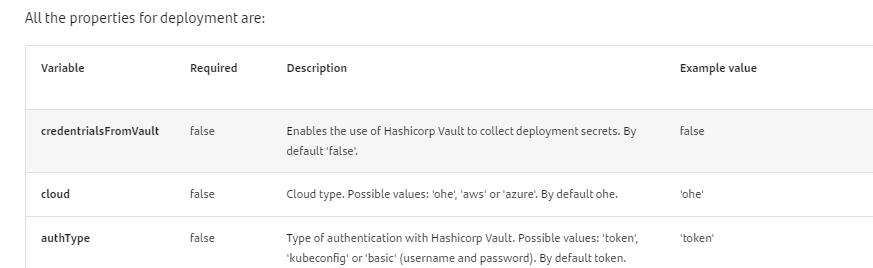
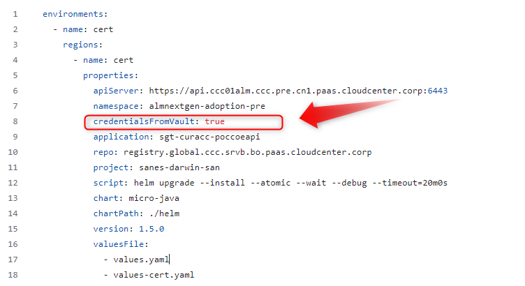

# Developer journeys

Currently in Gluon this is the list of secrets that are covered:

| | Deployment Secret | Application Secret | Harbor Credential |
|-|-|-|-|
| Darwin NodeJS Microservice |  X (GitHub or Vault) | | X (Only in Github) |
| Darwin 4 Java Microservice |  X (GitHub or Vault) | | X (Only in Github) |
| Arsenal Java Microservice |  X (GitHub or Vault) | | X (Only in Github) |
| Darwin Microfront |  X (GitHub or Vault) | | X (Only in Github) |
| Darwin SPA |  X (GitHub or Vault) | | X (Only in Github) |
| React SPA |  X (GitHub or Vault) | | X (Only in Github) |
| Kubernetes Secrets |  X (GitHub or Vault) | X (GitHub or Vault) | X (Only in Github) |
| Kubernetes ConfigMap |  X (GitHub or Vault) | | X (Only in Github) |

Vault structure is made on Application level, this means that all technical components from one application shared the same tree structure.

!!! note

    Only the Access Management group per company and environment has the permission to create these secrets.

Path  accessible to the developer group, each one of them to their specific company and application and always only in certification environment:

=== "Paths"

```txt
<company>/<application>/certification/application/  --> list and read
<company>/<application>/certification/deployment/   --> only list
```

## Deployment Secret

These secrets are the credentials used to authenticate in kubernetes clusters in order to do the deployment.

!!! note

    In order to create deployment secrets, they must follow the [naming convention](../../secret-lifecycle/index.md#naming-convention)

In order to start using Vault in the Gluon workflows, the following configuration must to be added to the deployment.yaml

| Deployment properties | Example of deployment.yaml integration |
|-|-|
| |   |

In case that you are looking for the service account automatically generetad by Gluon to deploy in the Kubernetes namespace, check more information [here](../../secret-lifecycle/index.md#secret-creation)

## Application Secrets

This apply to:

  - Kubernetes Secrets

This component use 2 kind of secrets:

- Deployment secrets to authenticate with the kubernetes cluster
- Application Secrets, these are the secrets that are going to be stored in the cluster.

## Deployment Secret in Github

In order to keep everything as it is, the user must leave everything as it is. Do not touch anything.

## Application Secret in Github

In order to keep everything as it is, the user must leave everything as it is. Do not touch anything.
