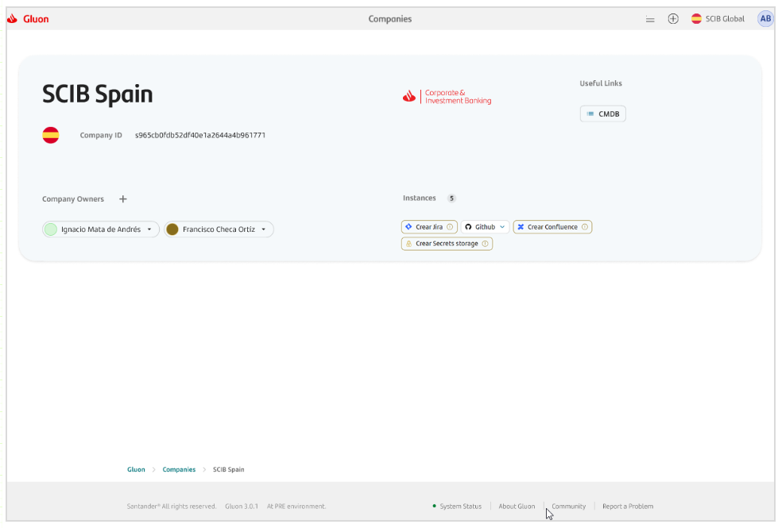
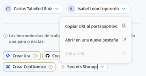
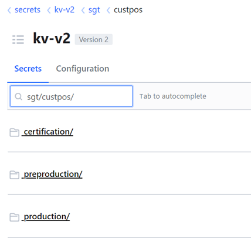

# Product Owner journey: Application creation in Vault

!!! note

    **Pre-req**
        - Company has to be onboarded before doing the next step
        - Only the product Owners can see the new button to start the company onboarding.

There is a new button **"Create Secret storage"** when you log in Gluon Portal,and select one application in which you are **Product Owner**:

After the application onboarding, there is going to be a new button in the portal with the Vault URL. The product owner must give the Vault URL to the developers, so they can list and read secrets over certification environment in their application.

{width="450" height="260" style="display: block; margin: 0 auto"}

!!! note

    Only Access Management teams of this company are going to be able to see the Vault tree in their environment.
    One of them can verify that the tree folder has been created:

    
