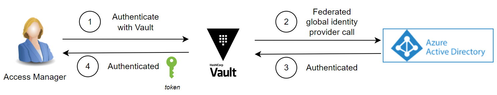
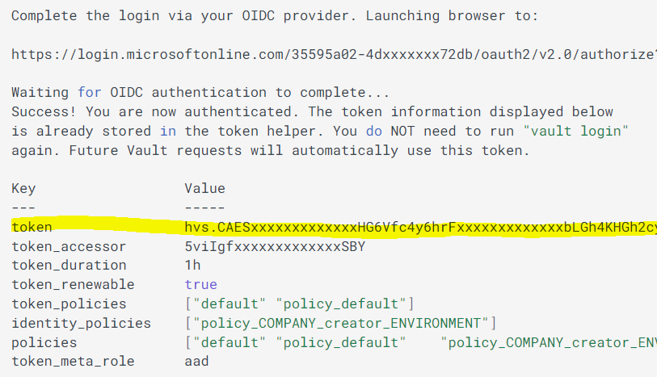
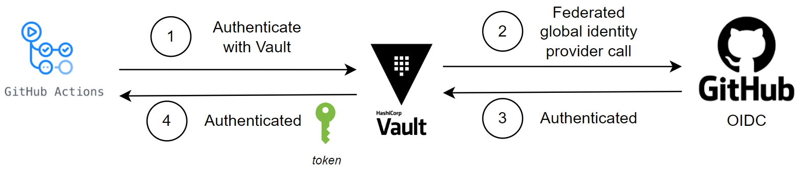

# Hashicorp Vault migration patterns

Vault migration patterns specify how to proceed when migrating from a previous secret storage solution to Hashicorp Vault.

??? note "Advices on designing the migration process"
    - Current pattern shows how to connect and create secrets at Vault. The way you may retrieve your secrets from your previous solution should be treated carefully in a case by case approach.

        > **The process must retrieve secrets from origin in a secure way (not covered in this pattern) and store them at Hashicorp Vault in a one-go process, therefore avoiding any intermediate store of the secrets.**

    - Batch migration processes are very sensitive. A batch process is automatically storing a set of secrets at Hashicorp Vault, so any mistake when specifying target secret paths may generate wrong results.
    We recommend to develop any mechanism that executes some validations before actually creating secrets at Vault.
    - Verify that company and applications are correct and aligned with secret path.
    - Verify that type of secret is aligned with secret path.
    - Any other verification that may make sense depending on your use case.

## Prerequisites

### 1. Company must be already onboarded at Vault

Each Company will have a dedicated area within HashiCorp Vault that isolates its secrets from those of other companies.

By [onboarding a Company at Vault](../secret-lifecycle/index.md#company-onboarding), process will create roles and company specific folders in Hashicorp Vault.

### 2. Applications must be already onboarded at Vault

Secrets at Vault can be stored at company level and application level.

You must onboard into Gluon every application which secrets you are going to migrate, as onboarding will generate hierarchical folders organization for every application at Vault.

You can read about that folder structure at [Secrets managed by Gluon](../index.md#secrets-managed-by-gluon).

A Gluon user with Product Owner Gluon role can use Gluon portal for application onboarding. Please follow this [instructions](../journeys/product-owner/index.md).

## Migration pattern with a User identity

This section explains how a specific user can create secrets at Vault using a script.

The user must belong to a group with write access at Vault. Generally, that can be accomplished by an Access Management role. See more information about [Vault Roles](../roles/index.md).

### 1. Login at Vault to get a token

A user with Access Management role must login at Vault and retrieve a token that then can be used to actually create secrets at vault.



To authenticate at Vault, you have to download Vault client and login at vault using some command line commands. Those steps are detailed at [How to operate with Vault](../how-to/index.md#how-to-operate-in-vault).

After login, you can get Vault token from command line output (see highlighted line below).



### 2. Write and run your script using Vault token

Now it is time to generate your script and run it.

Please check command to create secrets at [How to create and update secrets using Vautl client](../how-to/index.md#only-for-access-management-users-creatingupdate-secrets-in-vault-through-vault-client).

Remember you must follow specific hierarchical structure, predefined at [Secrets managed by Gluon](../index.md#secrets-managed-by-gluon).

There are lots of ways you can structure your script to migrate your secrets.
Below you can find a script example that accepts a secret path and a secret value string.

**You must adapt this script to your needs, but always keep in mind not to store secrets at transient as part of this migration process; retrieve your secrets from previous store and save them in Vault within a single process.**

## Vault-write.sh

```console
#!/bin/bash
#
# Usage: vault-write <path> <secret string>

SCRIPT_NAME=$(basename "$0")
VAULT_ADDR=${VAULT_ADDR:-https://vault.example.com}
if [ "$#" != "2" ]; then
    echo usage "$SCRIPT_NAME: <path> <secret string>"
    exit 1
fi

vault kv put $1 value="$2" format="text"
```

> **WARNING: Please keep in mind that vault token is bound to high privileged access to Hashicorp Vault within your organization, as it was obtained with an Access Management role. Be very careful with commands you launch within your script.**

## Migration pattern with a System identity

This section explains how to create secrets at Hashicorp Vault using a system user from Github Actions.

Identities are federated through OIDC between Github and Hashicorp Vault, as you can see below.



As in previous section, first we will configure Vault to keep our secrets by onboarding our Company and Apps. Then we will need to create a vault role and assign it to our system identity.
Lastly, we will negotiate a vault access token that we can use to create our secrets by calling vault api.

### 1. Create a github migration repository for your company secret migration

Create a migration repo at github.com. No specific template should be specified. You could use one single repository to migrate all secrets (company level, and all apps).

### 2. Request a migration role for your service user

Now we need to generate a migration role that our system identity will use at Github action.

Each entity's cross Devops team should contact Gluon Operations team to request a migration role for your company and associate that role to your system identity (github migration repository identity).

Migration roles will follow next naming convention:

```yaml
*role_${COMPANY_NAME}_migration_writer\_${ENV_NAME}*
```

Where *ENV_NAME* can be certification, preproduction, or production.

### 3. Configure your github migration repository for your company secret migration

Setup following parameters as migration Github security repository secrets:

| Secret | Value |
| -------- | ------- |
| VAULT_ADDR | Include vault address for your environment (cert/pre/pro) |
| VAULT_ROLE | Role value you got at previous step |

### 4. Develop your github action to create secrets at Vault

Then you must develop a github action that will create your secret at Vault.
Follow next steps:

1. Get IdToken for your repo
2. Negotiate Vault access token using previous idToken. In this example, we use node-vault client (<https://github.com/nodevault/node-vault>).
3. Create secrets using Vault client

> **NOTE: Please keep in mind that vault token is bound to high privileged access to Hashicorp Vault within your organization. Be very careful with commands you launch within your script.**

Following script shows an example.

```typescript
import * as core from "@actions/core";
import fetch from 'node-fetch';
import https from 'https';
import NodeVault from 'node-vault';

/**
 * Add here your code to retrieve secrets from previous secret storage.
 * Remember that you MUST NOT save those secrets as an intermediate step.
 * Retrieve secret and store them directly in Vault.
 */

core.info("Retrieve repo parameters");
const vaultAddr = process.env.VAULT_ADDR || "";
const vaultRole = process.env.VAULT_ROLE || "";

core.info("Get Github IdToken");
const idToken : string = await core.getIDToken();

core.info("Get Vault Token");
const vaultToken : string = await getVaultToken(vaultAddr, idToken, vaultRole);

core.info("Create Vault client");
const vaultClient = await getVaultClient(vaultAddr, vaultToken);

core.info("Importing secrets")
vault.write('<YOUR SECRET KEY>', '<YOUR SECRET VALUE>')
.catch(console.error);

static async getVaultToken(vaultAddr: string, idToken: string, vaultRole: string) : Promise<string> {
    const vaultLoginUrl = `${vaultAddr}/v1/auth/jwt/login`;
    const vaultLoginBody = {
        jwt: idToken,
        role: vaultRole
    };

    const vaultLoginResponse = await fetch(vaultLoginUrl, {
        method: 'POST',
        headers: {
            'Content-Type': 'application/json'
        },
        body: JSON.stringify(vaultLoginBody),
        agent: new https.Agent({ rejectUnauthorized: false })
    });

    const vaultLoginResponseBody : any = await vaultLoginResponse.json();

    if (vaultLoginResponse.status !== 200) {
        setFailed(`Error getting vault token: ${vaultLoginResponseBody.errors}`);
        throw new Error(`Error getting vault token: ${vaultLoginResponseBody.errors}`);
    };

    return vaultLoginResponseBody.auth.client_token;
}

static async getVaultClient(vaultAddr: string, vaultToken: string) : Promise<NodeVault.client> {
    const vaultClient = NodeVault({
        apiVersion: 'v1',
        endpoint: vaultAddr,
        token: vaultToken,
        requestOptions: {
            strictSSL: false
        }
    });
    return vaultClient;
}
```
