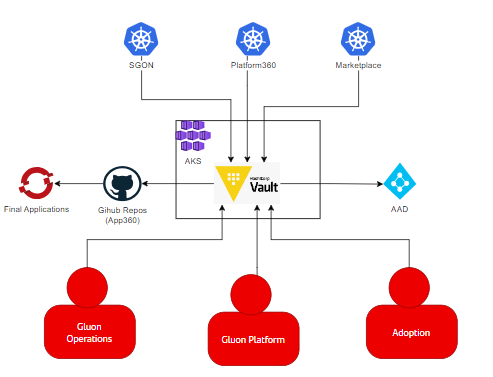
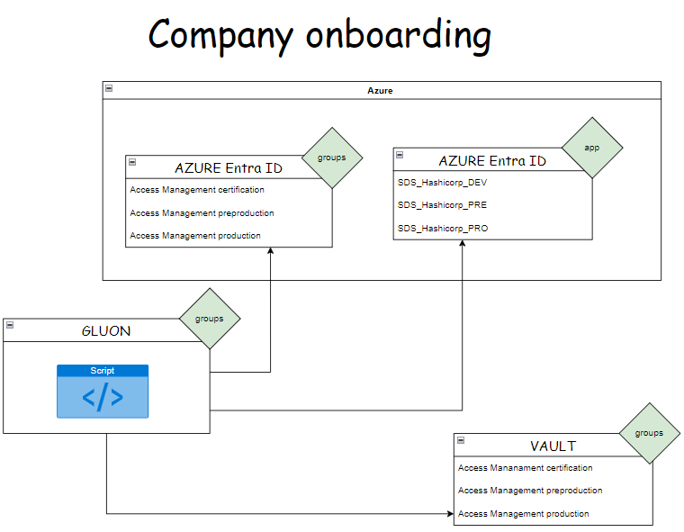
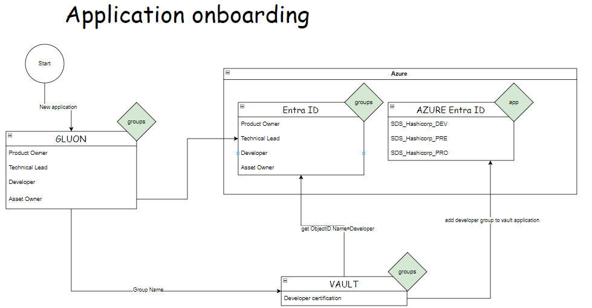

# Roles and Permissions

## Solution IAM roles

The following table describe the roles that have been identified as needed for the proposed solution. They will be assigned to the adequate teams, people, or systems in order to grant them just the minimum needed permissions to fulfil their tasks.

!!! note

    Defining who/what would be granted these roles is out of scope of this document and could involve both Entities and Gluon teams, people, or systems.

| Role                     | Description                                                                        | Control
| ------------             | -----------------------------------------------------------------------------------|-------------|
| Secret System Admin Role | Grants creation, list and deletion permission over all infrastructure secrets stored in Hashicorp Vault.<span><br/>Grants creation, list, read and deletion permission over all infrastructure policies stored in Hashicorp Vault.<span><br/>Activated different auth method and secrets engines. <span><br/>Grants permissions to do task relate with kubernetes admin cluster, such a generate snapshot.</br>| Global |
| Gluon Operations.        | Grants creation, list and deletion permission over every folder in company (gluon-platform, environment and ci-tools), but application, stored in Hashicorp Vault. They are in charge of the Company onboarding process into Hashicorp Vault. | Global |
| Adoption                 | Grants list permission over all infrastructure secrets stored in Hashicorp Vault. | Global |
| Developer                | Grants list and read permission over application secrets stored in Hashicorp Vault in certification folder and only list over deployment secrets in certification folder | Local |
| Access Management certification | Grants creation, list and update permission over certification folders in a company | Local |
| Access Management preproduction | Grants creation, list and update permission over preproduction folders in a company | Local |
| Access Management production | Grants creation, list and update permission over production folders in a company | Local |

## Approle creation for microservices that will manage onboardings

In order to Gluon interact with Vault, every microservices involved in the onboarding process who needs to interact with Vault in runtime must have an approle created.

Below there is an example of an approle created by this step:

```bash
COMPANY_NAME="spa" # company name with 3 characters
env_name="certification" # "preproduction" or "production"
APP_NAME="oneweba" # application name with 7 characters
type_secret="deploy" # or "application"
```

## TEAM -> ROLE/GROUP -> POLICY

| User/team | Group/Role name | Type | Scope |
|-|-|-|-|
| Gluon Platform team | group_secret_manager_system_admin | external group | all vault |
| Operations team | policy_gluon_operations_onboarding | external group | all vault |
| Adoption | group_gluon_adoption | external group | list all vault secrets |
| Access Management | group_secret_manager_${company}_accessmanagement_${env}| external group | create secrets in their company |
| Development team | group_secret_manager_${company}_${app}_development_${env}  | external group | list their company's specific app secrets in certification environment |
| Technical Leads team | group_secret_manager_${company}_${app}_tl_${env}  | external group | list their company's specific app secrets in certification environment |
| SGON | group_secret_manager_admin | approle | all applications |
| Application360 | role_${company}_${app}_${env}_reader | JWT role | specific app in specific company and environment |
| Platform360 | role-sgon-application-onboarding | approle | write secrets for deploy applications |
| Marketplace | role-marketplace-application-secrets-creator | approle | write application secrets |

{width="600" height="260" style="display: block; margin: 0 auto"}

## Groups Management

The groups created in Vault are related to the objectID from the groups created by Gluon in Azure AD. During the company onboarding, groups are going to be generated:



During the application onboarding a developer groups for that company is going to be generated:


