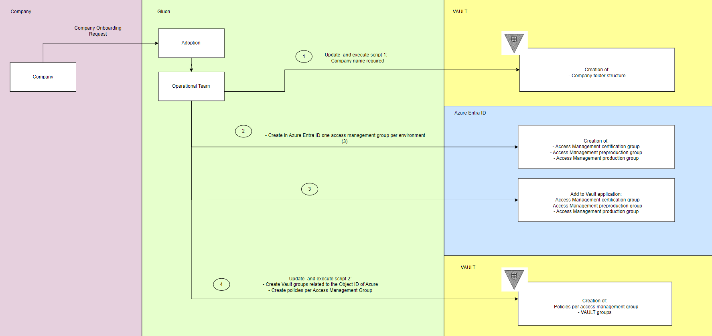
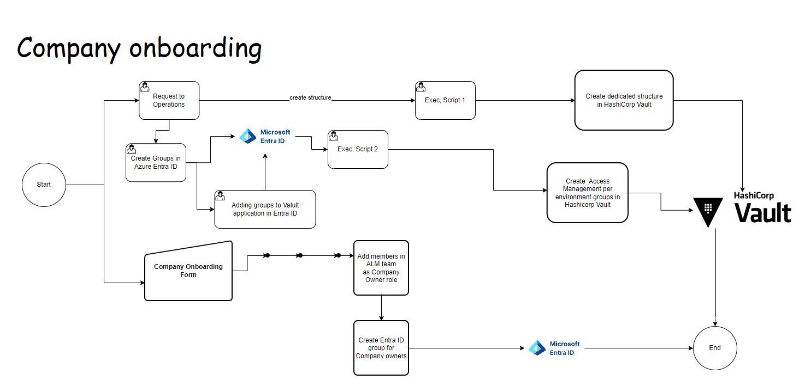
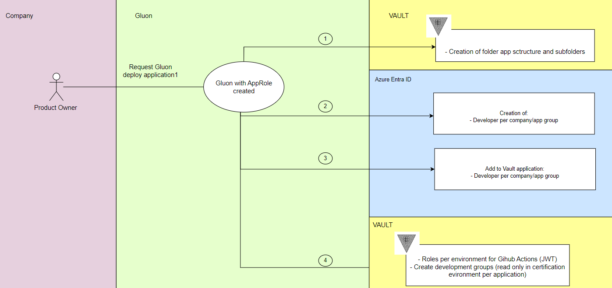
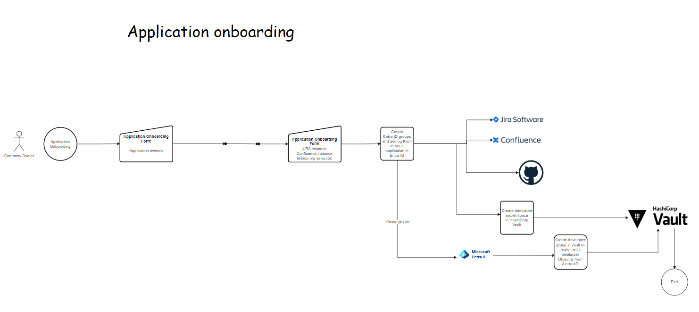
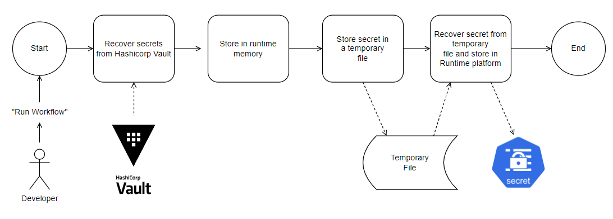
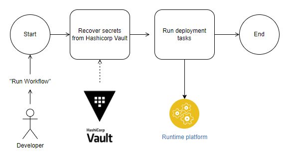

# Solution lifecycle phases

The following phases have been identified related to secret management in Gluon, and will be covered in the proposed solution:

## Secret onboarding
  
  To begin with, the company on which the application is to be deployed must be onboarded in Gluon.

### Company Onboarding

  A company will be onboarded in Gluon. There is a process to create the roles and folders in Hashicorp Vault to manage the company's secrets.
  This is a manual process executed via a bash script by Operations Team.
  
  

  

  A company can create applications in any of the environments. To do this, it is necessary to have a company onboarded, and request to Gluon to deploy a new application.

### Application Onboarding

  During the application onboarding process, the **Product Owner** will not only request the creation of the Gluon resources associated with the application project **through Gluon Portal** (e.g., OCP Namespace, database identity, etc.), but also the
  required infrastructure in Hashicrop Vault for them to store and access their Company’s infrastructure secrets (e.g., identities for eCP Cluster, Database, etc.).

  Gluon is going to create a folder app structure in Vault, roles per environment for Github Actions (JWT), and policies for developers to read secrets in Vault.
  Gluon is able to check previously to onboard an application if the application was onboarded previously.
  
  

  
  
  Those secrets would depend on the use cases that were described before: [**Deployment Secrets**](../secret-types/index.md#1-deployment-secrets) and [**Application Secrets**](../secret-types/index.md#2-application-secrets).

---

## Secret Creation

When a company's application ask for creating a namespace, Gluon will create a namespace in the kubernetes clusters where the application must be deployed, when that process is finished, a deployment secret will be saved in this folder in Vault:

```txt
<company-short-name>
    <application-short-name>
        <environment-long-name>
            deployment
              <secret-must-be-here>
```

### Naming Convention only for Deployment Secrets

The name of the secret will follow this generic pattern:

`<cloud>_<region>_<name>_<resource-name>_<credential-type>_<credential-subtype>`

In the case of an Openshift deployment this becomes:

`<cloud>_<region>_<cluster-name>_<namespace-name>_<credentials-type>_<credential-subtype>`

Defined as:

- `<cloud>` - The name of the cloud instance, i.e. "ohe", "aws", or "azure".
- `<region>` - The region where the application is being deployed, e.g. "bo1".
- `<cluster-name>` - The id of kubernetes cluster, e.g. "cib01".
- `<namespace-name>` - The application's namespace.
- `<credential-type>` - The type of credentials being that will be used to access
the cluster: "kubeconfig", "basic" or "token".
- `<credential-subtype>` - In the case of basic credendentials, "user" or "pass".

Default values:

- `<cloud>` - "ohe"
- `<credential-type>` - "token"

These values can be overwritten by the developer in their deployment configuration
files to cover other use cases.

Calculated values:

`<region>`, `<cluster-name>`, `<namespace-name>` will be obtained from the execution
context.

Based on the pattern above we will have a unique Key/Value secret for
each credential where the name of the key in the key/value pair is the same the
name of the secret.

=== "Examples"

```txt
Secret: ohe_bo1_cib01_almnextgen-adoption_kubeconfig
  Key -> Value
  ohe_bo1_cib01_almnextgen-adoption_kubeconfig -> <config>


Secret: ohe_bo1_cib01_almnextgen-adoption_token
  Key -> Value
  ohe_bo1_cib01_almnextgen-adoption_token -> <token>


Secret: ohe_bo1_cib01_almnextgen-adoption_basic_user
  Key -> Value
  ohe_bo1_cib01_almnextgen-adoption_basic_user -> <user name>

Secret: ohe_bo1_cib01_almnextgen-adoption_basic_pass
  Key -> Value
  ohe_bo1_cib01_almnextgen-adoption_basic_pass -> <user password>
```

### Deployment Workflow Compatibility

Now by default all deployment workflows will use GitHub based secrets. This can be achieve via an additional parameter "credentialsFromVault=false" in the deployment file.
This functionality will be available during a limited period of time of two months, after that, all deployment workflows will use deployment secrets obtained from Hashicorp Vault.

For other applications secret, the access management team of the company must create them in vault inside their applications path, in order to be used by their applications.

---

## Secret Usage

### Application Secrets

Application secrets are those credentials that an application needs at runtime for its proper functioning. For example, a database's user and password.

While these credentials are stored and managed in HashiCorp Vault, they need to be made available to the application through its runtime platform.

#### Pre-requisites

- The company must have been registered in HashiCorp Vault through the company  onboarding process.
- The application must have been registered in HashiCorp Vault through the application onboarding process.
- Before a secret can by deployed by the Workflow running on the CD Pipeline, it must be stored in HashiCorp Vault.

#### Description

From a developer's perspective secret deployment consists of three main steps:

- Create a Component in their application using the template provided by Gluon to manage secrets on their runtime platform
- Define the template in the GitHub Repository with the secrets they want to create in their runtime platform where they want to deploy them.
- Run the workflows to deploy the secrets.

As Github Action use OIDC federatation to interact with Vault, workflows can retrieve the secrets from Vault.

#### Deployment process

The deployment process is done following this steps:



### Deployment Secrets

Deployment secrets are managed in Vault and are used in the workflows runtime to deploy components to their target infrastructure.

Deployment secrets should be created at an application environment level, so there are not shared between environments or applications or, even worst, companies.

Centralizing deployment secrets allows us to rotate those secrets as each time it is used in a workflow, it is retrieved from Vault.

#### Pre-requisites

- The company must have been registered in HashiCorp Vault through the company onboarding process.
- The application must have been registered in HashiCorp Vault through the application onboarding process.
- Before a secret can be consumed by the Workflow running on the CD Pipeline, it must be stored in HashiCorp Vault

#### Naming Convention

The naming convention of the deployment secrets stored in vault is important as that will allow us to map it with the target infrastructure that has been configured on each component as deployment target.

#### Process

The process followed to consume this secrets is:



!!! note

    There are other processes in progress to understand where their secrets will be saved and who will be able to read them:
        
        - Harbor space creation process

---

## Secret Rotation
  
  Secrets, especially for identities (Service Account), must be rotated attending to the Security Policy that governs their lifecycle.
  
  The solution proposed here for Gluon V3 **does not cover this phase**, being required to do it manually (as it was done in the onboarding phase).
  
!!! warning

    When rotating secrets, it must be taken into account that a race condition might appear. If an existing secret, understood as an identity to access a system, is changed it could cause Gluon pipeline or applications at runtime to fail until it is also updated there with its new value in the Vault. Strategies such as creating a new secret (an identity similar to the previous one), updating its value, and deleting the old one once it works with the new one, could be used.

---
