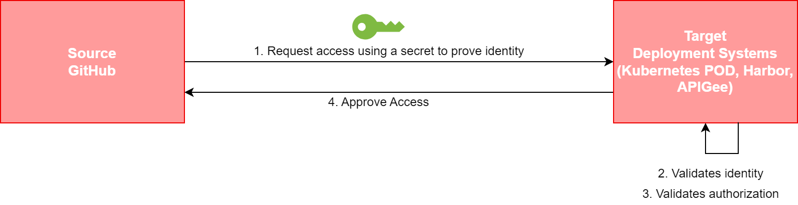
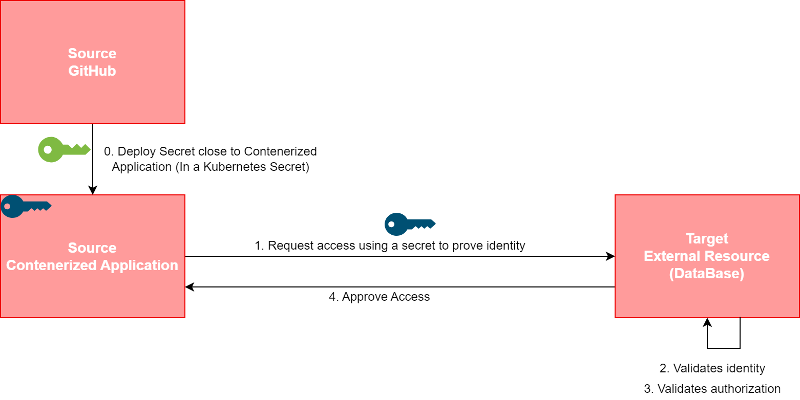

# Secrets Types

Gluon has defined the following two use cases regarding secrets to be covered to address the minimum needs for its V3:

## 1. Deployment Secrets

Continuous integration and delivery (CI/CD) have become an essential practice for organizations looking to develop and release applications quickly and efficiently.
This type of secrets are the credentials or identities that will be accessible from **GitHub Workflows** allowing them to process the repository (e.g., compile and package) and move or deploy the resulting artifact (e.g., JAR file, API swagger...)
into the destination infrastructure (e.g., Nexus, API Gateway, etc.).

### Pre-requisites

- The company must have been registered in HashiCorp Vault through the  [company onboarding](../secret-lifecycle/index.md#company-onboarding) process.

- The application must have been registered in HashiCorp Vault through the
  [application onboarding](../secret-lifecycle/index.md#application-onboarding)  process.

- Before a secret can be consumed by the Workflow running on the CD Pipeline, it
  must be stored in HashiCorp Vault.

These credentials or identities are represented in the diagrams by the **Green Key**.

## 2. Application Secrets

Another aspect to be considered is regarding the secrets that the Application will need at runtime. These secrets have to be managed throughout their life cycle.
This type of secrets are the credentials or access tokens used by an application at runtime to access an external element, for example, a database.
For this use case in Gluon V3, the application will be running as a POD in a Kubernetes namespace, requiring those credentials to be made available as **Secrets of the Kubernetes cluster** where it resides.

### Pre-requisites

- The company must have been registered in HashiCorp Vault through the [company onboarding](../secret-lifecycle/index.md#company-onboarding) process.

- The application must have been registered in HashiCorp Vault through the
  [application onboarding](../secret-lifecycle/index.md#application-onboarding)  process.

- Before a secret can be consumed by the Workflow running on the CD Pipeline, it
  must be stored in HashiCorp Vault.

These application secrets are represented in the diagrams by the **Blue Key**.

!!! note

    To Deploy the Application Secret within the Kubernetes CLuster hosting the application, a Deployment secret must be used (Green Key).

Gluon Platform and the applications created and deployed through it, need to cover for both aspects.

To address this topic, a **[Secret Management Reference Architecture](https://santandernet.sharepoint.com/:u:/r/sites/SantanderPlatforms/SitePages/Secret_Management_Reference_Architecture.aspx?csf=1&web=1&e=whzy9p)** has been defined.

!!! warning

    Although Vault improves secret management, it does not include the ability to rotate them, requiring manual rotation and redeployment of them.

---
