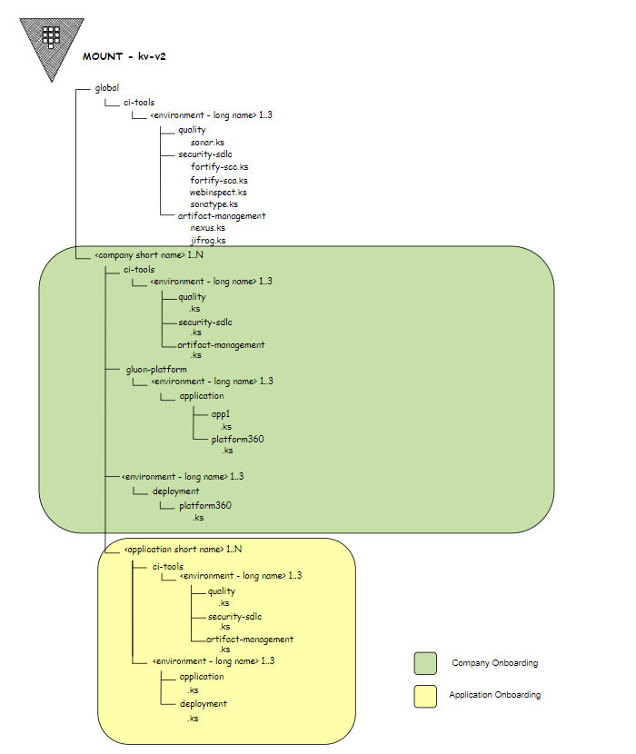

# Hashicorp Vault in GLuon

## HashiCorp Vault Installation

It is installed following a helm command by Gluon Platform team in a Kubernetes cluster with version 1.13.3. Allowing high availability of the services thanks to a cluster vault configuration in kubernetes:

```bash
helm search repo hashicorp/vault
helm install vault hashicorp/vault --version 0.24.0 (helm chart version)
```

### Internal Structure

According with Architecture decision the structure of the Hashicor Vault's secrets and folders will be the next one:

!!! note

    All secrets URLs start with `<vault_dns>/v1/kv-v2/data/` in their path.

{width="900" height="460" style="display: block; margin: 0 auto"}

### 1.2  Explanation of every folder

- **global**: This folder is used only when a process has only one secret per all gluon companies (this folder is only temporal).
The teams or automatizations related with this folder are the ones with CI pipelines or legacy process that don't support different credentials in the current status.

- **ci-tools**: This folder is used to save credentials related with all the tools used in pipelines to check the security of the code and the management of artifcacts. These type of secrets can be save in different levels.
The compliance status will be when secrets are segregated by companies at least.

- **company-short-name** must be the one at APM

- **ci-tools/environment-long-name** different companies have various CI environments depending on their idiosyncrasies. By default three spaces will be created in the Vault: "certification", "preproduction" and "production".
During execution of the CI workflows a variable in the github organization will be used to identify which CI environment will be used. This value can be overwritten at repository level allowing for fine-tuning at application level.

- **gluon-platform**: Is a special space in the structure for secrets that gluon uses in automation processes that affect the countries infraestructure.

- **environment-long-name** an application's assets are deployed to, and run, in different environments. By default three spaces will be created: "certification", "preproduction" and "production".

- **application-short-name** must be the Gluon application short name.

- **application-environment-long-name** By default three spaces will be created: "certification", "preproduction" and "production". These map with the deployment configuration environment name provided by the user.

- **secret-name** is a key store file where the secrets will be saved. The names of the secrets are defined by their owners.

- **<_company-short-name_>/<_application-environment-long-name_>/deployment**: these deployment secrets are shared by the company to resolve their deployments.

### 1.3  Example with folders' name defined

=== "kv-v2/data/san/myapp/application/mysecret"

```txt
v1/kv-v2/data/
    global/
        ci-tools/
            preproduction/
                quality/
                    sonar.ks
                secure-sdlc/
                    fortify-scc.ks
                artifact-management/
                    nexus.ks
            production/
                quality/
                    sonar.ks
                secure-sdlc/
                    fortify-scc.ks
                artifact-management/
                    nexus.ks
    san/
        ci-tools/
            preproduction/
                quality/
                    my-quality-secret.ks
                secure-sdlc/
                    my-sdlc-secret.ks
                artifact-management/
                    my-artifact-secret.ks
            production/
                quality/
                    my-quality-secret.ks
                secure-sdlc/
                    my-sdlc-secret.ks
                artifact-management/
                    my-artifact-secret.ks
        gluon-platform/
            preproduction/
                application/
                    gluonapp_1/
                        gluonapp_1.ks
                    platform360/
                        secret.ks
            production/
                application/
                    gluonapp_1/
                        gluonapp_1.ks
                    platform360/
                        secret.ks
        preproduction/
            deployment/
                my-deployment-secret.ks
        production/
            deployment/
                my-deployment-secret.ks
        myapp01/
            ci-tools/
                certification/
                    quality/
                        my-quality-secret.ks
                    secure-sdlc/
                        my-sdlc-secret.ks
                    artifact-management/
                        my-artifact-secret.ks
                preproduction/
                    quality/
                        my-quality-secret.ks
                    secure-sdlc/
                        my-sdlc-secret.ks
                    artifact-management/
                        my-artifact-secret.ks
                production/
                    quality/
                        my-quality-secret.ks
                    secure-sdlc/
                        my-sdlc-secret.ks
                    artifact-management/
                        my-artifact-secret.ks
            certification/
                deployment/
                    my-deployment-secret.ks
                application/
                    my-application-secret.ks
            preproduction/
                deployment/
                    my-deployment-secret.ks
                application/
                    my-application-secret.ks
            production/
                deployment/
                    my-deployment-secret.ks
                application/
                    my-application-secret.ks
```

---

### 1.4. Backups

The data persistence is done through snapshots every 6 hours since there is no second Hashicorp Vault replica. These snapshots are generated automatically with a kubernetes cron and uploaded in a S3 bucket in AWS.

- ### :heavy_check_mark: Guides

    See [Company Onboarding](../../../../../getting-started/company-management/company-onboarding.md) for the first steps you need to start using secrets in your organization.

    See the [User Guide](../how-to/index.md) for details on how to access the console and manage secrets.

- ### :raising_hand: Related Content

    [Vault Documentation](https://developer.hashicorp.com/vault/docs)

    [Vault Use Cases](https://developer.hashicorp.com/vault/docs/use-cases)

    [Vault limits](https://developer.hashicorp.com/vault/docs/internals/limits)

</br>
