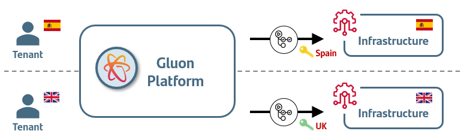

Security enablers are services that support the secure execution of application. These can be controls in place, patterns, policies and structure for the business so that they know the bounds within which their innovation can operate.

For more detail about Security Principles go [here](./red-lines.md)

## Secret Management in the context of Gluon V3

**Gluon**, as a multi-tenant platform, requires the use of secrets to provide service to the different tenants (Santander Group entities) it serves.
Those secrets, usually service principals, belong to the entities and such, their management: Creation, information in Gluon, rotation, etc.
In this respect, Gluon does not impose nor impact the operating model of the entities(who or how).

## Solution requirements

The general requirements for Secret Management have been adjusted to the specific scope of the proposed solution for storing and using secrets in Vault.

The following requirements must be meet:

| ID          | Description  |  Detail |
| ------------| -------------|----------------------------------------------------------------------------------------------------------------------|
| FUNC-REQ001 | Support main types of secret. | For this use case, the solution must support Deployment and Application Secrets, both static secrets.|
| FUNC-REQ002 | Support main capabilities for stored secret. | For this use case, the minimum capabilities to cover are Creation/Update/List, Delete and Audit.|
| FUNC-REQ003 | Integration out of the box with main CI/CD tools. | For this use case, the CI /CD tool is GitHub. |
| FUNC-REQ004 | Integration out of the box with native operators in Kubernetes Clusters. | As for this use case, Secret lifecycle Management is not included, this requirement is not detailed but technically possible. |  
| FUNC-REQ005  | Integration out of the box with main Databases vendors. | As for this use case, Secret lifecycle Management is not included, this requirement is not detailed but technically possible. |
| FUNC-REQ006  | Integration with main Cloud Service Providers. and OHE. |As for this use case, Secret lifecycle Management is not included, this requirement is not detailed but technically possible. |  
| NON.FUNC-REQ001  | Secrets management console with interactive and programmatic interface. | All secret operations should preferably be done programmatically.
| NON.FUNC-REQ002  | Audit and Security Monitoring  | The System Manager must log all actions over secrets. The Secret Manager must integrate with Splunk SIEM to centralize events.
| NON.FUNC-REQ003  | JWT/OIDC Authentication  | SSO for human user Authentication.
| NON.FUNC-REQ004  | Role Base Access Control Model for SoD | IAD RBAC for Human Administrators / Users.
| NON.FUNC-REQ005  | Multi-tenancy isolation  | Isolation between tenant, environments and applications.
| NON.FUNC-REQ007  | Encryption at rest and in transit | All data must be encrypted according with the Group Cryptographic Standard.
| NON.FUNC-REQ008  | Centralized secret management for the Gluon platform | All the secrets must lie in one central element for more efficient management..

---

 

- #### [Hashicorp Vault](./hashicorp-vault/index.md)

    ---

    Identity-based secrets and encryption management system.

     

 
