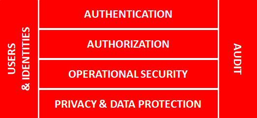
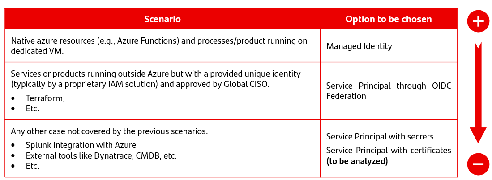
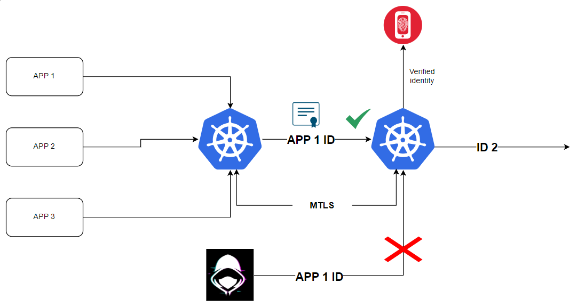

# Back to basics

## 1.-General Security Layers

From a basic starting point, any Security Architecture can be structured following a model divided into six functional layers:

{width="600" height="460" style="display: block; margin: 0 auto"}

- **Users & Identities**: Users are entities for which the system provides identity, for the purpose of allowing them to engage in transactions.
 Users can be defined as a collection of individual attributes that describe an entity-identity, and determine the transactions in which that entity can participate and how.
 Without identity there is no security. An identity will be needed for the purpose of securing applications, as far as they are not totally public or anonymous oriented.

- Data Security Architecture should manage identity to be implemented.

    - **Authentication**: Defined as the act of verificate that an entity/identity is who/what it claims to be, using one or a combination of security mechanisms as, mainly, can be: something the entity has, something that it is, something that it knows.
    - **Authorization**: Explicit security step, that based on known information, and starting from an authentication status point.
    This functionality resolves the permissions that define what operations with data an identity can perform in the context of a specific application.
    It establishes what types of resources are allowed or denied for a particular user or group of users.

- For ending, in particularly sensitive operations, security may require a new authentication invocation, since a prior authentication to that moment of operation does not mean evidence that the authenticated identity is still in control of the front
from which it is operating.

    - **Operational Security**: It is the implementation of the own security of the transaction that is being executed, following a functional definition very close to business operations.
    - **Privacy**: As far as data are considered today's “new oil”, it's a main security practice that aims to design, implement, guide, monitor and manage security over an organization's data.
    It primarily aims at securing and protecting logical data stored, consumed, and managed by an application, as well as users privacy, and so, inspire confidence that sensitive information is being handled correctly.
    It is mandatory to be aligned with regulations (both internal and external).
    - **Audit**: It is the action of monitorize and recording all the relevant information that is occurring in the system, including the ones related with security in respect of accesses, permissions resolution and services execution.

It is the pillar for detecting malfunctions, attacks and vulnerabilities, as well as the source for forensic investigation, legal information requirements and the support for incidents resolution.
Recorded information must accomplish with integrity and normalized time stamping, as well as being integrated with existing and homologated mandatory audit systems and policies.

---

## 2. Basic Principles

In onder to understand the secrets and certificates management we have to know the security basic principles. These are the fundations of the security chapter.

- **Preferred type of Service Account.** Always use a managed identity whenever you can. If this is not possible use a Service Principal through OIDC Federation and if this is not possible, then a Service Principal with secrets or certificates.

- **Standards of data.** The first consideration should be that secrets and certificates eventually are data. So all the standards related with data are going to apply over them.
When we talk about standard of data, we are talking about Standard of Identity Management, Standard of Cryptography, Data Custody.

- **Provide the least privilege access.** We have to ensure the access obteined is the minimum access required. Secret Management solution must have the ability to allow access to a specific secret and the ability to segregate access to the secret.
These accesses must be role-based, RBAC, ensuring a correct implementation of segregation of duties (SoD).

- **Every entity must be independent and only them must have the visibility of their own data.** Considering Gluon as a multitenant platform from a Security side. Every tenant/entity must be able to access/maintein their data without Gluon interaction.
Gluon teams must not be able to see any restricted/confidential information from the entities.

- **No information should be crossed.** As every entity is a different tenant. Must not be any identity used in more than one entity, or cross between entities from Gluon side.

- **The identities must be created by entity/tenant and ENVIRONMENT.** In order to avoid any production to be compromise by error or with bad intentions the identities used in development or in preproduction never must be used in production environment.

- **The identities impersonated by others must be signed and guaranteed by a identity provider.** Every identity used by others must be with a signed token  and must be guaranteed by a identity provider.

