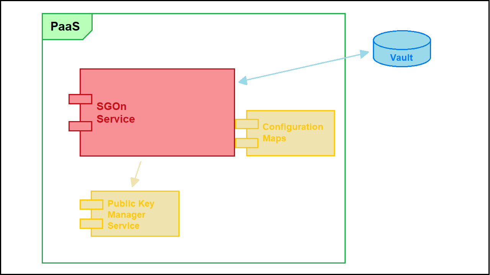

# Security Gluon On Boarding 

This document gives a complete and detailed technical overview of how to use the Security Gluon On Boarding

## Secure Connections

This component complies with the **Santander Group Cryptography Security Standard (draft version)** declared for secure connections the secure connections (HTTPS, LDAPS, DDBB, etc.) in both incoming and outgoing connections.

## Architecture

This is the _SGOn_ architecture diagram:

Now, we will describe the different components involved in the _SGOn Service_ architecture:

* **Public Key Manager Service**: Remote service as the key repository to obtain the public keys (this remote service does not allow to obtain a private key). Repository URL can be specified in service configuration.
* **Configuration Maps**: provides and manages the configuration of the deployed micro-services.
* **Vault**: The secret manager.

## Functional specification

The _Security Gluon Onboarding Service_ helps to create and retrieve a secret spaces in vault.

### Spaces management

#### Company

##### Get company spaces

!!! note "Endpoint"
    The endpoint only can be executed by users that have a valid jwt.

This endpoint allows to retrieve the base uri of the secrets of a company, if it exists (if the onboarding has been done before).

#### Application

##### Create application spaces

!!! note "Endpoint"
    The endpoint only can be executed by users that have a valid jwt.

This endpoints allows the creation of spaces for the secrets, creating roles and policies too with default permissions.
If the onboarding is successful, the base uri of the secrets created for the entered application and company is returned.

Will created fifteen secrets spaces, thirteen policies, three roles, and one group/group-alias:

  * The path of secrets (spaces) will follow the structure:
    * /kv-v2/{companyName}/{applicationName}/{environment}/{secretType}/
    * /kv-v2/{companyName}/{applicationName}/ci-tools/{environment}/{ciToolType}/
  * The naming convention for policies are:
    * policy_{companyName}_{applicationName}_developer_reader_{cert_env_name}
    * policy_{companyName}_{applicationName}_{secretType}_reader_{environment}
    * policy_{companyName}_{applicationName}_ci_tools_reader_{environment}
    * policy_{companyName}_{applicationName}_global_ci_tools_reader_{environment}
  * The naming convention for roles are:
    * role_{companyName}_{applicationName}_reader_{environment}
  * The naming convention for development groups are:
    * group_secret_manager_{companyName}_{applicationName}_development_{cert_env_name}
  * The naming convention for development groups are:
    * group_secret_manager_{companyName}_{applicationName}_tl_{cert_env_name}

Where:

* **companyName**: entry param of three characters.
* **applicationName**: entry param between one and seven characters.
* **environment**: Shall correspond to the configured values. Default _certification_, _preproduction_, _production_.
* **cert_env_name**: Shall correspond to the certification environment name configured value.
* **secretType**:Shall correspond to the configured values. Default _application_, _deployment_.
* **ciToolType**:Shall correspond to the configured values. Default _quality_, _security-sdlc_, _artifact-management_.

##### Get application spaces

!!! note "Endpoint"
    The endpoint only can be executed by users that have a valid jwt.

This endpoint allows to retrieve the base uri of the secrets of an application in a company, if it exists (if the onboarding has been done before).
