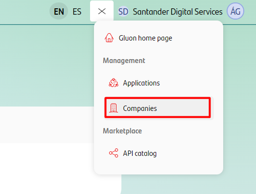
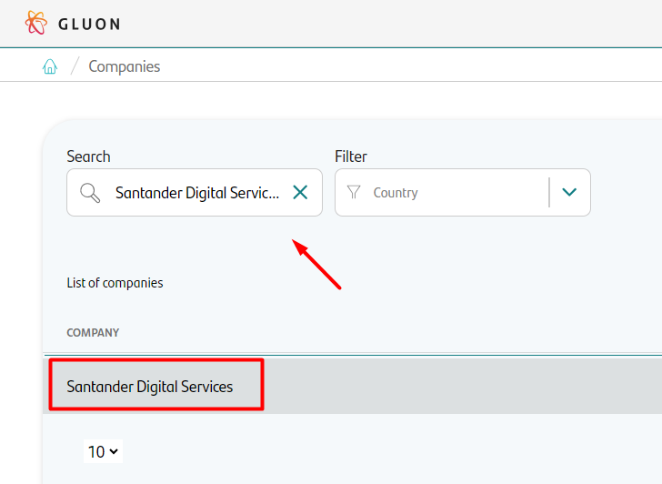
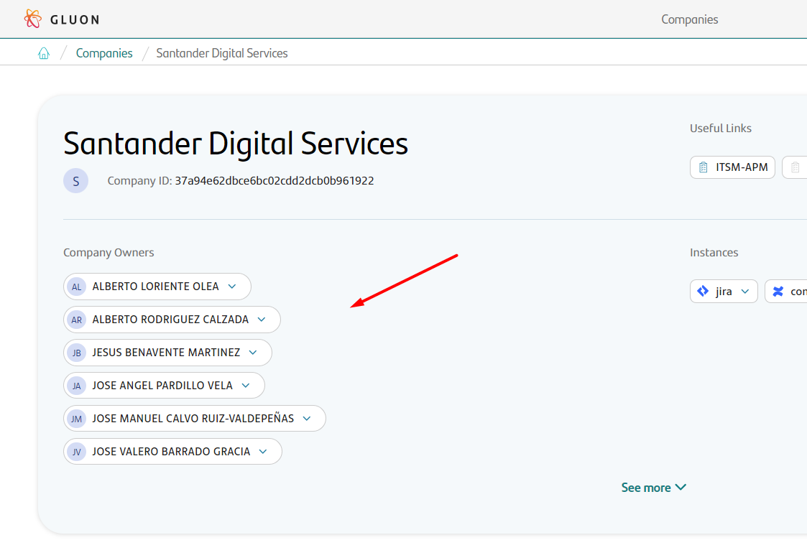

## Introduction

This section will explain the different types of users that exist in Gluon. Each role has permissions and limitations associated with the actions that the user wants to perform.

Currently, Gluon has **3** types of users or **roles**:

### :fontawesome-solid-building-user: Company Owner

Manage **configuration and registration** of applications in the company.
You have to contact him if:

* You need to register an application in Gluon
* You want to change something in the global application configuration.

### :fontawesome-solid-user-tie: Application Owner

He is in charge of application **team management**, collaboration with the **local API team** and management of your application's **api subscriptions**
You have to contact him if:

* You need to add people to your application
* You need to configure tools to your application
* You want to subscribe to an API
* You need to create a new API

### :fontawesome-solid-user: Application team member

Manage the lifecycle of the **application components** (creation, sdlc, releases...), and any capability offered within your Gluon application.
Most probably, if you don't know what role you have, this is your role.

* Create components
* Manage de lifecycle of components

 

:octicons-play-16: **Onboarding Process & Gluon Roles**

<iframe class= iframes src="https://santandernet.sharepoint.com/sites/gluonacademycommunity/_layouts/15/embed.aspx?UniqueId=02a58d45-eff6-4cab-bd30-2d6c30c69b31&embed=%7B%22ust%22%3Atrue%2C%22hv%22%3A%22CopyEmbedCode%22%7D&referrer=StreamWebApp&referrerScenario=EmbedDialog.Create"
width="1280" height="720" frameborder="0" scrolling="no" allowfullscreen title="Onboarding Process & Gluon Roles"  loading="lazy"></iframe>

---

 

## Company Owners List

To access the list of Company Owners of a specific company, follow the steps below:

* **Navigate the Menu.** From the Gluon home page, locate the menu icon in the top right corner. Click on it to reveal the menu options. Select the Companies Section. In the expanded menu, find and click on the `Companies` option.
    <figure markdown>
    
    <figcaption></figcaption>
    </figure>

* **Explore the Companies Listing.** On the Companies page, you will find a comprehensive listing of all the registered companies within Gluon. Here, you can search or filter the companies based on their name or country.
    <figure markdown>
    
    <figcaption></figcaption>
    </figure>

* **View Company Details.** Once we are in the company details we will see the list of owners.
    <figure markdown>
    
    <figcaption></figcaption>
    </figure>

