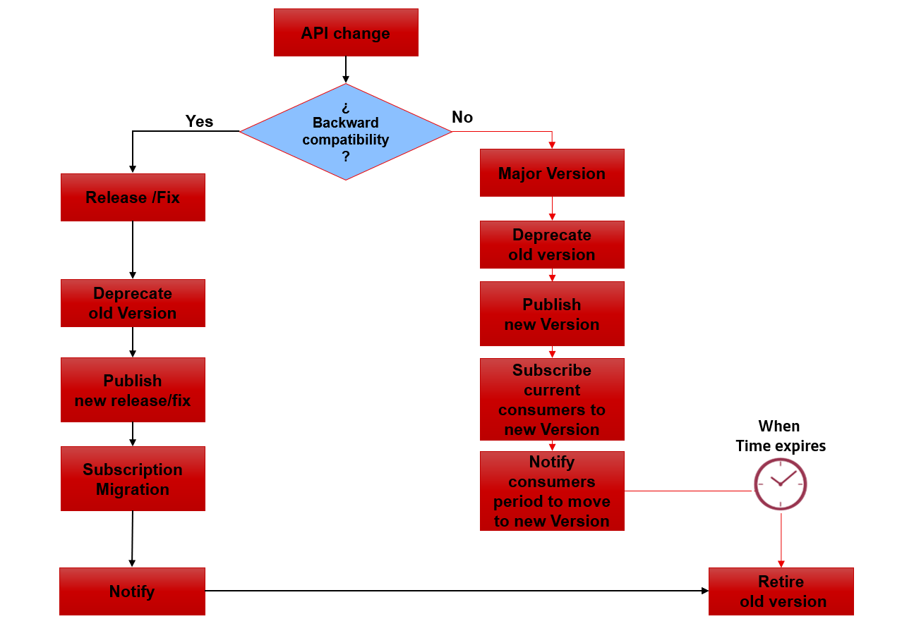

# DA2 - API Versioning

### Introduction

API Versioning is the capacity of managing and tracking changes to an API and the Products that they compose.
Assuming it implies a catalog of APIs able to store these versions and a strategy of generation, publication and withdrawal of a new version of an API.

This strategy is usually defined by the following attributes, which are implemented in the infrastructure and ecosystem of APIs:

- Do not have more than 2 major versions of an API.
- Never have more than one release. In cases of new releases or fixes, first deprecate.
- It is not advisable to use the Plans for versioning the APIs; new versions of Products must be created.

### Versioning use cases

#### API Compatible changes

| Problem | Example | API Version | Product Version (CER/PRE/PRO) |
|---------|---------|-------------|-------------------------------|
| Add new operations. | e.g.: add a new GET operation on a resource. | YES, release | YES, release |
| Add optional input parameters to requests on existing resources. | e.g.: a new filtering parameter in a GET on a collection of resources | YES, release | YES, release |
| Add new properties in a resource that the server returns. | e.g.: to a resource Person that previously was composed by DNI and name, we added a new field age. | YES, release | YES, release |
| New Optional  parameter in Query params  | e.g.: /users?filter=[{“type”:”type”,”role”:”role”}] | YES, release | YES, release |
| Same API(same contract), with new different values which implies different functionality | e.g. Payments Initiation API, with different currency payments| YES, release | YES, release |
| Modify input parameters from mandatory to optional. | e.g.: when creating a resource, a property of such a resource that was previously mandatory and made optional. | YES, release | YES, release |
| A bug is detected in the API | e.g.: The return value is not correct for the requested parameter | YES, Fix | YES, Fix |
| Modify API description | e.g.: description detail which does not affect API functionality or behavior | YES, Fix | YES, Fix |
| Modify API Contact | - | YES, Fix | YES, Fix |
| New Optional Header Parameters, which does not add new functionality | e.g.:X-MyHeader: Value | YES, Fix | YES, Fix |

#### API Incompatible changes

| Problem | Example | API Version | Product Version (CER/PRE/PRO) |
|---------|---------|-------------|-------------------------------|
| Add new required input parameters. | e.g.: now to register a resource you must send in the body of the request a new field required. | YES, version | YES, version |
| Modify a parameter in existing operations (verbs about resources). Also, applicable to the removal of parameters. | e.g.: when you query a resource, a field is no longer returned. Another example: a field that was previously a string of characters, is now numeric. | YES, version | YES, version |
| Modify input parameters from optional to required. | e.g.: now when creating a Persona resource, the age field, which was previously optional, is now mandatory. | YES, version | YES, version |
| Add different responses in existing operations. | e.g.: now the creation of a resource can return a new response| YES, version | YES, version |
| Delete operations or actions on a resource | e.g.: we removed the operation consult age about a resource Person | YES, version | YES, version |
| New parameter in Query param which implies new functionality | e.g. customer_id vs uid in token | YES, version | YES, version |
| Modify/DELETE a Query param parameter  | e.g. remove a filter parameter in Query param | YES, version | YES, version |
| New Mandatory Header Parameters  or modification | e.g X-MyHeader: Value | YES, version | YES, version |

#### Product Compatible changes

| Problem | Example | API Version | Product Version (CER/PRE/PRO) |
|---------|---------|-------------|-------------------------------|
| Add Apis , Add Operations , Add a Plan | e.g.: Add a Plan | NO | YES, Release |
| Perform a Plan increase change on a Product | e.g.: Product throttling increases | NO | YES, Fix |

#### Product Incompatible changes

| Problem | Example | API Version | Product Version (CER/PRE/PRO) |
|---------|---------|-------------|-------------------------------|
| An API is removed or a Plan is removed | e.g.: -- | YES, version | YES, version |
| Delete, or perform a Plan decrease change on a Product | e.g.: Product throttling decreases | NO | YES, version |

#### Actions between the versions of the Products, APIs and plans

| Use Case | Action |
|---------|--------|
| A new major version of the API | You must version the Products that include the API to a major version (myProduct v1.0.0-> myProduct v2.0.0) and include the new version of the API (myAPI v3.0.0) in this new version of the Product. The old version of the APIs and Versioned Products must be retired within a reasonable time. You should always notify those interested that the previous version will be retired and should migrate to the new version. |
| A new release of the API | You must version the Products that include the API to a release version (myProduct v1.0.0-> myProduct v1.1.0) and include the new release of the API (myAPI v1.2.0) in this new release of the Product. The old version of the APIs and Versioned Products must be retired within a reasonable time. You should always notify those interested that the previous version will be retired and should migrate to the new version. |
| A new fix of the API | You must version the Products that include the API to a fix version (myProduct v1.0.0-> myProduct v1.0.1) and include the new fix of the API (myAPI v1.0.1) in this new fix of the Product. The old version of the APIs and Versioned Products must be retired within a reasonable time. You should always notify those interested that the previous version will be retired and should migrate to the new fix. |
