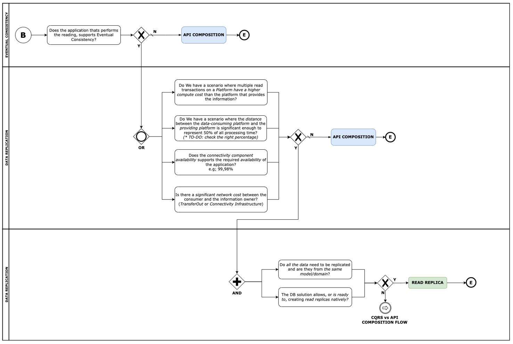
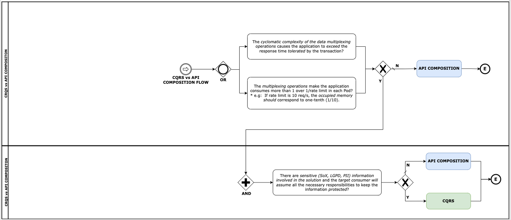

## DD1 - Decision tree for Data Replication

When designing a solution it is necessary to have a strategy for data replication along the system, so a decision tree is provided to help choosing the best possible solution.

{: .image-popup align="center" style="width:100%"}

{: .image-popup align="center" style="width:100%"}
