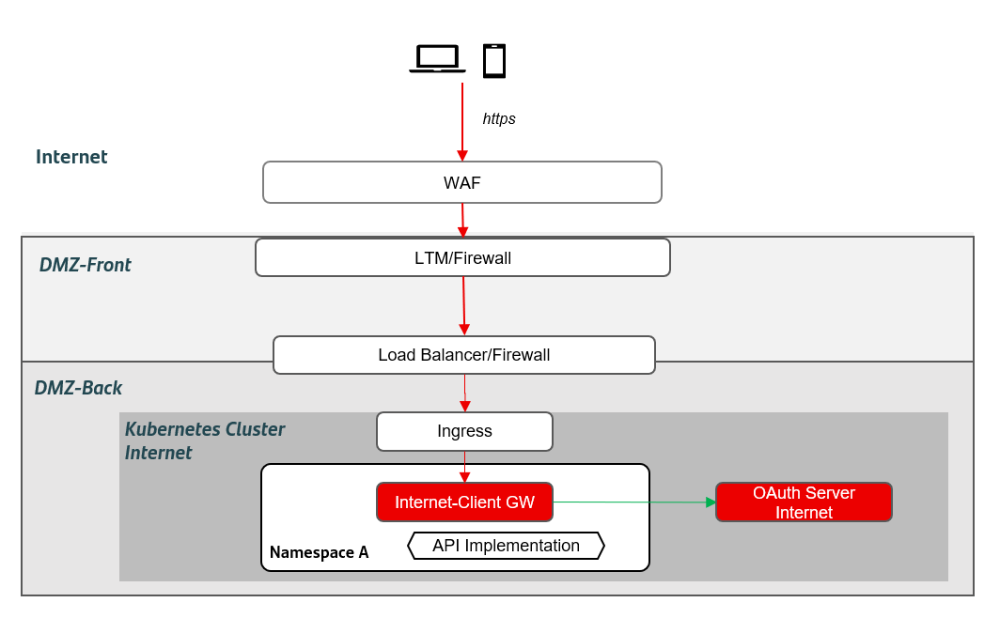
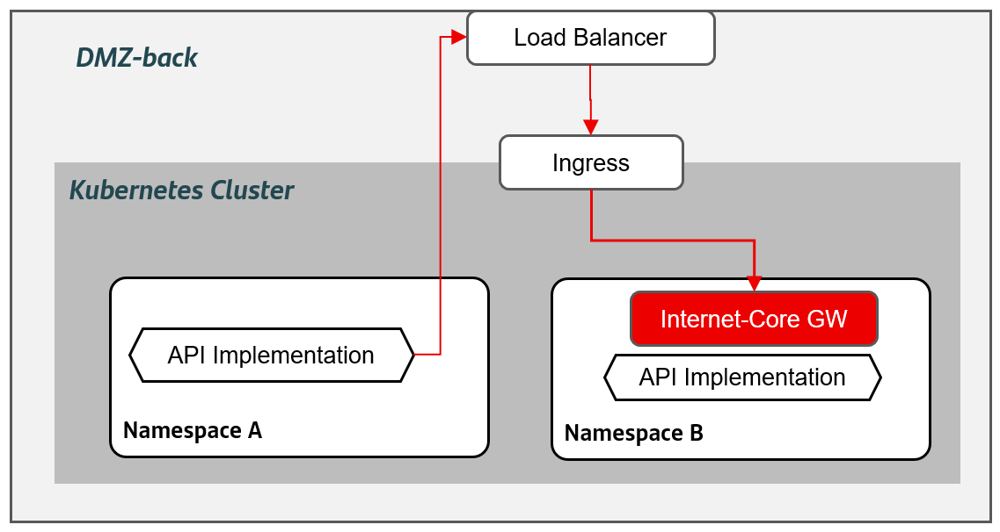

## DG2 - Internet use cases

### Touchpoint applications in Internet

The first use case to be considered is the Applications exposing APIs to a touchpoint in Internet.

!!! note
    Only web and mobile applications consuming APIs are in the scope. Other use cases will have to be analyzed in detail to design their architecture
    appropriately (processes, batches, etc.), although part of what is defined in this document may apply.

{: .image-popup align="center" style="width:100%"}

### Interdomain communication in DMZ-back

An application deployed in DMZ-back may need to consume an API from other domain, which is deployed in a different namespace inside DMZ-back. It is acceptable to access it via a internet core gateway, as it is shown below.

{: .image-popup align="center" style="width:100%"}
