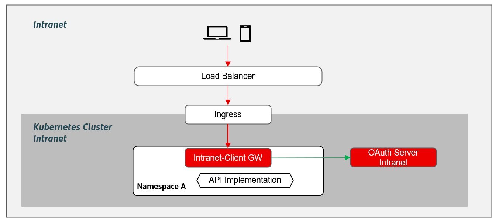
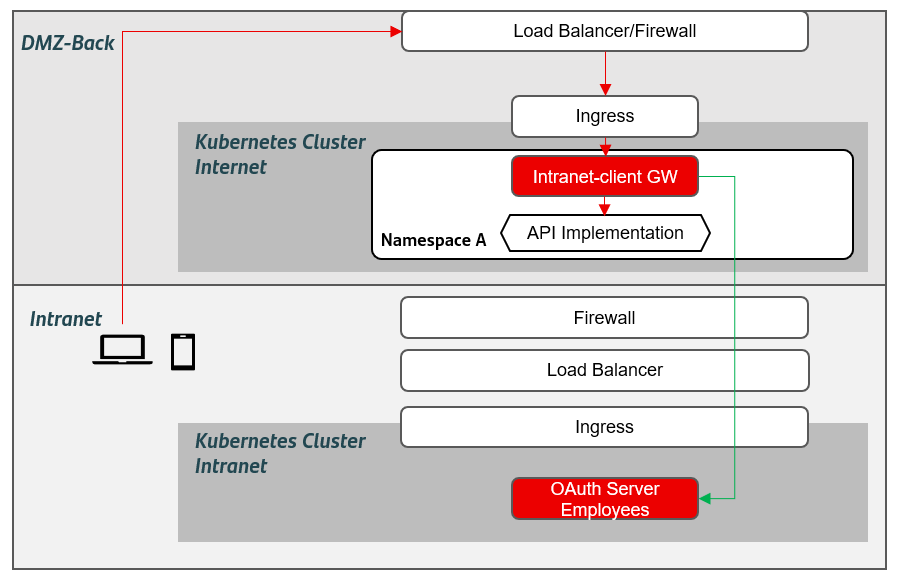
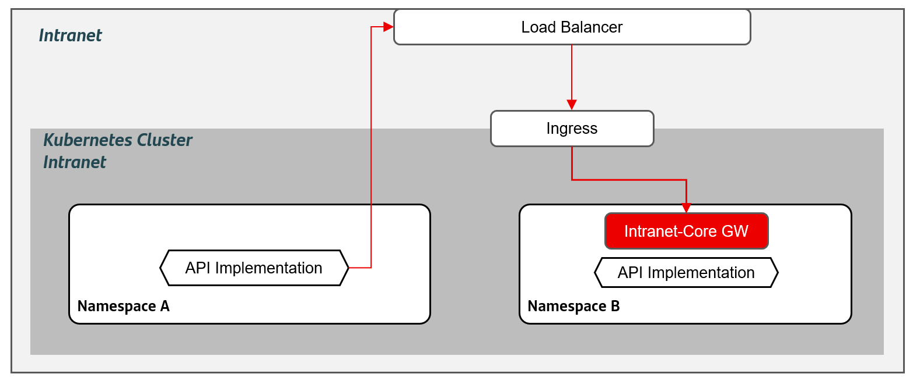
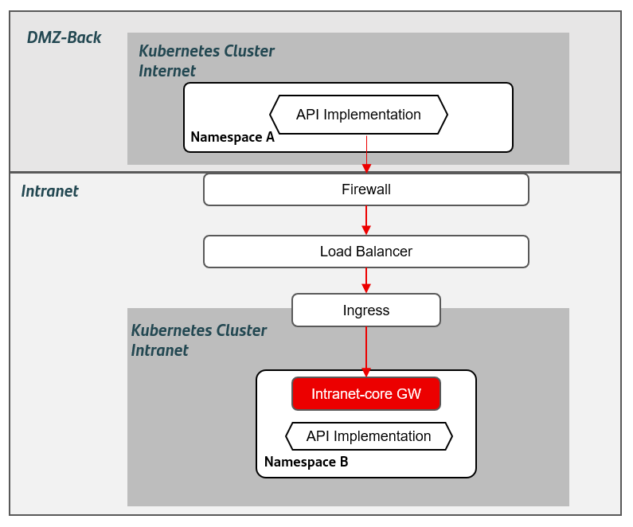
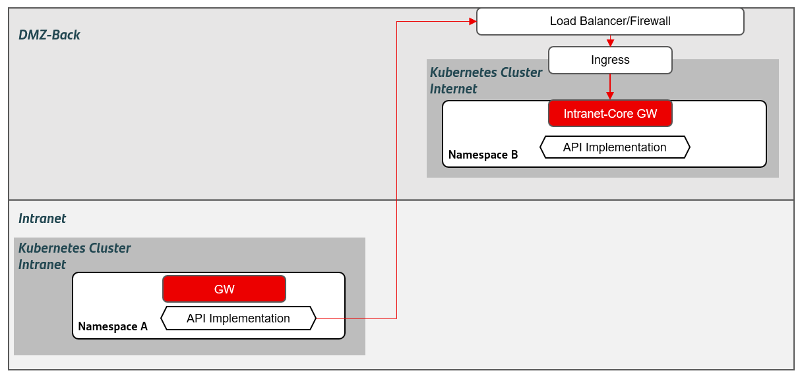

## DG3 - Intranet use cases

### Touchpoint applications in Intranet

When an application exposes APIs to a touchpoint internally via Intranet.

!!! note
    Only web and mobile applications consuming APIs are in the scope. Other use cases will have to be analyzed in detail to design their architecture
    appropriately (processes, batches, etc.), although part of what is defined in this document may apply.

{: .image-popup align="center" style="width:100%"}

#### Consumer in Intranet accessing APIs deployed in DMZ-back

Linked to the previous use case, an application in Intranet has to access an API which is deployed in DMZ-back. In this case, an intranet client gateway is deployed in DMZ-back has to be connected to an Employees Oauth Server.

{: .image-popup align="center" style="width:100%"}

### Interdomain use cases in intranet

An application deployed in intranet may need to consume an API from other domain, which is deployed in a different namespace inside intranet.
The correct way to access it is shown below.

{: .image-popup align="center" style="width:100%"}

#### Interdomain communication from DMZ-back to intranet

A microservice in DMZ-back needs to communicate to an API deployed in intranet.
In this case, the microservice has to connect to the Intranet core gateway through the intranet firewall and load balancer.

{: .image-popup align="center" style="width:100%"}

#### Interdomain communication from intranet to DMZ-back

A microservice deployed in intranet may need to consume an API from other domain, which is deployed in DMZ-back.
The way to access it is through an intranet core gateway in DMZ-back, as it is shown below.

{: .image-popup align="center" style="width:100%"}
