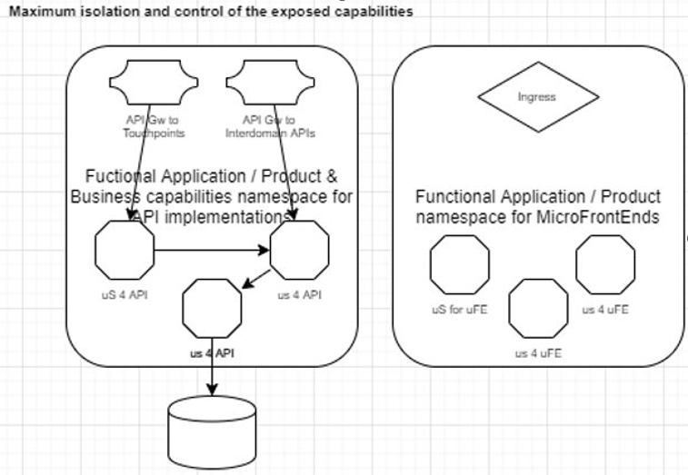
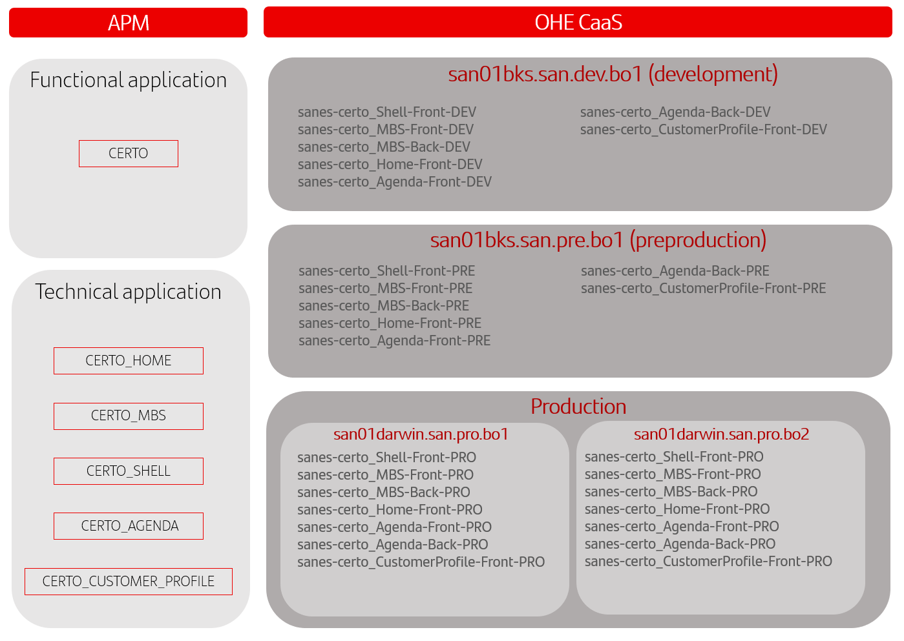

# DG1 - Namespace Segregation

- The criteria to define the namespaces:

    - Consider the Service Domain (BIAN Criteria) / Functional Application to define a namespace as the main criteria​
    - Due to the Software Configuration and Control principle, if the software components are managing their data models and their
    independent lifecycle within the Service Domain, this would lead to a separation in namespaces, considering exposing the
    capabilities from one to another part as APIs.

- This would allow us to control the Security context while making as much flexible as possible the interactions within the Service domain.​

- ​In the case the application have static contents for the MicroFronts this will be placed in a separated namespace to maximize isolation
and control as the exposition varies from - the API exposure. ​​

- The namespaces model will be replicated per environment: dev, cert, pre and prod​

- The proposal for naming the namespaces according this criteria is the following:

    - `<entity>-<functionalapp/servicedomain>-<namespacename/app>-<namespacetype:[Front/Back]>-<env>`

    - Example:`sanes-<certo-o-comercialtools>-agenda-front-[dev/cert/pre/pro]`

## Use case example - CERTO Spain

