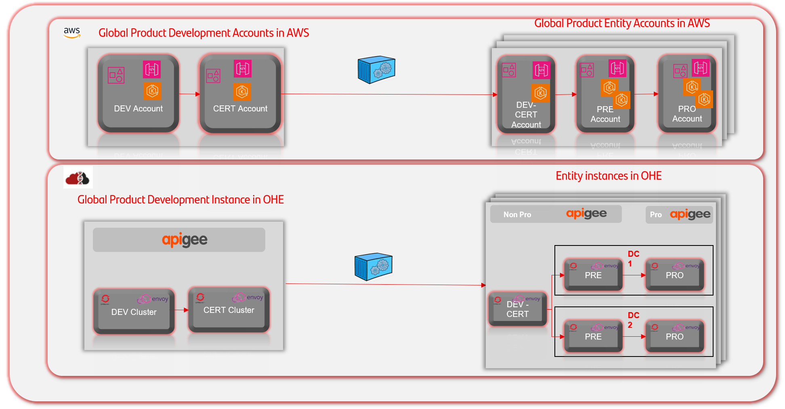
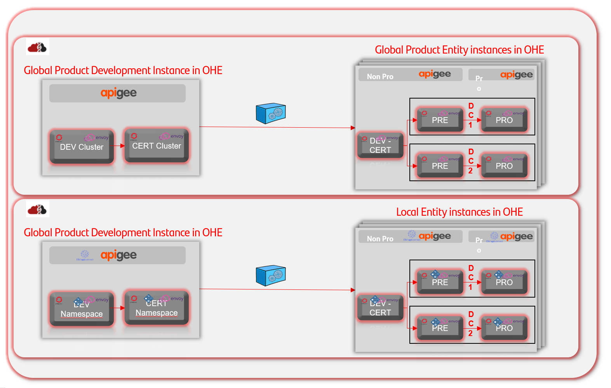
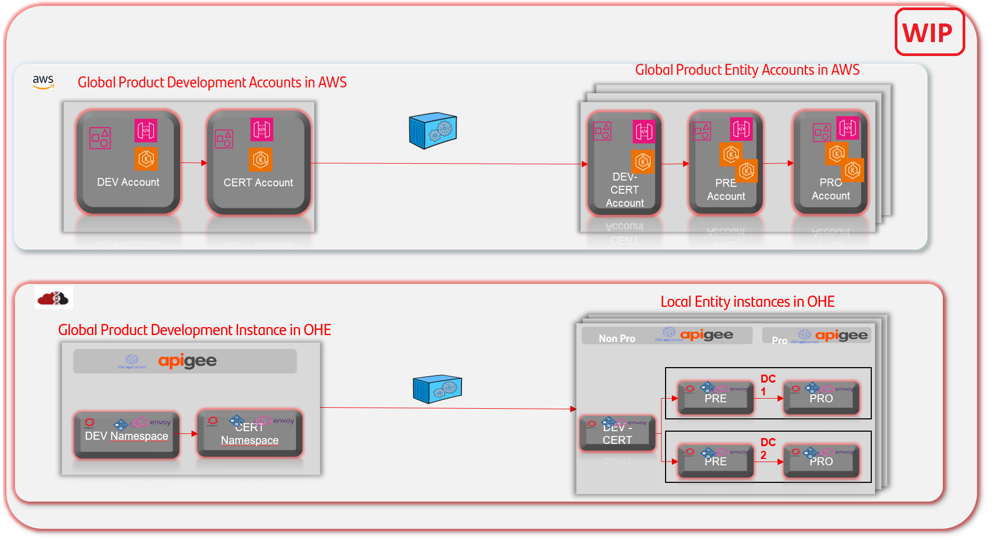
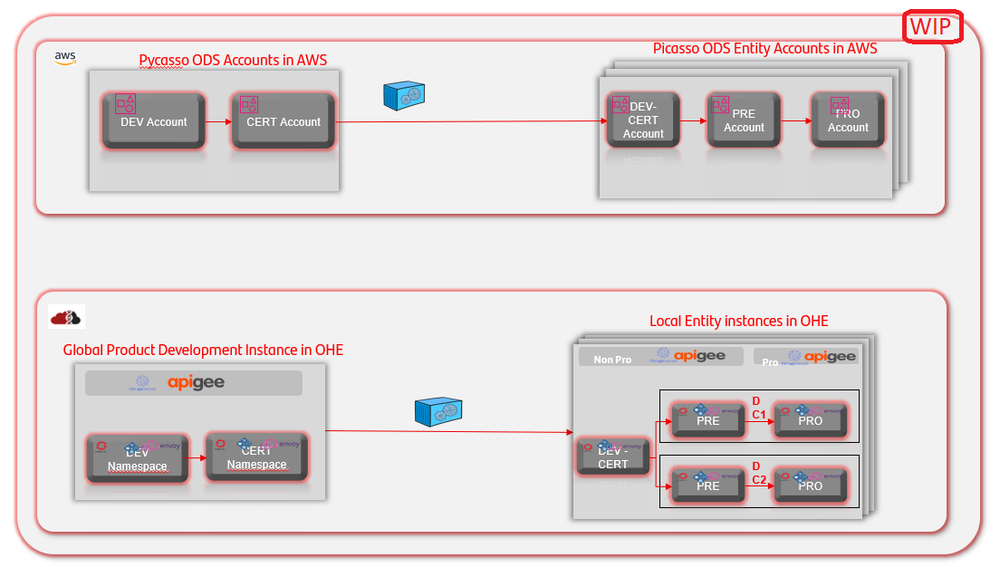

# DI1 - Environment Model

## In Operational PaaS the environments model is being standardized

- DEV & CERT environments don’t need high availability and are normally deployed with the minimum required infrastructure.
    Depending on the number of developers and/or software deployed, it’s recommended to size this environment properly, even
    implementing high availability in certain components. CERT environment will have the software to be promoted to PRE and PRO

- PRE-PRODUCTION should be an identical replica of a PRODUCTION environment. If there are more than one PRO env, PRE must have
    the same size than the bigger PRO env.

- PRODUCTION environment is the most robust environment. Some components can be segregated by domains to ease scalability and resilience.

## Example use cases

### CERTO Spain

Assisted Channel Global Product In Gluon PaaS OHE:

- Dedicated OCP clusters for the Product, and dedicated API Manager to manage the product APIs.
- Business logic separated in kubernetes namespaces, protected by External or Internal APIgws within the namespace depending on the exposition and data schemas in Entity Exadata.
- Observability with ALMA.
- Local Integrations through Gluon Compliance APIs with a defined behaviour.

Gravity+ in Gluon PaaS OHE:

- Prerrequisites: OCP clusters and Certified API Manager (APIgee or IBM API Connect v10).
- Business logic separated in kubernetes namespaces, per Service Domain, protected by External or Internal APIgws within the namespace depending on the exposition and data schemas in Entity Exadata.
- Observability with ALMA.
- Expose Partenon / Altair capabilities via these APIs.

### One Digital

Digital Channels in Gluon PaaS In AWS:

- Dedicated Account per Business Domain or Product.
- Dedicated Kubernetes clusters for the business logic.
- Business logic separated in kubernetes namespaces, protected by External or Internal API depending on the exposition and dedicated data services.
- Observability with ALMA.
- Local Integrations through Gluon Compliance APIs with a defined behaviour.

Gravity+ in Gluon PaaS OHE:

- Prerrequisites: OCP clusters and Certified API Manager (APIgee or IBM API Connect v10).
- Business logic separated in kubernetes namespaces, per Service Domain, protected by External or Internal APIgws within the namespace depending on the exposition and data schemas in Entity Exadata.
- Observability with ALMA.
- Expose Partenon / Altair capabilities via these APIs.

### Pycaso Mexico

Pycaso In AWS:

- Requirements to be confirmed.

Gravity+ in Gluon PaaS OHE:

- Prerequisites:  OCP clusters and Certified API Manager (APIgee or IBM API Connect v10).
- Business logic separated in kubernetes namespaces, per Service Domain, protected by External or Internal APIgws within the namespace depending on the exposition and data schemas in Entity Exadata.
- Observability with ALMA.
- Expose Partenon / Altair capabilities via these APIs.
