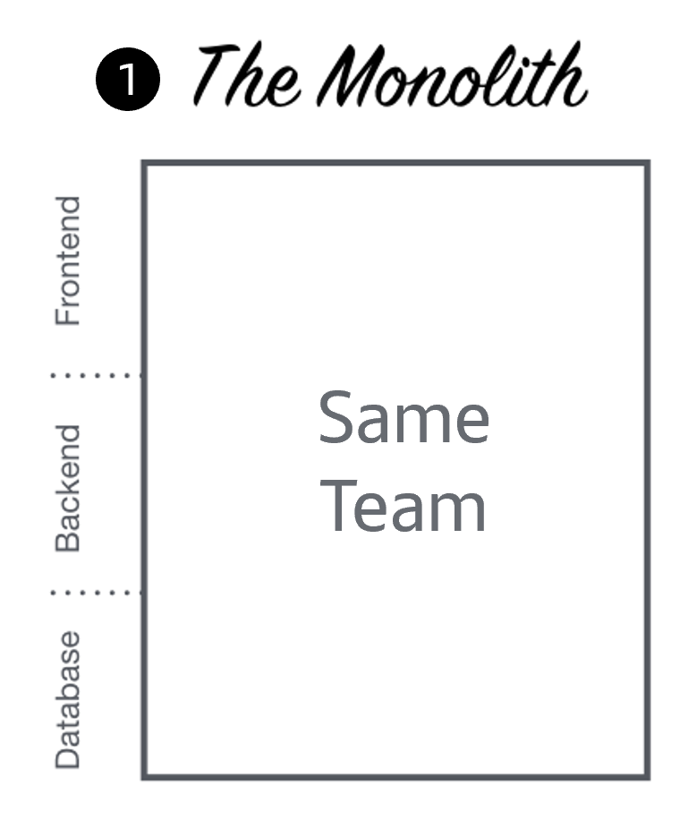
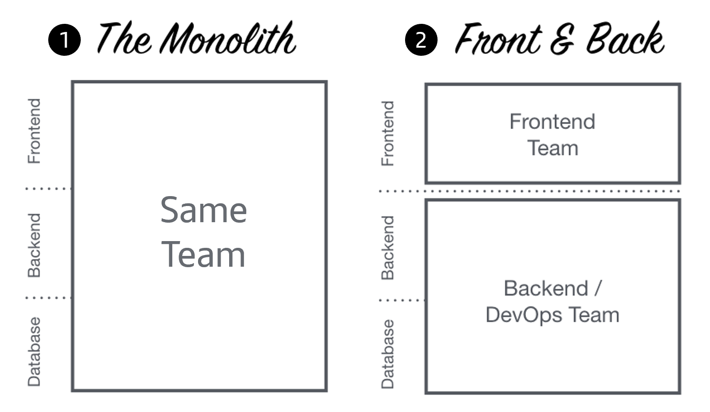
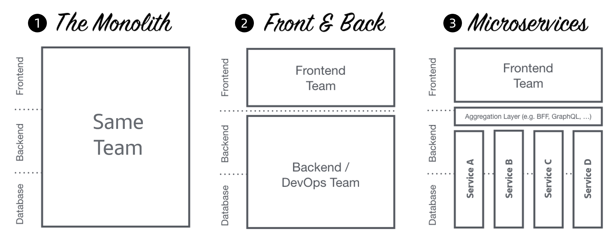
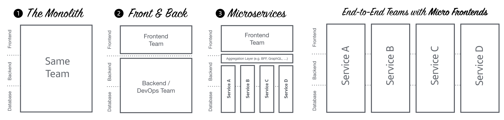
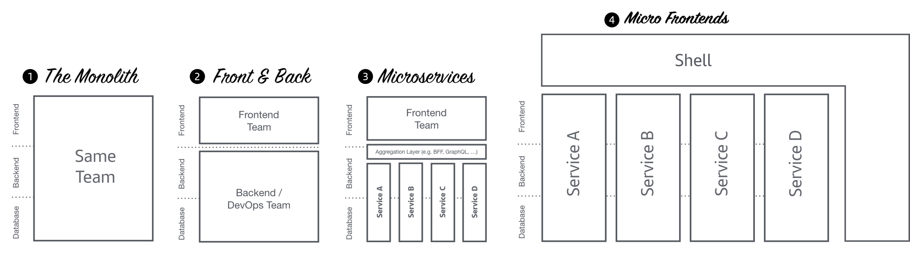
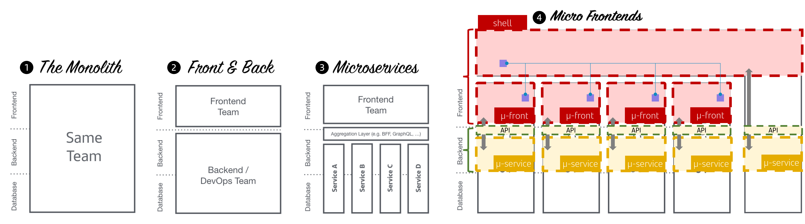

# Context: From Monolith to Microfronts

## The monolith

These applications keep the frontend and the backend tightly coupled, combined
into a single repository and deployed into the same runtime platform/service.

It is not only responsible for a task but for all processes from start to
finish.

<figure markdown>
  {: style="height:190px"}
  <figcaption>The monolith</figcaption>
</figure>

## Decoupling Front & Back

As an evolution of "The Monolith", applications with a separation between the
frontend and the backend emerged.

These applications made both the development and deployment of the software
independent, making its life cycle independent as well.

Despite this, both the backend and the front end remained as two separate
monoliths, independent of each other.

<figure markdown>
  {: style="height:190px"}
  <figcaption>Decoupling Front & Back</figcaption>
</figure>

## Front monolith + Microservices

The backend monolith evolved to microservices.

This approach consists on developing a single application as a suite of small
services, each running in its own process and communicating with lightweight
mechanisms, often an HTTP resources API. These services are built around
business capabilities and are independently deployable by fully automated
deployment machinery. There is a bare minimum of centralized management of these
services, which may be written in different programming languages and use
different data storage technologies.

Despite this, the frontend continued to be a monolith.

<figure markdown>
  {: style="height:190px"}
  <figcaption>Front monolith + Microservices</figcaption>
</figure>

## Microfronts

Microfronts bring the same concepts to the frontend as microservices brought to
the backend.

- The application could be divided vertically into independent features or
  products
- They could be developed by different teams with different lifecycles
- Improved agility and time-to-market

<figure markdown>
  {: style="height:190px"}
  <figcaption>Microfronts</figcaption>
</figure>

For this pattern to work correctly it is necessary to introduce the concept
from Shell, which is the application responsible for loading the different MFE's and
provide a complete user experience from a set of
uncoupled components.

<figure markdown>
  {: style="height:190px"}
  <figcaption>Shell + Microfronts</figcaption>
</figure>

## Shell + Microfronts (In detail)

<figure markdown>
  {: style="height:190px"}
  <figcaption>Shell + Microfronts (in detail)</figcaption>
</figure>
