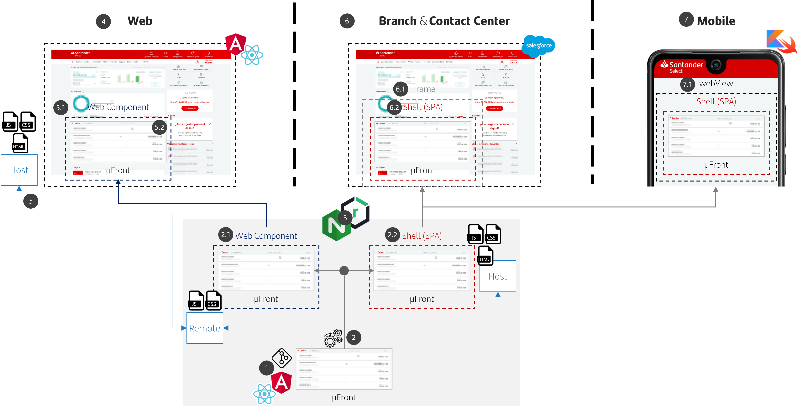
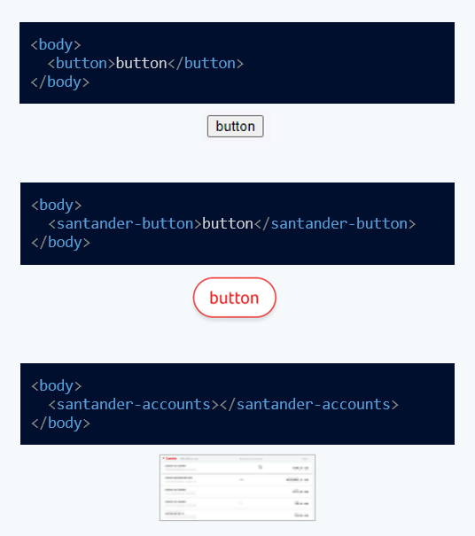

# Microfront Design guide

## Purpose

The **purpose** of this _design guide_ is to **define** and
**standardize** the use of **the Microfront pattern** _(a.k.a. Micro-Frontends,
MFEs,..)_ within _Grupo Santander_.

!!! note
    This document does not represent a final solution for a specific use case and it
    must be taken as the **foundation on which the different technical solutions for
    Microfronts should be based**.

    This first version of the document will be referenced to Angular Framework (Darwin flavour) but the design will take into account React in further versions.

The document will cover the following topics:

- **Reference framework** for creating and integrating Microfronts in web and
  mobile applications.
- Establishment of **patterns** and **best practices** to solve common problems
  such as:

    - Definition of the **archetypes** of Shells and MFEs, proposing a base scaffolding on which to implement the functionality.
    - Model of **integration** of MFEs within Shells, being able to have different nature types: Web & Mobile.
    - **Communication** between the MFEs and Shell, Shell and the MFEs.
    - **Sharing** data and libraries between Shell and MFEs
    - Internal **routing mechanisms** that allow navigation between states of the MFE itself

## Overview

Microfronts bring the **same concepts** to the frontend **that microservices
brought** to the backend.

- The application could be **divided vertically** into independent features or
  products
- They might be developed by **different teams** with **independent lifecycles**
- Improved **agility** and **time-to-market**

<figure markdown>
   {: style="height:190px"}
   <figcaption>Microfronts history</figcaption>
</figure>

### Shell & Microfronts

#### Shell

The Shell will be the main application **in charge of** managing the **user flow**
*(Do the login, decide what MFEs must be displayed and when,..)* and providing
the necessary mechanism to **visually integrate** and **communicate** them.

Likewise, it will be the one who **provides the necessary structural elements**
on which all of them will be based. These are:

- The main **navigation** module _(and its corresponding router)_ where the
  different remote modules will be routed
- **In case** of using **module federation** (like Darwin), the Shell will need to creadted the **webpack config** that will define the remote modules and shared
libraries that will be used by the MFEs
- The set of **shared libraries** that will be used by the MFEs, which may include:

     - **Angular** modules (common, core, ..)
     - Architectural components for **security** management, **configuration**, **observability**...
     - Components that will be in charge of the **secure storage** of information (LocalStorage, Cookies)

#### Microfront

They are **responsible for a specific feature** being **independent** and
**self-contained**. This means that they have **no dependency on each other** or on
their **development**, **testing** or **deployment** processes and they may be performed
separately.

Due to their nature, they allow a **high level of reuse**, being able to
integrate into any shell and any platform (that follow the same design rules)

## Multichannel approach

<figure markdown>
   
   <figcaption>Multichannel Approach</figcaption>
</figure>

1. The Microfront will be a **reusable component** for **all channels** coded in **Angular**.
2. The build pipeline will generate:

     1. A **remote module** that will expose the Microfront functionality using the **W3C Web Component standard** for web scenarios. _(It will require a shell in order to be displayed)_ and it should be exposed as:
          1. A federated module, for those shells with module federation capabilities
          2. A shelf-content module, for those shells without module federation capabilities
     2. A **Shell Lite** (SPA) hosting the previous remote module will expose the Microfront functionality for mobile and branch/contact center scenarios. _(ready to be displayed through an URL for iFrames or webViews)_

3. Both the **Web Component** and the **Shell Lite** will be **published** in an **artifact repository** and **deployed** on an **nginx**.
4. In **web scenarios**, SPA will **act as a host** using the web component integration.
5. The **host** must **download** the remote module as a Javascript file and **render** the corresponding microfront tag.

     1. The **shell must provide** the Microfront with an **initial configuration** and the necessary **security mechanisms**.
     2. From then on, the Microfront will be **autonomous to interact** with its **backend** and offer the desired functionality

6. In a **Contact Center** & **Digital Branch** scenario it is required a much more **isolated** integration.

     1. SPA integration may be within an **iframe**, **popup**, **new tab** or a **window navigation**
     2. The CC/Digital Branch application will load the **Microfront wrapped inside a SPA (Shell)** that will **act as a pipe** between the application and the Microfront

7. For **Android** & **iOS** mobile applications, the proposal is to **provide a native shell** within the **basic operative** and the best UX (i.e.: login or global position) and then load the rest of the operative through Web Views.

     1. The app will **contain** the Microfront **Shells bundled within the app**
     2. The app will **load** the Microfront **Shells** in a **webView** and **provide** the **initial configuration** and **security mechanism** that they would need.

## What is Web Components?

Web Components standard is a **suite of different technologies** allowing you to **create reusable custom elements** — with their functionality encapsulated away from the rest of your code — and use them in your web apps.

<figure markdown>
   
   <figcaption>Web Components standard</figcaption>
</figure>

- **Custom Elements**: Allow you to **define** custom elements and their behavior, which can then be used as desired in your user interface.
- **ES6 Modules**:  Allow you to create modules, which are pieces of **code** that we can write **in independent files**. Modules can have code, such as classes, functions, objects, or simple primitive data, that can be imported from other files.
- **Shadow DOM**: Allow you to attach an encapsulated "shadow" DOM tree to an element — which is **rendered separately from the main document** DOM — and controlling associated functionality.
In this way, you can keep an element's features private, so they can be scripted and styled without the fear of collision with other parts of the document.
- **HTML templates**: The `<template>` and `<slot>` elements enable you to write markup templates that are not displayed in the rendered page. These can then be **reused multiple times** as the basis of a custom element's structure.
