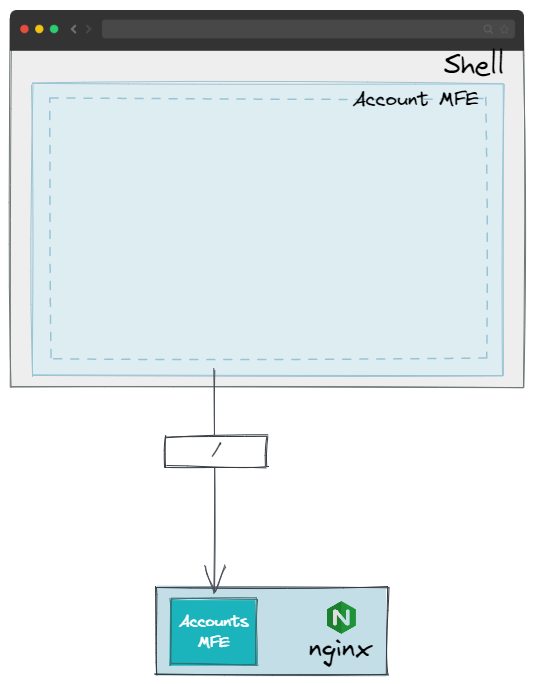
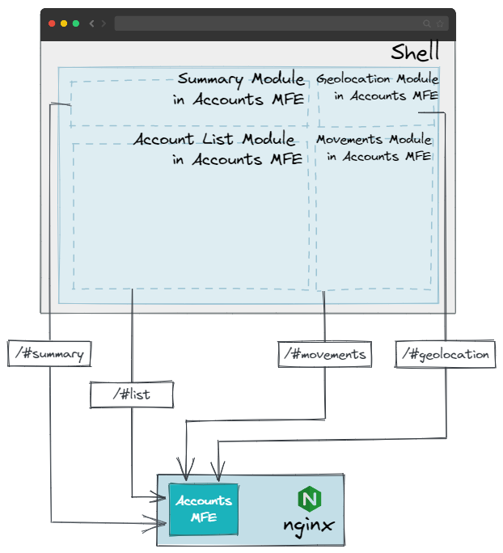
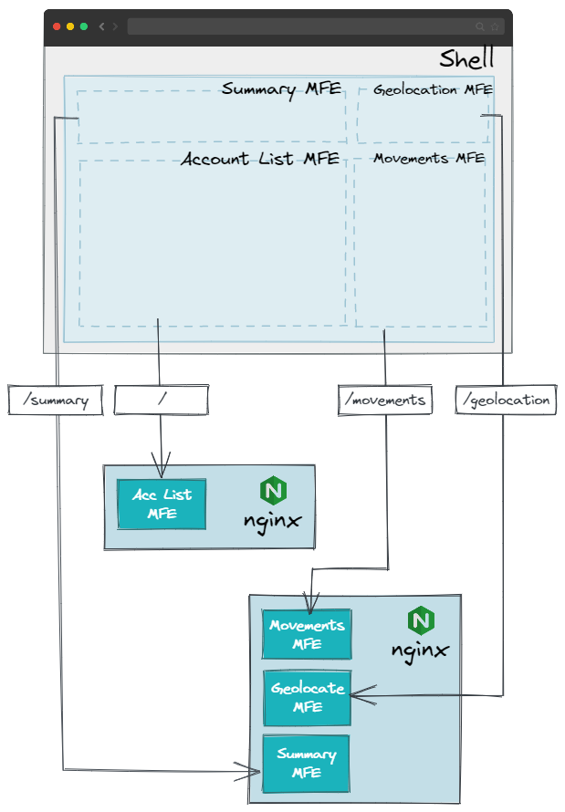
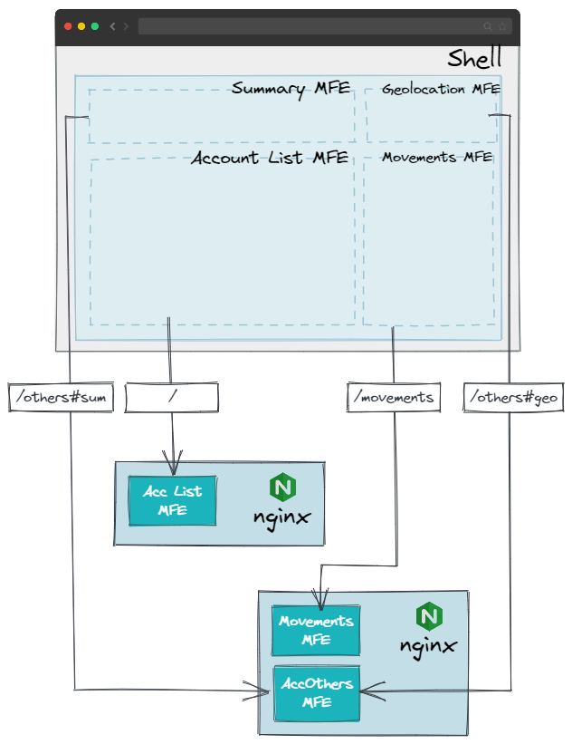
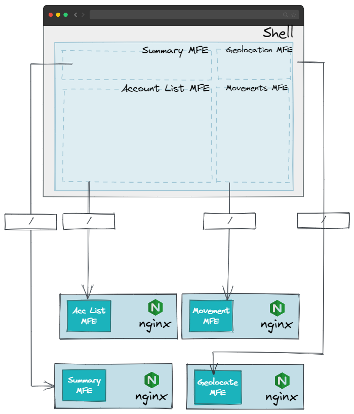

# Patterns

## MFE Segregation

Next, a set of high-level patterns will be exhibited that will allow us to know
the different possibilities of segregation in MFE against the typical monolith
in the front.

### Unique MFE for all the domain (Not recommended)

<figure markdown>
   {: style="height:400px"}
   <figcaption>No deep-link</figcaption>
</figure>

- 1 MFE published on 1 nginx
- The EXACT same experience will be delivered across all channels.
- The channel won't decide how to present the info.
- Although this is a real option, it is not recommended because:
  - The MFE will be transformed into a monolith itself.
  - The MFE should be displayed as is, and the shell cannot decide how to
    present the info.
  - Usually, the exact same experience across all channels is not desired.

#### Deep-linking alternative

<figure markdown>
   {: style="height:400px"}
   <figcaption>With deep-link</figcaption>
</figure>

- 1 MFE published on 1 nginx
- The same experience will be delivered across all channels, but the
  channel can decide how to present the info using deep-linking.
- Although this is a real option, it is not recommended because:
  - The MFE still remains to be a monolith for the whole domain.

### Several MFEs per domain deployed in shared nginxs

<figure markdown>
   {: style="height:500px"}
   <figcaption>Several MFE's</figcaption>
</figure>

- 'n' MFE published on 'n' nginx
- The same experience will be delivered across all channels, allowing the
  channel to decide how to present the info.
- Some MFEs will have their own lifecycle and others will share their lifecycle.
  The challenge is to correctly divide the application into MFEs and decide
  which of them must have linked their lifecycle and which do not.

#### Deep-linking alternative

<figure markdown>
   {: style="height:500px"}
   <figcaption>Several MFEs, some with deep-linking</figcaption>
</figure>

- Same as the previous one, but some MFEs will be able to be deep-linked.
  - This can be useful for MFEs that are not very complex, do not require
    their own lifecycle and can reuse some of their views.
- 'n' MFE published on 'n' nginx
- The same experience will be delivered across all channels, allowing the
  channel to decide how to present the info.
- Some MFEs will have their own lifecycle and others will share their lifecycle.
  The challenge is to correctly divide the application into MFEs and decide
  which of them must have linked their lifecycle and which do not.

### Several MFEs per domain deployed in independent nginxs (Current recommendation)

<figure markdown>
   {: style="height:450px"}
   <figcaption>Several MFE's with independent lifecycles</figcaption>
</figure>

- 'n' MFE published on 'n' nginx
- The same experience will be delivered across all channels, allowing the
  channel to decide how to present the info.
- Every MFE will have its own lifecycle.
- Although this is the optimal solution since all MFEs are decoupled with each
  other, the costs derived from having each one in a _nginx_ is something to
  take into account.

### MFEs deployed to Public Cloud Managed Services (Future recommendation)

As a next step, the MFEs could be deployed to a Public Cloud Managed Service.
This way, the cost of the _nginx_ containers would be reduced, and the MFEs
could have different versions of the same MFE deployed at the same time.

This is a work in progress and will be updated as soon as possible.
