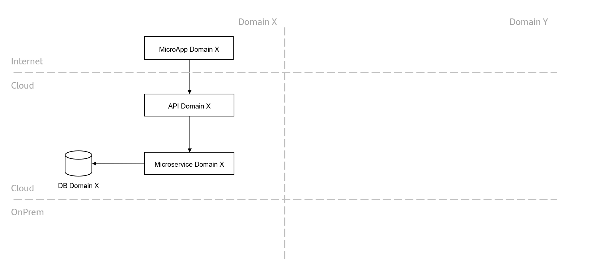
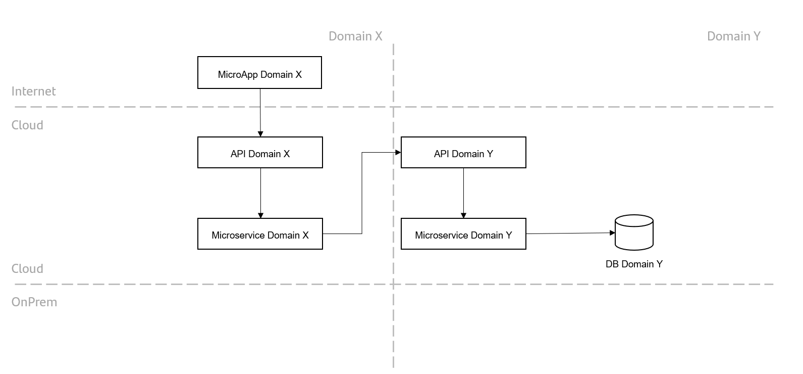
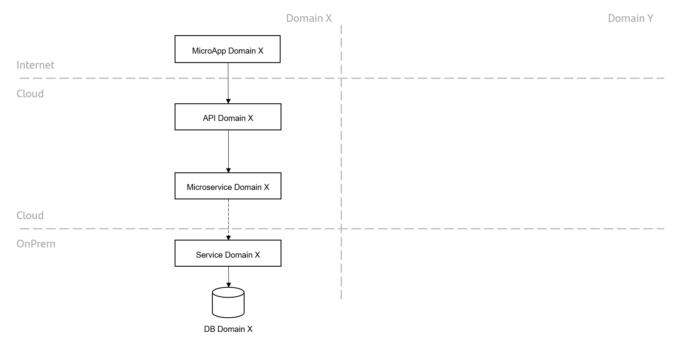
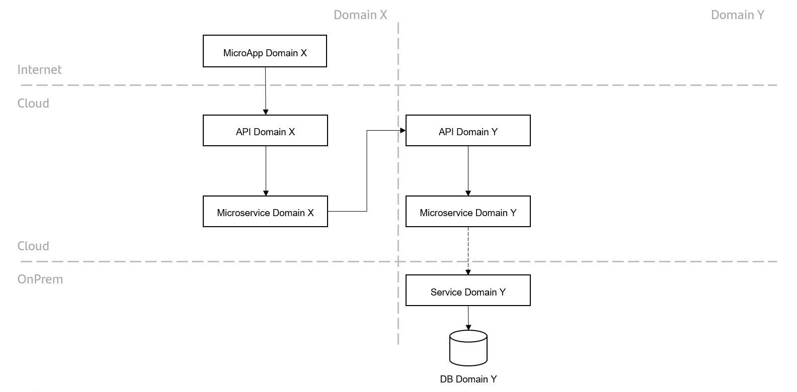

## DMS3 - Data Access Patterns

### Scenario 1 – MicroApp Cloud x Data on Cloud

{: .image-popup align="center" style="width:100%"}

### Scenario 2 - MicroApp Cloud x Data in another domain on the Cloud

{: .image-popup align="center" style="width:100%"}

### Scenario 3 – MicroApp Cloud x Data on premise

{: .image-popup align="center" style="width:100%"}

There are some scenarios, in which due to various reasons (i.e looking for implementing scalability in certain ranges), the databases on-prem can be accessed directly from the microservices in the Cloud.

### Scenario 4 – MicroApp Cloud x Data in another domain on premise

{: .image-popup align="center" style="width:100%"}

There are some scenarios, in which due to various reasons (i.e looking for implementing scalability in certain ranges), the databases on-prem can be accessed directly from the microservices in the Cloud.
